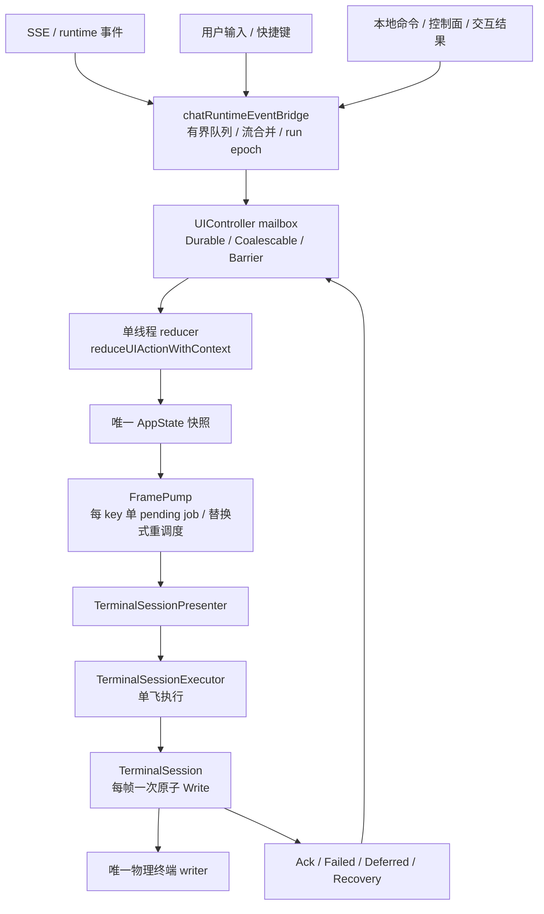

# aicli TUI 渲染架构与 legacy 兼容层评估

> 文档状态：当前实现架构说明 + legacy 兼容层移除评估（不是重构计划）
> 代码基线：2026-09-23 本仓库工作区；关键行号已逐条核对，后续改动可能造成漂移
> 范围：`aicli chat` 交互式终端 UI（`backend/cmd/aicli/commands`、`backend/cmd/aicli/ui`）；非交互 / JSON / ACP 等模式只在相关处说明
> 配套文档：见第 6 节索引（规范性规划、当前实现详述、迁移账本）

## 1. 结论速览

1. **渲染是事件驱动的**：SSE/runtime 事件、用户输入、控制面/本地命令三类输入，全部先转成同一 IR（typed `UIAction`），经单一 action mailbox 进入单线程 reducer，产出唯一 `AppState` 快照，再由 FramePump 调度、由唯一物理 writer（`TerminalSession`）每帧一次原子写入终端。**没有任何业务路径可以绕过这条链路直接写终端字节。**
2. **统一渲染器是交互式 TTY 的强制生产路径，不是特性开关**：`chat_setup.go:206-245` 先对 legacy surface 建立物理写入栅栏，再挂载 `EnableUnifiedRendererGateway()`；factory 失败即 fail-closed 终止会话，**明确不回退直写**（`chat_setup.go:226-239`；`chat_ui_actor.go:225` 注释确认直写渲染器仅保留给测试）。
3. **legacy 兼容层不能被整体删除，但大部分代码已"死而未删"**：
   - `FixedBottomSurface` 在统一模式下已退化为**语义 facade + 几何/lease 桥**（约 40 个生产方法、约 700–900 行承重），物理写入被**单向栅栏**永久关闭；
   - 其物理写路径与 legacy `Apply`/`*Impl` 渲染孪生体（约 150 个方法、4000+ 行）在交互式统一模式下不可达，属于 fenced-dead；
   - 仍有 6 个测试专用方法属于内部清理项。
4. **复活风险为零（当前代码面）**：栅栏一旦锁定，`SetPhysicalWritesEnabled(true)` 被拒绝（`fixed_bottom_surface.go:265-268`），fenced `writeOutput` 返回 `handled=true`（`:978-991`），调用方不会回退 raw stdout。唯一残余口是"绕过 `buildChatSession` 新建 surface"，当前不存在这种非测试构造。
5. **移除建议**：按三类处理——A 必须保留（承重 facade / plain、win7、pipe 模式路径 / Ctrl+T pager / lease 与几何 / debug 观测）、B 先迁移后删除（fenced-dead 大块与模式相关路径，含前置条件）、C 可立即清理的小件；整体删除会直接破坏交互式会话。详见第 5 节。

---

## 2. 事件驱动渲染管线

### 2.1 三类输入如何汇集到同一条链路

| 输入源 | 入口 | 汇集方式 |
| --- | --- | --- |
| SSE / runtime 事件（assistant delta、reasoning、tool、MCP、审批/问答结果、run epoch 变化） | `chat_runtime_events.go` 事件桥（有界队列、流事件合并、epoch 防护） | 编码为 `RenderModel/ChangeSet` → `scene.ChangeSetMapper` → `ReplaceTranscriptAction` |
| 用户输入（键盘、paste、composer 编辑、快捷键） | `chat_composer.go` / `chat_interaction.go` 输入路径 | 经 producer 适配发布 typed `UIAction` |
| 控制面 / 本地命令 / 生命周期（slash 命令、审批、Q&A、resize、theme、错误、history ack） | `chat_ui_actor.go`（producer → action 适配）、各 command handler | 同一 `UIAction` IR |

**IR-1 单一输入单元**：`ui/action.go:44-45` 约定所有 producer 必须 `Post(UIAction)`，不允许旁路直接改状态或写终端。

### 2.2 收敛模型：单 reducer + FramePump + 单物理 writer

- **mailbox 分级与背压**：`Post` 有界背压 `ui/controller.go:301-351`；`TryPost` 非阻塞 `:353-386`；`PostDeferred` 用于内部投影、可超上限 `:388-437`。
- **单 reducer 批处理**：唯一 reducer goroutine `ui/controller.go:508-623`；单批上限 `controllerBatchLimit`；每批只发一个 `FlushEffect`（dirty 取并集）`:503-507, 591-615`。
- **FramePump 合并**：单 goroutine `ui/frame_pump.go:101,118-144`；每个 key 只保留一个 pending job，重调度即替换 `:53-59`；调度键为 dynamicStatus / stableCommit / activeFrame / prompt；帧率预算下限 `:169-174`（默认 60 FPS）。
- **定时器不落笔**：超时/定时回调只 `Post(DrawRequested)`，不直接绘制（`chat_interaction.go:6711-6721`）；reducer 是唯一读取 active stream 状态的地方。
- **active stream 绘制**：`paintActiveStreamLocked`（`chat_interaction.go:5808-5831`）只更新语义态，"从不写 transcript writer"。
- **单次物理写**：`TerminalSessionPresenter`（`terminal_session_presenter.go:86-101`）→ 单飞 executor（`terminal_session_executor.go:667-687`）→ `TerminalSession` 每帧一次 `Write`，DEC 2026 同步框包裹，以终端写锁串行化。
- **fullscreen/alternate-screen 同样受约束**：lease 必须走同一 presenter transport；transport 缺失时 fail-closed 而不是另开 stdout 写口（`fixed_bottom_surface.go:288-299`）。

### 2.3 流式事件的三车道（`chat_runtime_events.go:1151-1215`）

1. **可合并车道**：assistant delta / reasoning 等高频流事件合并后再进入编码（判定 `:1914-1916`，含 `EventAssistantDelta`、`EventAssistantReasoning`）；
2. **关键事件保留 + 异步重试车道**：不允许丢弃的语义事件；
3. **普通有界等待车道**：一般事件按有界队列语义处理。

三车道共同的终点是同一个 action mailbox，不存在"流式事件直接渲染"的第二通路。

### 2.4 可检查的关键不变量

1. 单一输入单元：所有 producer 必须 `Post(UIAction)`（`ui/action.go:44-45`）。
2. 单 reducer、单 `AppState` 快照；`AppState` 是整帧语义/布局输入。
3. 单 FramePump，每 key 替换式合并，定时器不落笔。
4. 单物理 writer：`TerminalSession` 是唯一生产级终端字节出口；lease 也经同一 transport。
5. 事件先编码为有稳定身份的 `RenderModel/ChangeSet`（顺序由数组位置决定，而非到达时间），再映射 Scene，再进 `AppState`。
6. 终端失败保守处理：无法证明写入结果时 projection 标 unknown、停止盲重试，随后从 Scene/AppState 语义源恢复。
7. fail-closed：gateway factory 失败 = 会话初始化失败，**无直写回退**（`chat_setup.go:226-239`）。

---

## 3. legacy 兼容层现状（分类）

### 3.1 FixedBottomSurface：语义 facade + 单向栅栏

生产不变量：`surface != nil` ⟺ 统一渲染器已启用。`chat_setup.go:79-84` 先建立物理写入栅栏并 `Enable()`，`:206-212` 挂载 facade（仅贡献几何与语义 bottom-pane 输入），`:213-245` 挂载 gateway 并把物理所有权交给 `TerminalSession`。

栅栏机制（已逐行核实）：

- `SetPhysicalWritesEnabled(true)` 在锁定后被**静默拒绝**：`fixed_bottom_surface.go:265-268`；
- `FencePhysicalWrites` 永久锁死：`:277-286`，由 `chat_interaction.go:587-589`（`SetSurface`）与 `:686`（`SetPrimaryPresenter`）安装；
- fenced `writeOutput` 保留快照/恢复所需语义态并返回 `handled=true`，**绝不触碰调用方 writer**（含测试用 `bytes.Buffer`）：`:978-991`；
- 零值兼容：未显式配置时默认"允许写"（`:301-308`）——这是当前唯一残余口（见 3.3）。

| 类别 | 规模（约） | 代表成员 | 判定 |
| --- | --- | --- | --- |
| **A 承重（生产仍运行）** | ~40 方法 / 700–900 行 | `Enabled()`；`TerminalGeometry()`（唯一 presenter 的几何来源，`chat_interaction.go:709 → chat_ui_actor.go:219`）；`MeasuredGeometry()`；ActiveBand 尺寸与读写（`chat_interaction.go:6911,6908,6918,6978,5469`）；prompt/bottom-pane 语义态生产者；status model；popup 态与 picker；fullscreen lease 入口（`screen_lease.go` 是本类型的方法集）；fence/lifecycle（`chat_setup.go:83,84,230,295`）；`/debug` 观测钩子 | **必须保留** |
| **B fenced-dead（统一模式下不可达）** | ~150 方法 / 4000+ 行 | 全部物理 writer（`WriteOutput`/`BeginOutput`/`WritePromptEditorText`/`SettleOutputDebt`/`RewriteSoftOutputTail`/`Reconcile`…）；`Apply()` 及全部 `*Impl` 渲染孪生体（reducer 入口在 `chat_ui_actor.go:1013-1017` 被跳过）；私有 paint/layout/render 辅助 | 死而未删；删除需满足 5.3 前置条件 |
| **C 测试专用** | 6 方法 | `EnableForTest`、`HistoryWindowForTest`、`HistoryHandedOffForTest`、`LegacyReserveStateForTest`、`visibleOutputRowsForTest`、`RowOwnersForTest` | 内部清理项 |

栅栏检查点（grep 实测）：`fixed_bottom_surface.go` 49 处、`fixed_bottom_surface_snapshot.go` 2 处、`screen_lease.go` 3 处。

文件体量（约）：`fixed_bottom_surface.go` 254 函数 / ≥5209 行；`fixed_bottom_surface_snapshot.go` 37；`screen_lease.go` 13；`app_compose.go` 1。

### 3.2 其它 legacy / 并行路径一览

| 组件 | 现状 | 分类 | 关键证据 |
| --- | --- | --- | --- |
| `ui/terminal_output.go` | 进程级兼容 sink（默认 `os.Stdout`）；交互统一模式下 surface 的调用点全部被栅栏早退 | 非交互/plain/win7 仍需；统一交互下 dead | `terminal_output.go:9-21,46-48`；surface 侧 32 处命中均在栅栏之后 |
| `ui/transcript_pager.go`（Ctrl+T） | owned 交互模式下的受支持功能，走 ScreenLease；属并行渲染但**不是遗留债** | 保留（产品特性） | `chat.go:1526`；`chat_transcript_pager.go:9-16` |
| `ui/renderengine/legacy_reserve.go` | `LegacyReserveState` 仅剩惰性簿记；头注释"只被清零"已过时（`CursorOnBlankRow` 仍被 fenced 路径写入） | 惰性兼容（可小件清理） | `legacy_reserve.go:3-13`；`fixed_bottom_surface.go:990` |
| `AICLI_SCENE_PRESENTER`（Scene 双跑开关） | 默认 off：legacy cell 行为准 + 只读 parity 探针；on：完整块由 Scene 投影驱动 | 迁移审计/实验双跑；无生产启用 | `chat_runtime_events.go:558-568,583,3731-3734`；`chat_interaction.go:500,518` |
| `chat_command_output.go`（结构化命令输出 allowlist） | owned 交互 → `RenderCommandDocument`；plain/JSON/非交互 → 兼容 writer；`writeLegacyChatDebugDisplay` 仅供直接调用者 | 混合：allowlist 保留；guard 分支统一模式下 dead | `chat_command_output.go:10-12,25,31,45` |
| `chat_legacy_console_*.go` / `chat_pipe_console_line.go` | plain/compat/win7 与 pipe/PTY 的行输入与编辑器 | 保留（非统一交互模式） | `chat_setup.go:120,130,135`；`chat_legacy_console_line.go:90,117`；`chat_pipe_console_line.go:67,114` |
| `chat_interaction.go` 中 `if c.unifiedRenderer { return }` 早退守卫 | 统一交互模式下 dead；plain/compat 交互仍执行 | 混合 | grep 实测 15 处（`chat_interaction.go` 13、`chat_ui_actor.go` 2） |
| `chat_ui_actor.go` `enableUnifiedRendererWithWriter` | 仅测试调用 | TEST-ONLY（可移入 `_test.go`） | `chat_setup.go:225` 注释；`chat_ui_actor.go:231-234`；调用者均为 `*_test.go` |

### 3.3 复活风险评估

**结论：当前代码面无活跃复活路径。**

- 栅栏单向：锁定后无法重新开启（`fixed_bottom_surface.go:265-268`）；
- fenced 写路径返回 `handled=true`（`:978-991`），调用方不会回退 raw stdout；
- gateway 失败即 fail-closed，无直写回退（`chat_setup.go:226-239`）；
- lease 无 transport 时硬失败，不会另开 stdout 写口（`fixed_bottom_surface.go:288-299`）。

唯一残余口：绕过 `buildChatSession` 新建的 surface 会因"未配置"而默认允许写（`:301-308`）。当前非测试构造只有 `fixed_bottom_surface.go:227` 与 `chat_setup.go:79` 两处，均受控。后续加固可考虑把"未配置"默认改为拒绝写（需同步调整依赖零值默认的测试），或至少在类型注释中固化该约束。

---

## 4. 项目自身的迁移账本（文档与代码对照）

统一渲染器的"终局规划"由 `docs/plan/aicli-tui-unified-render-architecture-refactor-plan.md` 定义（自声明为唯一规范性终局；状态真源在其 §15.7/§15.8，而非早期历史章节）。与 legacy 移除直接相关的账本项：

- **P0 债务账本**（§14.2）：AST 门禁 `TestChatInteractiveDirectWriterInventory` 基线为 **145 组 / 447 个调用点**，并明确它是**债务账本 + 回归护栏，不是 allowlist**；要求逐条分类、迁移后删除，基线只降不升。
- **P8 终局**（§14.8）：删除生产 immediate renderer 与全部无主 terminal write；删除旧 scroll compensation / gap flags；killswitch 需在 ≥1 个稳定版本后才可删除。
- **已完成的删除批次**（`aicli-tui-owned-render-simplification-plan.md` 切片 17 / 17 续，2026-08-31、09-01）：legacy surface binding 链（`render/output/binding.go`、`legacyBinding`）、`LegacyTransactionAdapter`/`LegacyImmediateAdapter`、`legacyReserve` 序列链、`render*Locked` 遗留实现体，以及 22+33 个 legacy 契约测试迁移。其勘误同时澄清：`vt_emulator_adapter.go` / `render/output/virtual_terminal.go` **未删除**（仍是活跃基础设施）；`historyWindow`/`frontier` 是 owned 模式活跃代码，删除目标应表述为"删除 legacy-only 调用面"。
- **逃生门状态**：`AICLI_TUI=legacy/plain/off` 回滚开关已删除（仅测试残留断言），与 `chat_setup.go:213-245` 的强制路径一致。
- **`AICLI_SCENE_PRESENTER`** 仍随生产代码发布，最终目标是"Scene 权威覆盖全部可见内容后，标志本身失去意义并删除"（`aicli-tui-scene-presenter-convergence-design.md` §0，该文档已 superseded，仅作历史记录）。

**文档过时点提示**：`docs/architecture/aicli-chat-unified-renderer-architecture.md` 是当前实现的最详细说明，但其代码基线为 2026-08-29，**早于上述 08-31 / 09-01 删除批次**；阅读其 §16 债务清单时，删除状态应以 unified plan §15.7/§15.8 与 owned-plan 切片 17/17 续为准。

---

## 5. 是否移除：结论与建议

### 5.1 判定原则

legacy 层包含两个正交维度：**"在统一交互模式下是否可达"** 与 **"在其它模式下是否仍是唯一实现"**。因此**不能按文件/类型整体删除**，只能按"模式退役"推进：先迁移或退役某个模式，再删除只服务该模式的代码。整体删除 `FixedBottomSurface` 会立刻破坏：presenter 几何桥、全部全屏 lease/picker 入口、全部 band/status/prompt/popup 语义态生产者、会话生命周期与 `/debug` 观测。

### 5.2 A 类：必须保留（删除即破坏功能）

- `FixedBottomSurface` 的承重 facade 面（几何、ActiveBand/prompt/status/popup 语义态、lease 入口、fence/lifecycle、`/debug` 钩子）；
- Ctrl+T transcript pager（受支持产品功能，非遗留债）；
- plain / compat(win7) / pipe(PTY) / JSON / 非交互的 console 输入与输出路径；
- 结构化命令输出 allowlist 中 owned 与 plain 双路由（`chat_command_output.go:10-12`）。

### 5.3 B 类：先迁移后删除（含前置条件）

| 目标 | 前置条件 |
| --- | --- |
| fenced-dead 物理写路径与 `*Impl` 渲染孪生体（~150 方法） | reducer 侧确认不再需要 legacy `Apply`；快照/恢复不再读取 `legacyReserve`/`historyWindow` 兼容态；相关 fenced 分支测试改为断言"不可达" |
| 15 处 `unifiedRenderer` 早退守卫与 plain/compat 直写助手 | plain/compat 交互移植到 session/document API，或产品决定退役 plain 交互；同步更新债务账本基线 |
| `ui/terminal_output.go` 兼容 sink 的交互侧调用面 | `exec_event_processor.go`、`chat_selection_output.go`、`chat_system_output.go` 与 legacy widgets 全部改由 session writer 输出，并证明 fence 后不可达 |
| command output guard 分支与 `writeLegacyChatDebugDisplay` | `/debug display` 与 plain 命令结果迁到 document API；保持两个 inventory 门禁绿 |
| `LegacyReserveState` 及其 surface 字段 | 删除 `CursorOnBlankRow` 的写入/读取（`fixed_bottom_surface.go:990` 等）与测试断言 |
| `AICLI_SCENE_PRESENTER` 开关与 parity 探针 | Scene 投影覆盖全部可见内容；确认无部署配置启用该变量（默认 off） |

### 5.4 C 类：可立即清理的小件

- `enableUnifiedRendererWithWriter`：仅测试调用，可移入 `_test.go`（保持行为不变）；
- 6 个 `*ForTest` 方法：若无外部包引用，可收敛为内部快照断言；
- `legacy_reserve.go` 头注释勘误：修正"字段只被清零"的过时描述（实际 `CursorOnBlankRow` 仍被写入）。

### 5.5 建议删除顺序与验收门

1. C 类小件（低风险、纯清理）；
2. 模式迁移：plain/compat/pipe 交互 → session/document API（B 类主体解锁的前提）；
3. fenced-dead 大块删除（配合 unified plan §14.8 P8 的"删除无主 terminal write"）；
4. killswitch / 兼容开关删除：在 ≥1 个稳定版本后执行（unified plan §14.8）。

必须保持绿色的验收门：

- `chat_command_result_test.go:948` `TestStructuredCommandHandlersHaveNoDirectTerminalWriter`；
- `chat_command_result_test.go:999` `TestChatInteractiveDirectWriterInventory`（债务账本基线只降不升）。

---

## 6. 相关文档索引

| 文档 | 角色 | 状态（2026-09-23） |
| --- | --- | --- |
| `../plan/aicli-tui-unified-render-architecture-refactor-plan.md` | 规范性终局与总规划 | 进行中；状态看 §15.7/§15.8 |
| `../plan/aicli-tui-owned-render-simplification-plan.md`（+ implementation-guide） | 切片式收口与删除记录 | 切片 17/17 续已完成部分删除 |
| `../analysis/aicli-tui-owned-render-simplification-plan-review.md` | 方案评审 | completed / post-cutover verified |
| `../plan/aicli-tui-transcript-overlay-renderer-mode-plan.md` | Ctrl+T/overlay 子计划 | in progress（受统一架构约束） |
| `../plan/aicli-tui-render-data-plane-codex-migration-plan.md` | 历史迁移记录 | P5.7 收尾待推进 |
| `../plan/aicli-tui-scene-presenter-convergence-design.md` | Scene 收敛设计 | **superseded**（仅历史记录） |
| `../architecture/aicli-chat-unified-renderer-architecture.md` | 当前实现最详细说明 | 基线 2026-08-29，早于 08-31/09-01 删除批次 |
| 本文 | aicli 侧架构速览 + legacy 评估 | 2026-09-23 |
