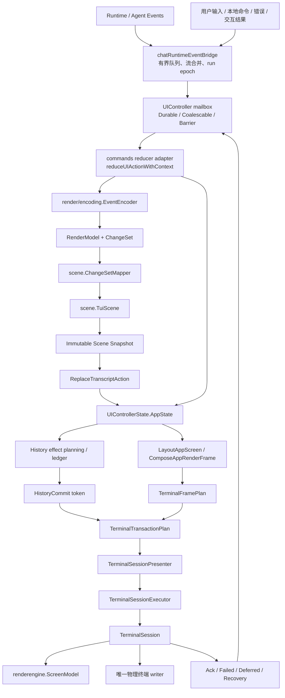
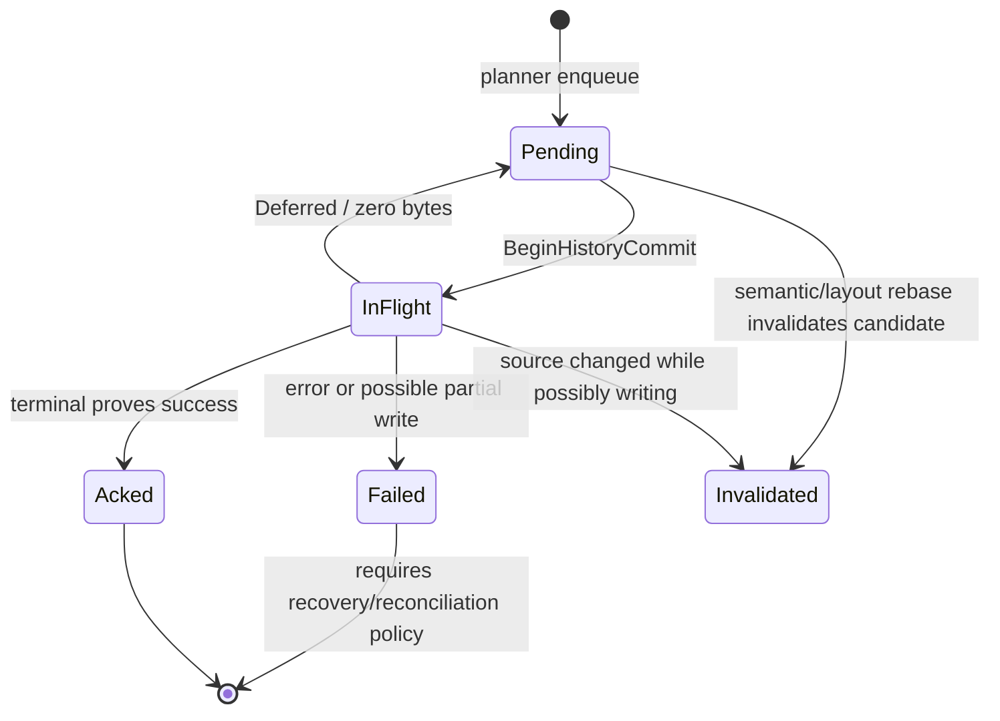

# aicli chat 统一渲染器架构与渲染流程

> 文档状态：当前实现架构说明（不是重构计划）
> 代码基线：2026-08-29，`feat/win7-go120-compat` 工作区
> 主要范围：`backend/cmd/aicli/commands`、`backend/cmd/aicli/ui`
> 适用场景：`aicli chat` 交互式终端 UI；非交互、JSON、ACP/stdio 等模式只在相关处说明

## 1. 结论摘要

当前 `aicli chat` 在**支持 ANSI 的交互式 TTY、且未进入兼容降级模式**时，已经以统一渲染器作为**强制生产路径**，而不是可选实验开关：

- `chat_setup.go` 对满足 `interactiveUI` 判定的会话调用 `EnableUnifiedRenderer()`；初始化失败会直接终止会话，不能退回到一个已被物理写入隔离的 legacy surface。
- 上游 runtime 事件先被编码为有稳定身份和生命周期的 `RenderModel/ChangeSet`，再原子映射到 `TuiScene`。
- `UIController` 是单线程 reducer/actor，按 action 顺序维护唯一的 `AppState` 快照。
- `TerminalSessionPresenter -> TerminalSessionExecutor -> TerminalSession` 是唯一生产级物理终端写入链路；fullscreen lease 也必须通过同一个 presenter transport，不得另开 writer。
- 已完成 transcript 通过 token 化 `HistoryCommit` 进入终端原生 scrollback；仍在变化的 active cell、状态栏、输入框、popup 等组成底部可变 viewport。
- `FixedBottomSurface` 和 `chatInteractionCoordinator` 中仍保留大量兼容逻辑，但在统一模式下前者只作为状态/几何 facade，物理写入被关闭；后者主要承担事件适配、输入交互和迁移桥接，不能再成为第二终端 writer。
- 终端失败采用保守策略：无法证明写入结果时将 projection 标为 unknown，停止盲目重试，随后从 Scene/AppState 的语义源执行恢复或 scrollback reconciliation。

可以把当前架构概括为四个相互分离的权威边界：

| 权威 | 当前实现 | 负责内容 | 明确不负责 |
| --- | --- | --- | --- |
| transcript 语义权威 | `render/encoding`（规范化事件/全序 item）+ `scene.TuiScene`（UI 消费的 canonical cell） | 事件归并、顺序、cell 身份、生命周期、原始 source、结构化 presentation | 终端尺寸、光标、ANSI、物理写入进度 |
| UI 状态权威 | `ui.UIControllerState.AppState` | transcript 快照、active cell、bottom pane、theme、geometry、lease、history effect 状态 | 从终端反推业务状态 |
| history 交付权威 | `HistoryEffectQueueState` / `HistoryCommitLedger` | token claim、Ack/Fail/Deferred、布局代次、原生 scrollback 已交付事实 | 生成语义内容、直接写终端 |
| 物理投影权威 | `TerminalSession` | 屏幕缓存、终端 epoch、viewport diff、scrollback handoff、单次原子写入 | 作为 transcript source 或业务事实源 |

这四个边界是理解统一渲染器的关键：**Scene 决定“是什么”，AppState 决定“这一帧应显示什么”，HistoryEffectQueue 决定“哪些历史已经可靠交付”，TerminalSession 决定“怎样把这一事务写到物理终端”。**

---

## 2. 范围与术语

### 2.1 本文覆盖

1. 交互式 chat 的渲染器启动与单 writer 切换。
2. runtime 事件、用户输入、本地命令、tool、reasoning、assistant stream 如何进入统一数据面。
3. `EventEncoder -> ChangeSet -> Scene -> AppState -> TerminalTransactionPlan -> TerminalSession` 的完整主流程。
4. transcript、active band、status、prompt、popup、fullscreen lease、resize/theme 的布局与提交方式。
5. 原生 scrollback 的 token 化提交、确认、失败和恢复流程。
6. replay/resume、并发调度、兼容层、扩展点和当前技术债。

### 2.2 术语

- **RenderModel**：事件编码层的有序 item 列表，渲染顺序由数组位置而非原始事件到达时间决定。
- **ChangeSet**：一次编码操作产生的增量变更集合，包含 append/upsert/correct/remove 和 revision。
- **Scene**：终端无关的 transcript 语义场景；基本单位是 `TranscriptCell`。
- **AppState**：UI actor 发布的整帧语义/布局输入，包含 transcript、active、bottom pane、geometry、lease、theme 和 history delivery 状态。
- **Active cell / ActiveBand**：当前仍可变化的 reasoning、assistant 或 tool 过程内容，属于底部可变区域。
- **HistoryCommit**：把已经稳定的一个语义范围交给终端原生 scrollback 的不可变、带 token 事务载荷。
- **Viewport**：终端底部仍由程序重绘的区域，不等同于整个 transcript。
- **Projection**：语义状态到终端可见行/屏幕缓存的派生结果。
- **Layout generation**：尺寸或主题变化后递增的布局代次，用于阻止旧 frame/history 回调确认新布局。
- **Lease**：fullscreen/alternate-screen 所有权；lease 活跃时主屏 history 交付被冻结。

---

## 3. 总体架构



### 3.1 分层职责

#### A. 命令与事件适配层：`backend/cmd/aicli/commands`

关键文件：

- `chat_setup.go`：建立交互式 UI，完成单 writer 权威切换。
- `chat_runtime_events.go`：runtime 事件入口、有界队列、流事件合并、事件编码、Scene 提交、event log。
- `chat_ui_actor.go`：把 producer 行为转换为 typed `UIAction`，并提供 reducer adapter。
- `chat_interaction.go`：输入、prompt、status、兼容 stream 状态和非 runtime 注入入口。
- `chat_history_reconcile.go`：从持久化消息重建统一 transcript。
- `chat_transcript_renderer.go`、`chat_history_cell.go`：非交互/兼容输出及历史 cell 适配。

该层负责“把业务事件变成渲染意图”，不应拥有生产终端字节。

#### B. 事件编码层：`ui/render/encoding`

- `EventEncoder` 是 runtime event 到 render item 的唯一统一编码入口。
- `RenderModel.Items` 保存全序；`Item.ID`、`Seq`、`CauseID`、`Status`、`Revision` 使流式更新、tool chain 和 replay 可确定化。
- 编码结果是 `ChangeSet`，不是 ANSI，也不是已经 wrap 的行。

#### C. Scene 数据层：`ui/scene`

- `TuiScene` 保存稳定 `TranscriptCell`。
- `ChangeSetMapper` 把编码层 item 增量映射为 Scene mutation。
- `SceneController.Submit` 对一组 mutation 执行全有或全无提交。
- `LayoutTranscript` 只派生语义行与跨 cell gap，不进行终端 I/O。

#### D. UI actor 与状态层：`ui/controller*.go`、`ui/action.go`、`ui/app_state.go`

- `UIController` 使用单 goroutine 消费 action；每个 action 对应单调 revision。
- reducer 是 `AppState` 的唯一写者。
- action 分为 durable、coalescable、barrier；流更新允许 latest-wins，身份/完成/history Ack 等边界不可合并。
- Scene 快照通过 `ReplaceTranscriptAction` 进入 AppState，不能从 terminal、legacy history window 或屏幕缓存反推。

#### E. 纯布局与结构化呈现层：`ui/app_*`、`ui/render`、`ui/markdown`、`ui/diff`

- `render.Document -> Block -> Line -> Span -> Style` 是无 ANSI 的结构化 IR。
- `LayoutAppScreen` 分配 transcript、active band、status、prompt、popup 的物理行与 owner。
- `ComposeAppRenderFrame` 同时保留 plain row 和结构化 `render.Line`，用于文本一致性与带样式输出。
- Markdown、diff、reasoning chrome、主题 role 和 terminal width 都在投影阶段处理；原始 Scene source 不被覆盖。

#### F. history 规划层：`history_*`

- 根据 Scene/AppState、cell phase、active range、layout generation 和 lease 状态生成 `HistoryCommit`。
- ledger 记录 Pending/InFlight/Acked/Failed/Invalidated，保证 token 不被重复解释。
- 原生 scrollback 的“已交付”只能由 TerminalSession 返回结果并经 reducer Ack 后成立。

#### G. 物理呈现层：`terminal_session_*`、`renderengine`

- `TerminalSessionPresenter` 绑定 UIController effect stream 和唯一 TerminalSessionExecutor。
- `TerminalSessionExecutor` 从 controller 读取最新不可变快照，claim history token，构造 transaction，并把结果发布回 actor。
- `TerminalSession` 对 history handoff、viewport frame、cursor 进行预检和单次终端事务写入。
- `renderengine.ScreenModel` 保存 front/back 屏幕模型并产生最小 ANSI diff；`Presenter`、终端锁、handoff 辅助设施保证同一物理 writer。

---

## 4. 权威边界与核心不变量

### 4.1 单一物理 writer

交互式初始化顺序确保：

1. legacy `FixedBottomSurface` 的 physical writes 先被关闭；
2. UI actor 建立；
3. theme 和 semantic active-cell projection 先进入 actor；
4. 创建并 attach `TerminalSessionPresenter`；
5. 之后所有主屏 frame/history effect 都由该 presenter 处理。

禁止在 presenter 已 attach 后再次启用 surface writer。`TerminalSessionPresenter` 的注释和 `SetPrimaryPresenter` 都把“双 writer”视为架构错误。

### 4.2 reducer 单写

所有可影响当前 UI 的状态必须通过 `UIAction` 进入 `UIController`。actor 的 FIFO/revision 是以下顺序的共同来源：

- runtime event；
- resize/theme；
- prompt input；
- active cell 更新/完成；
- status/popup；
- history claim/Ack/Fail；
- fullscreen lease。

定时器和 FramePump 回调也只投递 action，不应在回调 goroutine 直接改 surface 或写终端。

### 4.3 Scene 是源，终端只是投影

- Scene 保存 canonical source、kind、phase、revision、presentation。
- resize、theme change、replay、terminal replacement 都从 Scene/AppState 重算。
- `ScreenModel`、ANSI 字节、native scrollback 和 legacy history window 都不是恢复源。
- Scene snapshot 深拷贝 `render.Document`，避免 producer 在 actor/replay 边界后继续修改已发布内容。

### 4.4 布局与交付代次隔离

- geometry 或 theme 变化会推进 layout generation。
- 旧 generation 的 history Ack、frame 或 resize report 不能确认新 generation。
- pending history 可以在尚未写终端时 rebase；可能已经部分写出的 in-flight 事务不能静默改写或重复提交。

### 4.5 内容与终端编码隔离

- `render.Span.Text` 禁止携带 ESC/OSC/CSI。
- Scene source 不持久化 ANSI、wrap 结果、reasoning divider 或主题颜色。
- backend 最后才把 structured style 编码成 ANSI；plain backend 用于 parity、测试和非彩色输出。

### 4.6 history exactly-once 以 token/来源身份为准

字符串是否重复出现不能证明 exactly-once。真正的判据是：

- cell/source identity；
- revision/source range；
- layout generation；
- token ledger state；
- TerminalSession 返回的写入结果。

### 4.7 fullscreen lease 是硬屏障

alternate-screen lease 活跃时：

- history effect queue 冻结；
- lease ID 必须匹配才允许写入或释放；
- release 后主屏 projection 被视情况恢复，不能假定 fullscreen 前的缓存仍然有效。

---

## 5. 启动、接线与生命周期

### 5.1 启动流程

满足 `interactiveUI`（非 `NoInteractive`、非 JSON、交互式 TTY、且未进入 compat mode）的 session 在 `chat_setup.go` 中按以下顺序启动：

```mermaid
sequenceDiagram
    participant Setup as chat setup
    participant Coord as chatInteractionCoordinator
    participant Surface as FixedBottomSurface
    participant Actor as UIController
    participant Presenter as TerminalSessionPresenter
    participant Terminal as TerminalSession

    Setup->>Coord: newChatInteractionCoordinator(session)
    Setup->>Coord: SetSurface(surface)
    Setup->>Coord: EnableUnifiedRenderer()
    Coord->>Surface: SetPhysicalWritesEnabled(false)
    Coord->>Actor: ensureUIActor() + Run()
    Coord->>Actor: SetThemeContextAction
    Coord->>Actor: SetSemanticActiveCellProjectionAction
    Coord->>Actor: WaitIdle()
    Coord->>Presenter: NewTerminalSessionPresenter(actor, stdout, geometryProbe)
    Presenter->>Actor: Attach(effect consumer)
    Presenter->>Terminal: own the only physical session
    Coord-->>Setup: success; otherwise fail session setup
```

`EnableUnifiedRenderer()` 的语义是 authority transition：

- 不是“能开则开”的视觉 feature flag；
- surface 可继续保留逻辑状态和尺寸接口，但不能再输出字节；
- `TerminalSessionPresenter` attach 失败时交互式 session 初始化失败；
- MCP/system output 随后也被改接到 semantic sink，避免绕过统一路径直写 stdout。

### 5.2 effect 接线

`TerminalSessionPresenter.Attach()` 把 `HandleEffect` 设置为 `UIController` 的 effect consumer。当前它响应：

- `FlushEffect`：可见状态改变，需要组合/刷新一帧；
- `HistoryCommitWakeEffect`：有 history token 或恢复工作可执行。

收到 effect 后 presenter：

1. 只读探测 terminal geometry；
2. 如尺寸变化，投递 coalescable `Resize` action；
3. 请求 `TerminalSessionExecutor`；
4. executor 等 actor idle 后再取不可变 AppState，避免使用 resize 前快照。

### 5.3 关闭流程

关闭顺序必须与启动相反：

1. detach presenter effect consumer；
2. 等待 executor 已请求的物理工作完成；
3. 超时则调用 `AbortTerminalWrite()` 中断阻塞 writer 并释放全局 terminal lock；
4. 再关闭/排空 UI actor；
5. 不能让 effect callback 活过 terminal writer。

若 bounded shutdown 仍无法确认 writer 状态，会将终端视为 abandoned，而不是尝试恢复 legacy writer。

---

## 6. 统一语义数据面

### 6.1 runtime 事件入口与有界队列

`chatRuntimeEventBridge.Handle` 是 runtime 事件入口。bridge 内部具备：

- 正常容量与 critical reserve；
- 总字节上限；
- run epoch/turn ownership 校验；
- assistant stream identity、sequence 和乱序缓存；
- mergeable stream 事件合并；
- critical lifecycle 事件更强的保留策略；
- bounded actor admission，避免无限阻塞 LLM callback。

普通事件路径：

```text
runtime callback
  -> bridge.Handle
  -> bridge eventQueue
  -> bridge.run / handleQueuedEvent
  -> UIController RuntimeEvent action
  -> reducer applyRuntimeEventActionWithContext
  -> bridge.handleEvent
```

审批/问答目前是例外：它们同步拥有 stdin，仍由 bridge worker 在先等待 actor idle 后执行；完成的 prompt transcript 和本地 decision supplement 仍会回到统一 Scene。

### 6.2 为什么事件先进入 actor，再编码 Scene

bridge 队列保留上游 backpressure 边界，UI actor 则提供所有 UI mutation 的统一顺序。`applyRuntimeEventActionWithContext` 调用 `bridge.handleEvent`，其中先执行 ownership/suppression 检查，只有旧 UI 本来会接收的事件才调用：

```go
b.encodeRenderModelEvent(event)
```

这避免了两种偏差：

- 被判定为 stale/错误 turn 的事件进入 Scene，却没有对应可见输出；
- runtime、timer、resize、prompt 等各自使用不同 goroutine 顺序修改 UI。

### 6.3 EventEncoder：从事件到有序 item

`ui/render/encoding.EventEncoder` 维护：

- 单调 item ID：`item-{n}`；
- 单调 `Seq` 和内部 clock；
- 每 item revision；
- assistant/reasoning request identity 与 alias；
- tool call ID 到 item 的映射；
- stream sequence、pending delta、tombstone；
- reasoning ordering barrier；
- priority prompt lifecycle；
- render statistics。

主要 item 类型：

| `ItemKind` | 语义 |
| --- | --- |
| `user` | 用户输入，终态注入 |
| `assistant` | assistant 可变流/终态正文 |
| `reasoning` | reasoning 可变流/终态正文 |
| `tool_call` | 工具链宿主，running 到 terminal |
| `tool_output` | 以 `CauseID` 归到工具宿主 |
| `supplement` | 没有独立 runtime event 的本地补充 |
| `priority_prompt` | 审批/问答最终保留 transcript |
| `command` | 本地命令结果，可带结构化 Document |
| `system` | 会话、错误、诊断类信息 |
| `user_interaction` | `/debug`、`/model` 等按触发时 tail 锚定的输出 |

`ItemStatus` 状态机为：

```text
pending -> running -> completed | failed | canceled
```

终态后普通 upsert 不再允许；authoritative reasoning terminal correction 使用专门的 `OpCorrectReasoning`，不会把通用终态对象重新变成 mutable。

### 6.4 ChangeSet 与顺序规则

一次 encode 返回：

```text
ChangeSet {
  Changes: [ItemChange{Op, Item, Revision, AfterID, BeforeID}, ...]
  Tail
}
```

操作包括：

- `OpAppend`：创建 item；可按 `AfterID/BeforeID` 锚定插入；
- `OpUpsert`：更新 mutable item；
- `OpCorrectReasoning`：终态 reasoning 原位权威修正；
- `OpRemove`：删除不应保留的空/撤销 mutable item。

关键顺序不是简单“事件到达顺序”：

- reasoning 和 assistant 使用 request identity 关联；
- reasoning 可在 assistant 前建立 barrier；
- assistant 首 delta 到来时会先完成对应 reasoning；
- tool 输出通过 `CauseID/tool_call_id` 合并到同一 tool chain；
- 用户交互输出以捕获的 `Tail` 插入到触发时语义位置，即使提交期间模型继续增长；
- duplicate/stale stream revision 被跳过或缓存后按 sequence 排放。

### 6.5 Scene 映射与原子提交

`ChangeSetMapper.Apply` 执行：

```text
ChangeSet
  -> Map(ItemChange -> CellMutation)
  -> SceneTransaction
  -> SceneController.Submit
  -> immutable Scene Snapshot
```

`SceneTransaction` 中所有 mutation 要么全部提交，要么恢复提交前快照；Scene revision 只在成功时推进。

`TranscriptCell` 关键字段：

```text
ID / Sequence / Kind / Source / Presentation
Revision / Phase / Boundary / Provenance
ChainKey / BoundaryGroupKey
HistoryCommitBlocked / CreatedAt / FinalizedAt
```

其中：

- `ID` 在 live -> final -> replay/persist 映射期间稳定；
- `Source` 是 canonical 语义文本，不是 wrap 后行；
- `Presentation` 指示 plain、assistant markdown、diff supplement 或预构造 Document；
- `ChainKey` 用于 tool chain 稠密归组；
- `BoundaryGroupKey` 用于同一 LLM request 的 reasoning + assistant 跨 cell 边界归组；
- `HistoryCommitBlocked` 是物理历史顺序 fence，不产生可见行；
- `Phase` 为 mutable、committed、partially handed off、handed off。

### 6.6 非 runtime 内容如何进入统一数据面

并非所有可见内容都有 runtime event。以下入口直接调用 EventEncoder 的 typed submit API，然后走同一 `applyChangeSet`：

- 用户 echo：`SubmitUserInput`；
- 本地命令：`SubmitCommandDocument`；
- 本地错误：`SubmitError`；
- 本地 supplement：`SubmitSupplement`；
- tool direct chain：`SubmitToolCall/Progress/Result`；
- 审批/问答最终 transcript：`SubmitPriorityPromptTranscript`；
- `/debug`、`/model` 等：`SubmitUserInteractionDocument(anchor)`。

提交 Scene 后，非 runtime 路径显式调用 `postTranscriptSnapshotFromBridge`；runtime 路径则在同一个 reducer transaction 中发布 causal `ReplaceTranscriptAction`。

### 6.7 event log 与 replay

bridge 把 runtime event 和 typed injection 追加到 `runtime-events.jsonl`。重放时：

1. reset encoder/Scene/mapper；
2. 按日志顺序重放 runtime event 或 injection；
3. 重新生成 RenderModel 和 Scene，而不是回放终端字节；
4. 重建后的 Scene snapshot 再进入 AppState。

当没有完整 event log 或需要从持久化 messages 恢复时，`chat_history_reconcile.go` 会把 user、assistant、reasoning、tool、system 等消息转换为稳定 seed unit，再通过同一 typed submit API 重建 Scene。reasoning 和 assistant 使用稳定 boundary group key 保持相邻语义。

---

## 7. Scene 到 AppState 的 actor 流程

### 7.1 ReplaceTranscriptAction

每次 Scene 处理完成后，发布不可变快照：

```text
Scene Snapshot
  -> ReplaceTranscriptAction (durable)
  -> reduceUIControllerState
  -> TranscriptState
  -> reconcile ActiveCell
  -> sync HistoryEffects
  -> refresh overlay pager
```

reducer 使用 `SceneID + revision/content version` 判断是否已经安装，防止 replay/backtrack 后“不同 Scene 但碰巧相同 revision”被误判为无变化。

如果开启 semantic active-cell projection，reducer 可识别只更新当前 mutable cell 的快照，避免每个 delta 都完整克隆和重排全部 finalized transcript。

### 7.2 Active cell 热路径

当前 mutable Scene cell 可被投影为 `ActiveCellState`：

- `CellID/Kind`：身份 fence；
- `Revision`：AppState 侧 source fence；
- `Source`：当前完整语义源；
- `Stable/Enqueued/Acked`：流内容向 history 交付的 source range；
- `HistoryCommitBlocked`：reasoning 前驱未解决时禁止交付。

热路径规则：

1. 新 cell 首次 mount 由 `ReplaceTranscriptAction` 原子完成；
2. 已 mount 的同 identity cell 可用 coalescable `UpdateActiveCellAction` latest-wins 更新；
3. append-only source 保留已确认 range；
4. 非前缀 correction 清空 Stable/Enqueued/Acked，禁止把旧 offset 套到新内容；
5. 完成时 `FinalizeActiveCellAction` 同时携带 Scene snapshot、active revision 和 Scene revision fence，原子完成 mutable -> committed 转换。

### 7.3 AppState 组成

当前 AppState 包含以下主要区域：

```text
AppState
├─ Revision / LayoutGeneration
├─ Theme
├─ Geometry(width, height, generation)
├─ Lease
├─ Transcript
├─ Active
├─ BottomPane
│  ├─ ActiveBand / styled lines
│  ├─ Persistent + dynamic status
│  ├─ Prompt/editor/preview
│  └─ Popup stack / viewport
├─ fullscreen picker/overlay states
└─ HistoryEffects
```

`AppState.Clone()` 为 presenter/诊断读取提供 detached snapshot；外部不得修改 controller 持有的值。

### 7.4 action 分类与调度

UI action 的三类语义：

| 分类 | 行为 | 示例 |
| --- | --- | --- |
| Durable | FIFO，不丢失 | transcript replacement、cell mount/finalize、prompt submit、history result |
| Coalescable | 同 key latest-wins | stream source update、resize、动态状态、部分 prompt 输入 |
| Barrier | 严格位于此前 action 之后 | lease、history claim/Ack/Fail、完成边界 |

`FramePump`/`renderengine.Engine` 负责将 dynamic status、stable commit、active frame、prompt 等定时意图按 key 合并和限帧；到期 callback 只向 actor 投递 `Timer/DrawRequested`，不直接画屏。

---

## 8. 结构化呈现与布局

### 8.1 Render IR

`ui/render` 定义后端无关的结构化 IR：

```text
Document
  -> []Block
       -> []Line
            -> []Span {Text, Style, Link}
```

`Style` 包括颜色、bold、dim、italic、underline、reverse 和 semantic `Role`。role 在主题解析后才变为具体样式；ANSI backend 只负责最终编码。

设计约束：

- newline 属于 `Line` 边界，不在 span 内；
- span text 不得含终端控制序列；
- `Document.Clone` 必须深拷贝 block/line/span；
- `PlainBackend` 提取可见文本，用于 parity、测试和 fallback；
- width 计算、wrap 和缓存使用统一 terminal cell width 规则，而不是 rune 数或 byte 数。

### 8.2 Presentation 的宽度/主题重算

Scene cell 的 `PresentationKind` 决定投影：

| 类型 | source/presentation | 投影方式 |
| --- | --- | --- |
| Plain | `Source` | 按语义行和 width wrap，赋 kind role |
| AssistantMarkdown | canonical markdown 在 `Source` | Markdown renderer + shared cache，随 width/theme 重算 |
| DiffSupplement | diff source | diff parser/renderer，随 width/theme 重算 |
| Document | `Presentation.Document` | 直接使用结构化文档，再做 layout/theme |

Markdown/diff 不把渲染后的 ANSI 或行数组写回 Scene，因此 resize/theme 可以无损重算。

### 8.3 Reasoning chrome

reasoning 的 provider body 原样保存在 `cell.Source`。以下内容均为投影层派生：

- `── reasoning ──` 开始 divider；
- 终态 `── end reasoning ──`；
- width wrap；
- reasoning role/style。

Markdown-looking reasoning 仍按 literal provider 行处理，防止 parser 合并或删除 provider-owned 空行。终止换行只移除代表光标落点的最后虚拟行，不吞掉真实尾部空行。

### 8.4 Boundary 与 gap

跨顶层 cell 的空行不是内容字符串的一部分，而是 `boundary.ResolveGap(prev, next)` 的纯派生结果。参与决策的元数据包括：

- kind；
- top-level/chain；
- group key；
- boundary class；
- mutable 状态。

`LayoutTranscript` 生成 `LayoutRow`：内容行带 `CellID`，gap 行带 `BoundaryKey{PrevCellID, NextCellID, PolicyVersion}`。由此得到：

- 首 cell 前不添加 gap；
- 同 tool chain 可稠密连接；
- reasoning + assistant 的同 request group 不被普通 top-level gap 拆开；
- replay/live 使用同一纯函数；
- cell 内空行与 cell 间 gap 在语义上可区分。

### 8.5 App screen 布局

`LayoutAppScreen(AppState)` 将终端分成两类区域：

1. **历史/输出区域**：transcript 或 fullscreen overlay；
2. **底部区域**：active band、status、prompt、popup。

每一物理行带 `renderengine.RowOwner`，典型 owner 为：

- transcript；
- band；
- status；
- prompt；
- popup。

布局还返回：

- output bottom row；
- cursor 位置；
- popup/overlay 对底层行的覆盖；
- 结构化 `RenderLine`；
- transcript cell ID，供 history/诊断关联。

### 8.6 ComposeAppRenderFrame

`ComposeAppRenderFrame` 基于同一个 `AppState` 和同一个布局结果生成一帧：

- plain `AppScreenRow.Text`；
- 对应的 structured `render.Line`；
- geometry/lease/layout generation；
- cursor；
- output bottom row。

随后 `ComposeTerminalFramePlan` 克隆这些值形成不可变物理输入。plain 与 structured 两份表示是迁移期显式 parity 契约：带样式输出不能改变可见文本。

### 8.7 主题和 resize

- `SetThemeContextAction` 改变主题时会推进 geometry/layout generation，rebase pending history，并刷新 pager。
- `Resize` 使用 measured generation 防止延迟探测让 geometry 回退。
- geometry 或 generation 变化后，transcript、active、prompt/popup 和 pending history 都从 source 重新布局。
- 已经可靠进入 native scrollback 的内容不能靠普通 resize 重写；只有显式 reconciliation 才能重建不确定 scrollback。

---

## 9. 物理渲染流程

### 9.1 从 action 到 FlushEffect

`reduceUIActionWithContext` 在统一模式下处理业务 action 后，如该 action 可影响可见 frame，返回：

```go
FlushEffect{Dirty: DirtyContent | DirtyBand | DirtyStatus}
```

history 纯记账 action（例如 Begin/Failed/Deferred/ProjectionInvalidated）不会无条件触发普通 flush，以防永久写入错误形成自旋；真正可执行的 history/recovery 由 `HistoryCommitWakeEffect` 唤醒。

### 9.2 executor 调度

`TerminalSessionExecutor` 将多个 request 合并为单 worker。一次 `runOne()`：

1. 等 actor idle；
2. 读取轻量 `terminalSessionSchedule`；
3. 若 projection unknown/reconciliation actionable，先走恢复 transaction；
4. 若有 pending history token，向 actor 投递 `BeginHistoryCommit`；
5. 再等 actor idle，取得已 claim token 对应的完整 AppState snapshot；
6. 构造 `TerminalTransactionPlan`；
7. 调用 `TerminalSession.FlushTransaction`；
8. 把结果转换成 typed Ack/Fail/Deferred/Recovery action；
9. 如 Ack 后立即暴露下一个有序 token，可继续一轮，否则停止等待新 request。

所有计划都从**claim 后的最新 reducer snapshot**生成，避免 schedule scalar 与完整 AppState 之间的竞态。

### 9.3 TerminalTransactionPlan

一个 transaction 包括：

```text
TerminalTransactionPlan
├─ Frame: TerminalFramePlan
├─ History: optional claimed HistoryCommit
├─ BootstrapHistory: optional batch
├─ ResetScrollback: recovery only
└─ TerminalEpoch
```

在统一主路径中，`composeTerminalViewportFramePlan` 会从 frame projection 中去掉 finalized transcript：

- finalized transcript 只通过 `HistoryCommit` 进入 native scrollback；
- viewport frame 只保留 mutable active、bottom pane、status、prompt、popup 等；
- 避免每个 assistant delta 都重新布局一个马上会被丢弃的巨大 transcript 顶部区域。

### 9.4 TerminalSession 事务

`TerminalSession.FlushTransaction` 的概念步骤：

```mermaid
flowchart LR
    A[Validate plan/generation/geometry/lease] --> B[Prepare history handoff]
    B --> C[Compose viewport rows]
    C --> D[ScreenModel stage back buffer]
    D --> E[Generate frame diff/cursor]
    E --> F[Acquire shared terminal write lock]
    F --> G[One coherent terminal write]
    G --> H[Commit front buffer/projection state]
    H --> I[Return History + Frame result]
```



核心原则是**先完整预检，再开始写字节**。如果 frame 在任何 terminal byte 写出前无效，已 claim history 返回 `Deferred`，token 可在恢复后重试；不能返回“history success + frame failed”的虚假组合。

### 9.5 ScreenModel 与最小 diff

`renderengine.ScreenModel` 维护 front/back cell grid：

- structured line 经 theme resolver/ANSI parser 转成 VT cell；
- 比较完整 cell（文本、continuation、SGR）；
- 无变化行不输出；
- 对变宽字符从 continuation 回退到起始列；
- 删除旧非空 cell 时可强制清行；
- 生成绝对 cursor move + 最小 row range；
- 成功后交换/提交 back 到 front。

projection validity 分为 known/unknown。写失败或 terminal replacement 会使缓存失效，之后必须 full repaint 或更强 recovery。

### 9.6 单次写入与终端锁

TerminalSession/Presenter 使用共享 terminal write lock，保证：

- history bytes、frame diff、cursor 属于同一个物理事务；
- fullscreen lease、普通 viewport 和其他 terminal helper 不会交叉写；
- 写入 panic/错误被捕获为结构化结果；
- close timeout 可以通过 aborter 中断持锁的阻塞 writer。

---

## 10. HistoryCommit 与原生 scrollback

### 10.1 为什么 history 与 viewport 分开

长对话不能每帧重绘全部 transcript，也不能把已经滚入 terminal 原生 scrollback 的内容当成可随意改写的内存 surface。当前设计采用：

```text
稳定 transcript prefix -> tokenized native scrollback handoff
当前 mutable tail + bottom UI -> owned viewport repaint
```

这同时满足性能、用户滚动回看和单 writer 一致性。

### 10.2 history eligibility

history planner 只为满足条件的 cell/source range 生成 commit，例如：

- Scene cell 已 committed，或 active cell 有可确认 stable prefix；
- 没有 `HistoryCommitBlocked` 顺序 fence；
- 前面的 history token 已解决，不能越过失败/不确定范围；
- lease 未冻结队列；
- projection 不是 unknown，或当前正在执行显式 recovery；
- source identity/revision/layout generation 与当前 snapshot 一致。

### 10.3 token 生命周期



重要区别：

- **Deferred**：证明 transaction 未开始，token 可回 Pending；
- **写失败但 `MayHavePartiallyWritten=false`**：executor 通常把已 claim token 退回 Pending，同时把 viewport projection 标为 unknown；完成 source-backed recovery 后该 token 才可再次尝试；
- **Failed/Invalidated, MayHavePartiallyWritten=true**：native scrollback 可能已有部分字节，禁止盲重试；
- **Acked**：只有 reducer 消费 TerminalSession 成功结果后才成立。

### 10.4 active source range

流式 active cell 使用 source byte range 记录：

```text
Acked <= Enqueued <= Stable <= len(Source)
```

- Stable：语义上可交付的前缀；
- Enqueued：已生成 history effect 的前缀；
- Acked：终端已确认进入 scrollback 的前缀。

range 由 source identity 和 revision 约束，不由屏幕行数猜测。resize 可改变一段 source 映射出的视觉行数，但不会改变 source offset。

### 10.5 projection unknown 与恢复

出现以下情况时 projection 可变为 unknown：

- terminal transaction/frame 写失败；
- stale generation Ack；
- 已 Ack history 对应语义被替换；
- in-flight history 期间 source/boundary 改变；
- terminal 被替换或 alternate-screen 破坏主屏缓存。

恢复分两级：

1. **viewport recovery**：从 AppState source full repaint；适用于可证明 native history 没有部分写入的问题。
2. **scrollback reconciliation**：当 history 可能部分写入时，请求 reset/replace scrollback，推进 `TerminalEpoch`，清空旧 delivery ledger，并从 canonical transcript 重新规划新 token。

一次底部 viewport full repaint 本身不足以证明 native scrollback 已恢复；只有 TerminalSession 明确报告 `HistoryKnown` 或 scrollback reset epoch，reducer 才能解除相应 fence。

---

## 11. 典型渲染时序

### 11.1 用户输入

```mermaid
sequenceDiagram
    participant Input as InputBox/KeyHandler
    participant Coord as Coordinator
    participant Bridge as RuntimeEventBridge
    participant Scene as Encoder + Scene
    participant Actor as UIController
    participant Term as TerminalSession

    Input->>Coord: submit text
    Coord->>Bridge: SubmitUserInput(text)
    Bridge->>Scene: ChangeSet -> committed user cell
    Coord->>Actor: ReplaceTranscriptAction(snapshot)
    Actor->>Actor: transcript replace + plan HistoryCommit
    Actor-->>Term: Flush/History wake
    Term-->>Actor: Ack token + frame result
```

统一模式下 `commitHistoryCellLocked` 不再把用户 cell 镜像写入 legacy history window；它只更新兼容边界记账，实际 history handoff 由 reducer queue 唯一负责。

### 11.2 assistant + reasoning 流

```mermaid
sequenceDiagram
    participant RT as Runtime
    participant Bridge as Event Bridge
    participant Actor as UI Actor
    participant Enc as EventEncoder
    participant Scene as Scene
    participant App as AppState
    participant T as TerminalSession

    RT->>Bridge: reasoning delta
    Bridge->>Actor: RuntimeEvent
    Actor->>Enc: Encode(delta)
    Enc->>Scene: append/update mutable reasoning
    Scene-->>Actor: ReplaceTranscript(snapshot)
    Actor->>App: mount/update ActiveCell
    App-->>T: viewport frame

    RT->>Bridge: assistant delta
    Actor->>Enc: Encode(delta)
    Enc->>Enc: finalize reasoning before assistant
    Enc->>Scene: reasoning committed + assistant mutable
    Scene-->>Actor: snapshot/finalize+mount
    Actor->>App: plan reasoning HistoryCommit; show assistant active
    App-->>T: history + viewport transaction

    RT->>Bridge: assistant final / llm.finished
    Actor->>Enc: terminalize assistant
    Enc->>Scene: assistant committed
    Scene-->>Actor: FinalizeActiveCell/ReplaceTranscript
    Actor->>App: enqueue final history range
    App-->>T: ordered HistoryCommit
    T-->>Actor: Ack
```

reasoning ordering barrier 防止 assistant 的早到 prefix 先进入 native scrollback，随后才插入 reasoning 造成物理顺序不可逆错误。

### 11.3 tool chain

- `tool.requested/tool.started`：创建/更新 mutable `KindToolChain`；running/progress 主要显示在 active band，不写 durable history。
- `tool.progress`：相同 `tool_call_id` 更新同一 cell，actor 热路径 latest-wins。
- `tool.completed/failed/canceled`：把 display head/output 合并到同一 chain cell并终态化。
- 稳定 ID 的 direct shell output 不再通过 raw writer 复制到 history；runtime `tool.progress`/最终 result 是唯一语义来源。
- 无稳定 identity 的不完整事件仍保留保守 compatibility fallback，避免静默丢失。

### 11.4 本地命令与交互锚点

普通命令结果追加到模型尾部。`/debug`、`/model` 等交互在触发时捕获 `EventEncoder.Tail()`，最终结果用 `AfterID` 插回触发位置之后；期间到达的 model/tool 事件不会把命令结果错误推到对话末尾。

### 11.5 resize/theme

```text
Presenter geometry probe / theme action
  -> Resize or SetThemeContextAction
  -> advance LayoutGeneration
  -> rebase pending history payload
  -> re-layout Scene presentations and bottom UI
  -> TerminalSession rejects stale frame/Ack
  -> full or diff repaint under new generation
```

### 11.6 fullscreen picker/overlay

```text
Acquire lease -> actor freezes HistoryEffects -> TerminalSession enters alternate screen
  -> picker/overlay owns input and writes under matching lease ID
Release lease -> exit alternate screen -> request primary recovery
  -> actor unfreezes queue only for matching lease
  -> rebuild main viewport/history from semantic source as needed
```

---

## 12. 兼容层、双跑与当前边界

### 12.1 `FixedBottomSurface` 的现状

它仍存在并承担以下兼容职责：

- 已有 coordinator API 的状态 facade；
- terminal geometry/底部 pane 迁移输入；
- legacy/测试路径；
- 部分尚未完全删除的 active stream、soft output、history window 算法。

但在生产统一 session 中：

- `SetPhysicalWritesEnabled(false)` 在 presenter attach 前执行；
- facade action 只更新 AppState，reducer 不再调用 surface 的 legacy `Apply`；
- `commitHistoryCellLocked` 不再物理写 history；
- raw stdout/system writer 会改接 semantic sink；
- 任何重新产生第二 writer 的做法都违反当前架构。

### 12.2 `chatInteractionCoordinator` 的双重角色

该类型历史上既是业务协调器也是 immediate renderer，当前正在收敛为 adapter：

仍然必要的职责：

- input/prompt 生命周期；
- runtime callback 到 typed action；
- approval/question 同步 stdin 例外；
- status/active/tool stage 语义；
- legacy API 到 Scene/AppState 的迁移桥；
- shutdown 和 terminal lease 协调。

应逐步退出的职责：

- 自己维护 terminal history window；
- 自己决定物理换行/scroll compensation；
- `activeStream`/soft emitted range 作为生产事实；
- 任何直接终端 writer。

### 12.3 Scene presenter 环境开关

`AICLI_SCENE_PRESENTER` 仍存在于旧“完整块 visible rows”桥接中，用于曾经的 Scene/legacy 文本切换和 parity。它不等于当前 `TerminalSession` 统一 renderer 总开关：

- 交互式 `EnableUnifiedRenderer()` 已是强制 authority transition；
- Scene snapshot 已经是 AppState transcript source；
- 环境开关主要影响遗留块源/对照逻辑，不能用来允许第二物理 writer。

### 12.4 非交互与 JSON

- `NoInteractive`、JSON output、非 TTY、compat 降级或某些 stdio/ACP 路径不会 attach 交互式 TerminalSession。
- 这些路径可使用 transcript renderer/plain/顺序行输出，但仍可复用 EventEncoder、render Document 和格式化能力。
- 文中“唯一 physical writer”“native scrollback”“bottom viewport”特指通过 `interactiveUI` 判定的 ANSI 交互式终端模式。

### 12.5 尚存的同步交互例外

approval/question 还没有完全拆成 actor effect/result：

- bridge 先等待 actor idle，保证不越过先前 mailbox action；
- 同步读取 stdin；
- request identity 在编码层跟踪；
- 最终 prompt transcript 只追加一个 completed priority cell；
- 本地 permission/reuse/decision 作为独立 supplement 注入。

这是当前最明显的 actor 边界例外之一，但其可见 transcript 和后续 frame 仍进入统一数据面。

---

## 13. 性能与并发设计

### 13.1 避免全 transcript 热路径克隆

高频 stream delta 不应为读取一个 active cell 而克隆所有 finalized cell：

- `ActiveCellFromSnapshot` 直接扫描 detached Scene snapshot；
- active-only replacement 可只更新 `AppState.Active`；
- unified viewport frame 清空 finalized transcript projection；
- finalized 内容由 history token 一次性交付。

### 13.2 缓存

主要缓存包括：

- shared Markdown `RenderCache`：key 包含 mode/source/options/theme fingerprint，受条目数和字节预算限制；
- scene source line split cache：按 cell ID/revision/source；
- transcript layout cache；
- width/wrap cache；
- ScreenModel front/back projection。

缓存都只能缓存派生结果，失效后必须可由 canonical source 重建。

### 13.3 限帧与合并

- `FramePump` 使用 key 替换 pending job，避免同类 timer 堆积；
- `DirtyFlags` 合并 content/band/status/prompt/popup/geometry；
- max FPS 对 active frame 等高频绘制设上限；
- executor request 自身也合并，worker 总是组合最新 AppState；
- stream event 在 bridge 层按 identity/sequence 有界合并，actor mailbox 不无限膨胀。

### 13.4 锁与线程边界

| 边界 | 串行化方式 |
| --- | --- |
| runtime ingress | bridge event queue + run epoch |
| encoder | `renderMu`，因为 EventEncoder 非线程安全 |
| Scene mapper | `sceneMu` 且按 ChangeSet 顺序调用 |
| UI state | UIController 单 goroutine reducer |
| terminal transaction | TerminalSession mutex + shared terminal write lock |
| presenter worker | 单 executor worker，request 合并 |

避免的锁序模式：timer callback 持 coordinator/surface lock 直接写终端；当前 callback 应只投递 action。

---

## 14. 失败模型与可观测性

### 14.1 fail-closed 原则

以下情况宁可暂缓/恢复，也不猜测成功：

- frame generation stale；
- writer 缺失、panic、错误或 abort；
- history result 缺失；
- 可能部分写入；
- lease 不匹配；
- 已 Ack 语义被回溯/替换；
- Scene transaction 失败；
- actor mailbox 永久停滞。

统一模式下不能在失败后绕回 raw stdout 或 legacy surface，因为这会恢复第二 writer 并破坏顺序。

### 14.2 关键诊断指标

已有可观测信息主要包括：

- EventEncoder：encode、append、upsert、duplicate、unknown、out-of-order；
- Scene：cell 数、revision、apply failure、last error；
- bridge：queued/processed/critical pending、event log count/replayed/failure；
- UIController：posted/processed/dropped/deferred/peak pending/revision/panic；
- FramePump：pending、dirty、FPS、调度统计；
- history ledger：pending/in-flight/Acked/failed、projection unknown、reconciliation required、terminal epoch；
- TerminalSession：projection validity、history known、frame generation；
- PaintTrace：frame/row emit、重复/white emit、文本 hash；
- parity probe：legacy block 与 Scene projection 的 matched/missed。

### 14.3 测试契约

相关测试覆盖的架构契约可按目录理解：

- `ui/render/*_test.go`：IR、ANSI 安全、宽度、wrap/cache；
- `ui/render/encoding/*_test.go`：事件 identity、乱序、reasoning/assistant/tool 生命周期、replay；
- `ui/scene/*_test.go`：mapper、transaction rollback、boundary/gap、snapshot；
- `ui/app_*_test.go`：布局、reasoning chrome、row owner、structured/plain parity；
- `ui/history_*_test.go`：token ledger、rebase、exactly-once、failure/recovery；
- `ui/terminal_session*_test.go`：transaction preflight、single write、stale generation、alternate screen、partial write；
- `commands/chat_runtime_events_*_test.go`：runtime queue/order/coalesce/live-replay/text parity/Scene 输出；
- `commands/*native_history*`、`*scrollback*`：真实 transcript 与 native scrollback 行为；
- `rendering_golden_test.go`：主题/格式输出 golden。

---

## 15. 主要扩展点

### 15.1 新 runtime event 类型

推荐步骤：

1. 在 `EventEncoder.classify/apply` 定义语义映射；
2. 选择既有 `ItemKind` 或新增 kind/status；
3. 明确稳定 identity、父子 CauseID、terminal event 和 duplicate 规则；
4. 在 `ChangeSetMapper.cellKind/presentation` 映射 Scene；
5. 在 App screen projector 为新 `CellKind` 指定 role/chrome；
6. 定义 boundary class/group；
7. 添加 live/replay、乱序、duplicate、history eligibility、plain/structured parity 测试。

不要直接在 `chat_runtime_events.go` 拼接 ANSI/最终行作为主要实现。

### 15.2 新结构化内容

优先产出 `render.Document` 或新增 `PresentationKind`：

- source 保留 canonical 语义；
- renderer 接收 width/theme；
- role 由 theme resolver 解释；
- plain backend 必须保持文本等价；
- cache key 必须包含所有影响投影的参数。

### 15.3 新 overlay/picker

- 通过 typed lease action 获得 alternate-screen 权威；
- 状态进入 AppState 或 fullscreen list 自有模型；
- 所有 physical write 走 presenter/lease transport；
- release 后请求 primary recovery；
- 不允许自己发送第二套 DEC 1049 或绕过 terminal lock。

### 15.4 新 bottom pane 元素

- 为 AppState/typed action 增加语义状态；
- 在 bottom row plan 中定义行数、优先级、row owner 和 cursor；
- `ComposeAppRenderFrame` 提供 structured line；
- 更新 dirty classification；
- 添加窄屏、overflow、popup 覆盖、resize 测试。

---

## 16. 当前技术债与演进方向

以下判断基于当前代码，而不是旧计划文档中的目标态：

1. **commands adapter 仍很重**
   `chat_interaction.go` 仍保留 legacy active stream、stable commit queue、soft emitted range、history cell 写入代码。统一模式已有大量 early-return/fence，但认知负担和误触第二路径的风险仍高。

2. **双 Scene/AppState 过渡逻辑尚未完全收口**
   runtime event 先更新 Scene，再用 causal `ReplaceTranscriptAction` 更新 AppState；active 热路径还存在 shadow revision/finalize adapter。最终可考虑让 Scene transaction/active range reducer 更直接地成为 actor 内部 reducer，而不是 commands 层桥接。

3. **approval/question 仍同步占用 bridge worker**
   应演进为 request effect -> external input -> result action，使所有 UI sequencing 都通过 actor，而不是使用 idle barrier 的特殊通道。

4. **Scene text projection 与最终 App screen projection存在历史重叠**
   `scene.RenderText`/`AICLI_SCENE_PRESENTER` 主要服务迁移审计，生产最终 chrome/Markdown/width 已在 App screen 层。应明确保留为审计工具还是删除旧切换逻辑。

5. **renderengine 包职责有迁移痕迹**
   `Engine/FramePump/Presenter/ScreenModel/HandoffFrontier` 与 `ui.TerminalSession*` 共同构成最终引擎；包边界尚未完全统一，部分 facade 注释仍写“下一阶段迁移”。长期可让 terminal transaction/presenter 进一步下沉到 renderengine 或形成更清晰的 port。

6. **兼容 fallback 必须持续收紧**
   无稳定 tool identity、非交互、测试 writer 等路径仍有 legacy fallback。新增逻辑必须先判断它属于“真正非交互 adapter”还是“不应存在的统一模式旁路”。

7. **文档中的旧阶段标记可能过时**
   代码注释仍出现 P1/P3/P4、双跑、future presenter 等迁移术语；实际交互式 setup 已强制 TerminalSession primary writer。维护时应以启动接线和测试为事实，不应仅根据早期计划判断生产状态。

建议的演进优先级：

```text
P0  保持 single writer / token history / recovery 契约不可回退
P1  approval/question effect 化，消除 bridge worker UI 例外
P2  删除统一模式下不可达的 legacy physical rendering 状态
P3  收口 Scene -> AppState active/finalize adapter 与 shadow revision
P4  明确 renderengine 与 ui.TerminalSession 的最终包边界
P5  清理旧 Scene presenter/parity feature flag，只保留必要审计能力
```

---

## 17. 关键代码导航

### 17.1 启动和 authority transition

| 文件 | 关键入口 |
| --- | --- |
| `commands/chat_setup.go` | 交互式 setup，强制 `EnableUnifiedRenderer` |
| `commands/chat_ui_actor.go` | `ensureUIActor`、`EnableUnifiedRenderer`、`reduceUIActionWithContext` |
| `commands/chat_interaction.go` | `SetPrimaryPresenter`、兼容 facade 与输入/状态入口 |
| `ui/terminal_session_presenter.go` | presenter attach/request/close/lease transport |

### 17.2 事件到 Scene

| 文件 | 关键入口 |
| --- | --- |
| `commands/chat_runtime_events.go` | `Handle`、`handleQueuedEvent`、`handleEvent`、`encodeRenderModelEvent`、`applyChangeSet` |
| `ui/render/encoding/model.go` | RenderModel、Item、ChangeSet |
| `ui/render/encoding/encoder.go` | `EventEncoder.Encode` 与 typed submit API |
| `ui/scene/from_changeset.go` | `ChangeSetMapper.Map/Apply` |
| `ui/scene/scene.go` | `TranscriptCell`、`TuiScene` |
| `ui/scene/transaction.go` | 原子 transaction/rollback |

### 17.3 Scene 到 AppState

| 文件 | 关键入口 |
| --- | --- |
| `commands/chat_ui_actor.go` | causal `ReplaceTranscriptAction`、active shadow/finalize adapter |
| `ui/action.go` | typed UI actions |
| `ui/controller.go` | actor mailbox、revision、effect delivery |
| `ui/controller_state.go` | `reduceUIControllerState` |
| `ui/app_state.go` | Transcript/Active/Bottom/Lease/Geometry 数据模型 |

### 17.4 布局和呈现

| 文件/目录 | 作用 |
| --- | --- |
| `ui/app_screen_layout.go` | Scene cell 与 bottom pane 到物理行 |
| `ui/app_render_frame.go` | plain + structured frame |
| `ui/app_layout.go`、`bottom_pane_*` | 行分配策略 |
| `ui/render` | structured IR、width、wrap、ANSI/plain backend |
| `ui/markdown` | Markdown -> Document |
| `ui/diff` | diff parse/render |
| `ui/style`、`ui/theme*` | semantic role -> concrete style |

### 17.5 history 与终端

| 文件 | 作用 |
| --- | --- |
| `ui/history_commit.go` | commit/ledger 基础类型 |
| `ui/history_effect_planner.go` | 从 transcript/active 规划 commit |
| `ui/history_effect_queue.go` | queue 状态、Ack/Fail/reconciliation |
| `ui/terminal_session_executor.go` | claim/compose/execute/result action |
| `ui/terminal_session.go` | transaction、projection、scrollback、frame flush |
| `ui/renderengine/screen_model.go` | front/back cell diff |
| `ui/renderengine/presenter.go` | batch/terminal lock/handoff 辅助 |

---

## 18. 维护检查清单

修改统一渲染链路时至少确认：

- [ ] 是否仍只有一个 physical terminal writer？
- [ ] 新内容是否先有稳定语义 identity，再进入 Scene？
- [ ] 是否避免把 ANSI、wrap 后行或 terminal cache 写回 source？
- [ ] live 与 replay 是否走同一编码/Scene 规则？
- [ ] stream update 是否可合并，而 finalize/Ack/lease 是否保持 barrier？
- [ ] resize/theme 后是否使用新 layout generation，旧 Ack 是否会被拒绝？
- [ ] history 是否以 token/source identity 确认，而非字符串计数？
- [ ] 写失败是否区分 zero-byte、possible partial write 和成功？
- [ ] projection unknown 时是否从 semantic source 恢复，而非从屏幕反推？
- [ ] fullscreen lease 是否冻结 history 并在 release 后触发恢复？
- [ ] structured 与 plain 可见文本是否一致？
- [ ] 非交互 fallback 是否明确隔离，未在统一交互模式绕过 actor/presenter？
- [ ] 是否增加 live、replay、resize、failure、history 和 terminal transaction 对应测试？

---

## 19. 一句话心智模型

`aicli chat` 当前统一渲染器不是一个单独的“Render() 函数”，而是一条带事务和确认机制的状态流水线：

```text
业务事件
  -> 有序语义 item
  -> 原子 Scene cell
  -> actor-owned AppState
  -> 纯布局/结构化 frame + tokenized history
  -> 单一 TerminalSession transaction
  -> Ack/Fail 回到 actor
```

任何绕开其中“身份、actor 顺序、layout generation、history token、single writer”任一边界的快捷写法，都可能重新引入重复输出、乱序、resize 错位、scrollback 不一致或终端竞争。
