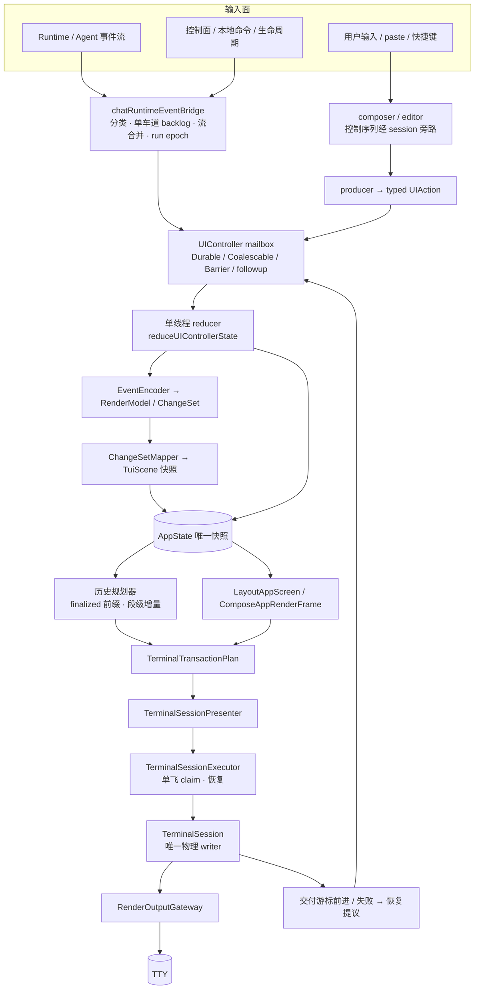
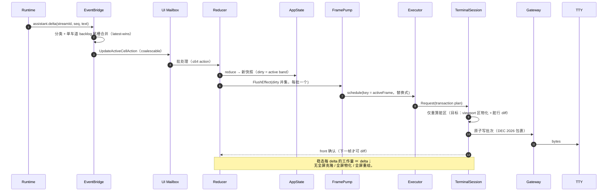
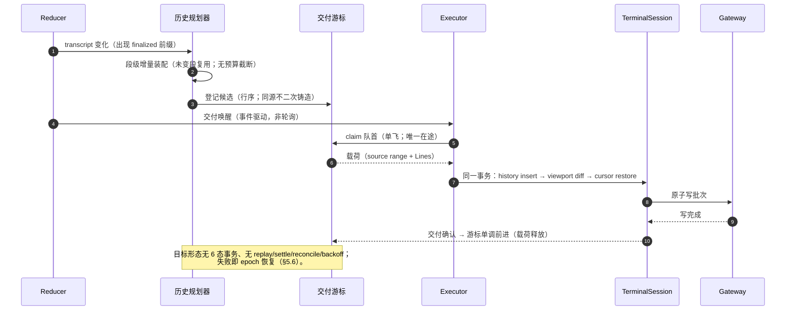
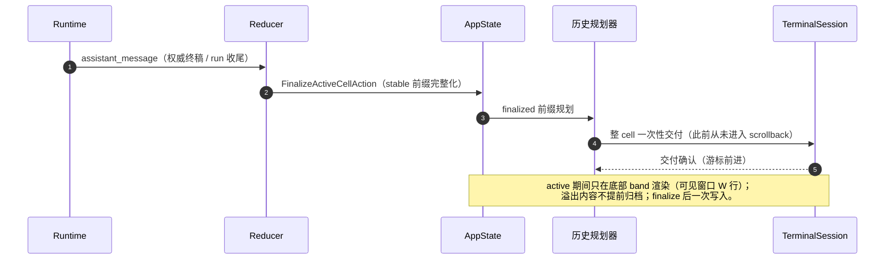
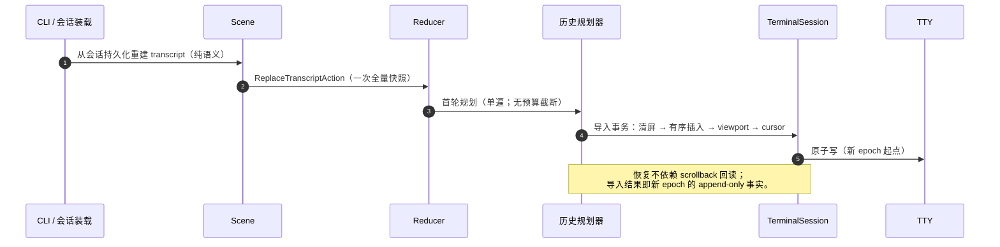
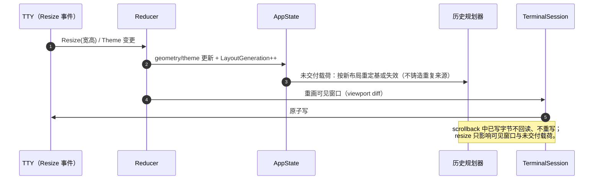
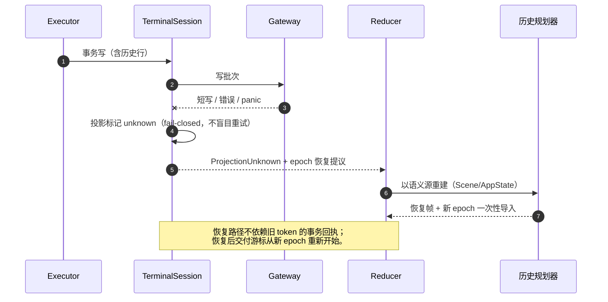
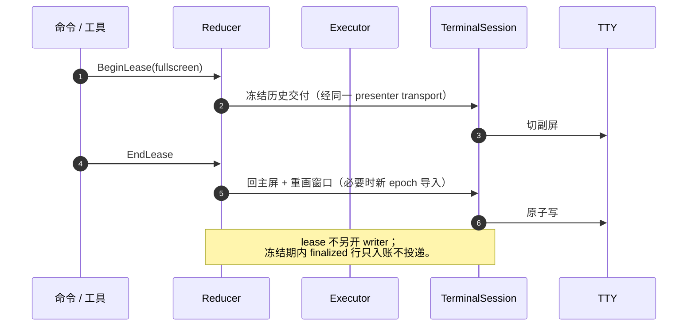
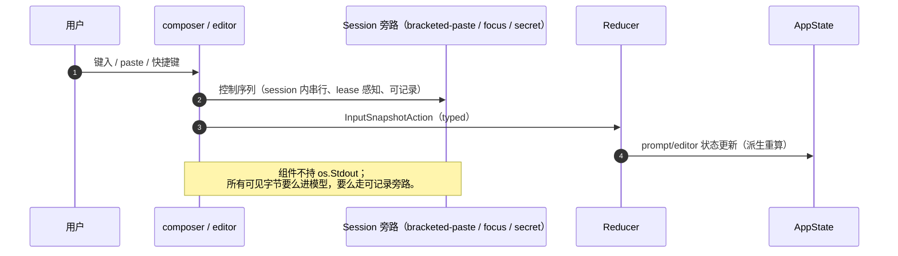
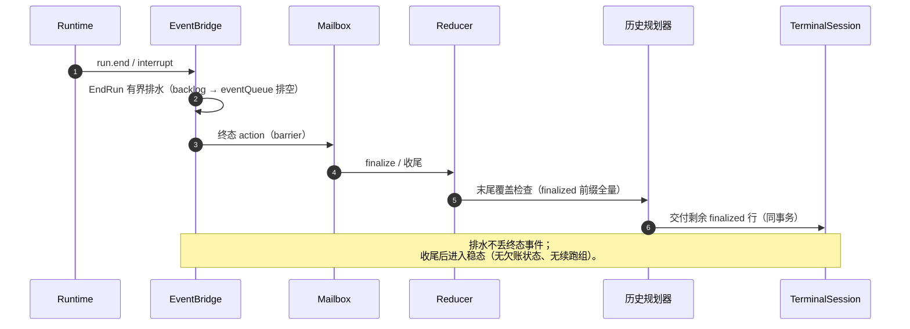

# aicli TUI 渲染器架构设计（目标形态 v2）

> 文档状态：**规范性设计**（目标架构 + 组件契约 + 状态所有权 + 时序图 + 迁移映射）。
> 自本文起，本文件是 aicli 交互式 TUI 渲染的**唯一规范源**；与旧文档的关系见 §7.3。
> 基线：`feat/render-p0-writer-unification` @ `d47147b1`（2026-10-06）。
> 依据：`docs/plan/aicli-unified-render-architecture-audit-20261005.md`（§5 根因、§6 目标与 P0–P3）、
> P0 台账（`aicli-render-p0-writer-unification-ledger.md`）、P1 计划（`aicli-render-p1-state-convergence-plan.md`）、
> P1-1 子计划（`aicli-render-p1-1-step4-planning-incremental-plan.md`）、P2 侦察（进行中）、P3 与工作区实读。
> 阅读顺序建议：§1 → §2 → §5（时序）→ §3/§4（按需）→ §6/§7。

---

## 1. 设计目标与原则

### 1.1 目标形态（一句话）

```text
事件 → 单一有序队列 → 单一 reducer（AppState）→ 单一 frame producer → 单一 writer；
native scrollback 只做 append-only 单向交付（写出的字节永不回读、永不改写）。
```

### 1.2 五条硬原则

| # | 原则 | 含义 | 反面（当前债务，审计口径） |
|---|---|---|---|
| G1 | **单一事实源** | 每个事实恰好一个所有者；其余只读派生，不落第二份可变状态 | 14 处镜像（审计 §3.2） |
| G2 | **单写端与边界闭合** | 交互期唯一物理写 = `TerminalSession`；标题/铃/编辑器序列/stderr 走显式旁路 | 6 类未栅栏字节出口（审计 §2.2） |
| G3 | **单向 scrollback** | 不可回读介质不做事务回执；mutable 内容不提前进入；finalized 一次性交付 | 6 态 ledger + replay/settle/reconcile/backoff |
| G4 | **O(delta) 成本** | 稳态每 delta 工作量 ∝ delta；全屏级克隆/物化/重绘不得作为基线 | 每帧 ≥2 次全屏克隆、全屏物化、全屏强制重绘 |
| G5 | **确定化恢复** | 无法证明写入结果 → fail-closed → source-backed 重建 + 新 epoch；不盲目重试 | 多守卫补偿叠加（backoff/recovery/unknown/reconcile） |

### 1.3 非目标（明确不做）

- 不做 scrollback 回读 / 改写 / 删除；不承诺"历史可修正"语义。
- 不以"每帧全量"为成本基线；不以 FPS 上限、时间预算、睡眠作为主要正确性手段。
- 不保留 legacy 双写路径；兼容层（`FixedBottomSurface` 等）仅作 facade/几何桥，不产生字节。
- 不追求分布式事务语义（scrollback 不是可协调的远端；它是单向日志）。

---

## 2. 组件全景与权威边界

### 2.1 四权威边界（+ 输入面）

| 权威 | 组件 | 负责 | 明确不负责 |
|---|---|---|---|
| **语义权威** | `render/encoding`（`EventEncoder`/`RenderModel`/`ChangeSet`）+ `scene`（`TuiScene`/`TranscriptCell`） | 事件归并、全序、cell 身份与生命周期、原始 source、结构化 presentation | 终端尺寸、光标、ANSI、物理写进度 |
| **状态权威** | `UIController` + reducer + `AppState` | transcript 快照、active cell、bottom pane、geometry、theme、lease、交付进度引用 | 从终端反推业务状态 |
| **交付权威** | 历史规划器 + 交付账（目标形态：**行序交付游标**，§3.4） | 哪些 finalized 行已可靠交付、在途 claim、恢复提议 | 生成语义内容、直接写终端 |
| **物理投影权威** | `TerminalSession`（唯一物理 writer） | 屏幕缓存、terminal epoch、viewport diff、scrollback 导入、原子写 | 作为业务事实源 |

### 2.2 组件清单

| 组件 | 位置 | 职责 | 关键契约 |
|---|---|---|---|
| 事件桥 | `commands/chat_runtime_events.go` | runtime 事件分类、单车道 backlog（512/2MiB，尾槽合并）、有界 eventQueue（576）、EndRun 有界排水、run epoch | 跨家族严格 FIFO；epoch 拒绝 stale；外来会话内容不进父数据面 |
| 输入路径 | `commands/chat_composer.go` / `chat_interaction.go` / `ui/inputbox_editor.go` | 键盘/paste/composer；编辑器控制序列经 **session 旁路** | producer 只发 typed `UIAction`；不持 `os.Stdout` |
| UI actor | `ui/controller.go`（`Run` :436） | mailbox（durable/coalescable/barrier/followup）、批 ≤64、每批一个 `FlushEffect` | 单 goroutine；reducer 唯一入口 |
| reducer | `ui/controller_state.go:78`（+ commands 适配 `chat_ui_actor.go:1076`） | `AppState` 唯一写者；纯 transition；派生状态 | 无 I/O、无终端读、无隐藏可变全局 |
| AppState | `ui/app_state.go` | 整帧语义/布局输入快照（COW） | 只读消费；写仅经 reducer |
| 编码器 | `ui/render/encoding/encoder.go` | runtime event → `RenderModel`/`ChangeSet`（全序 item、`streamOrder` 单点编号） | 编码结果是增量语义，不是 ANSI/行 |
| Scene | `ui/scene/*` | `TranscriptCell` 稳定身份；`ChangeSetMapper` 增量映射；`SceneController` 全有或全无提交 | Scene 是语义唯一来源；不可从终端反推 |
| 历史规划器 | `ui/history_effect_planner.go` | finalized 前缀筛选、布局 screening、提交装配（目标：单线程同步 + 段级增量） | 只产候选；不投递；不写终端 |
| 交付账 | `ui/history_effect_queue.go` / `ui/history_commit.go` | 目标：**行序交付游标 + 单飞 claim**（P1/P2 收敛后取代 6 态 ledger） | token 单调；同源不二次铸造；claim 单飞 |
| 帧合成 | `ui/app_screen_layout.go:68`（`LayoutAppScreen`）、`ui/app_render_frame.go:45`（`ComposeAppRenderFrame`）、`ui/terminal_session.go:63`（`ComposeTerminalFramePlan`） | `AppState` → screen rows → rich frame → terminal frame plan → transaction plan | 纯派生；不读终端；plain/structured 一致性校验 |
| presenter | `ui/terminal_session_presenter.go` | 几何发布 + `Request`（帧与历史共用一条 transport） | 非重入；唯一请求入口 |
| executor | `ui/terminal_session_executor.go` | 单飞 claim、事务执行、恢复调度（目标：无 backoff 睡眠） | claim-miss 显式释放；不并发写 |
| **TerminalSession** | `ui/terminal_session.go` | **唯一物理 writer**：viewport diff、历史插入、scrollback 导入、epoch、原子写（DEC 2026 包裹） | prepare→write 顺序；短写=失败；不承诺回读 |
| 输出网关 | `ui/render/output/gateway.go` | primary serial + journal ring + mirror（生产队列 64） | 一次只有一个 primary 提交 |
| 帧调度 | `ui/renderengine/frame_pump.go` | 每 key 单 pending job，替换式重调度（60/30 FPS） | 唯一 scheduler；定时器不落笔 |
| ScreenModel | `ui/renderengine/screen_model.go` | front/back 网格（**唯一屏幕内容镜像**） | 未确认 front 绝不作差分依据 |
| 控制序列旁路 | `ui/terminal_title.go` / `terminal_bell.go` + session 旁路方法 | 标题（OSC）/铃（BEL）/编辑器序列 | session 内串行、可记录、lease 感知；组件不持 stdout |
| lease | `ui/screen_lease.go` + `AppState.Lease` | fullscreen/alternate 所有权 | lease 活跃冻结历史交付；lease 走同一 transport |
| 诊断 | `/debug`、`renderengine.PaintTrace`、diag ring | 只读观测（白重绘/缺失覆盖/时序） | 不参与布局/diff/输出；零字段补偿 |

### 2.3 数据流总图



> 图注：实线为当前/目标一致的主链路；`ED` 的旁路为 P0 已落地的收编形态（`c159a118`）。
> 目标收敛后，`HP → TP` 的交付账从"6 态事务"降为"行序游标"（§3.4），其余拓扑不变。

---

## 3. 分层设计

### 3.1 事件接入层（`commands/chat_runtime_events.go`）

- **分类与家族**：runtime 事件按家族（assistant/reasoning/tool/approval/run 生命周期）分类；跨家族严格 FIFO，
  同流事件允许尾槽合并（latest-wins），ordered 家族不可绕过。
- **单车道 backlog**（`b19284db` 已落地）：所有事件经唯一有序 backlog（512 条 / 2MiB）→ 有界 `eventQueue`（576）
  → 单 worker 消费；不允许旁路直投 mailbox 的"快车道"。
- **epoch**：run/turn 身份由 bridge 单点持有（`runEpoch`）；所有下游只持**引用副本**用于 stale 拒绝，
  不落第二份可变状态（§4 第 1 项）。
- **EndRun 排水**：有界排空 backlog → eventQueue，再以 barrier action 通知 reducer 收尾；排水期间不丢终态事件。
- **目标**：接入层只做"有序化 + 身份化"，不做渲染决策；所有可见后果都必须表达为 `UIAction`。

### 3.2 编码与语义层（`render/encoding` + `scene`）

- **EventEncoder 单点编码**：runtime event → `RenderModel.Items`（全序数组，顺序由数组位置而非到达时间决定）
  → `ChangeSet`（append/upsert/correct/remove + revision）；流式序号 `streamOrder` 单点编号。
- **Scene 稳定身份**：`TranscriptCell` 以 `(ID, Revision)` 表达身份与版本；流式更新是 revision 演进，
  不铸造新 cell；`cell.Phase` 表达生命周期（mutable → finalized）。
- **全有或全无**：`SceneController.Submit` 对一组 mutation 原子提交；失败不产生半场景。
- **纯语义**：`LayoutTranscript` 只派生语义行与 cell 间 gap，不做终端 I/O、不读终端状态。
- **目标**：Scene 是 transcript 的唯一语义来源；任何"从屏幕/终端反推内容"的路径视为违规。

### 3.3 状态层（`UIController` + reducer + `AppState`）

- **action 分级**：durable（身份/完成/边界）、coalescable（流式 delta，latest-wins）、barrier（顺序栅栏）、
  followup（reducer 内部因果投递，先于外部 mailbox）；身份/完成/history 交付边界不可合并。
- **批处理**：单批 ≤64 action；每批只发**一个** `FlushEffect`（dirty 取并集）；批内不重入。
- **reducer 纯函数**：`reduceUIControllerState` 无 I/O、无终端读；`AppState` 只由 reducer 写（COW 复用）。
- **派生优先**：一切可从 `AppState` 纯函数派生的量（布局行、几何、交付视图、帧计划）不得落第二份可变状态；
  保留的唯一"缓存"是内容寻址的纯 memo（`sharedCellRows`/`sharedHistoryPlan`），带失效契约。
- **空闲判定**：目标为**事件驱动 ack**（交付完成事件唤醒），删除 1ms 轮询与三连 `WaitIdle`（P1-3 已落地）；
  生产路径不得以"轮询 + 超时"作为同步原语。

### 3.4 规划与交付账（目标形态核心）

**规划（planner）**

- **finalized-only 前缀**：只有 finalized cell 的完整物理行可进入交付；第一个 mutable cell 是屏障（canonical frontier），
  其后的 finalized 内容不得越位交付。
- **mutable 内容零提前进入**：active cell 只在底部 band 渲染（可见窗口 W 行）；其内容**不**进入 scrollback，
  finalize 时一次性交付（P2 目标规则，取代"active 溢出归档"整族特例）。
- **单线程 + 增量**：规划只在 reducer 线程内执行（无 worker、无跨线程结果 action）；
  单次代价 ∝ 输入增量（变更段），与历史总规模解耦（P1-1 子计划 Stage 1–4）。

**交付账（目标：行序交付游标）**

- **事实**：已交付的 finalized 行前缀（单调游标）+ 至多一个在途 claim（单飞写证明）。
- **提交身份**：`(cell 身份, revision, source range, fragment)`；display 位置为**簿记**，不参与字节等价
  （P1-1 §1.6 的 D2 方向：`byRange` 去 display）。
- **删除面**：6 态 ledger（defer/inflight/rebase 特例）、scrollback replay/settle/reconcile、reset backoff、
  `PlanIncomplete/PlanStalled/续跑组`——单线程序列化与单向交付后均无存在理由（P1/P1-1/P2）。
- **失败语义**：写入结果不可证明 → 不重试旧 token；标记投影 unknown → source-backed 重建 + 新 terminal epoch
  （§3.6）；恢复不需要旧账本的事务回执。

**可见窗口与 scrollback 边界**

- 可见窗口 W 行；finalized 溢出按**行序** append 进 native scrollback；resize 只重画窗口，
  不承诺 scrollback 可改写（P2 目标规则）。

### 3.5 帧合成层（`app_screen_layout.go` / `app_render_frame.go` / `terminal_session.go`）

- **三级派生**（全部纯函数，输入只有 `AppState`）：
  1. `LayoutAppScreen`：语义行 + cell gap + bottom 区域占位 → screen rows（plain）；
  2. `ComposeAppRenderFrame`：rich `render.Line`（role/样式/结构化 IR 保留）；
  3. `ComposeTerminalFramePlan`：plain/structured 一致性校验 → `TerminalFramePlan`；
     与待交付历史行合并 → `TerminalTransactionPlan`。
- **目标（P3）**：只物化 viewport 区（历史行占位，不编码）；diff 只处理脏行；去掉历史写入触发的全屏 `Invalidate`；
  plan 单所有者零拷贝（去防御性 `Clone`）；`ScreenModel` swap 复用而非整网格 copy。
- **契约**：帧合成不读终端、不读 legacy surface 的可变状态；一致性校验失败即拒绝该帧（fail-closed）。

### 3.6 物理投影层（presenter → executor → `TerminalSession`）

- **单写端**：交互期唯一物理写 = `TerminalSession`（经 gateway）；presenter 是唯一请求入口，executor 单飞执行。
- **事务语义**：`prepare → 原子写（DEC 2026 同步框包裹）→ front 确认`；一帧一次原子写；
  短写/错误/panic = 失败（fail-closed），不静默降级。
- **历史插入**：与 viewport diff 在**同一事务**内按 `history insert → viewport diff → cursor restore` 顺序执行；
  较早行进入 native scrollback；resident tail 保持可见窗口连续性。
- **导入（resume/新 epoch）**：清屏 + 全量有序导入 + viewport + cursor 为**一次事务**；
  导入后的字节流即新 epoch 的 append-only 流。
- **失败恢复**：投影标记 unknown → 停止盲目重试 → 以语义源（Scene/AppState）重建 source-backed 帧 +
  新 epoch 导入；恢复后交付游标从新 epoch 重新开始。

### 3.7 输出网关与帧调度

- **gateway**：primary 串行提交；journal ring（诊断）；mirror（只读旁路，生产队列 64）；
  一次只有一个 primary 提交，镜像不得回写主通道。
- **FramePump**：唯一帧调度器；每个 key（dynamicStatus/stableCommit/activeFrame/prompt）只保留一个 pending job，
  重调度即替换；定时器回调只 `Post(DrawRequested)`，不直接绘制。
- **ScreenModel**：front/back 双缓冲；**唯一屏幕内容镜像**；未确认 front 绝不作差分依据；
  `Commit` 后才允许下一帧 diff。

### 3.8 旁路与特殊路径（全部收敛到同一写端/同一状态源）

| 路径 | 设计 | 状态 |
|---|---|---|
| 标题 OSC / 铃 BEL | 经 `TerminalSession` 旁路方法（session 内串行、可记录、lease 感知） | P0 已落地（`c159a118`） |
| 编辑器控制序列（bracketed-paste/focus 等） | 同上，经 session 旁路；组件不持 `os.Stdout` | P0 已落地 |
| stderr | 交互期统一走 `NotifyChatDiagnostic` 或日志文件；禁止与 stdout 同 tty 直写 | P0 部分（边缘路径持续收口） |
| fullscreen lease | lease 活跃冻结历史交付；往返只经同一 presenter transport | 已落地，随 P1 简化 |
| resize / theme | 几何 probe 单点输入 → `AppState` → `LayoutGeneration++`；未交付载荷重定基/失效；仅重画窗口 | P1-2b 已落地主体 |
| 诊断（`/debug`、PaintTrace） | 只读观测；零字段补偿；不参与布局/diff/输出 | 已落地 |
| legacy `FixedBottomSurface` | 只作 facade/几何桥；物理写单向栅栏（不可复活） | P0 已栅栏；fenced-dead 待清理 |

---

## 4. 状态所有权矩阵（14 处镜像的终态）

> 口径：每行给出**目标唯一所有者**；"派生/引用"列的值必须是只读且可随时重算。
> "收敛动作"列指向 P0–P3 或专项计划；状态为截至 `d47147b1` 的实施进度。

| # | 事实 | 目标唯一所有者 | 只读派生 / 引用 | 收敛动作 | 状态 |
|---|---|---|---|---|---|
| 1 | run/turn 身份 | 事件桥 `runEpoch` | 交付层仅持 epoch 引用做 stale 拒绝 | 删除 `runState/lastClosedTurnID/adoptedTurnID` 等冗余副本；terminal epoch 与 run epoch 明确区分命名 | 部分 |
| 2 | layout generation | `AppState.LayoutGeneration` | frame/plan/session 持值副本（stale 拒绝） | 删除 `executor.lastResetGeneration`（backoff 删除后自然消失） | 部分 |
| 3 | 几何 | `AppState.Geometry`（probe 单点输入 + Resize barrier 回投） | session 持"已应用几何" | 删除 presenter `lastWidth/lastHeight` 镜像（改派生比较） | P1-2b 主体已落地 |
| 4 | 历史交付进度 | **交付游标**（§3.4） | executor 诊断只读 | 删除 claim 拒绝计数 / `historyTailRows` / `historyTailCells` / diag 镜像或降级 /debug | P1-1/P1-2 部分 |
| 5 | scrollback/terminal epoch | `TerminalSession.terminalEpoch` | `AppState` 持引用 | 收敛 `ProvenScrollbackEpoch` 等副本（P2 后 replay/settle 删除） | 待 P2 |
| 6 | lease | `AppState.Lease` | session 持应用态 | 归并 `alternateLeaseID` / `ScreenLease.ID` 副本 | 部分 |
| 7 | 帧号 | **writer 单点分配**（`TerminalSession.frame`） | `PaintTrace`/gateway 各自观测独立编号 | 删除跨层"同一帧号"假设；观测编号不参与正确性 | 部分 |
| 8 | 流序号 | 编码器 `streamOrder` | payload `sequence/coalesced_from` 仅作输入元数据 | 禁止下游二次编号 | 已落地 |
| 9 | assistant 去重 | 编码器 `assistantSnapshotBy` | — | 删除 `renderedAssistantDeltaContent/digest/length` 副本 | P1 部分 |
| 10 | 行内容镜像 | `ScreenModel`（唯一屏幕镜像） | 历史行由 source 派生（不落镜像） | 删除 `historyStreamTailRows` / `historyTailCells` / `SoftOutputState.lines` / `PaintTrace` 内容 hash（或降级 /debug） | P1-2a 部分；`historyTailCells` 保留待替换 |
| 11 | plan 完整性 | —（不存在） | — | 规划单线程同步后删除 `PlanIncomplete/PlanStalled/续跑组`（P1-1 Stage 2–4） | Stage 1 设计完成 |
| 12 | 空闲判定 | —（事件驱动 ack） | — | 删除 `waitControllerIdle` 1ms 轮询与三连 `WaitIdle`（P1-3 已落地） | 已落地 |
| 13 | backoff 进度 | —（fail-closed + 恢复） | — | 删除 reset backoff 状态机（P2） | 待 P2 |
| 14 | 降级/预算遥测 | 事件桥单点计数器 | 只读快照 | 合并两份无锁镜像 | 部分 |

**判定**：矩阵是"修一处、坏一处"的结构性解药——任何新状态字段必须先在本文登记所有者；
无所有者的镜像不得新增，已有镜像按上表收敛。

---

## 5. 时序图

### 5.1 流式 delta → 可见帧（稳态；目标 O(delta)）



### 5.2 finalized 前缀 → scrollback 一次性交付



### 5.3 active finalize（mutable 内容零提前进入）



### 5.4 resume / 历史导入（新 terminal epoch，一次性导入）



### 5.5 resize / theme（generation bump；只重画窗口）



### 5.6 写失败 / projection unknown → source-backed recovery



### 5.7 fullscreen lease 往返



### 5.8 输入与本地命令（编辑器序列经旁路）



### 5.9 run end / interrupt 排水



---

## 6. 不变量清单（跨组件契约）

> 违反任一条即为架构缺陷（而非局部 bug）；修复必须回到本表对齐。

| # | 不变量 | 验证手段 |
|---|---|---|
| INV-1 | **单写端**：交互期唯一物理写 = `TerminalSession`（经 gateway）；组件不得持有 `os.Stdout`/`fmt.Print` 直写 | 单写端断言测试（注入计数 writer）；白名单 CI 门禁 |
| INV-2 | **单事实源**：§4 矩阵中每个事实仅一个所有者；其余为只读派生 | 结构测试 + review 清单 |
| INV-3 | **reducer 单写**：`AppState` 只由 reducer 写；Scene 快照仅经 `ReplaceTranscriptAction` 进入 | actor 边界测试 |
| INV-4 | **单向 scrollback**：写出的字节不回读、不改写；mutable 内容不提前进入；finalized 一次性交付 | marker exactly-once 真机 e2e；P2 验收矩阵 |
| INV-5 | **顺序**：cell 内按 source 顺序；跨 cell 按 transcript 顺序；交付游标单调 | 顺序断言 + 覆盖度测试 |
| INV-6 | **原子帧**：一帧一次原子写（DEC 2026 包裹）；短写 = 失败（fail-closed） | 短写注入测试 |
| INV-7 | **O(delta)**：稳态每 delta 工作量 ∝ delta；全屏级克隆/物化/重绘不得作基线 | 基准（p50/p95、分配、GC、锁持有） |
| INV-8 | **确定化恢复**：写入结果不可证明 → unknown → source-backed 重建 + 新 epoch；不盲目重试 | 故障注入 + epoch 断言 |
| INV-9 | **generation**：布局代次单调；旧代次回调不得确认新布局 | generation 栅栏测试 |
| INV-10 | **lease**：lease 活跃冻结历史交付；lease 走同一 transport | lease 往返测试 |
| INV-11 | **边界闭合**：所有可见字节经统一边界或显式旁路（串行、可记录、lease 感知） | 写端清单 + 门禁白名单 |
| INV-12 | **零补偿探针**：诊断/追踪不参与布局、diff、输出；字段零补偿 | PaintTrace 不变量测试 |

---

## 7. 迁移映射与验收

### 7.1 P0–P3 现状映射（截至 `d47147b1`）

| 阶段 | 目标 | 已完成 | 进行中 / 待办 |
|---|---|---|---|
| **P0 写端归一** | 所有字节经统一边界；旁路可记录 | 控制序列旁路（`c159a118`：标题/铃/编辑器序列）；守卫与回归栅栏（`09190ee8`，64 项债务台账）；legacy surface 单向栅栏 | stderr 边缘路径收口；CI 白名单门禁（`render/output` 之外 0 命中）；fenced-dead 清理 |
| **P1 状态收敛** | 状态字段/镜像缩减；事件驱动同步 | P1-1 步骤 1–3（单飞写游标、六态归一、计数器游标）；P1-2a（零风险删除）；P1-2b 主体（几何收敛、去重镜像删除）；P1-3（`WaitIdle` → 事件驱动 ack） | P1-1 第 4 步（删续跑组 ≈305 refs，受 P1-1 子计划门控）；残余镜像（§4 标注"部分/待"） |
| **P1-1 规划增量** | 单线程 + 增量 + 无预算截断 | Stage 0（基线 522ms/op + CPU profile 归因）；Stage 1 设计细化（§1.6：身份模型/D2 反例） | Stage 1 编码（D2 测试先行 → 1c/1d → 基准 ≤174ms）；Stage 2（无预算同步化，冷启动门控）；Stage 3（去异步）；Stage 4（删续跑组） |
| **P2 历史线性化** | 单向交付；删特例族 | —（方向与目标规则已定：§3.4） | 侦察进行中（archive / replay-settle / topalign 三路）；切片计划 → 实施（含 8 项验收矩阵） |
| **P3 性能** | O(delta) 成本模型 | 基准与热点归因（P1-1 Stage 0）；部分缓存（`sharedCellRows`/`sharedHistoryPlan`） | 增量编码（viewport 物化 + 脏行 diff）；去全屏克隆（plan 单所有者、ScreenModel swap）；active markdown 增量解析 |

### 7.2 分阶段验收（总表）

| 阶段 | 关键验收 | 风险 |
|---|---|---|
| P0 | 单写端断言；真机 e2e 全绿；CI 门禁生效（白名单外 0 命中） | 低 |
| P1 | 状态字段/队列计数缩减（before/after）；`-race` 全绿；长会话 marker exactly-once | 中 |
| P1-1 | `second_plan_prepend` ≤174ms；增量 == 全量（身份多重集 + 顺序）；宽回归绿 | 中 |
| P2 | 8 项场景矩阵（流式溢出/归档/finalize/resize 收缩+扩张/lease 往返/partial write/resume-replay/≥5k cells）+ 真机 marker exactly-once + 无异常空行 | 中高 |
| P3 | 新基准（p95 帧时延 < 16ms 稳态；每帧分配/GC/锁持有）；delta 成本 O(delta) 证明 | 中 |

### 7.3 与旧文档的关系（规范性声明）

- 自本文起，**本文件是 aicli TUI 渲染的唯一规范源**。
- `docs/plan/aicli-tui-unified-render-architecture-refactor-plan.md`（2026-08-06，"唯一规范源"声明）**降级为历史注记**；
  其与本文冲突的表述以本文为准。
- `docs/architecture/aicli-chat-unified-renderer-architecture.md`（08-29）与 `docs/aicli/tui-render-architecture.md`（09-23）
  为**现状说明**（含已过期的单写端宣称，见审计 §2.2），不具规范性。
- 审计（10-05）是本文的设计依据与证据来源；P0–P3 各专项计划是本文的实现子计划，
  仅在"与本文一致"的范围内有效。

---

## 8. 开放问题（实施前需定稿）

1. **D2 提交身份决策**（P1-1 §1.6）：`historyCommitRangeKey` 去 display + finalized 跳过 display 比较；
   已识别中部插入反例（仅跳过重定基会丢行），需测试先行钉住"无重复铸造 / 无丢行"不变式。
2. **P2 切片顺序**：待三路侦察回报后定稿（预期：先删 active 溢出归档 → 再收 replay/settle → 最后锚定与 backoff）。
3. **写证明范围**：单向交付 + fail-closed 恢复下，是否需要 per-commit 写证明——设计倾向**否**
   （epoch 恢复取代事务回执）；需在 P2 验收中验证 partial write 场景。
4. **冷启动首轮锁内预算**：P1-1 Stage 2 的实测门控（超预算则先落 ledger 克隆地板 L2.7）。
5. **测试改写策略**：5,296 个固化断言中，哪些随 P2/P3 语义改写、哪些删除、哪些新增为结构断言——
   需在 P2 切片计划中列明（避免"改一处、重写多处断言"的回归噪声）。
6. **文档清理**：约 35 份 render 相关文档的归档/合并策略（避免再次出现"唯一规范源"声明漂移）。

---

> 维护约定：本文件随每个 P0–P3 切片更新（状态列 + 矩阵 + 时序图）；任何新增状态字段必须先在本文件 §4 登记所有者。
