# aicli TUI 渲染器架构设计（目标形态 v2）

> 文档状态：**规范性设计**（目标架构 + 组件契约 + 状态所有权 + 时序图 + 迁移映射）。
> 自本文起，本文件是 aicli 交互式 TUI 渲染的**唯一规范源**；与旧文档的关系见 §7.3。
> 基线：`feat/render-p0-writer-unification` @ `d47147b1`（2026-10-06）。
> 依据：`docs/plan/aicli-unified-render-architecture-audit-20261005.md`（§5 根因、§6 目标与 P0–P3）、
> P0 台账（`aicli-render-p0-writer-unification-ledger.md`）、P1 计划（`aicli-render-p1-state-convergence-plan.md`）、
> P1-1 子计划（`aicli-render-p1-1-step4-planning-incremental-plan.md`）、P2 侦察（2026-10-06 完成）、P3 与工作区实读。
> 阅读顺序建议：§1 → §2 → §5（时序）→ §8（衔接契约）→ §9（handoff 专项）→ §10（区域模型）
> → §3/§4/§6/§7（按需）→ §11。

---

## 1. 设计目标与原则

### 1.1 目标形态（一句话）

```text
事件 → 单一有序队列 → 单一 reducer（AppState）→ 单一 frame producer → 单一 writer；
native scrollback 只做 append-only 单向交付（写出的字节永不回读、永不改写）。
```

### 1.2 五条硬原则

| # | 原则 | 含义 | 反面（当前债务，审计口径） |
|---|---|---|---|
| G1 | **单一事实源** | 每个事实恰好一个所有者；其余只读派生，不落第二份可变状态 | 14 处镜像（审计 §3.2） |
| G2 | **单写端与边界闭合** | 交互期唯一物理写 = `TerminalSession`；标题/铃/编辑器序列/stderr 走显式旁路 | 6 类未栅栏字节出口（审计 §2.2） |
| G3 | **单向 scrollback** | 不可回读介质不做事务回执；mutable 内容不提前进入；finalized 一次性交付 | 6 态 ledger + replay/settle/reconcile/backoff |
| G4 | **O(delta) 成本** | 稳态每 delta 工作量 ∝ delta；全屏级克隆/物化/重绘不得作为基线 | 每帧 ≥2 次全屏克隆、全屏物化、全屏强制重绘 |
| G5 | **确定化恢复** | 无法证明写入结果 → fail-closed → source-backed 重建 + 新 epoch；不盲目重试 | 多守卫补偿叠加（backoff/recovery/unknown/reconcile） |

### 1.3 非目标（明确不做）

- 不做 scrollback 回读 / 改写 / 删除；不承诺"历史可修正"语义。
- 不以"每帧全量"为成本基线；不以 FPS 上限、时间预算、睡眠作为主要正确性手段。
- 不保留 legacy 双写路径；兼容层（`FixedBottomSurface` 等）仅作 facade/几何桥，不产生字节。
- 不追求分布式事务语义（scrollback 不是可协调的远端；它是单向日志）。

---

## 2. 组件全景与权威边界

### 2.1 四权威边界（+ 输入面）

| 权威 | 组件 | 负责 | 明确不负责 |
|---|---|---|---|
| **语义权威** | `render/encoding`（`EventEncoder`/`RenderModel`/`ChangeSet`）+ `scene`（`TuiScene`/`TranscriptCell`） | 事件归并、全序、cell 身份与生命周期、原始 source、结构化 presentation | 终端尺寸、光标、ANSI、物理写进度 |
| **状态权威** | `UIController` + reducer + `AppState` | transcript 快照、active cell、bottom pane、geometry、theme、lease、交付进度引用 | 从终端反推业务状态 |
| **交付权威** | 历史规划器 + 交付账（目标形态：**行序交付游标**，§3.4） | 哪些 finalized 行已可靠交付、在途 claim、恢复提议 | 生成语义内容、直接写终端 |
| **物理投影权威** | `TerminalSession`（唯一物理 writer） | 屏幕缓存、terminal epoch、viewport diff、scrollback 导入、原子写 | 作为业务事实源 |

### 2.2 组件清单

| 组件 | 位置 | 职责 | 关键契约 |
|---|---|---|---|
| 事件桥 | `commands/chat_runtime_events.go` | runtime 事件分类、单车道 ordered backlog（512/2MiB；流=连续序号尾槽拼接、coalescible=原位 latest-wins、critical 保留）、有界 eventQueue（512+64 critical 保留位 / 4MiB）、EndRun 有界排水、run epoch | 跨家族严格 FIFO；epoch 拒绝 stale；外来会话内容不进父数据面 |
| 输入路径 | `commands/chat_composer.go` / `chat_interaction.go` / `ui/inputbox_editor.go` | 键盘/paste/composer；编辑器控制序列经 **session 旁路** | producer 只发 typed `UIAction`；不持 `os.Stdout` |
| UI actor | `ui/controller.go`（`Run` :436） | mailbox（durable/coalescable/barrier/followup）、批 ≤64、每批一个 `FlushEffect` | 单 goroutine；reducer 唯一入口 |
| reducer | `ui/controller_state.go:78`（+ commands 适配 `chat_ui_actor.go:1076`） | `AppState` 唯一写者；纯 transition；派生状态 | 无 I/O、无终端读、无隐藏可变全局 |
| AppState | `ui/app_state.go` | 整帧语义/布局输入快照（COW） | 只读消费；写仅经 reducer |
| 编码器 | `ui/render/encoding/encoder.go` | runtime event → `RenderModel`/`ChangeSet`（全序 item、`streamOrder` 单点编号） | 编码结果是增量语义，不是 ANSI/行 |
| Scene | `ui/scene/*` | `TranscriptCell` 稳定身份；`ChangeSetMapper` 增量映射；`SceneController` 全有或全无提交 | Scene 是语义唯一来源；不可从终端反推 |
| 历史规划器 | `ui/history_effect_planner.go` | finalized 前缀筛选、布局 screening、提交装配（目标：单线程同步 + 段级增量） | 只产候选；不投递；不写终端 |
| 交付账 | `ui/history_effect_queue.go` / `ui/history_commit.go` | 目标：**行序交付游标 + 单飞 claim**（P1/P2 收敛后取代 6 态 ledger） | token 单调；同源不二次铸造；claim 单飞 |
| 帧合成 | `ui/app_screen_layout.go:68`（`LayoutAppScreen`）、`ui/app_render_frame.go:45`（`ComposeAppRenderFrame`）、`ui/terminal_session.go:63`（`ComposeTerminalFramePlan`） | `AppState` → screen rows → rich frame → terminal frame plan → transaction plan | 纯派生；不读终端；plain/structured 一致性校验 |
| presenter | `ui/terminal_session_presenter.go` | 几何发布 + `Request`（帧与历史共用一条 transport） | 非重入；唯一请求入口 |
| executor | `ui/terminal_session_executor.go` | 单飞 claim、事务执行、恢复调度（目标：无 backoff 睡眠） | claim-miss 显式释放；不并发写 |
| **TerminalSession** | `ui/terminal_session.go` | **唯一物理 writer**：viewport diff、历史插入、scrollback 导入、epoch、原子写（DEC 2026 包裹） | prepare→write 顺序；短写=失败；不承诺回读 |
| 输出网关 | `ui/render/output/gateway.go` | primary serial + journal ring + mirror（生产队列 64） | 一次只有一个 primary 提交 |
| 帧调度 | `ui/renderengine/frame_pump.go` | 每 key 单 pending job，替换式重调度（默认 60 FPS，可配置） | 唯一 scheduler；定时器不落笔 |
| ScreenModel | `ui/renderengine/screen_model.go` | front/back 网格（**唯一屏幕内容镜像**） | 未确认 front 绝不作差分依据 |
| 控制序列旁路 | `ui/terminal_title.go` / `terminal_bell.go` + session 旁路方法 | 标题（OSC）/铃（BEL）/编辑器序列 | session 内串行、可记录、lease 感知；组件不持 stdout |
| lease | `ui/screen_lease.go` + `AppState.Lease` | fullscreen/alternate 所有权 | lease 活跃冻结历史交付；lease 走同一 transport |
| 诊断 | `/debug`、`renderengine.PaintTrace`、diag ring | 只读观测（白重绘/缺失覆盖/时序） | 不参与布局/diff/输出；零字段补偿 |

### 2.3 数据流总图

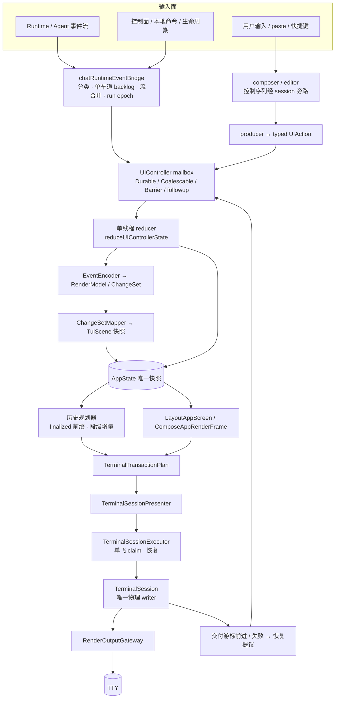

> 图注：实线为当前/目标一致的主链路；`ED` 的旁路为 P0 已落地的收编形态（`c159a118`）。
> 目标收敛后，`HP → TP` 的交付账从"6 态事务"降为"行序游标"（§3.4），其余拓扑不变。

---

## 3. 分层设计

### 3.1 事件接入层（`commands/chat_runtime_events.go`）

- **分类与家族**：runtime 事件按交付类（critical / coalescible / ordered / stream）分类；
  跨家族严格 FIFO；流事件按连续序号尾槽拼接、coalescible 原位 latest-wins、ordered 家族不可绕过。
- **单车道 backlog**（`b19284db` 已落地）：所有事件经唯一有序 backlog（512 条 / 2MiB）→
  有界 `eventQueue`（512 + 64 critical 保留位 / 4MiB）→ 单 worker 消费；
  backlog worker 是唯一重试路径；不允许旁路直投 mailbox 的"快车道"。
- **epoch**：run/turn 身份由 bridge 单点持有（`runEpoch`）；所有下游只持**引用副本**用于 stale 拒绝，
  不落第二份可变状态（§4 第 1 项）。
- **EndRun 排水**：有界排空 backlog → eventQueue，再以 barrier action 通知 reducer 收尾；排水期间不丢终态事件。
- **目标**：接入层只做"有序化 + 身份化"，不做渲染决策；所有可见后果都必须表达为 `UIAction`。

### 3.2 编码与语义层（`render/encoding` + `scene`）

- **EventEncoder 单点编码**：runtime event → `RenderModel.Items`（全序数组，顺序由数组位置而非到达时间决定）
  → `ChangeSet`（append/upsert/correct/remove + revision）；流式序号 `streamOrder` 单点编号。
- **Scene 稳定身份**：`TranscriptCell` 以 `(ID, Revision)` 表达身份与版本；流式更新是 revision 演进，
  不铸造新 cell；`cell.Phase` 表达生命周期（mutable → finalized）。
- **全有或全无**：`SceneController.Submit` 对一组 mutation 原子提交；失败不产生半场景。
- **纯语义**：`LayoutTranscript` 只派生语义行与 cell 间 gap，不做终端 I/O、不读终端状态。
- **目标**：Scene 是 transcript 的唯一语义来源；任何"从屏幕/终端反推内容"的路径视为违规。

### 3.3 状态层（`UIController` + reducer + `AppState`）

- **action 分级**：durable（身份/完成/边界）、coalescable（流式 delta，latest-wins）、barrier（顺序栅栏）、
  followup（reducer 内部因果投递，先于外部 mailbox）；身份/完成/history 交付边界不可合并。
- **批处理**：单批 ≤64 action；每批只发**一个** `FlushEffect`（dirty 取并集）；批内不重入。
- **reducer 纯函数**：`reduceUIControllerState` 无 I/O、无终端读；`AppState` 只由 reducer 写（COW 复用）。
- **派生优先**：一切可从 `AppState` 纯函数派生的量（布局行、几何、交付视图、帧计划）不得落第二份可变状态；
  保留的唯一"缓存"是内容寻址的纯 memo（`sharedCellRows`/`sharedHistoryPlan`），带失效契约。
- **空闲判定**：目标为**事件驱动 ack**（交付完成事件唤醒），删除 1ms 轮询与三连 `WaitIdle`（P1-3 已落地）；
  生产路径不得以"轮询 + 超时"作为同步原语。

### 3.4 规划与交付账（目标形态核心）

**规划（planner）**

- **finalized-only 前缀**：只有 finalized cell 的完整物理行可进入交付；第一个 mutable cell 是屏障（canonical frontier），
  其后的 finalized 内容不得越位交付。
- **mutable 内容零提前进入**：active cell 只在底部 band 渲染（可见窗口 W 行）；其内容**不**进入 scrollback，
  finalize 时一次性交付（P2 目标规则，取代"active 溢出归档"整族特例）。
- **单线程 + 增量**：规划只在 reducer 线程内执行（无 worker、无跨线程结果 action）；
  单次代价 ∝ 输入增量（变更段），与历史总规模解耦（P1-1 子计划 Stage 1–4）。

**交付账（目标：行序交付游标）**

- **事实**：已交付的 finalized 行前缀（单调游标）+ 至多一个在途 claim（单飞写证明）。
- **提交身份**：`(cell 身份, revision, source range, fragment)`；display 位置为**簿记**，不参与字节等价
  （P1-1 §1.6 的 D2 方向：`byRange` 去 display）。
- **删除面**：账本事务语义（六态已于 P1-1 第 2 步归一为三态 queued/delivered/quarantined，目标再降为
  行序交付游标）、scrollback replay/reconcile（**settle 保留**，它就是目标语义）、reset backoff、
  `PlanIncomplete/PlanStalled/续跑组`——单线程序列化与单向交付后均无存在理由（P1/P1-1/P2）。
- **失败语义**：写入结果不可证明 → 不重试旧 token；标记投影 unknown → source-backed 重建 + 新 terminal epoch
  （§3.6）；恢复不需要旧账本的事务回执。

**可见窗口与 scrollback 边界**

- 可见窗口 W 行；finalized 溢出按**行序** append 进 native scrollback；resize 只重画窗口，
  不承诺 scrollback 可改写（P2 目标规则）。

### 3.5 帧合成层（`app_screen_layout.go` / `app_render_frame.go` / `terminal_session.go`）

- **三级派生**（全部纯函数，输入只有 `AppState`）：
  1. `LayoutAppScreen`：语义行 + cell gap + bottom 区域占位 → screen rows（plain）；
  2. `ComposeAppRenderFrame`：rich `render.Line`（role/样式/结构化 IR 保留）；
  3. `ComposeTerminalFramePlan`：plain/structured 一致性校验 → `TerminalFramePlan`；
     与待交付历史行合并 → `TerminalTransactionPlan`。
- **目标（P3）**：只物化 viewport 区（历史行占位，不编码）；diff 只处理脏行；去掉历史写入触发的全屏 `Invalidate`；
  plan 单所有者零拷贝（去防御性 `Clone`）；`ScreenModel` swap 复用而非整网格 copy。
- **契约**：帧合成不读终端、不读 legacy surface 的可变状态；一致性校验失败即拒绝该帧（fail-closed）。

### 3.6 物理投影层（presenter → executor → `TerminalSession`）

- **单写端**：交互期唯一物理写 = `TerminalSession`（经 gateway）；presenter 是唯一请求入口，executor 单飞执行。
- **事务语义**：`prepare → 原子写（DEC 2026 同步框包裹）→ front 确认`；一帧一次原子写；
  短写/错误/panic = 失败（fail-closed），不静默降级。
- **历史插入**：与 viewport diff 在**同一事务**内按 `history insert → viewport diff → cursor restore` 顺序执行；
  较早行进入 native scrollback；resident tail 保持可见窗口连续性。
- **导入（resume/新 epoch）**：清屏 + 全量有序导入 + viewport + cursor 为**一次事务**；
  导入后的字节流即新 epoch 的 append-only 流。
- **失败恢复**：投影标记 unknown → 停止盲目重试 → 以语义源（Scene/AppState）重建 source-backed 帧 +
  新 epoch 导入；恢复后交付游标从新 epoch 重新开始。

### 3.7 输出网关与帧调度

- **gateway**：primary 串行提交；journal ring（诊断）；mirror（只读旁路，生产队列 64）；
  一次只有一个 primary 提交，镜像不得回写主通道。
- **FramePump**：唯一帧调度器；每个 key（dynamicStatus/stableCommit/activeFrame/prompt）只保留一个 pending job，
  重调度即替换；定时器回调只 `Post(DrawRequested)`，不直接绘制。
- **ScreenModel**：front/back 双缓冲；**唯一屏幕内容镜像**；未确认 front 绝不作差分依据；
  `Commit` 后才允许下一帧 diff。

### 3.8 旁路与特殊路径（全部收敛到同一写端/同一状态源）

| 路径 | 设计 | 状态 |
|---|---|---|
| 标题 OSC / 铃 BEL | 经 `TerminalSession` 旁路方法（session 内串行、可记录、lease 感知） | P0 已落地（`c159a118`） |
| 编辑器控制序列（bracketed-paste/focus 等） | 同上，经 session 旁路；组件不持 `os.Stdout` | P0 已落地 |
| stderr | 交互期统一走 `NotifyChatDiagnostic` 或日志文件；禁止与 stdout 同 tty 直写 | P0 部分（边缘路径持续收口） |
| fullscreen lease | lease 活跃冻结历史交付；往返只经同一 presenter transport | 已落地，随 P1 简化 |
| resize / theme | 几何 probe 单点输入 → `AppState` → `LayoutGeneration++`；未交付载荷重定基/失效；仅重画窗口 | P1-2b 已落地主体 |
| 诊断（`/debug`、PaintTrace） | 只读观测；零字段补偿；不参与布局/diff/输出 | 已落地 |
| legacy `FixedBottomSurface` | 只作 facade/几何桥；物理写单向栅栏（不可复活） | P0 已栅栏；fenced-dead 待清理 |

---

## 4. 状态所有权矩阵（14 处镜像的终态）

> 口径：每行给出**目标唯一所有者**；"派生/引用"列的值必须是只读且可随时重算。
> "收敛动作"列指向 P0–P3 或专项计划；状态为截至 `d47147b1` 的实施进度（2026-10-06 四路扫描复核，见 §7.5）。

| # | 事实 | 目标唯一所有者 | 只读派生 / 引用 | 收敛动作 | 状态 |
|---|---|---|---|---|---|
| 1 | run/turn 身份 | 事件桥 `runEpoch` | 交付层仅持 epoch 引用做 stale 拒绝 | 删除冗余副本（已登记：`runState/lastClosedTurnID/adoptedTurnID`；**扫描补登**：`runActive`、`adoptedRunEpoch`、`executorTurnID`、轮终态账本 `retiredTurnIDs/acceptedAssistantFinalTurns/finalAssistantTurns`）；terminal epoch 与 run epoch 明确区分命名 | 部分 |
| 2 | layout generation | `AppState.LayoutGeneration` | frame/plan/session 持值副本（stale 拒绝） | 删除 `executor.lastResetGeneration`（backoff 删除后自然消失） | 部分 |
| 3 | 几何 | `AppState.Geometry`（probe 单点输入 + Resize barrier 回投） | session 持"已应用几何" | 删除 presenter `lastWidth/lastHeight` 镜像（改派生比较） | P1-2b 主体已落地 |
| 4 | 历史交付进度 | **交付游标**（§3.4） | executor 诊断只读 | 删除 claim 拒绝计数 / `historyTailRows` / `historyTailCells` / diag 镜像或降级 /debug | P1-1/P1-2 部分 |
| 5 | scrollback/terminal epoch | `TerminalSession.terminalEpoch` | `AppState` 持引用 | 收敛 `ProvenScrollbackEpoch` 等副本（P2 后 replay/settle 删除）；**扫描补登**：session 与 `HistoryEffectQueueState.TerminalEpoch` 两份可变值需归一 | 待 P2 |
| 6 | lease | `AppState.Lease` | session 持应用态 | 归并 `alternateLeaseID` / `ScreenLease.ID` 副本 | 部分 |
| 7 | 帧号 | **writer 单点分配**（`TerminalSession.frame`） | `PaintTrace`/gateway 各自观测独立编号 | 删除跨层"同一帧号"假设；观测编号不参与正确性 | 部分 |
| 8 | 流序号 | 编码器 `streamOrder` | payload `sequence/coalesced_from` 仅作输入元数据 | 禁止下游二次编号 | 已落地 |
| 9 | assistant 去重 | 编码器 `assistantSnapshotBy` | — | 删除 `renderedAssistantDeltaContent/digest/length` 与 **`renderedAssistantFinal/finalDigest/finalLength`**（扫描补登） | P1 部分 |
| 10 | 行内容镜像 | `ScreenModel`（唯一屏幕镜像） | 历史行由 source 派生（不落镜像） | 删除 `historyStreamTailRows` / `historyTailCells` / `SoftOutputState.lines` / `PaintTrace` 内容 hash（或降级 /debug）；**扫描补登**：bridge 侧 `historySeedSeen/historySeedClaimedItems` 与 legacy `FixedBottomSurface.lastWidth/lastHeight` | P1-2a 部分；`historyTailCells` 保留待替换 |
| 11 | plan 完整性 | —（不存在） | — | 规划单线程同步后删除 `PlanIncomplete/PlanStalled/续跑组`（P1-1 Stage 2–4） | Stage 1 设计完成 |
| 12 | 空闲判定 | —（事件驱动 ack） | — | `waitControllerIdle` 已删、executor 已改 `WaitActionApplied`；**残余**：`WaitIdleTimeout` 的 1ms 轮询仍在（`controller.go:852`），经 P1-3 §3.7 明确**保留的有界超时兜底**触达（close drain / legacy 辅助 / `waitUIActorIdleBounded` 5s）→ 可选事件化见差距收敛方案 B1 | **部分**（残余为显式保留项） |
| 13 | backoff 进度 | —（fail-closed + 恢复） | — | 删除 reset backoff 状态机（P2） | 待 P2 |
| 14 | 降级/预算遥测 | 事件桥单点计数器 | 只读快照 | 合并 `lateDropStats` 与 `publishedDrops` 两份无锁镜像（扫描点名） | 部分 |

**判定**：矩阵是"修一处、坏一处"的结构性解药——任何新状态字段必须先在本文登记所有者；
无所有者的镜像不得新增，已有镜像按上表收敛。

---

## 5. 时序图

### 5.1 流式 delta → 可见帧（稳态；目标 O(delta)）

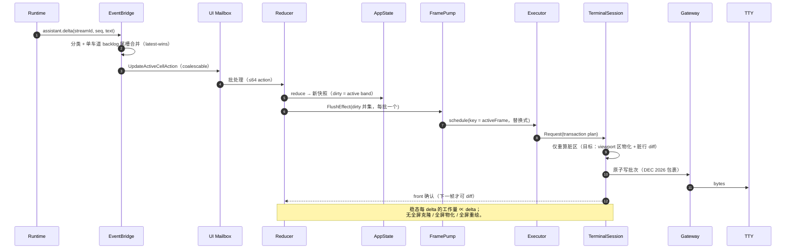

### 5.2 finalized 前缀 → scrollback 一次性交付

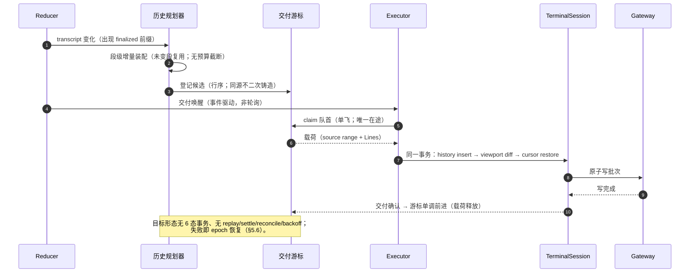

### 5.3 active finalize（mutable 内容零提前进入）

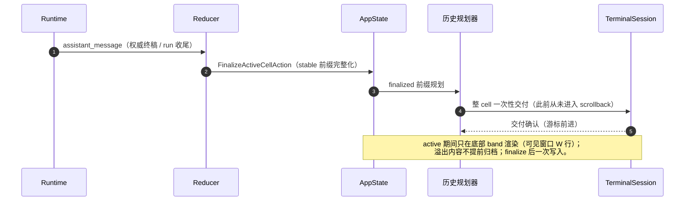

### 5.4 resume / 历史导入（新 terminal epoch，一次性导入）

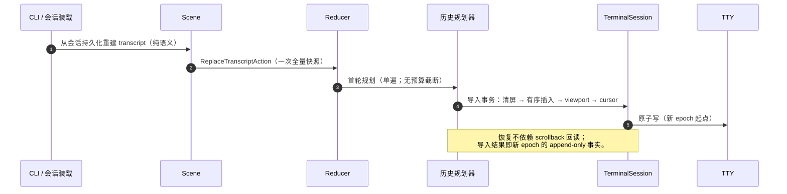

### 5.5 resize / theme（generation bump；只重画窗口）

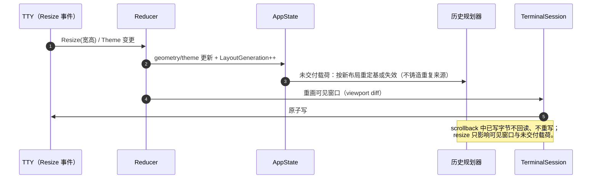

### 5.6 写失败 / projection unknown → source-backed recovery

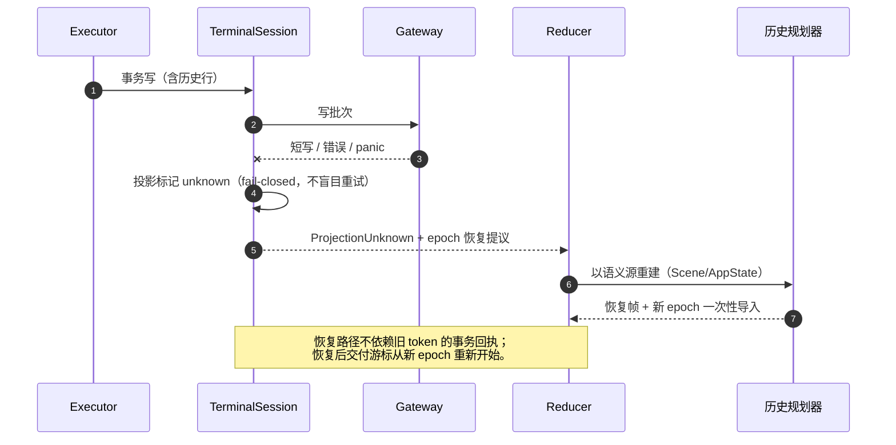

### 5.7 fullscreen lease 往返

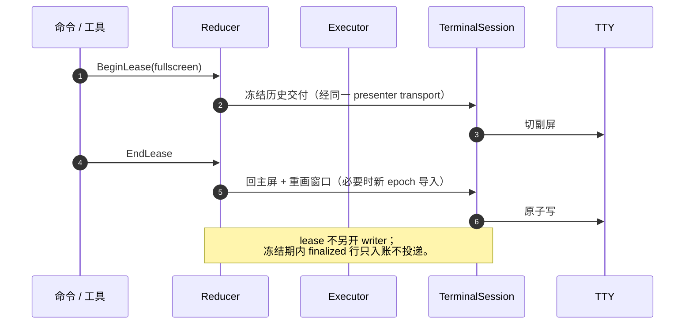

### 5.8 输入与本地命令（编辑器序列经旁路）

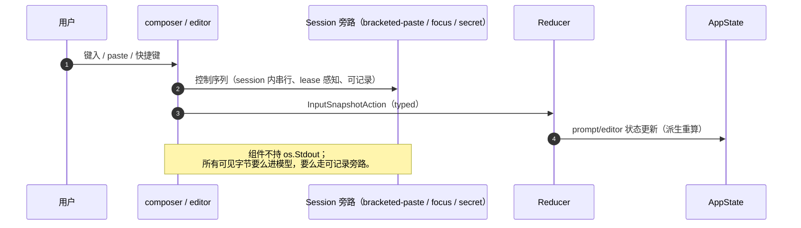

### 5.9 run end / interrupt 排水

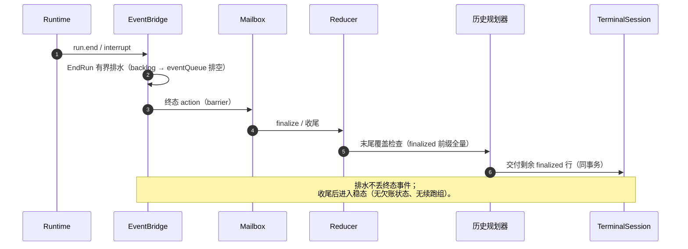

---

## 6. 不变量清单（跨组件契约）

> 违反任一条即为架构缺陷（而非局部 bug）；修复必须回到本表对齐。

| # | 不变量 | 验证手段 |
|---|---|---|
| INV-1 | **单写端**：交互期唯一物理写 = `TerminalSession`（经 gateway）；组件不得持有 `os.Stdout`/`fmt.Print` 直写 | 单写端断言测试（注入计数 writer）；白名单 CI 门禁 |
| INV-2 | **单事实源**：§4 矩阵中每个事实仅一个所有者；其余为只读派生 | 结构测试 + review 清单 |
| INV-3 | **reducer 单写**：`AppState` 只由 reducer 写；Scene 快照仅经 `ReplaceTranscriptAction` 进入 | actor 边界测试 |
| INV-4 | **单向 scrollback**：写出的字节不回读、不改写；mutable 内容不提前进入；finalized 一次性交付 | marker exactly-once 真机 e2e；P2 验收矩阵 |
| INV-5 | **顺序**：cell 内按 source 顺序；跨 cell 按 transcript 顺序；交付游标单调 | 顺序断言 + 覆盖度测试 |
| INV-6 | **原子帧**：一帧一次原子写（DEC 2026 包裹）；短写 = 失败（fail-closed） | 短写注入测试 |
| INV-7 | **O(delta)**：稳态每 delta 工作量 ∝ delta；全屏级克隆/物化/重绘不得作基线 | 基准（p50/p95、分配、GC、锁持有） |
| INV-8 | **确定化恢复**：写入结果不可证明 → unknown → source-backed 重建 + 新 epoch；不盲目重试 | 故障注入 + epoch 断言 |
| INV-9 | **generation**：布局代次单调；旧代次回调不得确认新布局 | generation 栅栏测试 |
| INV-10 | **lease**：lease 活跃冻结历史交付；lease 走同一 transport | lease 往返测试 |
| INV-11 | **边界闭合**：所有可见字节经统一边界或显式旁路（串行、可记录、lease 感知） | 写端清单 + 门禁白名单 |
| INV-12 | **零补偿探针**：诊断/追踪不参与布局、diff、输出；字段零补偿 | PaintTrace 不变量测试 |

---

## 7. 迁移映射与验收

### 7.1 P0–P3 现状映射（截至 `d47147b1`）

| 阶段 | 目标 | 已完成 | 进行中 / 待办 |
|---|---|---|---|
| **P0 写端归一** | 所有字节经统一边界；旁路可记录 | 控制序列旁路（`c159a118`：标题/铃/编辑器序列）；守卫与回归栅栏（`09190ee8`，64 项债务台账）；legacy surface 单向栅栏 | stderr 边缘路径收口；CI 白名单门禁（`render/output` 之外 0 命中）；fenced-dead 清理 |
| **P1 状态收敛** | 状态字段/镜像缩减；事件驱动同步 | P1-1 步骤 1–3（单飞写游标、六态归一、计数器游标）；P1-2a（零风险删除）；P1-2b 主体（几何收敛、去重镜像删除）；P1-3（`WaitIdle` → 事件驱动 ack，**部分：残余 1ms 轮询**，见 §7.5 G1） | P1-1 第 4 步（删续跑组 ≈305 refs，受 P1-1 子计划门控）；残余镜像（§4 标注"部分/待"）；P1-3 轮询收尾 |
| **P1-1 规划增量** | 单线程 + 增量 + 无预算截断 | Stage 0（基线 522ms/op + CPU profile 归因）；Stage 1 设计细化（§1.6：身份模型/D2 反例） | Stage 1 编码（D2 测试先行 → 1c/1d → 基准 ≤174ms）；Stage 2（无预算同步化，冷启动门控）；Stage 3（去异步）；Stage 4（删续跑组） |
| **P2 历史线性化** | 单向交付；删特例族 | 三路只读侦察完成（2026-10-06，结论见 §7.4）；目标规则定稿（§3.4）；**Slice 1 全部完成**（第一刀 `130cc7f5`；第二刀 `7471d34a`/`80738513`/`e3236de9`）；**replay 切片 S1（`59ac603d`）+ S2（`9a205572`）+ S3（`9e7383c1`）+ S4（`7ade9732`：armed 诊断删除 + recoveryBackoff 命名）** | replay 切片 S5（目标语义用例）；锚定切片 |
| **P3 性能** | O(delta) 成本模型 | 基准与热点归因（P1-1 Stage 0）；部分缓存（`sharedCellRows`/`sharedHistoryPlan`） | 增量编码（viewport 物化 + 脏行 diff）；去全屏克隆（plan 单所有者、ScreenModel swap）；active markdown 增量解析 |

### 7.2 分阶段验收（总表）

| 阶段 | 关键验收 | 风险 |
|---|---|---|
| P0 | 单写端断言；真机 e2e 全绿；CI 门禁生效（白名单外 0 命中） | 低 |
| P1 | 状态字段/队列计数缩减（before/after）；`-race` 全绿；长会话 marker exactly-once | 中 |
| P1-1 | `second_plan_prepend` ≤174ms；增量 == 全量（身份多重集 + 顺序）；宽回归绿 | 中 |
| P2 | 8 项场景矩阵（流式溢出/归档/finalize/resize 收缩+扩张/lease 往返/partial write/resume-replay/≥5k cells）+ 真机 marker exactly-once + 无异常空行 | 中高 |
| P3 | 新基准（p95 帧时延 < 16ms 稳态；每帧分配/GC/锁持有）；delta 成本 O(delta) 证明 | 中 |

### 7.3 与旧文档的关系（规范性声明）

- 自本文起，**本文件是 aicli TUI 渲染的唯一规范源**。
- `docs/plan/aicli-tui-unified-render-architecture-refactor-plan.md`（2026-08-06，"唯一规范源"声明）**降级为历史注记**；
  其与本文冲突的表述以本文为准。
- `docs/architecture/aicli-chat-unified-renderer-architecture.md`（08-29）与 `docs/aicli/tui-render-architecture.md`（09-23）
  为**现状说明**（含已过期的单写端宣称，见审计 §2.2），不具规范性。
- 审计（10-05）是本文的设计依据与证据来源；P0–P3 各专项计划是本文的实现子计划，
  仅在"与本文一致"的范围内有效。

### 7.4 P2 侦察结论（2026-10-06，三路只读，支撑 §3.4）

1. **active 溢出归档（切片一）**：只需**停止铸 active 提交**即达目标语义——
   `activeAckedRenderedPrefixRows` 的 skipRows 由已交付 Active 条目推导，停铸后恒为 0，
   finalize 从 source 0 一次性铸全量。切片序：Slice 0 目标断言 → Slice 1 单点停铸
   （核心语义，可独立回滚）→ Slice 2 删终端归档路径 → Slice 3 reducer/planner 清理
   → Slice 4 `HistoryCommitActive` 类型面收尾——**全部完成**（Slice 1 `130cc7f5`；
   Slice 2–4 第二刀 `7471d34a`/`80738513`/`e3236de9`，删除 1336 行（净减 ~1194 行），行为中性）。
2. **replay / settle 族**：**settle 族整体保留（它就是目标语义：原地隔离、永不重发、
   从最后已证明行续写）；armed 销毁式重放族整体可删**（授权字段、`ProvenScrollbackEpoch`、
   `HistoryScrollbackReconciled` 分支、`\x1b[3J` 写路径、success-mode 背压、相关诊断）。
   `TerminalEpoch` 必须**降级保留**为"陈旧回调栅栏"（语义 epoch），不得连同物理 epoch 一起删。
   **S1 已完成（`59ac603d`）**：生产恢复计划恒 settle；装载（`ArmScrollbackReplay`）只做
   从源重证明，delivery ledger 保持权威（append-only 去重：同身份内容零重发、新身份只追加）；
   装载不推进 epoch、不写 `3J`；授权族/物理屏障测试改写或删除。
   **S2 已完成（`9a205572`）**：`HistoryScrollbackReconciled`/`ProvenScrollbackEpoch`/
   `reconcileScrollback` 全族删除，settle 成为唯一恢复路径；旧回调栅栏由 delivery ledger
   身份 + settle 原地隔离承担。
   **S3 已完成（`9e7383c1`）**：`resetScrollback` 计划字段、销毁式 composer、
   `forceScrollbackReset` 分支、`ScrollbackResetCount`/`LastScrollbackResetReason`、
   `TerminalTransactionResult.ScrollbackReset` 与全部 `\x1b[3J` 写点删除；生产已无
   清屏字节路径（真机 e2e 复核 exactly-once）。
   **S4 已完成（`7ade9732`）**：`ScrollbackReplayArmed` 全表面（state/diagnostics/
   debug JSON/document/恢复门）删除；guard 命名收敛为 `recoveryBackoff*`（限速非收敛
   重证而非清屏）；`ArmScrollbackReplay` 保留为装载"从源重证明"标记。
   `/resume`/`/backtrack` 语义需产品决策：append-only 下"改写历史"不可物理回滚。
3. **锚定与 backoff**：`historyTopAligned` + `historyInsertionContinuesScrollback`（0d5ecda6 启发式）
   属删除核心；插入统一为"resident 之后按序写、写满 LF 溢出"；resize 已是 window-only，
   不得重新引入 DECSTBM/DECSC。reset backoff 不能裸删（防 busy loop）：先删 success-mode 预算，
   保留 failed-mode 限速与诊断窗口，确认无循环后再删 guard。
4. **必须保留的内核**：settle 全链与 tail 锚点、stream tail/cells 去重证明、`TerminalEpoch`、
   诊断窗口（`ArmedBackoff/BackoffEngaged` 等读数）；删除任何 reset/归档代码时不得触碰。

### 7.5 目标架构 × 现状差距扫描（2026-10-06，四路只读扫描）

> 方法：写端闭合 / 状态镜像 / handoff 链路 / 屏幕区域四路只读扫描 + 文档逐条核验（对照 §2/§4/§8/§9/§10）。
> 本节只登记"与目标架构的差距"；已由既有计划覆盖的标注处置，未覆盖的进 §11 开放问题。

| # | 差距 | 证据 | 严重度 | 处置 |
|---|---|---|---|---|
| G1 | **1ms 轮询残余（保留项）**：`WaitIdleTimeout` 内部 1ms 轮询仍在，经 `waitUIActorIdleBounded`（5s）/close drain/legacy 辅助触达；P1-3 §3.7 已决策**保留**（有界兜底） | `controller.go:852`；`chat_ui_actor.go:1054/1315/1326`；`chat_runtime_events.go:4787/4790` | 低-中 | 实施方案 B0/B1：登记清单化；事件化（可选） |
| G2 | **写端门禁盲区**：ui 门禁 glob 非递归漏 `renderengine/terminal_lock.go:73,76`（os.Stdout DEC2026）；两个扫描器不覆盖包级 var / 结构体字面量 / 非 arg0 | `terminal_output.go:21`；`chat_notification.go:613`；`chat_notification_sound.go:170`；`chat_legacy_console_editor_windows.go:60-66`；`chat_tool_executor.go:95,117` | 中 | P0 门禁增强（递归 + 盲区扫描）+ 缺口登记 |
| G3 | **stderr 边缘未收口**：交互期仍有 os.Stderr 直写（与 stdout 同 tty） | `chat_setup.go:108/139/233/268` 及 `printChatSessionInfoRow` 调用点；`chat_selection_output.go:129`；`chat.go:1073` | 中 | §3.8 持续收口（P0 尾项） |
| G4 | **claimed 路径 rebase/invalidate 缺口**：`rebasePendingHistoryEffects` 对 claimed 且 presentation 改变的 token 静默跳过，靠 generation 失配→Deferred 释放后收敛 | `history_effect_planner.go:1643-1661`；`history_effect_queue.go:560-567` | 中 | P2 前收紧；§9.3.3/§8 已标注 |
| G5 | **skipRows 证明 0 二义性**：`activeAckedRenderedPrefixRows` 返回 0 兼表"无前缀/前缀不等价"，后者由 finalize 兜底置 `ProjectionUnknown` | `history_effect_planner.go:335-367`；`controller_state.go:594-597` | 中 | P2 Slice 1 后消失；先加注释/测试钉住 |
| G6 | **§4 未登记镜像 9 组**（M1–M9：`runActive`/轮终态账本/`historySeed*`/legacy 几何/viewport 双表示/terminalEpoch 双份/final 三字段/恢复诊断/drop 遥测） | 见 §4 本轮补登 | 中 | 已补登 §4；映射（D3）：M4→A 批 fenced-dead、M5→P1-2b 残余、M6→P2 TerminalEpoch 语义化、其余随 P1/P2 字段清理 |
| G7 | **生产轮询多处**：1ms（4 处）、5ms（backlog worker/settle）、10ms（backoff/lease）、50–100ms（Windows/overlay 平台）；多数为 P1-3 §3.7 明确保留的队列等待/有界兜底 | `chat_runtime_events.go:1840/1981/2003/2597/3033/4803`；`terminal_session_executor.go:1037`；`screen_lease.go:82-89` 等 | 低 | 实施方案 B0 登记表；随 P2 backoff/legacy 退役删减 |
| G8 | **区域未登记项**：编辑器状态行/队列指示/band 顶距/fullscreen 族/主帧 defer/ComposerLine 替换语义 | 见 §10 本轮补登 | 低 | 已补登 §10 |
| G9 | **legacy `StatusBar` 潜伏第二写端**：生产不可达，但 `StatusBar.Render` 直写 os.Stdout，无栅栏 | `statusbar.go:197-252`；唯一构造 `layout.go:58`（无生产 Render 调用） | 低-中 | 已 fenced-dead 标注（A1-7：`statusbar.go` Render 注释 + 基线登记）；重接线须先加物理栅栏 |
| G10 | **web/TUI statusbar 段集合不一致**：同源同构建函数，但 web 缺 state/goal/model/provider/fast（goal/fast 未说明） | `web_statusbar.go:125-210` vs `chat_interaction.go:2878-2912` | 低 | 已文档注明（D2）：web 缺段为现状差异，web 侧对齐另评；goal/fast 为 TUI 专属段 |
| G11 | **doc/code drift**：`terminal_output.go` 注释宣称 `SetLegacyBinding` 重定向，全仓无实现 | `terminal_output.go:21` 注释 | 低 | 已修正注释（A1-2，2026-10-06） |
| G12 | **口径不一致**：`app_layout.StatusRows`（nil 时为 0）与 row plan 恒预留 1 行 | `app_layout.go:110` vs `bottom_pane_row_plan.go:121` | 低 | 已统一（D1：物理预留口径 + 钉测试） |

**本轮文档修正记录**：§4（#1/#5/#9/#10/#12/#14 补登与状态降级）、§8（S1/S5 迁移注记、约束 3 缺口）、
§9（9.3.3 缺口注、9.3.4 settle 前置、9.5 核验注）、§10（堆叠 clamp/modal/ComposerLine/未登记区域/状态栏数据源）、
§7.1（P1-3 部分）。

> 收敛执行：`docs/plan/aicli-render-gap-closure-plan-20261006.md`（批次 A–D：门禁增强 / 轮询登记 /
> 交付账收紧 / 口径小修 + 验收与台账）。

### 7.5.1 轮询保留项登记（B0/B2，2026-10-06）

> 依据：P1-3 §3.7 保留决策 + 实施方案 B 批。B2 核对：生产 1ms 命中集合与本表一致
>（`controller.go:852`、`chat_runtime_events.go:1981/2003/2597/3033`、`chat_ui_actor.go:485`），
> 无未登记 1ms 站点。B1 决策：**保留**（不事件化；触发条件变化时再走事件化改造）。

| 站点 | 形态 | 分类 | 说明 |
|---|---|---|---|
| `ui/controller.go:852`（`WaitIdleTimeout` 内部） | 1ms | 有界超时兜底（保留） | 经 close drain / legacy 有界辅助 / `waitUIActorIdleBounded` 5s 触达（P1-3 §3.7） |
| `chat_runtime_events.go:1981/2003/2597` | 1ms | 队列等待（保留） | backlog / deferred / 字节预算等待 |
| `chat_runtime_events.go:3033` | 1ms | 防御回退（保留） | 无 accepted ticket 的 mailbox 满等待回退 |
| `chat_ui_actor.go:485` | 1ms | 防御回退（保留） | `waitUIActorCapacity` 无 ticket 防紧自旋 |
| `chat_runtime_events.go:1840` | 5ms | 队列重试（保留） | deferred retry interval |
| `chat_ui_actor.go:1035` | 5ms | 有界重试（保留） | alternate-screen release 3 次退避 |
| `ui/terminal_session_executor.go:1037` | 10ms | backoff 让出（保留，P2 删） | scrollback reset backoff |
| `ui/screen_lease.go:82-89` | 10ms | lease 等待（保留） | alternate screen 互斥 |
| `chat_resume_progress.go:331/407` | 400ms | 进度轮询（保留；P2 候选事件化） | 历史加载 settle 等待 |
| `chat_startup_timing.go:187` | 5s | watchdog（保留） | 启动看门狗 |
| `chat_busy_input.go:38` / `chat_input_queue.go:951` | 50–100ms | 输入窗口/队列（保留） | 非 actor-idle 路径 |
| `chat_http.go:205` / `context.go:383` | 退避间隔 | 网络/命令重试（保留） | 指数退避 |
| `chat_interaction.go:7660` | rune delay | 用户可见节流（保留） | 流式渲染节奏 |
| `ui/inputbox_editor*.go`、`chat_legacy_console_editor_windows.go:159` | 10–50ms 级 | 平台输入/转义序列等待（保留） | Windows/Unix 输入解码 |
| `ui/terminal.go:450` | Sleep 方法 | 工具 API（非轮询点） | 公共封装 |

> 复核触发：若上述任一站点成为热点/延迟主因，或 actor-idle 语义变化，重新评估事件化（方案 B1）。

---

## 8. 组件衔接契约（接口矩阵）

> 本表是"组件之间怎么衔接"的规范：每一行是一个衔接点（seam），定义载荷、顺序/前置条件、失败语义。
> 任何新增交互必须先在此登记；违反顺序约束的调用视为架构缺陷（对齐 §6 INV）。

| # | 衔接（上游 → 下游） | 载荷/载体 | 顺序与前置条件 | 失败/拒绝语义 |
|---|---|---|---|---|
| S1 | 事件桥 → UI mailbox | `UIAction`（epoch 标记；流=coalescable，critical=保留席） | 单车道 FIFO；epoch stale 拒绝；有积压不得旁路 | 有界等待失败 → 仅流事件可丢弃 + 诊断计数；critical 不丢（实现注：部分有界等待站点仍用 1ms 睡眠轮询，`chat_runtime_events.go:2597/3033`，待收敛） |
| S2 | 输入/命令 producer → mailbox | typed `UIAction`（durable/coalescable/barrier/followup） | 唯一入口；禁止直改状态或写终端 | 非 typed 调用 = 评审/门禁违规 |
| S3 | mailbox → reducer | action 批（≤64） | 单 goroutine；durable 保序、coalescable latest-wins；followup 先于外部 mailbox | reducer panic 丢弃本 action 的 causal children（不半提交） |
| S4 | reducer → Scene | `ReplaceTranscriptAction`（快照） | 全有或全无；与规划同一次归约（S4 先于 S5） | 无快照不替换；失败不产生半场景 |
| S5 | reducer → planner | transcript+active+geometry+theme+lease（纯输入） | 目标：同线程同步（无 worker、无结果 action）；**迁移中**：当前仍有 plan worker/异步（P1-1 Stage 3） | 无（纯函数） |
| S6 | planner → 交付账 | 候选（身份 = source range + revision + fragment） | 同源去重（`hasTerminalRecordForSource`）；**Queued 可 rebase，claimed 只 invalidate、永不 rebase** | 重复铸造/身份冲突 → 拒绝入账 |
| S7 | 交付账 → executor | Pending 批 + claim（单飞） | `markInFlight` 门：`!Frozen && !Unknown && !hasUnresolvedDelivery` | `ErrHistoryCommitFrozen` / `ErrHistoryProjectionUnknown` / `ErrHistoryCommitRecoveryPending` |
| S8 | executor → TerminalSession | claimed 批快照（plan + payload） | prepare→write；单 writer；geometry 已发布（S11 先于 S8） | 短写/错误 = fail-closed（不静默降级） |
| S9 | TerminalSession → gateway → TTY | 原子写批次（DEC 2026 包裹） | 一帧一次；primary 串行提交 | 写失败 → Failed（投影 unknown） |
| S10 | TerminalSession → reducer（回执） | Ack/Failed/Deferred/Settled/Recovered（动作） | 经 mailbox 回 reducer；回执顺序 = 写顺序 | 世代失配 → settle / quarantine（不复活旧 token） |
| S11 | presenter → executor | geometry 发布（先）+ Request（后） | 首帧不得零尺寸；probe 失败保留 pending 下次重试 | TryPost 失败 → 下次 Flush/Request 重试 |
| S12 | FramePump → executor | 调度键：dynamicStatus / stableCommit / activeFrame / prompt | 每 key 单 pending，替换即合并；定时器只 `Post(DrawRequested)` | 无（替换语义） |
| S13 | reducer → lease 屏障 | Begin/EndLease（barrier） | lease 活跃 → 历史交付冻结（S7 门）；往返只经同一 transport | 冻结期只入账不投递 |
| S14 | 编辑器/控制序列 → session 旁路 | bracketed-paste/focus/secret/标题/铃 | session 内串行、可记录、lease 感知 | 组件持 stdout = P0 门禁违规 |
| S15 | 诊断 tap | 只读（PaintTrace / diag ring） | 零字段补偿；不参与布局/diff/输出 | 无 |

**跨 seam 关键顺序约束（违反即缺陷）**

1. **S4 先于 S5**：Scene 安装与规划必须同一次归约，否则规划输入与所授权快照错位。
2. **S11 先于 S8**：首帧前 geometry 必须已发布（否则 `TerminalFramePlan.Valid()` 拒绝该帧）。
3. **S6 → S7 → S8 严格串行**：claim 之后该载荷不得被 rebase/替换；invalidate 只能转为失败/隔离。
   （**扫描缺口 G4**：`rebasePendingHistoryEffects` 对 claimed 且 presentation 改变的 token 静默跳过，
   靠 generation 失配→Deferred 释放后收敛——见 §7.5。）
4. **S10 必须回 reducer**：任何"结果直接驱动下一跳"的旁路都视为违规。
5. **S1 的 epoch 与 S10 的世代校验成对**：回执世代失配一律进 settle/quarantine，不得重放旧 token。

---

## 9. active band → history handoff 专项（影响最终渲染的核心链路）

> 本章把"active band 如何变成历史、最终如何成为屏幕字节"的衔接逻辑完整成文；
> 目标语义与 P2 切片（§7.4）一致；凡标"当前"的行为是迁移期状态。

### 9.1 目标语义（四句话）

1. mutable 只活在 band（可见窗口内的 tail）：不铸 history token、不写 scrollback、不写 resident。
2. finalize 时整 cell 从 source 0 一次性铸造并按行序交付（不重铸、不跳段、skipRows=0）。
3. 已交付事实只进不退：交付游标单调；settle 原地隔离、永不重发、从最后已证明行续写。
4. 可见窗口 W 行只服务 finalized 内容；溢出按行序 append 进 native scrollback。

### 9.2 四阶段生命周期（目标形态）

| 阶段 | 入口 | 责任组件 | 写什么 | 不写什么 | 账目变化 |
|---|---|---|---|---|---|
| A 流式 | `UpdateActiveCellAction` | reducer → band 投影（`ProjectActiveCellBand`） | band 尾部（≤ `ActiveBandRows` 预算） | 不铸 token、不写 scrollback、不写 resident | 无 |
| B finalize | `FinalizeActiveCellAction` | reducer → planner | 无（仅规划） | — | cell 转 transcript；整段铸造候选（skipRows=0） |
| C 交付 | 交付唤醒（事件驱动） | executor → `TerminalSession` | 单事务：history insert（resident 窗口 + 溢出按行序 append）→ viewport diff → cursor restore | 不改写 scrollback、不重发已证明行 | claim → 写 → 交付游标前进 |
| D 账目 | 回执 | reducer / 交付账 | — | 不复活旧 token | ack=游标单调；失败=settle/quarantine 或 epoch 恢复 |

### 9.3 时序图

#### 9.3.1 阶段 A：流式（band-only）

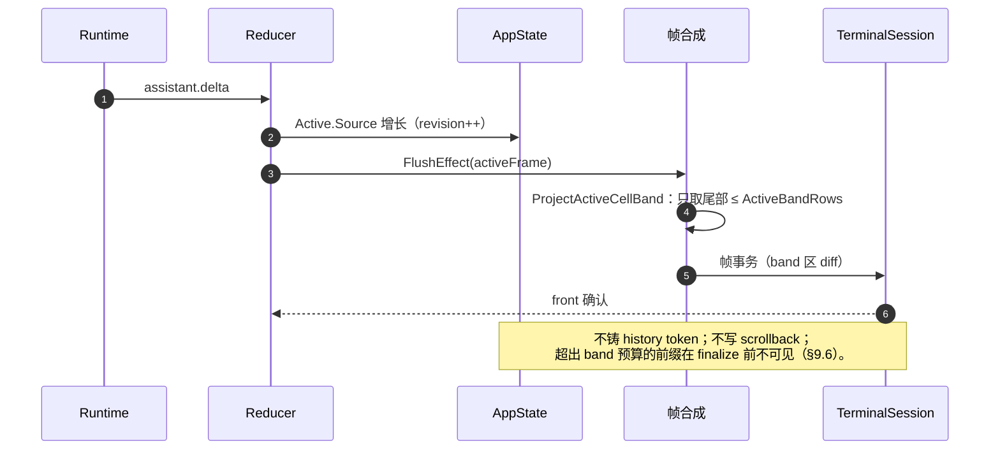

#### 9.3.2 阶段 B+C：finalize 一次性交付（全链）

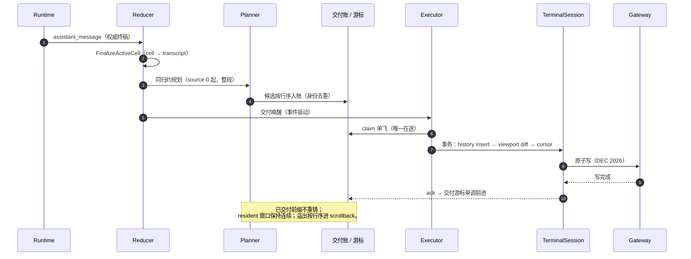

#### 9.3.3 交付在飞 × resize（rebase / invalidate）

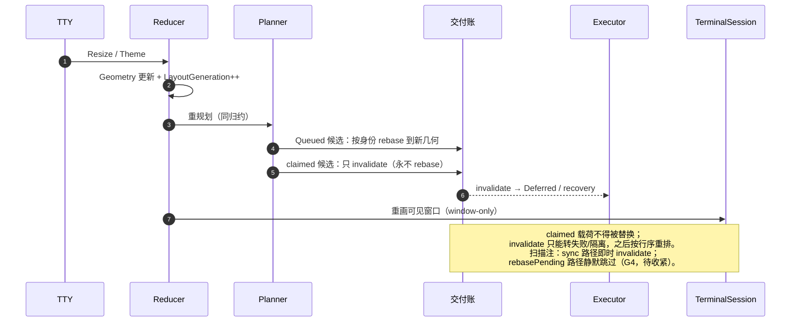

#### 9.3.4 部分写失败 → settle → 续写

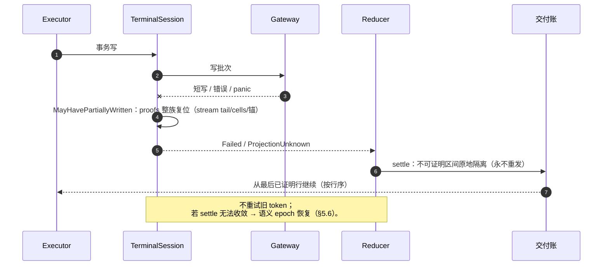

> 前置条件：settle 仅在 `LayoutGeneration == 当前代数 && !ScrollbackReplayArmed` 时执行
> （`controller_state.go:373`）；armed replay 竞态下 settle 让位给 replay（实现正确，本轮补记）。

### 9.4 边界条件矩阵（handoff × 事件）

| 事件 | 流式中（A） | 交付在飞（C） | 已确认（D 之后） |
|---|---|---|---|
| resize / theme | band 按新几何重投影（不铸） | Queued rebase；claimed invalidate → Deferred/recovery；窗口重画 | 只重画窗口；scrollback 不回读 |
| finalize | 立即转 B（同归约） | 迁移期：等批 ack 后补铸；目标：无 active 批 | 直接铸全量 |
| lease begin/end | 交付冻结（queued 只入账） | 冻结期 claim 延后；lease 结束恢复 | 不受影响 |
| 部分写失败 | — | proofs 复位 → settle（从最后已证明行续写） | 不受影响 |
| resume / replay | 新 epoch 一次性导入（不依赖旧账） | 新 epoch 取消旧在途 | 旧 epoch 游标作废 |
| 长 mutable 溢出 | 超出 band 预算部分 finalize 前不可见（§9.6） | — | — |
| 队列满 / 背压 | 候选有界入账（不入渲染） | claim 延后，不丢已确认事实 | — |

### 9.5 当前 → 目标差异与 P2 切片映射

| 对象 | 当前（迁移期） | 目标 | 切片 |
|---|---|---|---|
| active 溢出归档（mutable→scrollback） | **已完成**：生产停铸（`130cc7f5`）；交付分支统一 resident 插入；死代码/skipRows 管线/active ack 机制与枚举面已删（第二刀 `7471d34a`/`80738513`/`e3236de9`） | 停铸；band tail-only | Slice 1 ✅ |
| skipRows（finalize 只补尾） | **第一刀后恒 0**（停铸 → 无已交付 Active 条目） | 恒 0（整段铸造） | Slice 1 后自动成立 ✅ |
| 锚定（底锚/顶锚/续接启发式） | `historyTopAligned` + `historyInsertionContinuesScrollback` 等 12 场景 | 统一"resident 之后按序写、写满 LF 溢出" | P2 锚定切片 |
| armed 销毁式重放 | **S1–S4 已完成（`59ac603d`/`9a205572`/`9e7383c1`/`7ade9732`）**：生产恒 settle、装载不再 arm；barrier/reconcile/3J/物理 reset 路径与 armed 诊断全删；guard 收敛为 recoveryBackoff | 删除；settle 保留；`TerminalEpoch` 语义化 | P2 replay 切片 S5（目标用例） |
| recovery backoff | 预算 / 窗口 / yield | **已收敛（S3/S4）**：`recoveryBackoff*` 限速非收敛的 source-backed recovery 重证；failed 限速保留；success-mode 分支保留为 handoff-under-backoff（新内容照常投递） | ✅ |

> 扫描复核（2026-10-06）：①③④⑥⑦ 与本章语义一致（②的 G4 claimed 漂移由差距收敛方案 C1 `d1cd0efb`
> 显式化；G5 由 C2 `cc4ae9ac` 去二义）。⑤"整段铸造 skipRows=0"已由 **Slice 1 第一刀 `130cc7f5`**
> 落地（停铸后 skipRows 恒 0，finalize 从 0 全量一次）；第二刀 `7471d34a`/`80738513`/`e3236de9`
> 完成纯清理（行为中性）。

### 9.6 可见性取舍（显式设计决策）

- band 预算：`ActiveBandRows = clamp(Height/3, ≤14, ≤Height-12, ≥6)`（常量：divisor=3、max=14、reserved=12、min=6）。
- **流式期间超出 band 预算的内容在 finalize 前不可见**：既不进 scrollback（INV-4），也不进 resident（resident 只服务 finalized 内容）。
- 理由：exactly-once + append-only 的代价；提前可见必然引入"可改写区域"（破坏 resident 语义）或"提前归档"（正是被删除的特例族）。
- 若未来产品要求长流式提前可见：只允许两条路——**增大 band 预算** 或 **stable 前缀分段 finalize（需单独设计并登记 §11 开放问题）**；不得恢复 mutable→scrollback 路径。

---

## 10. 屏幕区域模型（Region Model）

> 本章把"屏幕上有哪些区域、各自归谁、预算多少、如何互让、光标归谁、怎么扩展"成文；
> 数据来自代码实证（`bottom_pane_layout_policy.go` / `bottom_pane_row_plan.go` /
> `bottom_pane_popup_state.go` / `app_screen_layout.go` / `app_render_frame.go`）。

### 10.1 区域清单与所有者

| 区域 | 语义所有者（AppState） | 渲染槽位（RowOwner） | 预算 | 光标 | 备注 |
|---|---|---|---|---|---|
| 历史区（transcript / fullscreen overlay） | `AppState.Transcript`（Scene 快照） | transcript | resident 窗口 W 行（outputBottom 以上）；溢出 → scrollback | 无 | fullscreen 时主帧在 TerminalSession 级整体 defer（`terminal_session.go:878-887`），非 layout 内替换 |
| active band | `AppState.Active`（ActiveCellState） | band | `clamp(h/3, ≤14, ≤h-12, ≥6)`；顶距 1 行（h≥16） | 无 | tail-only（§9）；legacy 兼容源 `BottomPaneState.ActiveBandLines/Styled`（`!SemanticActiveCellProjection` 时） |
| 动态状态行 | `BottomPaneState.DynamicStatusModel` | status | 1 行（统一生产模式 `ReserveDynamicStatusRow=true` 常驻预留；ComposerLine 激活时挂起=0 行） | 无 | 等待态时钟；events degraded 尾部；预留但模型 nil 时保持 RowOwnerGap 空白（结构预留、非绘制） |
| notice 行 | `BottomPaneState`（notice + `PromptEditorStatusLine`） | prompt | ≤ noticeRows（队列/附件 ≤3 + 编辑器状态 1，可达 4） | 无 | prompt 上方；含队列指示行与编辑器状态/错误行（如 Plan mode 失败） |
| prompt 输入区 | `BottomPaneState`（prompt/composer） | prompt | 可见行 ≤ 派生上限；上下 margin 各 1（h≥12） | prompt（默认） | popup ComposerLine 存在时 prompt 区整体不布局（被替换，而非仅光标接管） |
| SessionID 行 | `BottomPaneState.SessionIDLine` | status | 1 行（statusRow-1，可选） | 无 | session 级；composer 可见或 popup 有内容时隐藏；内容含 `--pprof/--debug` 段 |
| 底部状态栏 | `BottomPaneState.StatusModel` | status | 1 行（最底，statusRow=height） | 无 | nil → RunReady 默认；物理行恒预留（即使 nil）；`app_layout.StatusRows` 已对齐物理预留口径（D1，2026-10-06） |
| popup / 面板 | `BottomPaneState`（PopupLines/Owner/Instance/Viewport/ComposerLine/PopupStack/BelowPrompt/ReservedRows） | popup | 两种锚定（见 10.2）；reserved rows 契约 | ComposerLine 存在时接管 | 见 10.6；modal box 按内容扩展并替换 popupLines（`bottom_pane_row_plan.go:49-51`） |
| 副屏（fullscreen/alternate） | `AppState.Lease`（唯一入口 `chat_screen_framework.go:21`）；使用者：RoutingPanel / fullscreen list / debug overlay / transcript pager / pickers | （同一 transport） | 全屏 | lease 内自管 | 冻结历史交付（S13）；主帧整体 defer |

### 10.2 底部堆叠顺序与优先级（代码实证）

自底向上（bottom-up）：

1. `height`：底部状态栏（`StatusModel`，owner status；nil 渲染 RunReady）。
2. `height-1`：SessionID 行（`SessionIDLine`，owner status；可选）。
3. popup / prompt 区（互让，两种锚定）：
   - `popupExpandsBelowPrompt`：popup 从 `promptBottom + bottomMargin + 1` 向下扩展；
   - 否则：popup 锚定在 `statusRow - popupBottomGap - popupRows`（整个底部 gap 之上），
     防止 prompt 区行（band/动态状态/notice）覆盖 popup 尾。
4. prompt 区自底向上：prompt 输入行 → top margin → 动态状态行 → notice 行 → active band。

reserve 公式（`bottomPaneReservedRowCount`）：

```text
bottomRows = 1 + sessionStatusVisible + visiblePopup
           + (popupExpandsBelowPrompt ? promptAreaVisible
                                      : composerVisible + popupBottomGap)
```

优先级（互让规则）：prompt 可见行数在空间不足时被压缩
（`maxRows = promptBottom - outputBottom - dynamic - notice - bandLayout - topMargin`），
但动态状态 / notice / band 不被 prompt 挤掉；popup 的输入行（ComposerLine）优先于底部 prompt 获得光标。

补充（扫描补登）：

- `bottomRows` 先夹到 `[1, height-1]`（`height≤1` 强制 1；`bottom_pane_row_plan.go:54-61`）。
- `visiblePopup` 为 modal box 替换后的行数；`popupRows` 另加 `composerVisibleRowCount()`（:52）。
- 非扩展分支的 `popupBottomGap` = bandLayout + dynamic + notice + margins + popupInputGap + extraPromptReserved
  （`fixed_bottom_surface.go:4521-4523`）。
- prompt 压缩用 `activeBandLayoutRowCount()`（含顶距），`maxRows<1` 时强制 1（:191-197）。
- ComposerLine 模式整段跳过 prompt 区布局（:102-104）。

### 10.3 光标归属（`bottomFocusForPopup`）

| 条件 | 焦点 |
|---|---|
| popup 持有 `ComposerLine` | popup（最后一行即输入行） |
| prompt 可见 | prompt |
| prompt 不可见但存在信息型 popup | popup（驻留末尾，兼容语义） |
| 以上皆无 | None |

> Focus 并非只由该函数派生：`controller_state.go:616/675/728/749-759/1231` 亦有写入点；
> 实际光标落点见 `app_compose.go:66-102`（Prompt 需 `PromptCursorKnown && PromptVisible &&
> RowPlan.PromptInputStartRow/Rows`；Popup 落在最后一条 popup 行，无行则 nil）。

### 10.4 行预算公式汇总

| 预算 | 公式/常量 | 位置 |
|---|---|---|
| band 行数 | `clamp(h/3, ≤14, ≤h-12, ≥6)`（min=6 / max=14 / reserved=12 / divisor=3；顺序：先除、cap 14、cap h-12、floor 6，h<18 时 floor 6 胜出） | `fixed_bottom_surface.go:57-72` |
| band 顶距 | 1 行（h≥16），否则 0 | `fixed_bottom_surface.go:81-86` |
| composer margins | 上 1 / 下 1（h≥12），否则 0/0 | `fixed_bottom_surface.go:74-79` |
| prompt 最大可见行 | `promptInputMaxVisibleRowsForGeometry`（定义 :72-101；调用 :43；上限 `ChatComposerMaxVisibleRows=6`） | `bottom_pane_layout_policy.go` / `inputbox_editor.go:40` |
| 底部 reserve | 见 10.2 公式 | `bottom_pane_row_plan.go:120-128` |

### 10.5 区域 → dirty → 帧键

| 区域 | dirty 来源 | 帧键 |
|---|---|---|
| active band | 流式 delta / ack 推进 | activeFrame |
| 历史区 | finalize / 交付确认 / resize | stableCommit |
| 动态状态行 | `SetDynamicStatusModel` / 等待态时钟 | dynamicStatus |
| prompt / notice / popup | 输入 / popup 栈 / 焦点 | prompt |
| 诊断通知行 | 诊断事件（degraded/警告） | diagnosticNotice |

### 10.6 面板族统一模型（目标；当前为缺口）

统一面板契约（目标形态，所有面板都必须满足）：

```text
Panel = { Owner, Instance, Layer(above-prompt | below-prompt | fullscreen),
          ReservedRows, ComposerLine?, FocusPolicy, Lifecycle(open/update/close),
          LeaseInterplay }
```

| 面板族 | 当前实现 | 目标 |
|---|---|---|
| popup（审批/提问/信息） | `PopupLayer` + owner/instance/viewport/composerLine/belowPrompt/reservedRows | 保留为 `Layer=above/below-prompt` |
| modal box（审批/提问正文盒） | `modalBoxLines`（按内容扩展的边框盒） | 归入 popup 统一层 |
| RoutingPanel | 副屏 lease + `RoutingPanelState` | `Layer=fullscreen`（lease 互斥） |
| agent panel | 各自 popup owner | 归入 popup 统一层 + 独立 owner 命名空间 |
| debug overlay / fullscreen list / transcript pager | lease 全屏（**非** popup） | 归入 `Layer=fullscreen` |
| 多层 popup | `PopupStack`（准入/优先级规则散落） | 统一"优先级 = 层深 + owner 优先级表"（待定稿） |

### 10.7 区域扩展流程（新区域/新面板）

1. 语义状态进 `AppState`（并在 §4 所有权矩阵登记所有者）；
2. 在 bottom row plan 中定义行数、优先级、row owner、cursor（含窄屏/溢出行为）；
3. `ComposeAppRenderFrame` 提供 structured line（plain 一致性校验）；
4. 定义 dirty 分类与帧键；
5. 添加窄屏、overflow、popup 覆盖、resize 测试（并更新本章表格）。

---

## 11. 开放问题（实施前需定稿）

1. **D2 提交身份决策**（P1-1 §1.6）：`historyCommitRangeKey` 去 display + finalized 跳过 display 比较；
   已识别中部插入反例（仅跳过重定基会丢行），需测试先行钉住"无重复铸造 / 无丢行"不变式。
2. **P2 切片顺序**：待三路侦察回报后定稿（预期：先删 active 溢出归档 → 再收 replay/settle → 最后锚定与 backoff）。
3. **写证明范围**：单向交付 + fail-closed 恢复下，是否需要 per-commit 写证明——设计倾向**否**
   （epoch 恢复取代事务回执）；需在 P2 验收中验证 partial write 场景。
4. **冷启动首轮锁内预算**：P1-1 Stage 2 的实测门控（超预算则先落 ledger 克隆地板 L2.7）。
5. **测试改写策略**：5,296 个固化断言中，哪些随 P2/P3 语义改写、哪些删除、哪些新增为结构断言——
   需在 P2 切片计划中列明（避免"改一处、重写多处断言"的回归噪声）。
6. **文档清理**：约 35 份 render 相关文档的归档/合并策略（避免再次出现"唯一规范源"声明漂移）。
7. **长流式提前可见性**（§9.6）：若产品要求，选择"增大 band 预算"或"stable 前缀分段 finalize"
   （需单独设计；禁止恢复 mutable→scrollback 路径）。
8. **面板族统一契约**（§10.6）：多层 popup 的准入/优先级表、焦点与 lease 关系定稿。
9. **扫描缺口收敛**（§7.5）：G2 门禁增强（递归 + 盲区）、G4 claimed 路径收紧、G5 skipRows 二义性、
   G9 legacy `StatusBar` 第二写端——需在 P0/P2 内排期。

---

> 维护约定：本文件随每个 P0–P3 切片更新（状态列 + 矩阵 + 时序图 + 区域表）；
> 任何新增状态字段必须先在本文件 §4 登记所有者，任何新增区域/面板必须先在本文件 §10 登记契约。
