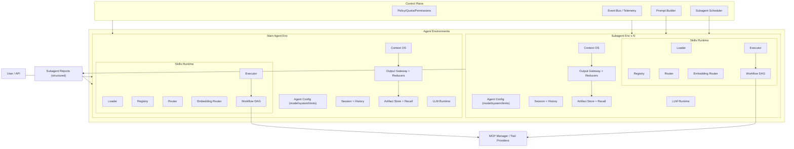
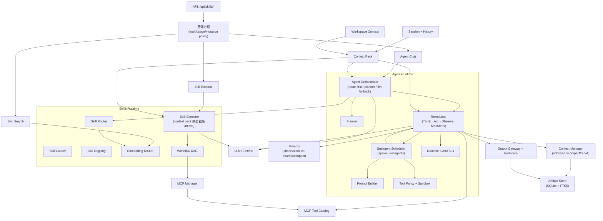

# Architecture

本文给出“目标架构（满足 multi-agent 在 skills 之上）”与“当前实现”对照。

## Target Architecture (Intent from design docs)

**要点**
- 多代理层位于 skills 之上，每个 agent 具备独立运行环境与可配置 model。
- 主 agent 动态生成子代理 prompt，子代理仅回传结构化报告。
- Context OS + Output Gateway + Artifact Store 是多代理稳定运行的前置条件。

## Current Architecture (Implemented, 2026-03-13)

## Gap Analysis（目标 vs 当前）

| 层 | 目标 | 当前状态 | 缺口 |
| --- | --- | --- | --- |
| Agent 环境 | 每个 agent 独立 session/context/skills/model | fresh child agent + 独立 session/config/prompt/skills runtime 已落地，主线支持 planned subagents | MCP/LLM runtime 仍共享（非强隔离） |
| Context OS | Hot/Warm/Cold 三层 + 预算 + admission + compaction + recall | `contextmgr` 已实现 admission/ledger/recall/checkpoint | 预算策略与全入口接线仍需继续打磨 |
| Output Gateway | 工具输出→Reducer→Envelope，原始数据存 Artifact Store | 已实现 gateway/reducers/artifact store 并接入 ReAct | reducer 类型覆盖仍有限 |
| Message Builder | tool_use/tool_result 顺序一致，自动修复 | 已实现并接入 ReActLoop | 仍需持续扩展边界用例 |
| 子代理协同 | spawn_subagents 工具 + 调度器 + 任务包/回执协议 | runtime 已落地，支持 structured report / single writer / read-only；API 主线已可执行 planned subagents，streaming 提供静态 SSE subagent 事件 | writer patch 应用/落盘闭环仍缺；subagent 输出仍为静态事件，缺增量流式编排 |
| Tool Catalog | MCP tools 目录化 + BM25/FTS | 已有轻量 catalog + ranked search | 尚非 BM25/FTS 级别 |
| Control Plane | Policy/Quota + EventBus + Scheduler + PromptBuilder | EventBus / Hooks / Scheduler / PromptBuilder 已落地 | 更完整的治理编排与规模化运维仍待补齐 |
| 安全/Sandbox | 路径白名单、网络限制、单写者策略 | tool policy + sandbox + read-only + single-writer 已实现 | patch decision/approval 已落地，但 patch 应用/落盘与自动 verifier 流程仍待完成 |

**要点**
- 当前实现已完成 P0，并已提前落地一部分 P1/P2/P3：Output Gateway、Artifact Store、Context Manager、Message Builder、Subagent Scheduler、Tool Catalog、Hooks/EventBus、Sandbox 均已有实现。
- 当前最主要的剩余工作不再是“从零实现多 agent”，而是补完 writer patch 的 apply/落盘与 verifier 自动验证闭环，并收口 Context OS / Reducers / Tool Catalog 的策略层。
- 后续优先级应聚焦在 reducer 覆盖、Context OS 分层策略、Tool Catalog BM25/FTS、writer patch 落盘闭环、subagent 增量流式编排，以及跨 agent 观测面增强。
