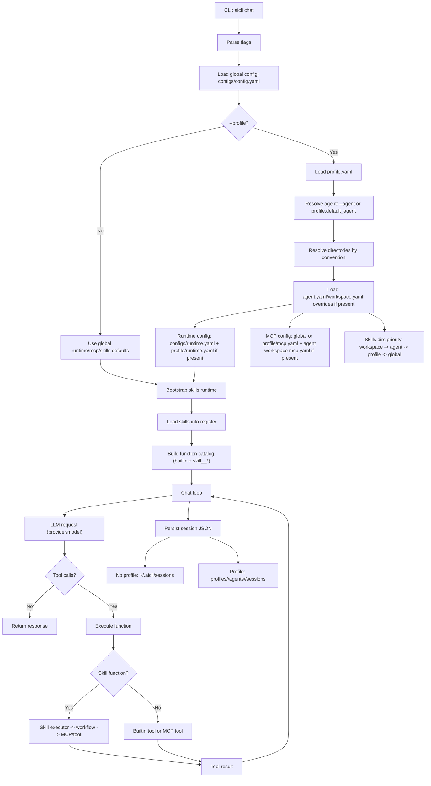
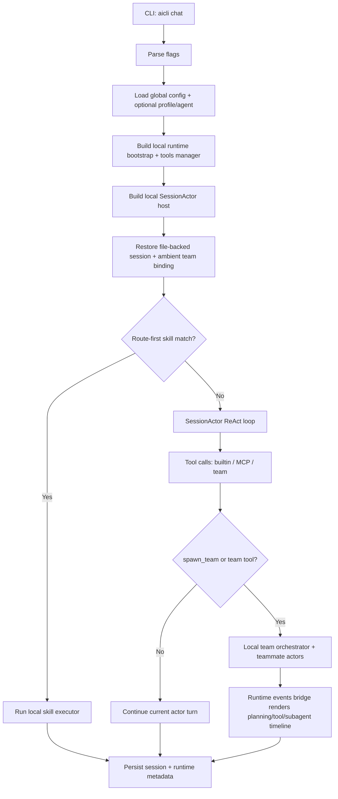
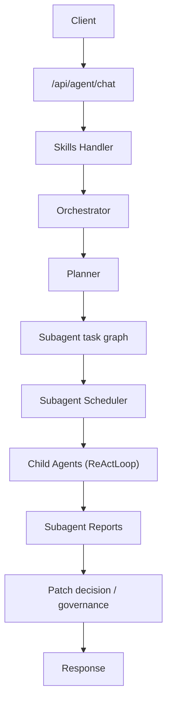
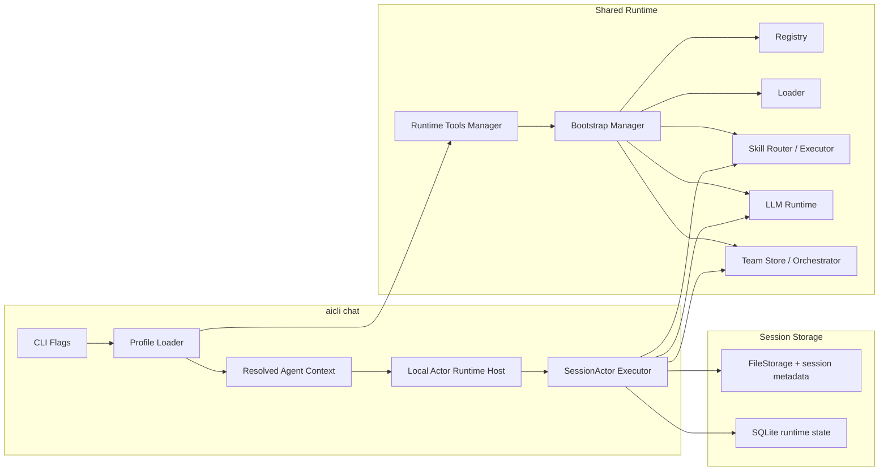

# AICLI Profile Loading Flow (Single vs Multi‑Agent)

> Status: design validation  
> Date: 2026-03-13  
> Scope: profile‑based aicli chat; current runtime behavior
>
> Migration note (2026-03-30):
>
> - The local `aicli chat` path discussed here still exists in `ai-gateway`.
> - The service-hosted `/api/agent/chat` alternative has moved to `E:\projects\ai\ai-agent-runtime\backend`.
> - When this document mentions API-side runtime code, read old `internal/runtime/<subpkg>` paths as `ai-agent-runtime/backend/internal/<subpkg>`.

## 1. Assumptions (Profile Defaults)

This document assumes the default directory rules from
`docs/multi-agents/profile/profile_workspace_agent_design.md`:

- Profile root: `profiles/<profile>/`
- Entry config: `profiles/<profile>/profile.yaml`
- Optional overrides (by convention):
  - `profiles/<profile>/runtime.yaml`
  - `profiles/<profile>/mcp.yaml`
  - `profiles/<profile>/agents/<agent>/agent.yaml`
  - `profiles/<profile>/agents/<agent>/workspace/workspace.yaml`
- Skills directories (by convention):
  - `profiles/<profile>/skills/`
  - `profiles/<profile>/agents/<agent>/skills/`
  - `profiles/<profile>/agents/<agent>/workspace/skills/`
- Agent workspace (by convention):
  - `profiles/<profile>/agents/<agent>/workspace/`
- Sessions (by convention):
  - `profiles/<profile>/agents/<agent>/sessions/`

Global fallbacks (current code):

- Runtime config: `configs/runtime.yaml`
- MCP config: `configs/mcp.yaml` (via `aicli.mcp.config_file`)
- Sessions: `~/.aicli/sessions` (aicli default when no profile)

## 2. Single‑Agent aicli chat Flow (Supported)

### Flowchart

### Key Notes

- `aicli chat` is the default local actor-first orchestration host.
- Route-first skills are still exposed and can short-circuit before the actor falls back to ReAct/tool execution.
- Builtin tools, MCP tools, and local team tools are unified through the shared runtime tool surface.
- Sessions and ambient team binding are persisted through `runtime/chat` file storage plus runtime session metadata.

## 3. Multi-Agent in aicli (Current Local Path)

`aicli chat` can now orchestrate multi-agent work locally without a running API service.
The CLI bootstraps a local `SessionActor` host, local team store/orchestrator, route-first skills,
approval/question bridges, and ambient team binding so follow-up turns or resumed sessions can
continue on the active team/task.

### Current Local Orchestration Flow (`aicli chat`)

Notes:

- `--permission-mode default|accept_edits|plan|bypass_permissions` and `--yolo` control the local actor/team run policy.
- Successful team tool calls update the ambient team binding; resumed sessions can keep the same `team_id`/`task_id`.
- `--no-interactive` still works, but approval/question requests now fail fast with a structured error instead of hanging.

### API-Orchestrated Alternative (`/api/agent/chat`)

The API path remains valid when orchestration should happen in the service rather than in the local CLI host.
As of 2026-03-30, that service-hosted path is owned by `ai-agent-runtime`, not by `ai-gateway`.

### Optional Future: Dedicated `aicli agent`

A dedicated `aicli agent` command can still be added later as a thinner UX surface,
but it is no longer the only planned way to expose multi-agent orchestration in the CLI.

## 4. Architecture Diagram (aicli profile path)

## 5. Can We Load & Run?

- Single-agent: Yes. The same actor-first host still handles normal single-session chat.
- Multi-agent via `aicli chat`: Yes. Local actor/team orchestration now works in-process.
- Multi-agent via API: Yes. `/api/agent/chat` remains the service-hosted alternative in `ai-agent-runtime`.
- Dedicated `aicli agent`: Optional future surface, not a prerequisite for CLI multi-agent support.
