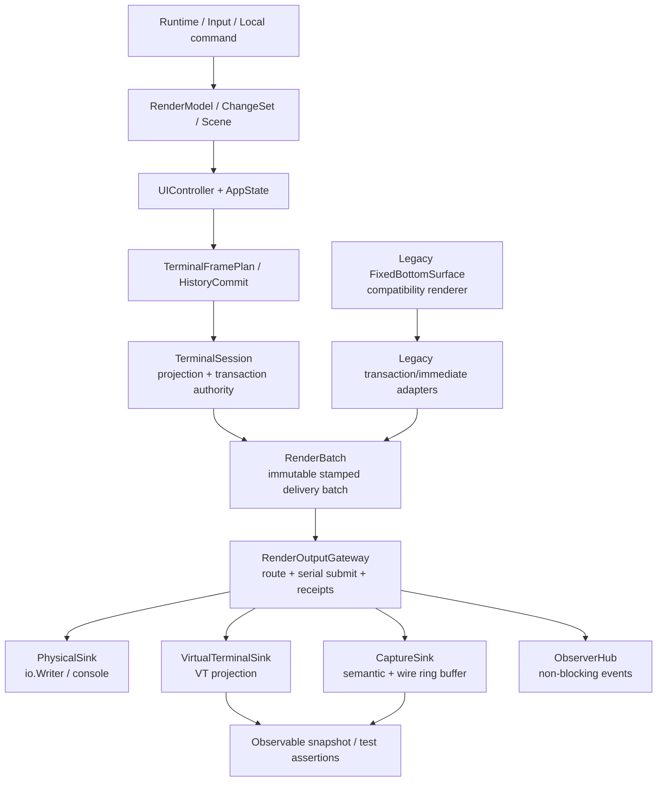

# aicli chat 渲染中间层设计方案

> 文档状态：设计方案（未开始实现）  
> 代码基线：2026-08-29，`main` 分支  
> 关联架构：`docs/architecture/aicli-chat-unified-renderer-architecture.md`  
> 主要范围：`backend/cmd/aicli/commands`、`backend/cmd/aicli/ui`、`backend/cmd/aicli/ui/render`  
> 目标：在统一渲染器和 legacy 渲染器与物理 console 之间建立可切换、可并行、可观测、可测试的渲染交付中间层

## 1. 摘要

当前 `aicli chat` 已经在统一模式中建立了 `UIController -> TerminalSessionPresenter -> TerminalSession` 的单一物理写入链路，但渲染交付的最后一跳仍然是 `io.Writer`/`os.Stdout`。legacy 路径也保留了 `TerminalOutput()`、`FixedBottomSurface` 以及若干立即式 ANSI 写入入口。这样做在生产环境可以工作，却给测试带来几个结构性困难：

1. 渲染代码很容易直接触达进程 console，测试必须替换全局 stdout 或建立复杂的 pseudo-TTY。
2. 测试只能看到最终字节，无法同时断言“渲染意图、事务边界、历史 handoff、物理结果和 projection 状态”。
3. 统一路径和 legacy 路径的输出捕获方式不同，无法使用同一套观察和故障注入工具。
4. 物理写入是异步的，测试经常需要猜测 worker 何时空闲；一旦发生 short write 或 partial write，捕获到的字节又不能说明哪些语义已经可靠交付。
5. 如果简单引入 tee writer，又无法定义多目标写入的原子性：物理 console 成功而缓存失败，或缓存成功而物理 console partial，都不能被粗略地视为同一个结果。

本方案提出一个**渲染交付中间层**（暂名 `RenderOutputGateway`）：

```text
语义/布局/事务计划
        │
        ├─ unified: TerminalSession
        └─ legacy:  FixedBottomSurface / LegacyTransactionAdapter
                      / allowlisted LegacyImmediateAdapter
                         │
                         ▼
              RenderOutputGateway
       （路由、批次、receipt、观测、捕获）
             │          │          │
             ▼          ▼          ▼
       PhysicalSink  CaptureSink  VirtualTerminalSink
```

中间层不取代 `Scene`、`AppState`、`HistoryEffectQueue` 或 `TerminalSession` 的权威地位。它只负责把已经确定的渲染事务交付到一个或多个输出目标，并记录可验证的交付事实。生产模式可以只写物理 console；测试模式可以只写内存/虚拟终端；诊断模式可以物理输出与内存捕获并行；回放模式可以完全不触达 console。

核心设计决策如下：

- **每个 chat session 一个 gateway**，不使用进程级可变路由作为新架构的权威配置。
- **每个批次一个不可变 `RenderBatch`**，统一描述来源、代次、lease、事务类别和待交付字节；它是 gateway 盖章后的交付批次，不是 producer 的意图别名。
- **一个 primary sink + 零或多个 mirror sink**。primary 的 receipt 决定当前 primary target 的交付事实；只有 `TargetClass=physical` 且结果为 `Committed/Full` 时，才构成物理投影事实。mirror 失败只进入诊断，不伪装成物理失败。
- **capture 分为语义层、wire 层和 virtual-terminal 层**，不能把“保存 ANSI 字节”和“保存屏幕结果”混为一谈。
- **不自动重试未知 partial write**。中间层保留 `Committed/FailedZeroBytes/UnknownPartial/Deferred` 事实，由现有 projection recovery/reconciliation 决策下一步。
- **路由切换是 barrier**，不得在一个批次中途切换目标；从 capture/virtual 切到 physical 时必须由语义源触发完整恢复绘制。
- **legacy 通过兼容适配器接入**，而不是保留第二个绕过 gateway 的 console writer。

---

## 2. 现状与问题定位

### 2.1 现有统一渲染路径

当前架构文档规定的生产链路是：

```text
runtime event / input
        -> EventEncoder / ChangeSet
        -> TuiScene
        -> UIController reducer
        -> AppState
        -> TerminalSessionExecutor
        -> TerminalSession.FlushTransaction
        -> TerminalSession.writer.Write
        -> console
```

实际代码中的关键边界：

| 位置 | 当前职责 | 与物理输出的关系 |
| --- | --- | --- |
| `commands/chat_setup.go` | 根据 `interactiveUI` 选择统一模式并调用 `EnableUnifiedRenderer()` | 生产 writer 通常在此被绑定到 `os.Stdout` |
| `commands/chat_ui_actor.go` | 将 presenter 接到 UI actor effect stream | effect callback 不应直接写终端 |
| `ui/terminal_session_presenter.go` | 几何探测、生命周期、alternate-screen lease、executor 绑定 | 是统一模式的生产 writer 生命周期边界 |
| `ui/terminal_session_executor.go` | claim history token、读取 AppState、执行一笔物理事务、回传 typed result | 异步 worker，测试必须等待 idle |
| `ui/terminal_session.go` | 屏幕 cache、history projection、cursor、lease、generation、partial write 语义 | 当前直接持有 `io.Writer` 并提交 ANSI bytes |
| `ui/renderengine.Presenter` | 对写入进行锁定/批处理，协助 diff/handoff | 是写入同步和 ANSI 批处理工具，不是输出路由层 |

`TerminalSession` 已经有较好的物理投影状态和失败语义：

- `ProjectionState()` 可以报告 projection validity、geometry、viewport、frame、epoch 和 history 状态。
- `FlushTransaction` 将 lease/generation、geometry、scrollback transition、history insertion、viewport diff、cursor 组合为一笔事务。
- `writeTerminalBytesLocked` 可以区分零字节失败与可能 partial 的失败。
- `EnterAlternateScreen`、`WriteAlternateScreen`、`ExitAlternateScreen` 已经把 fullscreen 控制字节纳入同一 owner。

问题在于这些语义在到达 `writer.Write` 后就被压缩成了一个低层接口。测试无法在不依赖物理 console 的情况下观察完整交付过程。

### 2.2 现有 legacy/compat 路径

`FixedBottomSurface` 仍然承担兼容 facade 和 capability fallback 的大量职责。已存在的安全措施包括：

- `PhysicalWritesEnabled` / `SetPhysicalWritesEnabled` 用于统一模式切换时关闭 legacy 物理写入。
- `flushHoldingLock`、`flushHandoffHoldingLock` 经 `renderengine.Presenter` 和共享终端写锁提交。
- `SetAlternateScreenLeaseTransport` 使统一模式下的 fullscreen bytes 回到 primary presenter。
- `EnableForTest` 可以建立合成 geometry，但主要解决 surface 状态测试，不解决所有输出捕获问题。

仍然存在的测试困难：

- `flushLegacyANSIHoldingLock` 等调用最终仍把 `TerminalOutput()` 作为 `io.Writer`。
- `terminal_output.go` 的 `processTerminalOutput` 是一个同步的全局 proxy，只能替换 writer，不能表达 session、batch、receipt 或 projection。
- legacy 的 `WriteOutput`、`WritePromptEditorText`、状态/popup/清理路径与统一路径的入口不同。
- 某些 fullscreen/list/pager 代码仍接收普通 `io.Writer`，若没有 lease transport，容易重新出现 stdout bypass。

因此，问题不是“没有 fake writer”，而是**输出目标、交付事务、观测数据和物理事实没有形成统一的中层契约**。

### 2.3 为什么只增加一个 `bytes.Buffer` 不够

把 `NewTerminalSession(&bytes.Buffer{})` 作为测试入口是有价值的，但它不能单独解决以下场景：

- legacy 路径不一定使用该 `TerminalSession` 的 writer；
- buffer 只能保存原始 ANSI 字节，无法知道哪个 frame/history token 产生了这些字节；
- buffer 不记录 route 切换、lease、layout generation、terminal epoch 和 partial write 分类；
- 无法模拟 short write、阻塞、取消和目标失败；
- 没有虚拟终端状态时，测试仍需自己解析 ANSI 才能判断屏幕、scrollback、cursor；
- 物理输出和缓存并行时，没有“哪个目标是权威结果”的定义。

中间层必须首先解决**交付契约**，然后才提供 buffer、文本缓存和虚拟终端实现。

---

## 3. 设计目标与非目标

### 3.1 目标

1. 统一模式和 legacy 模式都经过同一套渲染交付边界。
2. 生产、测试、回放和诊断可以按 session 选择输出目标。
3. 支持以下模式：
   - 仅物理 console；
   - 仅文本/语义捕获；
   - 仅 wire bytes 捕获；
   - 仅虚拟终端；
   - 物理 console + 捕获/观察并行；
   - 录制后离线回放。
4. 输出批次具有稳定的 session-local sequence、来源和事务元数据。
5. 统一暴露 committed、deferred、zero-byte failure、unknown partial 等结果。
6. 观察和测试不需要替换进程级 stdout，也不需要依赖真实 TTY 才能覆盖主流程。
7. 允许故障注入和确定性等待，同时不改变生产 transaction/recovery 语义。
8. 保持 `TerminalSession` 仍是物理 projection authority；gateway 不成为 transcript 或 AppState 的第二事实源。
9. fullscreen lease、history handoff、bell/title 等 terminal control bytes 不得绕过同一 session gateway。
10. 迁移期间保持 legacy fallback 可用，并能用统一 capture 做 parity 对照。

### 3.2 非目标

- 本方案不改变 `Scene`、`RenderModel`、`AppState` 或 history token 的语义来源和 Ack 权威；为隔离不同投影目标而扩展 delivery ledger 的 `{token, ProjectionTargetID, HistoryEpoch}` 键及迁移记录，但不把 gateway 变成 history authority。
- 本方案不把所有业务事件重新编码为 ANSI；编码仍由现有 render/terminal 组件负责。
- 本方案不保证物理 console 与 mirror sink 的跨目标原子提交；这在一般 `io.Writer` 上不可证明。
- 本方案不在 gateway 内部重建业务语义或从终端字节反推 transcript。
- 本方案不立即删除 legacy renderer；删除属于后续收敛阶段。
- 本方案不默认把包含用户输入、provider 内容或工具结果的 capture 持久化到磁盘。
- 本方案不把测试专用的 global stdout 替换继续扩展为新的生产依赖。

---

## 4. 约束与不变式

### 4.1 权威边界不变

现有架构的四个权威边界必须保持：

| 边界 | 中间层的关系 |
| --- | --- |
| transcript 语义权威：encoder + `TuiScene` | gateway 只携带引用/摘要，不生成或修正 transcript |
| UI 状态权威：`UIControllerState.AppState` | gateway 不修改 AppState，不从 capture 反写 reducer |
| history 交付权威：`HistoryEffectQueueState` / `HistoryCommitLedger` | gateway 返回 receipt；token 的 Ack/Fail/Deferred 仍由 reducer 消费 |
| 物理投影权威：`TerminalSession` | gateway 承载交付目标和观察记录，但 projection cache、epoch、lease 和恢复判断仍由 session 拥有 |

gateway 是一个**交付路由边界**，不是第五个语义事实源。它记录“尝试交付了什么、目标怎样响应”，不记录“业务实际上应该是什么”。

### 4.2 单一物理 owner

- 一个 active interactive chat session 恰好绑定一个 session-scoped
  `RenderOutputGateway`；noninteractive command 不为满足形式而创建 TTY gateway。
- 一个 gateway 最多有一个 authoritative physical primary sink。
- legacy surface 被统一 presenter 接管后，任何 `FixedBottomSurface` 物理 flush 都必须转为 no-op 或经同一 gateway。
- alternate-screen enter/write/exit、history handoff、viewport frame、cursor、bell/title 若属于该 session，必须使用同一 gateway 的 serial boundary。
- 不允许在 mirror sink 中偷偷写 `os.Stdout`。

### 4.3 批次边界优先于裸字节

所有新的 interactive producer 必须提交 `RenderIntent`，由 gateway 校验并盖章成
`RenderBatch` 后交付 sink。普通 `io.Writer` 只保留为 sink 实现细节或 legacy 兼容
adapter，不再是上层调用契约。

一个 batch 必须：

- 有唯一的 session-local `BatchID`/sequence；
- 携带 `LayoutGeneration`、`TerminalEpoch`、`LeaseID` 和 `TransactionKind`；
- 明确是 frame、history handoff、alternate enter/write/exit、prompt editor、bell、title 或 legacy immediate output；
- 持有不可变 bytes 或可重建的 immutable payload；
- 在一次 `Submit` 中获得一个 primary receipt。

### 4.4 未知结果不可伪造

| primary 结果 | gateway 记录 | `TerminalSession` 后续动作 |
| --- | --- | --- |
| `Committed` | 当前 primary target 接受全 batch | 只推进该 target domain 的 projection；仅 physical primary 可推进物理 projection/history Ack |
| `FailedZeroBytes` | target 明确没有字节写入 | 保留旧 projection；如上层决定再试，必须构造新 intent/batch |
| `UnknownPartial` | 目标可能接受了前缀 | projection 标 unknown；禁止 gateway 自动重复写；由 session 触发 source-backed recovery/reconciliation |
| `Deferred` | primary 已被调用，但 target-local barrier 暂时不允许 I/O | 不产生 target I/O；由上层在 barrier/wake 后创建新 intent |

gateway 在调用 primary 前发现 invalid binding、stale lease/generation、lifecycle barrier、
closed 或 oversized 时，属于 **pre-admission** `AdmissionDeferred/AdmissionRejected`：
`Primary=nil, TargetInvoked=false, Sequence=0`，不能记成上表的 target-level
`Deferred/Rejected`。

取消不是独立的最终 `DeliveryStatus`：target 调用前取消是 pre-admission
`AdmissionRejected + DeliveryErrorCanceledBeforeIO`，返回 `Primary=nil, Sequence=0`；
target 已开始后，只有 sink/aborter 明确证明零字节时才归一化为
`FailedZeroBytes/Zero + DeliveryErrorCanceledAfterStart`，否则为
`UnknownPartial/Unknown + DeliveryErrorCanceledAfterStart`。

capture/observer 的成功不改变 primary 结果。primary 失败时，wire recorder 可以记录
“attempted bytes”，但 virtual terminal 默认不得把它当成已提交的物理状态。

---

## 5. 目标架构

### 5.1 分层模型



### 5.2 责任划分

#### `TerminalSession`

继续负责：

- 根据 immutable `TerminalTransactionPlan` 准备 viewport/history bytes；
- 判断 lease、generation、projection validity 和 recovery；
- 维护 front/back screen、history tail、cursor、epoch；
- 消费 primary receipt 并生成现有 `TerminalFrameResult`/`HistoryCommitResult`；
- 在 unknown partial 后使 projection 失效。

改动点：

- 不再把“最终 `io.Writer`”视为唯一输出契约，而是持有一个 `RenderOutputPort`；
- `writeTerminalBytesLocked` 变为构造 `RenderBatch` 并调用 port；
- 保留一个 `io.Writer` adapter 仅用于构造 `PhysicalSink` 的兼容入口。

#### `RenderOutputGateway`

负责：

- 接收 producer 的 `RenderIntent`，复制并盖章为 immutable `RenderBatch`；
- 在 session 内串行化提交；
- 按 route 配置调用一个 primary 和若干 mirror；
- 同步生成 primary `OutputReceipt`，异步封存 `DeliveryRecord`；
- 发布非阻塞观察事件；
- 维护有界 capture/journal 和 route snapshot；
- 处理 route epoch、关闭、取消和 sink abort。

不负责：

- 组合 AppState 或计算 layout；
- 决定 history token 是否 Ack；
- 修改 `TerminalSession` projection cache；
- 自动重放 unknown partial batch；
- 直接解释业务事件。

#### `RenderOutputSink`

负责一个具体目标的交付：物理 writer、内存 buffer、虚拟终端、录制器或丢弃 sink。sink
必须返回明确的 `SinkDeliveryResult`，不能只返回 `error`；target identity 和时间由
gateway 盖章形成 `TargetReceipt`。

#### observer / `Subscription`

只读订阅 batch、receipt、route 和 sink 状态；第一版只暴露 10.2 的有界 event channel，
不暴露可重入的任意 callback interface。observer dispatch 不得在
`TerminalSession.transactionMu`、共享 terminal write lock 或 reducer actor 临界区中同步执行。

### 5.3 推荐包结构

建议新增一个不依赖上层 `ui` 的低层包：

```text
backend/cmd/aicli/ui/render/output/
    types.go              # intent, stamped batch, route, receipt, delivery
    gateway.go            # Submit, Begin/Commit/AbortReconfigure, Close
    state.go              # lifecycle state machine and barriers
    sink.go               # RenderOutputSink contract
    physical_sink.go      # io.Writer + abort/short-write classification
    capture_sink.go       # bounded semantic/wire capture
    virtual_terminal.go   # vt-backed sink and projection snapshot
    mirror_scheduler.go   # bounded outcome-aware mirror delivery
    observer.go           # event hub and ring buffer
    fault_sink.go         # deterministic test failure/block injection
    replay.go             # versioned recorder/decoder and replay validation
    legacy_adapter.go     # transaction buffer + allowlisted immediate facade
    binding.go            # session binding generation/fence
    clock.go              # production/fake clock
```

包依赖规则：

- `render/output` 只依赖标准库和本包定义的低层 emulator/cell 接口；不得直接导入当前
  `ui/vt`、`ui/render`、`commands`、`UIController` 或 `TerminalSession`，避免循环依赖。
  当前 `ui/vt/screen.go` 反向依赖 `ui/render`，因此 `VirtualTerminalSink` 通过注入的
  `TerminalEmulator` 接口工作；若未来要共享实现，先抽出独立的 `ui/vtcore`（只依赖
  cell/value types），再由上层 adapter 接入，禁止以 import cycle 换取复用。
- `ui/terminal_session.go`、`terminal_session_presenter.go` 和 `fixed_bottom_surface.go` 可以依赖 `render/output`。
- `commands` 只负责按 session 生命周期创建和配置 gateway，不直接访问 sink 内部。
- 测试可以直接创建 output package 的 memory/virtual/fault sink，不需要启动 command 层。

名称可在实现前调整，但必须保留“gateway 是交付边界、TerminalSession 是 projection authority”的语义。

---

### 5.4 标识、代次与事实的词汇表

实现和 debug 输出必须使用下列含义，禁止用一个“epoch”或一个
`session id` 代替多个独立维度：

| 名称 | 所有者/来源 | 作用 | 是否可在切换时变化 |
| --- | --- | --- | --- |
| `SessionID` | `ChatSession` 的 interactive render setup | 一次 interactive process session 的稳定 render 身份；不等同可被 resume/load 替换的 runtime conversation ID | 只在新 interactive process/session 创建时变化 |
| `BindingGeneration` | session binding registry | 使旧 adapter/late goroutine 失效的代次 fence | 每次 bind、unbind 或 close 递增 |
| `Sequence` | gateway | session 内进入 primary serial boundary 的单调提交序号 | 不回退、不复用；pre-admission rejection 为 0 |
| `BatchID` | gateway | 关联一笔 stamped batch 的诊断身份 | 每个 accepted batch 唯一 |
| `RouteEpoch` | gateway | 区分已安装 route 配置版本 | `BeginReconfigure` 单调保留候选值且永不复用；只有成功 commit 才安装为 current，abort 可留下数值空洞 |
| `SinkID` | sink descriptor | 具体 sink instance 的生命周期身份 | sink 替换时变化且不可复用 |
| `TargetClass` | sink descriptor | `physical/capture/virtual/discard` 目标类别；replay 是执行模式而非 target class | 由 sink 类型决定 |
| `ProjectionTargetID` | primary descriptor（route 只做一致性校验） | receipt、projection 和 history domain 所属的目标域 | 目标连续性不能证明时必须变化 |
| `ContinuityID` | sink/平台能力 | 证明底层目标仍是同一个可连续投影的设备/历史空间 | detach、reset、abort 后不得臆测不变 |
| `TerminalEpoch` | `TerminalSession` | 物理 terminal 生命周期/重置代次 | terminal reset、不可恢复 abort 时变化 |
| `HistoryEpoch` | history authority / session ledger | 某个 `ProjectionTargetID` 的 delivery ledger 代次 | target continuity 失效时变化 |
| `LayoutGeneration` | layout/profile authority | geometry、theme、profile 变化的布局代次 | 每次 context barrier 变化 |
| `LeaseID` | alternate-screen lease owner | 一段 alternate-screen ownership 的身份 | enter/exit 或 lease replacement 时变化 |

其中 `SessionID` 只保证 render binding 的生命周期稳定：`ChatSession.RuntimeSession.ID`
在 resume/load 后可以变化，但不得因此把旧 batch、旧 adapter 或 gateway 误绑定到新的
render session。`ProjectionTargetID` 是投影域，不是 sink 指针、route epoch 或 terminal
epoch 的别名。

这些维度没有隐式级联关系：仅安装新 `RouteEpoch` 不自动推进 `TerminalEpoch`、
`HistoryEpoch`、`LayoutGeneration` 或 `BindingGeneration`；context barrier 只推进由
layout/profile authority 决定的 `LayoutGeneration`，不伪造 route/target 变化；bind/unbind
只 fence adapter，不证明 terminal/history 已重置。terminal reset 或 unknown physical
abort 由 `TerminalSession` 推进 `TerminalEpoch` 并使 screen proof 失效；只有 history
authority 判断目标历史连续性失效时才为对应 `ProjectionTargetID` 推进 `HistoryEpoch`。
若 `ProjectionTargetID` 改变，即使两个 epoch 数值碰巧相等，也必须视为不同 history
domain；任何代码都不得比较不同维度的数值来推导 continuity。

---

## 6. 核心接口设计（Go 伪代码）

以下接口是设计契约，不要求一次性按原名实现；实现时可以拆分文件，但不得削弱字段语义。这里明确区分三类对象：

1. **`RenderIntent`**：调用方已经编码好的不可变交付意图，不含 gateway 才能决定的 sequence、route epoch 和 target identity。
2. **`RenderBatch`**：gateway 接受 intent 后复制、校验并盖章形成的不可变批次。
3. **receipt / delivery record**：同步返回给 projection authority 的 primary 事实，以及异步补全的 mirror/observer 诊断事实。

`render/output` 包必须拥有本节出现的低层 value type，例如 cursor、projection validity、sink snapshot 和 terminal profile identity；不得引用上层 `ui.AppCursor`、`TerminalSession` 或 reducer 类型。所有公开 snapshot 都返回 detached copy。

### 6.0 端到端 port 契约

时间与有界存储不是未定义的实现细节，最低支撑契约为：

```go
type ClockTimer interface {
    C() <-chan time.Time
    Stop() bool
}

type Clock interface {
    Now() time.Time
    NewTimer(time.Duration) ClockTimer
}

type JournalLimit struct {
    MaxItems int
    MaxBytes int // sanitized record/event 估算后的 retained bytes，不包含 payload store
}
```

`Clock.NewTimer(d<=0)` 必须立即变为 ready；gateway 自己创建的 timeout、TTL 和 close timer
都使用该时钟并在不用时 `Stop`，caller context 的取消仍作为外部输入处理。生产配置的
`JournalLimit` 两个字段都必须为正；超限淘汰最旧的已封存观察记录并计数，绝不淘汰运行中
正确性状态或改变 primary receipt。测试若要“无界”，也必须传入显式、可审计的大上限，
不能用零值暗示无限。

```go
type RenderSubmitPort interface {
    // Submit 在 session serial boundary 中接受一笔 intent，等待 gateway-owned
    // primary invocation runner 固定 primary outcome，并完成有界 mirror
    // admission 后返回。不得等待 mirror I/O 或 observer callback；调用方
    // 必须检查 receipt.Primary 是否为空。
    Submit(context.Context, RenderIntent) OutputReceipt
}

type RenderOutputPort interface {
    RenderSubmitPort
    Snapshot() RenderOutputSnapshot
    WaitIdle(context.Context) error
    Drain(context.Context) error
    Close(context.Context) error
}
```

#### gateway-owned invocation runner 与 admission 线性化

`Submit` 的同步 API 不表示 sink callback 在 caller goroutine 中执行。每个 gateway
必须拥有一个 primary invocation runner 和每个 mirror sink 的串行 runner；caller 只等待
gateway-owned 的 result channel。这样 close/reconfigure finalizer 才能在 callback 尚未返回
时接管**结果的所有权**，而不是试图从另一个 goroutine 抢占 caller 的栈：

1. gateway 在同一个 admission/control 临界区内先登记该 `Submit` 的
   `ReceiptPublicationGate`，再完成 validation、分配 `Sequence`/`BatchID`、创建 immutable
   `RenderBatch`、登记 delivery-record slot 和该 batch 的 `PrimaryInFlight`/mirror
   `ScheduleInFlight` 状态。对最终 accepted 的 intent，gate registration、sequence 分配、
   record-slot/mirror-slot 登记是同一不可分割的 admission 可见事务；没有“已分配 sequence
   但尚未登记 gate 或 slot”的可观察窗口。最终 deferred/rejected 的 intent 也保留已登记的
   gate，供其 sanitized admission event 和 cutoff 使用。
2. gateway 先向 runner 提交一个 pending ticket；ticket 不是 invocation，不得占用或提前暴露
   `InvocationID`。runner 仅在 callback-admission 线性化点（紧邻进入 sink 之前）为该 sink
   instance 分配命名空间内单调且不复用的 `InvocationID`；`{SinkID, InvocationID}` 是
   gateway-wide 唯一的 callback key。若 finalizer 在该线性化点前接管，ID 保持零；通过
   admission 后，runner 才以 gateway-owned child context/私有 invocation envelope 将 ID 传给
   sink。sink 不得自行改写、重用或从 producer context 取得 ID，也不得保存 caller context。
   `SinkSnapshot`、`InvocationAborter` 和 gateway 记录的 outcome 必须引用同一个 ID。runner
   只向一次性的 invocation result channel 发送一次真实结果或 synthetic result。
3. invocation 有独立的 outcome CAS/状态锁：第一个 callback return 或 lifecycle finalizer
   固定 authoritative outcome，后到的 return 只能生成 late diagnostic。`Submit` 在 sequence
   已分配后不能因为 caller context 取消而返回一个缺少 `Primary` 的半成品 receipt；取消只
   取消 child context，并按 6.2 归一化。必要时由 close/reconfigure deadline 固定 synthetic
   target receipt 后唤醒 waiter。
4. primary serial slot 直到 callback 正常返回，或取得与该 `InvocationID` 对应的
   `AbortProofTerminated`/平台终止证明，或被明确 quarantine 为 abandoned 前都保持占用。
   synthetic result 唤醒 `Submit` 不等于释放 sink ownership；没有终止证明时不得启动同一
   sink 的下一次 callback。mirror runner 采用同一规则，且同一 sink instance 同时最多一个
   active callback。

因此 runner、finalizer 和 `Submit` waiter 之间的唯一交接是 invocation 状态 CAS 与
一次性 result channel；不得让 finalizer 直接向 caller 栈写值，也不得让 late callback
第二次完成同一 batch。

同步边界固定为：

```text
RenderIntent
  -> gateway validation + immutable copy
  -> gateway stamp(sequence, batch_id, route_epoch, projection_target)
  -> gateway-owned primary invocation runner -> primary.Submit(RenderBatch)
  -> non-blocking schedule(outcome-aware mirrors / journal / observers)
  -> OutputReceipt(admission + optional primary fact + scheduling counters) 返回 TerminalSession
  -> mirror workers
  -> DeliveryRecord(final diagnostic fact)
```

关键约束：

- `TerminalSession` 只在 `OutputReceipt.Primary != nil` 时消费 primary fact；不得因
  best-effort capture、virtual 或 observer 变慢而延迟 projection result。
- `Drain`/测试 fixture 可以等待对应 `DeliveryRecord` 完成；actor effect callback 不得调用 `Drain`。
- `WaitIdle`/`Drain` 进入时在同一个 admission/control 临界区内捕获
  `cutoff=lastAllocatedSequence`；sequence 分配、`BatchID` 创建和 delivery-record slot
  登记也在该临界区内完成。前者只等待 `sequence<=cutoff` 的 primary runner 离开 serial
  boundary，后者还等待这些 sequence 的所有 configured mirror 终结并封存 record；cutoff
  后的新 Submit 不延迟本次等待。`Close` 的第一次调用则在**同一把 admission lock** 下
  原子地把状态改为 `Closing`、停止新的 admission，并捕获不可变的
  `closeCutoffSequence=lastAllocatedSequence`；cutoff 内的 record/mirror slots 已由各自
  admission transaction 登记，Close 只验证并冻结这组登记，不能在 fence 后补造 slot。
  因此锁前已完成 slot 登记的 batch 必须被 finalizer 收口；对通过 validation、但与 fence
  竞争 admission 的 intent，只可能在 fence 前完整登记，或在 fence 后返回 `Sequence=0`，
  不可能落在两者之间。`Close` 随后对这个明确 cutoff 执行
  bounded drain，超时按 12.4 abort/abandon。`WaitIdle`/`Drain` 只受本次调用的 context
  约束；`Close` caller 的 context 只限制该 caller 的等待，不能取消 shared close
  operation，后者由配置的 `CloseTimeout` 单独约束。三者都不隐含固定 sleep，也不替调用方
  提交新工作。
- gateway 不做 `BatchID` 去重，也不透明重试。每次被接受的 `Submit` 都是一个新 sequence；recovery/retry 必须创建新 intent，并用 `ParentBatchID`/`Cause` 关联旧 batch。
- receipt 明确区分 admission 与 target delivery：进入 serial boundary 前因 nil/invalid/closed
  被拒绝或 deferred 的 intent 返回 `Primary == nil`、`Sequence == 0`；一旦分配 sequence，
  即使 primary 得到 `Deferred`、`Rejected` 或 zero-byte failure，也必须返回非空
  `Primary`，且该 sequence 不得复用。sink 被调用后的 `Rejected` 不得伪装成
  pre-admission rejection。
- gateway 通过注入的 `Clock` 生成 prepared/started/finished 时间；测试使用 fake clock，不把 wall clock 作为顺序或正确性证据。

### 6.1 批次与元数据

```go
type TransactionKind string

const (
    TransactionFrame             TransactionKind = "frame"
    TransactionHistoryHandoff    TransactionKind = "history_handoff"
    TransactionFrameAndHistory   TransactionKind = "frame_history"
    TransactionAlternateEnter    TransactionKind = "alternate_enter"
    TransactionAlternateWrite   TransactionKind = "alternate_write"
    TransactionAlternateExit    TransactionKind = "alternate_exit"
    TransactionPromptEditor      TransactionKind = "prompt_editor"
    TransactionBell              TransactionKind = "bell"
    TransactionTitle             TransactionKind = "title"
    TransactionContextBarrier    TransactionKind = "terminal_context"
    TransactionShutdownCleanup   TransactionKind = "shutdown_cleanup"
    TransactionLegacyFlush       TransactionKind = "legacy_flush"
    TransactionLegacyImmediate   TransactionKind = "legacy_immediate"
)

type TerminalGeometry struct {
    Width  int
    Height int
}

type TerminalProfileRef struct {
    ID      string // ANSI/color/Unicode capability profile identity
    Version uint32
}

// HistoryDeliveryDomain 由 gateway 按当前 primary target 盖章。
// HistoryEpoch 的数值由 TerminalSession/history authority 提供；gateway 不生成
// token，也不拥有 Ack 权限。非 history batch 的 History 为 nil。
type HistoryDeliveryDomain struct {
    ProjectionTargetID string
    HistoryEpoch       uint64
}

type RenderTerminalContext struct {
    Geometry         TerminalGeometry
    Profile          TerminalProfileRef
    LayoutGeneration uint64
    TerminalEpoch    uint64
    Frame            uint64
    LeaseID          uint64
}

type SemanticPayload struct {
    SchemaVersion uint32
    PlainText     string
    LogicalRows   []string
    SummaryHash   string
    SourceIDs     []string
}

type RenderOperationKind string
const (
    RenderOperationText    RenderOperationKind = "text"
    RenderOperationCursor  RenderOperationKind = "cursor"
    RenderOperationErase   RenderOperationKind = "erase"
    RenderOperationScroll  RenderOperationKind = "scroll"
    RenderOperationStyle   RenderOperationKind = "style"
    RenderOperationControl RenderOperationKind = "control"
)

// RenderOperation 是可选、低基数的诊断汇总，不携带业务对象或待执行参数。
type RenderOperation struct {
    SchemaVersion uint32
    Kind          RenderOperationKind
    Count         uint32
}

// RenderIntent 只含 producer 确定的事实；session identity 由 gateway 绑定。
type RenderIntent struct {
    IntentID      string // 可选诊断 ID，不作为 gateway 幂等键
    ParentBatchID string // retry/recovery/补偿时关联旧 batch
    Kind             TransactionKind
    Source           string
    Cause            string
    Bytes            []byte
    Semantic         *SemanticPayload   // 可选可信语义，不从 ANSI 反推
    Operations       []RenderOperation  // 可选诊断摘要，不是执行计划
    HistoryEpoch     *uint64            // 可选；只由 history authority 提供 epoch
    Terminal         RenderTerminalContext
}

// RenderBatch 由 gateway 复制 intent 并盖章；producer 不得自行填写这些字段。
type RenderBatch struct {
    RenderIntent
    SessionID          string
    Sequence           uint64
    BatchID            string
    RouteEpoch         uint64
    ProjectionTargetID string
    ProjectionTargetClass TargetClass
    BindingGeneration  uint64
    History            *HistoryDeliveryDomain
    PreparedAt         time.Time
}
```

要求：

- gateway 接受 intent 时深拷贝 `Bytes`、`Semantic`、`Operations` 及其 slice；sink 不得修改 batch。
- `SessionID` 由创建 gateway 时绑定的 stable chat session identity 盖章；producer 不得提交或覆盖它。
- `Semantic` 不是从 ANSI bytes 猜出来的业务文本；只有调用方已经有可信纯文本/逻辑行时才填充。
- `Operations` 是诊断信息，不是第二个渲染执行计划；物理提交仍以 `Bytes` 为准。存在
  operation 时 `SchemaVersion==1`、`Count>0` 且 kind 必须属于上述闭集；未知
  schema/kind 在 gateway validation 阶段 fail closed，不把任意 detail 字符串带入 journal。
- `len(Bytes)==0` 只允许 `TransactionContextBarrier`；该 intent 必须
  `HistoryEpoch=nil`，并建立初始 terminal context 或携带严格推进的
  `LayoutGeneration`/变化后的 geometry/profile。其他 kind 的空 bytes 在分配 sequence
  前返回 `AdmissionRejected + DeliveryErrorInvalid`，不能用空的 frame/title/lease/
  cleanup batch 制造 committed 事实。
- `HistoryEpoch` 只允许出现在明确的 history-bearing kind
  (`TransactionHistoryHandoff`/`TransactionFrameAndHistory`)；context、lease、title、bell、
  prompt、cleanup 和 legacy immediate/flush 若携带它必须在 pre-admission 被拒绝。若未来
  需要让其他 kind 承载 history，必须新增并登记 transaction kind，而不是放宽这个隐式
  约定。
- `Sequence` 和 `BatchID` 由 gateway 在 session 内单调分配，不能使用全局时间戳替代。推荐 `BatchID = <session>/<sequence>`。
- `RouteEpoch` 用于判断 route 切换前后的 batch，不能与 `LayoutGeneration` 混用。
- `ProjectionTargetID` 和 `ProjectionTargetClass` 由当前 primary descriptor 盖章；它们与
  sink ID、route epoch 和 terminal epoch 都不是同一个概念。route config 中若声明
  expected target ID，必须与 descriptor 完全相等。
- `BindingGeneration` 由 session binding 注入并盖章；旧 generation 的 adapter 在 admission
  前被拒绝，不能通过查询全局“当前 session”自我修复。
- 如果 `HistoryEpoch` 非 nil，gateway 生成 `HistoryDeliveryDomain{ProjectionTargetID:
  primary.ProjectionTargetID, HistoryEpoch: *HistoryEpoch}`；producer 不能提供或覆盖
  该 domain 的 target ID。
- geometry/profile 必须与 bytes 在同一 serial boundary 被记录；禁止依赖不可回放的并发 `SetGeometry` 旁路。
- `IntentID` 只用于 trace。gateway 不因相同 `IntentID` 跳过提交，exactly-once 仍由 history token/actor 来源身份保证。

### 6.2 交付结果

```go
type WriteCertainty string
const (
    WriteCertaintyZero    WriteCertainty = "zero"
    WriteCertaintyFull    WriteCertainty = "full"
    WriteCertaintyUnknown WriteCertainty = "unknown"
)

type DeliveryStatus string

const (
    DeliveryCommitted       DeliveryStatus = "committed"
    DeliveryFailedZeroBytes DeliveryStatus = "failed_zero_bytes"
    DeliveryUnknownPartial  DeliveryStatus = "unknown_partial"
    DeliveryDeferred        DeliveryStatus = "deferred" // sink 已调用；target-local barrier，零 I/O
    DeliveryRejected        DeliveryStatus = "rejected" // sink 已调用；target-local invalid/capacity/stale state
)

type DeliveryErrorClass string
const (
    DeliveryErrorNone             DeliveryErrorClass = ""
    DeliveryErrorSink             DeliveryErrorClass = "sink"
    DeliveryErrorWriterContract   DeliveryErrorClass = "writer_contract"
    DeliveryErrorCanceledBeforeIO DeliveryErrorClass = "canceled_before_io"
    DeliveryErrorCanceledAfterStart DeliveryErrorClass = "canceled_after_start"
    DeliveryErrorControlCanceled  DeliveryErrorClass = "control_canceled"
    DeliveryErrorClosed           DeliveryErrorClass = "closed"
    DeliveryErrorInvalid          DeliveryErrorClass = "invalid"
    DeliveryErrorOversized        DeliveryErrorClass = "oversized"
    DeliveryErrorStaleRoute       DeliveryErrorClass = "stale_route"
    DeliveryErrorReconfiguring    DeliveryErrorClass = "reconfiguring"
    DeliveryErrorQueueFull        DeliveryErrorClass = "queue_full"
    DeliveryErrorTimeout          DeliveryErrorClass = "timeout"
    DeliveryErrorAbandoned        DeliveryErrorClass = "abandoned"
)

// lifecycle/control API 返回的稳定 typed error；receipt 仍以 ErrorClass 为分支依据。
type ClassifiedDeliveryError interface {
    error
    DeliveryClass() DeliveryErrorClass
}

type AdmissionDecision string
const (
    AdmissionAccepted AdmissionDecision = "accepted"
    AdmissionDeferred AdmissionDecision = "deferred"
    AdmissionRejected AdmissionDecision = "rejected"
)

type AdmissionReceipt struct {
    Decision   AdmissionDecision
    ErrorClass DeliveryErrorClass
    Message    string // 经过清理的稳定原因；不得包含原始 prompt/provider 内容
}

// SinkDeliveryResult 是 sink 返回的纯 I/O outcome；identity、invocation 和时间由 gateway 盖章。
type SinkDeliveryResult struct {
    Status                  DeliveryStatus
    Certainty               WriteCertainty
    ErrorClass              DeliveryErrorClass
    AttemptedBytes          int
    AcceptedBytes           int
    MayHavePartiallyWritten bool
    Err                     error
}

type TargetReceipt struct {
    SessionID             string
    Sequence              uint64
    BatchID               string
    RouteEpoch            uint64
    BindingGeneration       uint64
    SinkID                  string
    TargetClass             TargetClass
    ProjectionTargetID    string
    InvocationID          uint64    // gateway 为该 sink callback 分配；`{SinkID, InvocationID}` 唯一
    Synthetic              bool      // gateway 在 callback return 前（含未 dispatch）固定的保守 outcome
    SinkDeliveryResult
    CallbackReturned        bool      // synthetic timeout/close outcome 为 false
    StartedAt               time.Time
    FinishedAt              time.Time // CallbackReturned=false 时必须为零值
    OutcomeFixedAt          time.Time // gateway 固定 outcome 的时间；不等同 callback 返回时间
}

// OutputReceipt 同时表达 admission 和 primary target delivery。
// pre-admission rejection/defer 时 Primary=nil、Sequence=0；accepted batch 一旦
// 建立 primary invocation reservation，Primary 就必须非 nil，即使 close/finalizer
// 在 sink callback dispatch 前接管并生成 synthetic target outcome，或 target 返回
// Rejected/Deferred/zero-byte failure。
type OutputReceipt struct {
    SessionID             string
    Sequence              uint64
    BatchID               string
    RouteEpoch            uint64
    ProjectionTargetID    string
    ProjectionTargetClass TargetClass
    BindingGeneration     uint64
    History               *HistoryDeliveryDomain
    Admission             AdmissionReceipt
    TargetInvoked         bool
    Primary               *TargetReceipt
    MirrorsScheduled           int             // 已非阻塞接纳到 bounded scheduler 的数量
    MirrorScheduleDrops        int             // queue 满/closing 等即时未接纳数量
    ObserverDrops              uint64          // cutoff（含 marker）前归因于该 submit 的 subscriber drop
    ReceiptCutoffEventSequence uint64          // gate path 的 cutoff marker；pre-admission 可非零，retired terminal fast path 为零
    MirrorAdmissions           []MirrorAdmissionReceipt // 按 route.Mirrors 顺序；detached
}

type MirrorDeliveryStatus string
const (
    MirrorApplied MirrorDeliveryStatus = "applied"
    MirrorSkipped MirrorDeliveryStatus = "skipped"
    MirrorFailed  MirrorDeliveryStatus = "failed"
)

type MirrorSkipReason string
const (
    MirrorSkipMetadataOnly       MirrorSkipReason = "metadata_only"
    MirrorSkipPrimaryNotCommitted MirrorSkipReason = "primary_not_committed"
    MirrorSkipCapturePolicy      MirrorSkipReason = "capture_policy"
)

// MirrorEntryRef 是 gateway 为一笔已 admission batch 的某个 configured
// mirror 分配的稳定引用。它在 schedule drop、quarantine 和 late completion
// 中仍然保留；pre-admission intent 没有 mirror entry。
type MirrorEntryRef struct {
    EntryID             string
    MirrorIndex         int    // route.Mirrors 中的零基索引，决定 record 顺序
    SinkID              string
    TargetClass         TargetClass
    ProjectionTargetID  string
}

// MirrorAdmissionReceipt 只报告 receipt 返回前已经完成的 enqueue/drop 判定，
// 不代表 mirror I/O 已开始或已完成。
type MirrorAdmissionReceipt struct {
    EntryID             string
    MirrorIndex         int
    SinkID              string
    TargetClass         TargetClass
    ProjectionTargetID  string
    Policy              MirrorPolicy
    RequestedApplyMode  MirrorApplyMode
    EffectiveApplyMode  MirrorApplyMode
    NonAuthoritative    bool
    Scheduled           bool
    ErrorClass          DeliveryErrorClass // drop 时非空；scheduled 时为空
}

type MirrorReceipt struct {
    EntryID                string
    MirrorIndex             int
    SinkID                  string
    TargetClass             TargetClass
    ProjectionTargetID      string
    InvocationID            uint64 // callback 未启动/未调用 sink 时为零
    Synthetic               bool   // gateway 在 callback return 前固定，或补齐的 entry outcome
    ObservedPrimaryTargetID string
    Policy                  MirrorPolicy
    RequestedApplyMode      MirrorApplyMode
    EffectiveApplyMode     MirrorApplyMode
    NonAuthoritative        bool
    Scheduled               bool
    SinkInvoked             bool
    TargetInvoked           bool
    CallbackReturned        bool // callback 已返回；无 target 时仍用于区分 timeout/quarantine
    Status                  MirrorDeliveryStatus
    Target                  *TargetReceipt
    ErrorClass              DeliveryErrorClass
    Err                     error // 仅运行时；record 只保存 class + safe message
    SkipReason              MirrorSkipReason
    SealedAt                time.Time // entry 终态被固定的时间；不是 target 完成时间的替代
}

// DeliveryRecord 是 gateway/journal 封存的最终诊断事实。它不是运行时
// OutputReceipt 的别名：不得包含 error interface、未清理的文本或默认完整 bytes。
type RecordedPayloadMode string
const (
    RecordedMetadataOnly  RecordedPayloadMode = "metadata_only"
    RecordedHashOnly      RecordedPayloadMode = "hash_only"
    RecordedTruncated     RecordedPayloadMode = "truncated"
    RecordedFullAvailable RecordedPayloadMode = "full_available"
)

type RecordedBatch struct {
    SessionID             string
    BatchID               string
    IntentID              string
    ParentBatchID         string
    Sequence              uint64
    RouteEpoch            uint64
    ProjectionTargetID    string
    ProjectionTargetClass TargetClass
    BindingGeneration     uint64
    Kind                  TransactionKind
    Source                string
    Cause                 string
    Terminal              RenderTerminalContext
    History               *HistoryDeliveryDomain
    PayloadMode           RecordedPayloadMode // gateway journal 仅允许 metadata_only/hash_only
    BytesLength           int
    BytesHash             string
}

type RecordedTargetReceipt struct {
    SessionID               string
    Sequence                uint64
    BatchID                 string
    RouteEpoch              uint64
    BindingGeneration       uint64
    SinkID                  string
    TargetClass             TargetClass
    ProjectionTargetID      string
    InvocationID            uint64
    Synthetic               bool
    Status                  DeliveryStatus
    Certainty               WriteCertainty
    ErrorClass              DeliveryErrorClass
    SafeMessage             string
    AttemptedBytes          int
    AcceptedBytes           int
    CallbackReturned        bool
    StartedAt               time.Time
    FinishedAt              time.Time
    OutcomeFixedAt          time.Time
}

type RecordedMirrorReceipt struct {
    EntryID                 string
    MirrorIndex             int
    SinkID                  string
    TargetClass             TargetClass
    ProjectionTargetID      string
    InvocationID            uint64
    Synthetic               bool
    ObservedPrimaryTargetID string
    Policy                  MirrorPolicy
    RequestedApplyMode      MirrorApplyMode
    EffectiveApplyMode      MirrorApplyMode
    NonAuthoritative        bool
    Scheduled               bool
    SinkInvoked             bool
    TargetInvoked           bool
    CallbackReturned        bool
    Status                  MirrorDeliveryStatus
    Target                  *RecordedTargetReceipt
    ErrorClass              DeliveryErrorClass
    SafeMessage             string
    SkipReason              MirrorSkipReason
    SealedAt                time.Time
}

type RecordedOutputReceipt struct {
    SessionID             string
    Sequence              uint64
    BatchID               string
    RouteEpoch            uint64
    ProjectionTargetID    string
    ProjectionTargetClass TargetClass
    BindingGeneration     uint64
    History               *HistoryDeliveryDomain
    Admission             AdmissionReceipt
    TargetInvoked         bool
    Primary               *RecordedTargetReceipt
    MirrorsScheduled           int
    MirrorScheduleDrops        int
    ObserverDrops              uint64
    ReceiptCutoffEventSequence uint64 // cutoff marker 的 EventSequence
    MirrorAdmissions           []MirrorAdmissionReceipt
}

type DeliveryRecord struct {
    RecordID     string // gateway 在 record seal 时分配；与 batch identity 独立
    SchemaVersion uint32
    Batch       RecordedBatch
    Output      RecordedOutputReceipt
    Mirrors     []RecordedMirrorReceipt
    SealedAt    time.Time // receipt 已冻结且所有 configured mirror entry 终态固定后的时间
}
```

`TargetReceipt` 规范化不变式（表内默认表示 gateway 已 dispatch
`Primary.Submit`；accepted batch 在 callback dispatch 前由 finalizer 固定的
pre-dispatch synthetic receipt 是下述明确例外）：

| target status | certainty | 底层 I/O 事实 | 上层含义 |
| --- | --- | --- | --- |
| `Committed` | `Full` | target 明确接受完整 batch | 可推进该 target domain 的已证明 projection |
| `FailedZeroBytes` | `Zero` | target 明确证明零字节 | 保留 projection；上层可决定创建新 intent |
| `UnknownPartial` | `Unknown` | 已写前缀或无法证明零写 | projection 失效，禁止透明 retry |
| `Deferred` | `Zero` | target 明确未做 I/O 并要求稍后处理 | token 保持 pending，等待新 wake/new intent |
| `Rejected` | `Zero` | target 明确未做 I/O 且拒绝该 batch | invalid/oversized/stale target state 等确定性拒绝 |

- `OutputReceipt` 不提供顶层 `Status` 别名：`Primary != nil` 时只读取
  `Primary.Status/Certainty`；`Primary == nil` 时只读取 `Admission.Decision/ErrorClass`。
  这样 pre-admission decision 不会与 target delivery status 混成一个字段。mirror 的
  错误仅进入 `DeliveryRecord.Mirrors` 和观察事件。
- `Primary == nil`、`TargetInvoked == false` 与 `Sequence == 0` 必须同时成立；
  `Primary != nil`、`TargetInvoked == true` 与 `Sequence > 0` 也必须同时成立。gateway
  validation、binding fence、lifecycle barrier、closed 和调用 target 前已取消都属于前者。
- 前一组必须配 `AdmissionDeferred/AdmissionRejected`，后一组必须配
  `AdmissionAccepted`。后一组中 `OutputReceipt`、stamped `RenderBatch` 和
  `Primary` 的 session/sequence/batch/route/target class/target ID 必须一致；
  `Primary.SinkID` 来自已冻结的 primary descriptor。
- `AdmissionAccepted` 必须是 `DeliveryErrorNone` 且空 message；
  deferred/rejected 必须带非空稳定 error class。`Reconfiguring` barrier 使用
  `AdmissionDeferred + DeliveryErrorReconfiguring`，closed/abandoned 分别使用
  `DeliveryErrorClosed/DeliveryErrorAbandoned`，调用方不能靠自由文本分支。
  `Close`、reconfigure、subscribe 等直接返回 `error` 的 control API 必须可
  `errors.As` 为 `ClassifiedDeliveryError`，并复用同一 class。
- `SinkDeliveryResult` 只描述 outcome：`Committed` 必须
  `AttemptedBytes==AcceptedBytes==len(batch.Bytes)`；`Deferred/Rejected` 必须二者为零；
  其他状态满足 `0<=AcceptedBytes<=AttemptedBytes<=len(batch.Bytes)`。
  status/certainty、byte range 或 partial flag 任一不合法时，gateway 不信任该 sink result，
  保守归一化为 `UnknownPartial/Unknown + DeliveryErrorSink`（计数 clamp 到合法范围）并
  fault 该 sink；绝不能把无效 result 提升成 committed/zero proof。
- target-level `Committed/Full` 必须使用 `DeliveryErrorNone`、在封存 record 中保留空
  `SafeMessage` 且 `Err=nil`；`FailedZeroBytes`、`UnknownPartial`、`Deferred` 和 `Rejected` 必须带非空
  稳定 `ErrorClass`（sink 未提供时由 gateway 使用 `DeliveryErrorSink`），并将原始
  `Err` 只保留在运行时诊断。`Deferred/Rejected` 的零字节约束不等于
  pre-admission：它们已经分配 sequence 且必须有非空 `TargetReceipt`。任何
  `Status/Certainty/ErrorClass` 组合不满足该规则都按上一条保守归一化，不能以空 error
  把失败伪装成成功。
- cancellation 不是独立最终状态：target 调用前取消归一化为 pre-admission
  `AdmissionRejected + DeliveryErrorCanceledBeforeIO`，没有 `TargetReceipt`；target
  开始后只有明确零写证明才是
  `FailedZeroBytes + DeliveryErrorCanceledAfterStart`，否则是
  `UnknownPartial + DeliveryErrorCanceledAfterStart`。
- `MayHavePartiallyWritten` 必须等价于 `Certainty == Unknown`，保留该字段只为旧结果映射期间兼容。
- gateway 盖章的 `TargetReceipt` 必须复制 enclosing batch 的
  `SessionID/Sequence/BatchID/RouteEpoch/BindingGeneration`，并从 frozen descriptor 复制
  `SinkID/TargetClass/ProjectionTargetID`。真实 callback 必须使用 runner/gateway 为该 sink
  instance 的本次 callback 分配的单调、不可复用的非零 `InvocationID`，并在 outcome 固定时与
  invocation state 的 ID 相等；未来的 `SinkSnapshot` 可能已经显示更新的 invocation，因此不能要求
   receipt 永远等于一个稍后读取的 live snapshot。真实 callback return 被采用的 receipt
   必须为 `Synthetic=false, CallbackReturned=true`，`StartedAt` 非零；
   `RecordedTargetReceipt` 原样保留这些 identity。
  只有 finalizer 在 callback 尚未 dispatch 时生成的保守 target receipt 才允许
  `InvocationID=0`，且必须明确标记 `Synthetic=true`、`StartedAt=zero`、
  `CallbackReturned=false`、`FinishedAt=zero`。若 callback 已 dispatch 但尚未返回，
  finalizer 生成的 synthetic receipt 必须保留该 invocation 的非零 ID 和 `StartedAt`。
   对 sealed target receipt，`Synthetic=true` 与 `CallbackReturned=false` 成对；只有被
   gateway 采用的真实 callback return 才能是 `Synthetic=false, CallbackReturned=true`。
   所有 synthetic receipt 的 `OutcomeFixedAt` 必须非零；`CallbackReturned=true` 时
   `FinishedAt` 和 `OutcomeFixedAt` 都必须非零，且 `StartedAt <= FinishedAt <= OutcomeFixedAt`；
   已 dispatch 但 synthetic 的 receipt 必须满足非零 `StartedAt <= OutcomeFixedAt`，而
   `CallbackReturned=false` 时 `FinishedAt` 始终为零。synthetic outcome 之后到达的 callback
   只能作为 late diagnostic，不能回写 target receipt。
- `AcceptedBytes` 是 sink 报告值，不是“终端已经可靠呈现”的证明；只有
  `Committed + Full` 可以推进该 receipt 的 target-domain projection；只有 receipt 同时
  证明 `TargetClass=physical`，才可推进物理 projection/history Ack。
- 零字节 `TransactionContextBarrier` 的 `Committed/Full` 只证明 context transition
  经过该 target 的 serial boundary；它没有 visible/control delivery，也因
  `History=nil` 不能 Ack frame、lease、title、cleanup 或 history token。`PhysicalSink`
  对这一合法空 batch 不调用 writer，但仍返回 attempted/accepted 都为零的 target receipt。
- receipt 不提供通用 `Retryable` 位。只有上层依据 zero-byte/domain 状态决定是否创建
  **新 intent**；`UnknownPartial`、旧 `BatchID` 和旧 sequence 永远不可透明重试。
- `DeliveryRecord`/snapshot 不保留任意 error object，只保留稳定 `ErrorClass`、经过清理的错误文本和计数，避免泄露及不可序列化状态；完整 bytes 只有显式 full capture 才进入独立 payload store。
- `DeliveryRecord.SchemaVersion` 第一版为 `1`；未知版本不能进入 replay/debug 的当前结构
  decoder。`RecordedBatch.PayloadMode` 只允许 `RecordedMetadataOnly/RecordedHashOnly`；
  `BytesHash` 是 session-keyed journal diagnostic，不能定位 payload，也不能充当 replay
  archive checksum。full/truncated payload 的 source identity 只存在于显式
  `CapturedDelivery`/recorder descriptor。
- record 只有在 `OutputReceipt` 已于 receipt cutoff 冻结，且每个 configured mirror 都有
  终态后才能封存：未接纳的 schedule drop 在 receipt 返回前即形成最终 entry，已接纳的
  mirror 则必须得到 applied/skipped/failed；timeout/abandoned 只作为
  `MirrorFailed` 的 `ErrorClass` 细分。封存后不可变。该双前置条件避免
  record 先 seal、随后又需要回写 `MirrorAdmissions/ObserverDrops` 的循环。
- `DeliveryRecord.Batch`、`Output` 和 `Primary` 的 session/sequence/batch/route/binding/target
  identity 必须两两一致；`Output.Primary` 的 identity 仍来自 primary descriptor。每个
  `RecordedMirrorReceipt` 的外层 identity 来自对应 mirror descriptor。其
  `InvocationID` 在 callback 已 dispatch 时必须与该 entry 的实际 callback 相等，callback
  未启动时为零；`Synthetic` 必须与运行时 sealed `MirrorReceipt` 逐值相等。若
  `Target != nil`，nested `RecordedTargetReceipt` 只能是该 mirror 自己的 target receipt，
  与外层 sink/target identity 完全一致，并且其 `InvocationID` 必须等于外层 invocation；
  它不能复制 primary receipt。`RecordedTargetReceipt` 必须原样保留运行时 primary 或
  nested target 的 `InvocationID/Synthetic/CallbackReturned/StartedAt/FinishedAt/OutcomeFixedAt`
   及规范化 outcome；late callback 返回不得回写这些字段。每个 final mirror 的
   policy/requested/effective/non-authoritative 字段还必须与同位置的 admission receipt 和
   frozen route 一致。
  `Scheduled=true` 的 admission 必须有空 `ErrorClass`，对应 final entry 必须仍为
  `Scheduled=true`；`Scheduled=false` 的 admission 必须与 final
  `MirrorFailed/SinkInvoked=false/TargetInvoked=false/CallbackReturned=false/Target=nil`
  逐值一致，且 `ErrorClass` 不得改变。`RecordedMirrorReceipt` 必须原样保留
  `CallbackReturned`；`Mirrors` 按 route 配置顺序排列，且数量必须等于该 stamped batch
  所属 route 的 configured mirror 数。每个 `MirrorEntryRef.EntryID` 在 gateway 生命周期内
  唯一；`MirrorIndex` 必须是连续的 `0..len(route.Mirrors)-1`，并与
  `Mirrors`/`MirrorAdmissions` 的位置一致。
- pre-admission receipt 的 `MirrorsScheduled`、`MirrorScheduleDrops` 都为零且
  `MirrorAdmissions` 为空；在已成功登记 `ReceiptPublicationGate` 的路径上，其 receipt
  cutoff 位于 admission deferred/rejected 事件的非阻塞发布尝试之后，`ObserverDrops` 可
   包含该事件造成的 subscriber drop。已 admission
  的 receipt 必须满足
  `len(MirrorAdmissions) == len(route.Mirrors)`、每个 entry 的 identity、policy 和
  requested mode 与冻结的 route descriptor 相等，effective mode/non-authoritative 与
  primary outcome 的 6.5 计算表相等，并且
  `MirrorsScheduled + MirrorScheduleDrops == len(route.Mirrors)`，其中
  `Scheduled` 与 `!Scheduled` 分别贡献前一个和后一个计数。异步 mirror/observer
  完成或 drop 只能更新 detached snapshot/health counter，不能改写已返回 receipt 或已
  封存 record。
- `DeliveryRecord` 只对应已 admission、已有 stamped `RenderBatch` 的 `Sequence>0` 提交；
  pre-admission defer/reject 只生成 sanitized admission event/counter，不能伪造
   `RecordedBatch` 或占用 sequence。
- pre-admission `OutputReceipt` 的字段形状固定为：`SessionID` 和当前有效
  `BindingGeneration` 仅用于诊断（无 binding 时为零），`Admission` 填写最终 decision/class，
  `Sequence=0`、`BatchID=""`、`RouteEpoch=0`、`ProjectionTargetID=""`、
  `ProjectionTargetClass` 为零值、`History=nil`、`TargetInvoked=false`、
  `Primary=nil`、`MirrorsScheduled=0`、`MirrorScheduleDrops=0`、
  `MirrorAdmissions=nil`。在 gate 已登记的路径上，gateway 必须发布 sanitized admission
  event 并冻结 `ReceiptCutoffEventSequence`；该 watermark 可非零，但不能被误解为 accepted
  batch sequence。已 retired 的 terminal fast path 依 10.1 规则将该字段保持为零。
- mirror entry 的生命周期只有 gateway 能推进：`scheduled`（已接纳入队）、
  `callback_started`（worker 已开始调用 mirror）、`entry_sealed`（最终
  `MirrorReceipt` 已固定）和 `late_completion`（超时/隔离后的返回，仅作诊断）。
  queue-full/closing 等入队前 drop 不产生 `scheduled`，但仍立即生成一个
  `Scheduled=false` 的 sealed entry；所有 entry 都必须恰好 seal 一次。整笔
  `DeliveryRecord` 只有在 receipt cutoff 已冻结且所有 configured entry 都 sealed 后才能
  seal，`RecordID` 和 `SealedAt` 一经写入不可变。

### 6.3 sink 契约

```go
type TargetClass string
const (
    TargetPhysical TargetClass = "physical"
    TargetCapture  TargetClass = "capture"
    TargetVirtual  TargetClass = "virtual"
    TargetDiscard  TargetClass = "discard"
)

type SinkLifecycleState string
const (
    SinkOpen      SinkLifecycleState = "open"
    SinkClosing   SinkLifecycleState = "closing"
    SinkClosed    SinkLifecycleState = "closed"
    SinkAbandoned SinkLifecycleState = "abandoned"
)

// AbortProof 是 sink 对“此后不会再有该调用产生的 terminal bytes”的可验证声明。
// AbortProofRequested/AbortProofUnavailable 不能作为复用或 ownership 交接依据。
type AbortProof string
const (
    AbortProofNone        AbortProof = "none"
    AbortProofRequested   AbortProof = "requested"
    AbortProofTerminated  AbortProof = "terminated"
    AbortProofUnavailable AbortProof = "unavailable"
)

type TargetDescriptor struct {
    SinkID             string
    Class              TargetClass
    ProjectionTargetID string
    ContinuityID       string // 可证明的底层目标连续性；不得由指针地址推导
}

type SinkSnapshot struct {
    SchemaVersion            uint32
    SnapshotEpoch            uint64    // 该 sink instance 的原子、单调 snapshot 版本
    Descriptor               TargetDescriptor
    State                    SinkLifecycleState
    AbortSupported           bool
    AbortRequested           bool
    AbortProof               AbortProof
    InFlight                 int
    InvocationID             uint64    // 当前或最近一次 callback；每个 sink instance 单调且不复用
    AbortProofInvocationID   uint64    // AbortProof 所针对的 callback；无 proof 时为零
    AbortProofAt             time.Time // proof 在 sink snapshot boundary 固定的时间
    CallbackCount             uint64    // 已返回的真实 Submit/SubmitMirror callback（含 late）；不含 synthetic reservation
    MirrorCallbacksApplied   uint64    // 仅 RenderMirrorSink：callback 返回 applied 分类（含 late；非 gateway seal）
    MirrorCallbacksSkipped   uint64    // 仅 RenderMirrorSink：callback 返回 skipped 分类（含 late；非 gateway seal）
    MirrorCallbacksFailed    uint64    // 仅 RenderMirrorSink：callback 返回 failed 分类（含 late；非 gateway seal）
    OutcomeCount              uint64    // 已由 sink 返回的 target-level outcome；不含 gateway synthetic outcome
    AttemptedBytes           uint64
    AcceptedBytes            uint64
    Committed                uint64
    FailedZeroBytes          uint64
    UnknownPartial           uint64
    Deferred                 uint64
    Rejected                 uint64
    LastSequence             uint64
    LastBatchID              string
    LastErrorClass           DeliveryErrorClass
    LastSafeMessage          string
}

type RenderOutputSink interface {
    Descriptor() TargetDescriptor
    // 由 gateway-owned invocation runner 调用；sink 不直接接收 caller 的 context。
    Submit(context.Context, RenderBatch) SinkDeliveryResult
    Snapshot() SinkSnapshot
    Abort() error                       // 可与阻塞中的 Submit 并发调用且幂等；proof/InvocationID 见 Snapshot
    Close(context.Context) error        // bounded、幂等；Close 后不得重新打开
}

type MirrorEnvelope struct {
    Batch               RenderBatch
    Primary             TargetReceipt
    Entry               MirrorEntryRef
    EffectiveApplyMode  MirrorApplyMode
    NonAuthoritative    bool
}

type MirrorSinkResult struct {
    Status        MirrorDeliveryStatus
    TargetInvoked bool
    Target        *SinkDeliveryResult
    ErrorClass    DeliveryErrorClass
    Err           error
    SkipReason    MirrorSkipReason
}

// mirror 必须看见 primary outcome，不能用普通 io.Writer/io.MultiWriter 代替。
type RenderMirrorSink interface {
    Descriptor() TargetDescriptor
    // 由 gateway-owned per-sink runner 调用；同一 sink instance 不并发 callback。
    SubmitMirror(context.Context, MirrorEnvelope, MirrorPolicy) MirrorSinkResult
    Snapshot() SinkSnapshot
    Abort() error                        // proof/InvocationID 见 Snapshot
    Close(context.Context) error
}

// 可选的强契约：当 sink 能按 ID 寻址 abort 时，gateway 优先使用它；只有该调用
// 或等价的 gateway-private invocation reservation 才可能产生 AbortProofTerminated。
// 未实现该接口的 sink 若不能参加下文的 expected-ID 线性化契约，Abort 只能是
// best-effort，gateway 不得把它当作终止证明。
type InvocationAborter interface {
    AbortInvocation(context.Context, uint64) error
}
```

补充能力接口可选实现：

```go
type FlushableSink interface { Flush(context.Context) error }
type VirtualProjectionSink interface { Projection() VirtualProjectionSnapshot }
type CaptureReadableSink interface { CaptureSnapshot() CaptureSnapshot }

type CapturePayloadRequest struct {
    SessionID           string
    SinkID              string
    BatchID             string
    ProjectionTargetID  string
    Purpose             string
    MaxBytes            int
    TTL                 time.Duration
}
type CapturePayloadHandle struct {
    ID                  string
    SessionID           string
    SinkID              string
    BatchID             string
    ProjectionTargetID  string
    ExpiresAt           time.Time
}

type CapturePayloadErrorClass string
const (
    CapturePayloadInvalid      CapturePayloadErrorClass = "invalid"
    CapturePayloadDisabled     CapturePayloadErrorClass = "disabled"
    CapturePayloadUnauthorized CapturePayloadErrorClass = "unauthorized"
    CapturePayloadNotFound     CapturePayloadErrorClass = "not_found"
    CapturePayloadExpired      CapturePayloadErrorClass = "expired"
    CapturePayloadEvicted      CapturePayloadErrorClass = "evicted"
    CapturePayloadRevoked      CapturePayloadErrorClass = "revoked"
    CapturePayloadTooLarge     CapturePayloadErrorClass = "too_large"
)

type CapturePayloadError interface {
    error
    Class() CapturePayloadErrorClass
}

type CapturePayloadAuthorizer interface {
    AuthorizeCapturePayload(context.Context, CapturePayloadRequest) error
}

type CapturePayloadAccess interface {
    OpenPayload(context.Context, CapturePayloadRequest) (CapturePayloadHandle, error)
    ReadPayload(context.Context, CapturePayloadHandle) ([]byte, error)
    RevokePayload(CapturePayloadHandle) error
}
```

sink 契约要求：

- geometry/profile 由 `RenderBatch.Terminal` 传入，不能以未串行化的 `SetGeometry` 作为正确性前提。
- gateway 在调用前后用注入的 `Clock` 记录时间，并用 route assembly 时冻结的
  `TargetDescriptor` 构造 `TargetReceipt`；sink result 不能选择/覆盖 sink ID、target
  class、projection target 或时间。
- sink 不得保留调用方 context，不得修改 batch，不得同步回调 reducer、presenter 或任意用户代码。
 - `Abort` 必须能在另一 goroutine 打断可中断 writer，并在有活动 invocation 时绑定到
   gateway 已记录的那个 `InvocationID`；无参形式不是“取消任意最近调用”的许可。gateway
   在调用前记录 expected ID，sink 必须在同一线性化点检查当前 ID；没有活动调用、ID 已变化
   或调用发生竞态时只能返回 memoized no-op/error，不能产生针对另一个 invocation 的 proof。
   若实现 `InvocationAborter`，gateway 传入 expected ID；否则无参 `Abort` 也必须满足同样
   的原子绑定规则。`Abort` 本身必须 bounded、不得等待 callback 无界返回；调用返回后 sink
   必须原子更新 `Snapshot.AbortProof` 及其 `AbortProofInvocationID/AbortProofAt`。
   `AbortProofTerminated` 才表示该 invocation 已被平台/底层明确终止且不会再产生 bytes；
   `AbortProofRequested`、`AbortProofUnavailable` 或普通 `nil` error 都不是终止证明。若
   底层不可中断，sink 要声明 `AbortSupported=false`/非 terminated proof，gateway 超时后
   进入 abandoned。一次 invocation 只允许发起一次实际 abort；并发或重复 `Abort` 必须
   返回同一 memoized 结果，不得为同一 invocation 生成新的 proof ID。正常 callback 已返回
   时，返回本身是该 invocation 的结束证明；但 timeout/close 代替 callback 返回时仍必须
   满足上述 abort/平台终止证明，不能把 gateway 的 synthetic result 当成 sink proof。
 - 第一版每个 sink instance 同时最多有一个 active `Submit` 或 `SubmitMirror` callback；
   callback 必须由 gateway-owned runner 启动，而不是由 `Submit` caller 直接执行。primary
   由 gateway serial boundary 保证，mirror scheduler 必须对同一 sink 串行化 callback。
   runner 在进入 sink 前分配 `InvocationID`、发布 in-flight 状态，并把 callback 返回值送入
   对应的 one-shot result channel；lifecycle finalizer 可通过同一 invocation state 的 CAS
   先固定 synthetic outcome 并唤醒 `Submit` waiter，随后到达的真实 return 只能走 late
   diagnostic。这样无参数的 `Abort()` 和 snapshot proof 能唯一对应正在结束的调用，且
   `InvocationID` 可以拒绝旧 proof 被新 callback 复用。若未来需要并行 mirror，必须为每个
   并行调用引入可寻址的 invocation/abort proof contract，不能仅提高 worker 数量或复用
   当前无参 `Abort()`。
- `Close`、`Abort` 和 snapshot 必须并发安全、幂等；同一 sink instance 不允许同时服务两个 active session route。
- gateway 只依赖上述基础接口；高级 snapshot 通过 capability query 暴露，避免所有 sink 强耦合到 terminal 语义。
 - `SinkSnapshot.SchemaVersion` 第一版为 `1`；它只含 detached、sanitized、单调计数和最后
   一笔诊断，不含任意 `error`、payload handle 或原始 bytes。`SnapshotEpoch` 由 sink
   instance 在一次原子发布中递增；`Snapshot()` 必须返回同一 epoch 的完整值，不能逐字段
   拼接。每次真实 `Submit`/`SubmitMirror` callback 在进入 sink 前分配单调且不复用的
   `InvocationID`；同一 sink instance 同时最多一个 active callback，`InFlight` 与该 ID
   在同一 sink snapshot boundary 固定。`AbortRequested`、`AbortProof` 和
   `AbortProofInvocationID` 都只描述最近一次 abort 尝试所针对的 callback；新 callback
   开始时必须清除旧 invocation 的 proof 和 abort 标记，不能把上一笔
   `AbortProofTerminated` 借给新调用。
  - `AbortProofTerminated` 只有在 `AbortProofInvocationID == InvocationID`、该 invocation
    已不再 `InFlight` 且 `AbortProofAt` 非零时才有效；`AbortProofRequested`、
    `AbortProofUnavailable` 或普通 `nil` error 都不证明底层 I/O 已停止。proof 字段与
    `State/InFlight/InvocationID` 必须在同一 snapshot boundary 读取，不能由调用方把
    `AbortRequested && InFlight==0` 推导成 terminated。正常 `Close` 若终止活动 invocation，
    也必须为对应 ID 发布同样的 proof；否则 gateway 只能 quarantine/abandon，不能复用 sink。
  - `TargetDescriptor.SinkID` 在一个 gateway 生命周期内是 sink instance identity，而不只是
    可重复的显示名称：同一 instance 跨 route 复用时继续使用同一 ID 和不复用的 invocation
    allocator；不同 instance 即使底层地址相同也必须使用新的 ID（或被 gateway 拒绝）。
    因而 `{SinkID, InvocationID}` 在 sink replacement、reconfigure 和 late callback 交错时
    仍是唯一 callback key，不能因重新组装 sink 而从 1 重新开始。
  - abort、`Close` 和 reconfigure drain 的线性化步骤必须相同：gateway 先在 invocation
   state/sink lifecycle 的同一短临界区捕获 `{SinkID, expectedInvocationID, route/session}`
   并建立一次性的 abort reservation；没有 active callback 时 reservation 的 ID 为零，
   该次操作只可成为绑定到零 ID 的 memoized no-op，不能在稍后 callback 开始后重新指向
   “最近一次”调用。实现 `InvocationAborter` 时必须把这个 expected ID 传入
   `AbortInvocation`；未实现时，gateway-owned adapter 必须在 callback admission 时把
   reservation 安装到 sink，之后无参 `Abort()` 也只能消费并在同一线性化点比较该 reservation，
   不能被解释为取消任意最近调用。
 - abort/close 返回后，若 `expectedInvocationID==0`，gateway 只能把同一 reservation
   作为 no-op 记录，并依赖 callback-admission fence 防止该次操作重新绑定；它不能生成
   `AbortProofTerminated`。若 expected ID 非零且该 invocation 的 callback return 先以同一
   outcome CAS 获胜，正常 return 本身就是该 invocation 的结束证明；只有 gateway 要用
   abort/close synthetic outcome 代替 callback return 时，才只能接受同一个原子
   `SinkSnapshot` 中同时满足 `InvocationID==expectedInvocationID`、
   `AbortProof==AbortProofTerminated`、`AbortProofInvocationID==expectedInvocationID`、
   invocation 已不在 `InFlight` 且 `AbortProofAt!=zero` 的结果。snapshot 显示了新 ID、ID
   变化、reservation 竞态或任一
   字段来自不同 epoch 时，视为没有终止证明；不得把 `nil` error、`AbortRequested` 或
   暂时的 `InFlight==0` 升级为 proof，并必须 quarantine/abandon 该 sink。重复 control
   调用只返回同一 expected ID 的 memoized 结果，不得重新 abort 或为另一个 invocation
   生成 proof。
  - `Close(context.Context)` 也必须消费同一份 expected-ID reservation：先在该 sink 的
    lifecycle lock 下把 `Open` fence 为 `Closing`，再在锁外执行一次 bounded close/abort
    operation；并发的 `Abort`/`Close` 只能加入这一个 operation，不能各自对“最近一次”
    callback 发起副作用。`Close` 返回成功只表示所有活动 invocation 正常返回或已取得
    对应终止 proof，并可将 sink 置为 `Closed`；若 deadline 到期仍没有 proof，只能置为
    `Abandoned`，不得以 `Close` 的 nil/普通 error 释放 slot 或允许新 callback。reconfigure
    drain 复用完全相同的 fence、expected ID、memoized result 和 `Closed/Abandoned` 规则，
    且不能在 drain 期间短暂回到 `Open`。
  - sink 的 callback admission 也在同一 lifecycle lock 下线性化：只有 `State=Open` 且
    没有未终结 invocation 时才可登记新 ID；`Open->Closing` 的 fence 先于任何 close/abort
    side effect，之后不得再接收 callback。`Closing->Closed` 只在所有活动 invocation
    正常返回或取得其对应终止 proof 后发生；否则只能走 `Closing->Abandoned`。已被
    synthetic outcome 唤醒的 waiter 不改变这些规则，late return 仍按原 ID 进入诊断。
  - `CallbackCount` 只在真实 callback 返回后增加一次，gateway 的 synthetic reservation/
   outcome 不增加它。primary sink 必须满足
   `CallbackCount == OutcomeCount`（在没有 active callback 的稳定边界）；mirror sink 则满足
   `CallbackCount == MirrorCallbacksApplied + MirrorCallbacksSkipped + MirrorCallbacksFailed`
   （同样只在没有 active callback 的稳定边界）。mirror 的 `OutcomeCount` 只统计返回结果中
   实际存在的 nested target outcome，满足
   `OutcomeCount == Committed + FailedZeroBytes + UnknownPartial + Deferred + Rejected`；
   skipped callback 没有 target outcome，不能被伪装成 `Rejected`。`InFlight` 期间相应的
   callback 尚未计入这些 returned counters；gateway synthetic outcome 也不增加 sink 的
   target counters。sink 的这些 counters 只记录 callback 返回值的分类（包括 sealed outcome
   之后到达的 late return），不是 gateway 已采用的 entry/record seal 结果；late return 不得
   增加 gateway 的 `MirrorsApplied/Skipped/Failed` 或任何 seal count。
 - sink 状态只能沿 `Open -> Closing -> Closed` 或 `Open/Closing -> Abandoned` 前进；
   `Closed`/`Abandoned` 不得重新接收 callback。`AbortProofTerminated` 或正常 callback
   return 只证明指定 invocation 的结束，不会自动把另一个旧 route 重新绑定到 sink；
   route reuse 仍须通过 gateway 的 ownership/continuity fence。
- gateway 是正常的 admission/shape validation 入口，但每个标准 sink 仍必须做
  defense-in-depth 校验：直接调用 `Submit` 时，`len(batch.Bytes)==0` 只有在
  `TransactionContextBarrier` 且 batch identity/context 合法时才允许；其他空 batch
  必须在任何 writer、capture store 或 emulator side effect 前返回
  `DeliveryRejected/WriteCertaintyZero + DeliveryErrorInvalid`。合法 context barrier 在各 target 上只执行其
  明确的 context 行为（physical 不调用 writer、capture 记录 metadata、virtual 应用
  geometry/profile、discard 记录显式接受），不能被 direct sink 调用绕过或伪造成可见
  delivery。
- Capture/Virtual 可以同时实现 primary 和 mirror 接口；作为 mirror 时必须依据 `MirrorEnvelope.Primary` 决定 apply、skip 或 invalidate。
- payload handle 必须不可猜测、绑定 session/sink/target、受 policy 最大 TTL/bytes 限制且可撤销；
  `DeliveryRecord`、event、普通 log 和 `CaptureSnapshot` 都不得包含 handle ID。
  `ReadPayload` 返回 detached bounded copy，过期、撤销、target 不匹配或 full capture 未启用时 fail closed。
- `CapturePayloadRequest` 的四个 identity 字段都必须非空并与当前 sink/record 完全相等，
  `Purpose` 非空，`MaxBytes/TTL` 为正且不超过 policy。production full capture 必须注入
  `CapturePayloadAuthorizer`；nil authorizer 默认 deny，测试只能显式注入 allow policy。
  `Open/Read/Revoke` 的失败返回可 `errors.As` 为 `CapturePayloadError` 的稳定 class；
  未授权 caller 的 not-found/target-mismatch 统一返回 unauthorized，避免 existence oracle。

### 6.4 route 配置

```go
type MirrorPolicy string
const (
    MirrorBestEffort    MirrorPolicy = "best_effort"
    MirrorCommittedOnly MirrorPolicy = "committed_only"
    MirrorAttempted     MirrorPolicy = "attempted"
)

type MirrorApplyMode string
const (
    MirrorApplyMetadataOnly MirrorApplyMode = "metadata_only"
    MirrorApplyBytes         MirrorApplyMode = "bytes"
)

type SinkOwnership string
const (
    SinkOwned    SinkOwnership = "owned"    // gateway 在 replace/close 时关闭
    SinkBorrowed SinkOwnership = "borrowed" // owner 负责关闭，gateway 只停止调用
)

type RenderMirror struct {
    Sink       RenderMirrorSink
    Policy     MirrorPolicy
    ApplyMode  MirrorApplyMode
    Ownership  SinkOwnership
    Timeout    time.Duration
}

type RenderRouteConfig struct {
    Primary            RenderOutputSink
    PrimaryOwnership   SinkOwnership
    ProjectionTargetID string // expected value; must equal Primary.Descriptor().ProjectionTargetID
    Mirrors            []RenderMirror
}

type RenderGatewayOptions struct {
    Clock                Clock
    CloseTimeout         time.Duration
    ReconfigureTimeout   time.Duration
    MaxIntentBytes       int
    MirrorQueueCapacity  int
    DeliveryJournalLimit JournalLimit
    EventJournalLimit    JournalLimit
    MaxSubscriptions     int
    MaxSubscriptionBuffer int
}
```

配置约束：

1. `Primary` 不能为空；没有物理输出时使用显式 `DiscardSink`，不能以 nil 隐式吞写。
2. `Primary.Descriptor().ProjectionTargetID` 和 route config 的
   `ProjectionTargetID` 都不能为空且必须完全相等；descriptor 是运行时 canonical
   identity，route 字段只是组装时的声明/校验值。相同 ID 只表示可以证明的投影连续性，
   不能因为 sink 类型、地址或 `SinkID` 相同就自动复用。
3. `Class == TargetPhysical` 是 physical 的唯一判定；不得再维护一个可与 `Class`
   矛盾的独立 physical flag。
4. 同一个 sink ID/instance 不能同时出现在 primary 和 mirrors 中，也不能被两个 active gateway 共用。
5. `TargetPhysical` 只能作为 primary；第一版禁止 physical mirror，避免意外双写。
6. route 配置替换生成新 `RouteEpoch`。旧 route 停止接收新 batch 后，owned sink 按
   shutdown policy 排空/关闭，borrowed sink 只解绑。候选 route 只有在旧 route 已 quiesce
   且 descriptor、ownership、连续性证明均允许时才能复用同一 sink instance；复用期间
   不得有两个 route 同时调用它，也不得把 sink ID/route epoch 本身当作 continuity proof。
   未满足条件时必须分配新 sink 或拒绝 reconfigure，不能隐式共享。
7. route 中不保存 `AppState`、Scene、history token 或其他上层可变指针。
8. `MaxIntentBytes` 是保护 primary 的显式全局安全上限；capture 的单 batch/总字节/ring
   限制必须配置在 capture sink，capture 超限不得拒绝或截断 physical primary。
9. `RenderMirror.ApplyMode` 是 requested mode，必须为
   `MirrorApplyMetadataOnly` 或 `MirrorApplyBytes`；空值在 route freeze 时规范化为
   metadata-only，不能隐式启用 bytes。gateway 在 primary 完成后计算
   `MirrorEnvelope.EffectiveApplyMode`：requested metadata 始终保持 metadata；requested
   bytes 只有在 primary 为 `Committed/Full`，或 policy 明确为 `MirrorAttempted` 时才
   保持 bytes，其他 noncommitted outcome 一律降为 metadata。primary 不是
   `Committed/Full` 时 envelope 必须设置 `NonAuthoritative=true`；requested/effective
   mode 和该标记必须原样进入 admission receipt、最终 mirror receipt、record 和事件。
   `NonAuthoritative=false` 也只表示输入来自已 committed 的 observed primary，不会把
   mirror/virtual/capture 提升为 physical/history authority。
10. gateway 构造时校验 sink identity、class、projection target、ownership、timeout、
   queue/journal/subscription capacity；`CloseTimeout`、`ReconfigureTimeout`、mirror
   timeout 和所有容量上限都必须为正，`Subscribe` 的 buffer 还不得超过
   `MaxSubscriptionBuffer`。运行中不得原地修改 route/sink 配置。

### 6.5 outcome-aware mirror 协议

每个 mirror 都接收
`MirrorEnvelope{Batch, Primary, Entry, EffectiveApplyMode, NonAuthoritative}`；
`Entry` 必须与该 route slot 的 descriptor 相等。policy、requested mode 和 primary
outcome 的组合固定如下：

| policy | primary committed | primary zero/deferred/rejected | primary unknown |
| --- | --- | --- | --- |
| `MirrorBestEffort` | 使用 requested mode | 强制 metadata-only，记录 attempted metadata、跳过 bytes | 强制 metadata-only；virtual 必须 invalidate |
| `MirrorCommittedOnly` | 使用 requested mode | 强制 metadata-only，`MirrorSkipped` | 强制 metadata-only，`MirrorSkipped`；virtual 仍必须 invalidate |
| `MirrorAttempted` | 使用 requested mode | 使用 requested mode，entry 标记 non-authoritative | 使用 requested mode；virtual 先 invalidate，任何 attempted bytes 只形成 unknown/non-authoritative 诊断状态 |

effective metadata-only 仍可调用 mirror sink 记录 metadata 或执行 invalidate，但不能调用其
target apply/write 路径。effective bytes 表示允许调用 mirror 自己的 target；它不声称
observed primary 成功。

`MirrorSinkResult`/`MirrorReceipt` 不变式：

- `Synthetic=true` 只表示 gateway 在真实 mirror callback 返回前（或 callback 根本未
  dispatch 时）固定/补齐了该 entry 的保守终态；真实 callback 返回并被采用的 entry
  必须为 `Synthetic=false`。synthetic entry 不得是 `MirrorApplied`，且 callback 已
  dispatch 时保留其非零 outer `InvocationID`；callback 未 dispatch 时 outer ID 为零。
- outer `MirrorReceipt.InvocationID` 是 `SubmitMirror` callback 的 ID，不是 nested target
  的第二个隐式调用；若 `Target != nil`，nested `TargetReceipt.InvocationID` 必须与 outer
  ID 相等。callback return、synthetic finalizer 和 late diagnostic 都只能引用这一个
  invocation identity。
- `MirrorApplied` 必须是 `TargetInvoked=true`、`Target!=nil` 且 target outcome 为
  `Committed/Full`，`ErrorClass=DeliveryErrorNone` 且 `SkipReason` 为空；在
  `NonAuthoritative=true` 时 applied 只证明 mirror 自己接受了 attempted bytes；
- `MirrorSkipped` 必须是 `TargetInvoked=false`、`Target=nil`、
  `ErrorClass=DeliveryErrorNone` 且有非空稳定 `MirrorSkipReason`；
  worker 仍可令 `SinkInvoked=true`，让 virtual sink 执行 invalidate 或让 capture 记录
  metadata；
- `MirrorFailed` 可带或不带 target receipt：effective bytes 且 target apply 已开始时，必须
  `TargetInvoked=true, Target!=nil` 并保留 zero/unknown/rejected outcome；effective
  metadata-only 即使 callback 已开始也禁止 target apply，必须保持
  `TargetInvoked=false, Target=nil`。若在 schedule、callback validation 或 metadata-only
  callback 路径失败，target 为空；两种情况都必须有非空 `ErrorClass`、`SkipReason` 为空；
- gateway 使用 mirror descriptor/clock 盖章 target receipt；非法
  `MirrorSinkResult` 按 `MirrorFailed + DeliveryErrorSink` 归一化，target 已开始但不能证明
  零 I/O 时还必须保留 `UnknownPartial/Unknown`。
- `MirrorReceipt.SinkID/TargetClass/ProjectionTargetID` 必须来自该 mirror descriptor；
  `EntryID/MirrorIndex` 必须来自 envelope 的 `Entry`，且与该 mirror descriptor/route
  slot 相等；`ObservedPrimaryTargetID` 必须等于 envelope 中 primary 的 target ID。
  `Policy/RequestedApplyMode/EffectiveApplyMode/NonAuthoritative` 必须与 frozen route、
  envelope 和 admission receipt 一致。`Target!=nil` 时其
  identity 必须与 mirror 外层 identity 完全相等，表示 **mirror 自己的 target receipt**，
  绝不能嵌入或复制 primary `TargetReceipt`；schedule drop/skip 的 `Target=nil` 也不改变
  外层 mirror identity。封存为 `RecordedMirrorReceipt` 时原样保留同一 identity 约束，
  不能因为 sanitized 或脱离运行时而改用 primary 的字段。
- sealed `MirrorReceipt` 的 `Synthetic` 与 `CallbackReturned` 组合必须可解释：
  `Synthetic=true` 时 `CallbackReturned=false`，表示 gateway 在 callback return 前固定了
  保守 entry outcome；`Synthetic=false` 时 entry outcome 必须来自已返回且被采用的
  `SubmitMirror` callback，因而 `CallbackReturned=true`。synthetic outcome 不能伪装成
  callback return、nested target 的物理写入证明或 `MirrorApplied`。
- 下表是 `Scheduled/SinkInvoked/TargetInvoked/CallbackReturned/InvocationID/Synthetic`
  的闭集（`Target` 只表示 mirror 自己的 nested target）；除表中允许的 policy-skip
  例外外，不得制造新的组合：

  | entry 情形 | Scheduled | SinkInvoked | TargetInvoked | CallbackReturned | InvocationID | Synthetic | sealed outcome |
  | --- | ---: | ---: | ---: | ---: | ---: | ---: | --- |
  | enqueue 前 queue-full/closing drop | false | false | false | false | 0 | true | `MirrorFailed`，`Target=nil`，`ErrorClass=DeliveryErrorQueueFull/DeliveryErrorClosed` |
  | 已入队、callback 尚未 dispatch 即 timeout/quarantine | true | false | false | false | 0 | true | `MirrorFailed`，`Target=nil`，`ErrorClass=DeliveryErrorTimeout/DeliveryErrorAbandoned` |
  | callback 已 dispatch、effective metadata-only，未返回即 timeout | true | true | false | false | 非零 | true | `MirrorFailed`，`Target=nil`，`ErrorClass=DeliveryErrorTimeout/DeliveryErrorAbandoned` |
  | callback 已 dispatch、effective bytes，未返回即 timeout | true | true | true | false | 非零 | true | `MirrorFailed`，nested `TargetReceipt` 为 synthetic `UnknownPartial/Unknown` |
  | callback 返回并被采用 | true | true | 依结果 | true | 非零 | false | `Applied/Skipped/Failed`；有 target 时 nested receipt 也为非 synthetic |
  | policy 在 callback 前固定 skip（若该 policy 选择不调用 sink） | true | false | false | false | 0 | true | `MirrorSkipped`，`Target=nil`，有稳定 `SkipReason` |

  `MirrorSkipped` 若由 callback 返回，则使用上一表“callback 返回并被采用”的
  `Synthetic=false, CallbackReturned=true, InvocationID!=0` 组合；无论哪一种，
  `TargetInvoked` 都必须为 false 且 `Target=nil`。late return 不生成第二个 entry，
  只引用原 invocation 并追加 detached diagnostic。
- 每个 sealed entry 的 `SealedAt` 必须非零且只写入一次；真实 callback 被采用时，
  nested target 的 `FinishedAt`/`OutcomeFixedAt` 不得晚于 `SealedAt`，gateway synthetic
  target 的 `OutcomeFixedAt` 也不得晚于 `SealedAt`。无 nested target 的 synthetic
  queue-drop/skip/timeout 以 `SealedAt` 作为 entry outcome fixed time；
  `RecordedMirrorReceipt.SealedAt` 必须原样复制，late return 不得刷新它。
- 已入队但因 quarantine 未调用 sink 的 entry 必须保持
  `Scheduled=true, SinkInvoked=false, TargetInvoked=false, CallbackReturned=false, Target=nil,
  Status=MirrorFailed, ErrorClass=DeliveryErrorAbandoned`；它与入队前 queue-full/closing
  drop 的 `Scheduled=false` 可区分。这里的“entry 封存”只表示该 mirror entry 已成为
  不可变终态，不表示整笔 `DeliveryRecord` 已封存。timeout entry 的 `Target` 若已产生，
  只能保留其 gateway-盖章的 zero/unknown/rejected outcome，不能被 late return 改成
  applied。

调度语义：

1. gateway 同步完成 primary 后，对每个 mirror 做一次有界、非阻塞的 schedule；不得等待
   mirror I/O。接纳/drop 数进入 `OutputReceipt`，所以这些计数在返回前必须已经固化。
   schedule loop 的 slot 状态、admission slice 和累计计数在同一短 control boundary 原子
   固化；普通 enqueue 接纳时同时完成 `ScheduleInFlight--`、`Scheduled++`、`Pending++`，
   callback start 原子地完成 `Pending--`/`InFlight++`；entry 从 `Pending` seal 时完成
   `Pending--`，从 `InFlight` seal 时完成 `InFlight--`，两者都完成 `EntrySealCount++`。
   policy skip 在同一 boundary 完成 `ScheduleInFlight--`、`Scheduled++` 后直接 seal，
   schedule drop 则完成 `ScheduleInFlight--`、`ScheduleDrops++` 并 seal，不短暂落入等式之外。
   随后由 sequencer 发布唯一
   `EventReceiptCutoff`。admitted receipt 的 cutoff 就是
   marker 的 event sequence，`OutputReceipt.ObserverDrops` 只固化该 submit 因果链中、
   cutoff（含 marker）前已经完成的非阻塞发布尝试所产生的 drop。record 必须等 receipt
   冻结后才能 seal，因而 `EventBatchCompleted` 永远在 cutoff 后。其他 batch 的事件不得
   计入；cutoff 后的 drop 只进入 snapshot/event-journal 计数，不能回写已经返回的 receipt
   或封存后的 record。
2. schedule 完成后立即返回 `OutputReceipt`；已接纳的 envelope 由 session-local worker
   按 batch sequence、mirror 配置顺序处理，保证 journal 可读性。
3. 对该 route 的每个 configured mirror 都生成一个按配置顺序排列的最终
   `RecordedMirrorReceipt`。queue 满/closing 的 schedule drop 记录
   `Scheduled=false, SinkInvoked=false, Target=nil, Status=MirrorFailed`，并分别使用
   `DeliveryErrorQueueFull/DeliveryErrorClosed`；policy skip 可以 scheduled 且
   sink-invoked，但 target 仍为 nil；timeout 或 mirror failure 记录 `MirrorFailed`。
   每个 entry 的 `EntryID/MirrorIndex` 必须与 `OutputReceipt.MirrorAdmissions` 和最终
   `RecordedMirrorReceipt` 一一对应；`MirrorsScheduled + MirrorScheduleDrops ==
   len(route.Mirrors)`，所有这些事实都只增加健康计数，不反向修改 primary receipt。
4. `Drain` 按 6.0 的调用时 sequence cutoff 等待对应 mirror record；`WaitIdle` 只等待同一
   cutoff 的 primary serial boundary，二者不得混用，也都不保证调用返回瞬间没有 cutoff
   之后的新工作。
5. 测试 fixture 可以配置同步 mirror scheduler，但必须复用同一 contract tests，不能产生另一套语义。
6. gateway/journal 只有在 receipt cutoff 已冻结 `RecordedOutputReceipt`，且所有 configured
   mirror 已应用、跳过、schedule-drop 或失败后，才封存 sanitized `DeliveryRecord`；
   mirror sink 只保存自己的 payload/target outcome，不负责回写或构造包含自身的完整 record，
   从而避免 capture sink 与 gateway journal 的循环所有权。
7. per-mirror timeout 到达时，scheduler 对该 sink 只发起一次幂等 `Abort`。若 callback
   尚未 dispatch，entry admission fence 确认没有 active invocation 后，expected ID=0 的
   reservation 作为 memoized no-op，entry 以 `MirrorFailed + DeliveryErrorTimeout` 封存且不
   因此 abandon sink；若 callback 已 dispatch，则在该次有界 abort 返回后一次性封存 entry：
   若 callback return 先赢得 outcome CAS，采用其规范化真实结果；若 gateway synthetic outcome
   先赢得 CAS，只有取得匹配的终止 proof 时才使用 `MirrorFailed + DeliveryErrorTimeout`；
   无法证明 callback/physical writer 已终止时，使用
   `MirrorFailed + DeliveryErrorAbandoned` 并 quarantine sink。这里的 entry 封存是该
   mirror 的终态，不等于整笔 `DeliveryRecord` 已封存，整笔 record 仍须等待其他
   configured mirrors 终态。若 timeout 发生在 mirror callback 尚未开始前，entry 保持
   `SinkInvoked=false, TargetInvoked=false, Target=nil`；若 callback 已开始但尚未返回
   可规范化结果，effective metadata-only 仍保持
   `SinkInvoked=true, TargetInvoked=false, Target=nil`；只有 effective bytes 才由 gateway
   保守生成自己的
    `TargetReceipt{InvocationID=invocationID, Synthetic=true,
    Status=DeliveryUnknownPartial, Certainty=WriteCertaintyUnknown,
    ErrorClass=DeliveryErrorTimeout/DeliveryErrorAbandoned, AttemptedBytes=0, AcceptedBytes=0,
    CallbackReturned=false, StartedAt=callbackStartedAt, FinishedAt=zero,
    OutcomeFixedAt=outcomeFixedAt}`，其中 `outcomeFixedAt` 是该次 CAS 的 `Clock.Now()`，且
    `ErrorClass` 必须与 entry 的终态一致，并固定
   `SinkInvoked=true, TargetInvoked=true`。这个 synthetic target receipt 表示 outcome
   不可证明，不表示已经写入任何字节；metadata-only 没有 target receipt，避免把禁止的
   target apply 伪造成 invocation。若 timeout 前已有 gateway-盖章的 target receipt，
   则原样保留其 zero/unknown/rejected outcome，并补记 `OutcomeFixedAt`。所有这些终态都
   由 entry lock 只确定一次，late return 不能改写。
8. 对已 dispatch 的 invocation，只有 `Abort` 后的
   `Snapshot.AbortProof==AbortProofTerminated`、等价的 bounded `Close` 平台证明，或
   `SubmitMirror` 返回且其 sink contract 明确证明底层调用已终止时，sink 才可继续用于后续
   batch；仅仅发起/调用成功返回 `Abort`、`AbortRequested=true` 或 `InFlight==0` 都不足以
   复用。未 dispatch 且由 admission fence 确认的 expected ID=0 no-op 不适用该 proof 要求。
   否则将该 mirror quarantine/标为 `SinkAbandoned`，
   后续 configured entry 直接失败且不再调用它；borrowed sink 只停止调用并报告 quarantine，
   不由 gateway 代替 owner `Close`。timeout 后的 late return 只增加 late-completion 诊断
   并发布 sanitized `EventMirrorLifecycle`（`MirrorPhaseLateCompletion`）事件；primary
   late return 发布 `EventPrimaryLateCompletion`。只有另有独立 sink contract fault 时才发布
   `EventSinkFaulted`。任何 late 事件都不得修改已封存 entry/record、primary receipt 或
   重新把 mirror 标成 applied；该 sink 的 virtual/capture projection 也必须视为不可信，
   直到显式替换 target。

### 6.6 semantic schema 与类型归属

- `SemanticPayload.SchemaVersion` 从 `1` 开始；同一 parity test 只比较相同 schema。
- canonical plain text 统一 LF、保留有语义的空行，不携带 ANSI；logical rows 使用 producer 已知的 wrap-independent 行。
- unified/legacy producer 若无法提供可信 semantic payload，应明确记录 `semantic=unavailable`，parity 为 skipped-with-reason，而不是从 wire bytes 猜测后判成功。
- `RenderOperation` 只允许 output 包定义的低层诊断枚举和值对象；不得引用 Scene、Document 或 history token 的可变对象。
- `VirtualProjectionSnapshot` 使用 output/vt 包自有的 `TerminalCursor` 和 `ProjectionValidity`，避免 `render/output -> ui -> render/output` 循环。
- replay、capture 和 debug snapshot 都带 schema version；未知版本 fail closed，不静默按当前结构解释。

---

## 7. 输出目标设计

### 7.1 `PhysicalSink`

`PhysicalSink` 将现有 `io.Writer`、`TerminalWriteAborter` 和短写分类封装为标准 sink。

职责：

- 对一次 `RenderBatch.Bytes` 只执行一次底层提交，不自行 retry；
- 提供 `Abort()`，供 presenter bounded shutdown 调用；
- 不持有业务层锁，不回调 reducer。

普通 `io.Writer` 没有可靠的取消/终止协议时，`PhysicalSink` 必须将
`AbortSupported=false` 且 `AbortProof=AbortProofUnavailable`（或在从未请求时为
`AbortProofNone`）；即使包装器让调用方返回，也不能把“底层 syscall 可能稍后完成”当作
`AbortProofTerminated`。只有底层平台 API 明确保证不会再写，才可报告 terminated proof，
并据此复用 writer 或完成 ownership handoff。

完整的 writer 结果归一化如下：

| `len(p)` / writer 结果 | status / certainty | 说明 |
| --- | --- | --- |
| `len(p)==0` 且 batch 是已通过 admission 的 `TransactionContextBarrier` | `Committed / Full` | 不调用底层 writer，但保留 context batch/receipt；其他 kind 的空 bytes 不得到达此路径 |
| `n==len(p), err==nil` | `Committed / Full` | 唯一正常成功 |
| `n==0, err!=nil` | `FailedZeroBytes / Zero` | 可证明零字节 |
| `n==0, err==nil, len(p)>0` | `FailedZeroBytes / Zero + DeliveryErrorWriterContract` | 转换为 `io.ErrNoProgress`，不循环 |
| `0<n<len(p)`，无论 err | `UnknownPartial / Unknown` | 包含 `err==nil` 的 short write |
| `n==len(p), err!=nil` | `UnknownPartial / Unknown` | 不能用字节计数掩盖 writer error |
| `n<0` 或 `n>len(p)` | `UnknownPartial / Unknown + DeliveryErrorWriterContract` | writer 违反契约，除非底层另有零写证明 |
| gateway 调用 `Primary.Submit` 前已取消 | pre-admission `AdmissionRejected + DeliveryErrorCanceledBeforeIO` | 不生成 `TargetReceipt`，也不调用 `PhysicalSink` |
| `PhysicalSink.Submit` 已开始、writer 尚未调用且检测到取消 | `FailedZeroBytes / Zero + DeliveryErrorCanceledAfterStart` | target-level receipt；以零写证明为前提 |
| writer invocation 开始后 cancel/abort | 默认 `UnknownPartial / Unknown + DeliveryErrorCanceledAfterStart` | 只有 aborter 明确证明零写时才降为 zero |

现有 `TerminalSession.writeTerminalBytesLocked` 的 partial-write 逻辑可以下沉到该 sink，但最终仍由 gateway 返回统一 receipt。迁移初期可保留分类代码在 session，使用 adapter 转换，待测试覆盖稳定后再移动。

物理 sink 的 `Snapshot()` 至少包括：

- sink id、open/closed/aborted；
- attempted/accepted bytes；
- committed/zero-failure/partial/rejected 计数及 cancellation error class；
- last batch sequence、last error；
- 当前底层 writer 是否可 abort。

### 7.2 `CaptureSink`

Capture 不应只有一个 `bytes.Buffer`。建议按三个层次记录：

#### A. semantic capture

在 batch 构造时记录可信的：

- transaction kind；
- frame/history metadata；
- plain text / logical rows（如果调用方提供）；
- `RenderFrame` 或 `HistoryCommit` 的摘要；
- route epoch、layout generation、lease。

用于测试“这次应该渲染什么”，不依赖 ANSI 细节。

#### B. wire capture

在进入 mirror queue 前按 capture policy 完成 sanitize/hash/truncate，再保存自己的
 payload：

```go
type CapturedDelivery struct {
    SchemaVersion            uint32
    SessionID                string
    BatchID                  string
    Sequence                 uint64
    RouteEpoch               uint64
    MirrorEntryID            string // primary capture 时为空
    MirrorIndex              int    // primary capture 时为零值且不参与 identity
    SinkID                   string
    TargetClass              TargetClass
    ProjectionTargetID       string // capture sink 自己的 target
    ObservedPrimaryTargetID  string // primary capture 时等于 ProjectionTargetID
    Policy                   MirrorPolicy
    RequestedApplyMode       MirrorApplyMode
    EffectiveApplyMode       MirrorApplyMode
    NonAuthoritative         bool
    Mode                     RecordedPayloadMode // full_available/hash_only/metadata_only/truncated
    BytesLength              int
    ContentHash              string // session-keyed diagnostic hash；不是 archive checksum
    TruncationReason         string
    DroppedBytes             int
}

type CaptureSnapshot struct {
    SchemaVersion      uint32
    SessionID          string
    Sink               SinkSnapshot
    FullCaptureEnabled bool
    Deliveries         []CapturedDelivery
    PayloadItems       int
    PayloadBytes       uint64
    ActiveHandleCount  int // 仅计数，绝不暴露 handle ID
    DroppedBatches     uint64
    DroppedBytes       uint64
}
```

gateway journal 不直接保存 `RenderBatch` 或 `CapturedDelivery` 的原始内容，而是封存
前述 sanitized `RecordedBatch`/`RecordedOutputReceipt`。full capture 的 payload 由
capture sink 的 bounded payload store 持有；其他 mode 只保留相应长度、session-keyed
content hash、schema 和截断原因。这样既避免默认把 bytes 放入 journal，也避免 capture sink 反过来
拥有包含自身 mirror receipt 的 `DeliveryRecord`。

`CapturedDelivery`、`CaptureSnapshot` 第一版的 `SchemaVersion` 都是 `1`；snapshot 中的
slice 必须 detached。两者也只返回上述 metadata；调用方需要完整 bytes
时，必须通过 `CapturePayloadAccess` 显式申请带 purpose、大小限制和 TTL 的 handle。
`RecordedFullAvailable` 只表示 payload store 中当前可能存在可申请的内容，不是持久性
承诺；payload 到期/淘汰后读取必须返回稳定的 expired/evicted error，不能回退到 journal。
每条 delivery 自带 session/batch/sequence/route 和 capture sink/class/target identity；
`SinkID` 必须等于 `CaptureSnapshot.Sink.Descriptor.SinkID` 且 class 必须是
`TargetCapture`。capture 作为 primary 时 `MirrorEntryID` 为空、`MirrorIndex` 不参与
identity、`ObservedPrimaryTargetID` 等于自身 `ProjectionTargetID`，mirror
policy/apply mode 使用零值；作为 mirror 时 entry/index/policy/mode 字段必须与
envelope/admission/final receipt 一致。`NonAuthoritative=true` 的 payload 即使完整存在，
也只能用于 attempted-intent 诊断，不能被 committed-wire replay 或 history recovery 消费。
`ContentHash` 是 session-keyed 诊断值；授权 export/recorder 在 detached payload 和
canonical descriptor 上另行生成 archive checksum，二者不能互换。

用于测试 ANSI 控制序列顺序、history handoff 边界、alternate-screen 生命周期、短写后的
attempted bytes，以及录制/回放。Capture 作为 mirror 时从 `MirrorEnvelope` 获取 primary
outcome，并返回不含 identity/time 的 `MirrorSinkResult`；最终 mirror/target receipt 由
gateway scheduler 盖章汇总，
不在 primary 尚未完成时构造循环依赖的完整 record。

#### C. bounded journal

使用 session-local ring buffer 保存最近 N 个 batch 和事件，超过容量时只丢弃旧观察记录，不影响 primary 写入。每次丢弃要增加 `DroppedBatches` 计数并在 snapshot 中可见。

Capture sink 默认：

- 不持久化；
- 有最大 batch bytes、总 bytes、batch 数限制；
- 对内容可配置 redact/hash；
- `CaptureSnapshot()` 返回 detached copy；
- 测试中可使用无界或显式大容量配置，但生产必须有界；
- 作为 mirror 超限时降为 metadata/hash、增加 drop 计数并返回 mirror failure/skip，绝不改变 physical primary；
- 作为 primary 时使用 strict capacity：无法满足调用方声明的 capture mode 就在触达存储
  前返回 zero-byte `Rejected` sink result，由 gateway 盖章为 target receipt；不能一边
  丢内容一边声称 wire capture committed；
- 单 batch 上限、总字节上限和 ring 上限属于 capture 配置，不复用 gateway 的 primary safety limit。

### 7.3 `VirtualTerminalSink`

虚拟终端 sink 将**已经编码的 ANSI bytes**应用到注入的 terminal emulator，生成可观察
screen/scrollback/cursor 快照。它与 semantic capture 不同：它验证“终端解释器看到什么”。

建议复用现有 `ui/vt` 能力，但不能让低层 `render/output` 直接 import 当前 `ui/vt`：
`ui/vt/screen.go` 目前依赖 `ui/render`。实现先定义本包的窄接口，例：

```go
type TerminalEmulator interface {
    ApplyContext(TerminalGeometry, TerminalProfileRef) error
    Apply([]byte) error
    Snapshot() VirtualProjectionSnapshot
    Invalidate()
}
```

由 `ui`/integration 层提供 `ui/vt` adapter；若 parser 能力不足以覆盖所有 DEC 1049、
scroll region 或宽字符行为，先补 capability matrix 或抽出 `ui/vtcore`，不要在 gateway
中偷偷实现第二套 parser。

快照至少包括：

```go
type CursorShape string
const (
    CursorShapeUnknown   CursorShape = "unknown"
    CursorShapeBlock     CursorShape = "block"
    CursorShapeUnderline CursorShape = "underline"
    CursorShapeBar       CursorShape = "bar"
)

type TerminalCursor struct {
    Row     int // zero-based
    Column  int // zero-based display cell，不是 UTF-8 byte offset
    Visible bool
    Shape   CursorShape
}

type ProjectionValidity string
const (
    ProjectionUnavailable ProjectionValidity = "unavailable" // 尚未建立 projection
    ProjectionValid       ProjectionValidity = "valid"
    ProjectionUnknown     ProjectionValidity = "unknown"     // partial/abort 后不可证明
)

type VirtualProjectionSnapshot struct {
    SchemaVersion          uint32
    Width, Height          int
    Rows                   []string
    Scrollback             []string
    Cursor                 TerminalCursor
    Alternate              bool
    Validity               ProjectionValidity
    NonAuthoritative       bool
    LastSequence           uint64
    LastBatchID            string
    LastMirrorEntryID      string // primary virtual 时为空
    ProjectionTargetID     string
    ObservedPrimaryTargetID string
    Profile                TerminalProfileRef
}
```

`VirtualProjectionSnapshot.SchemaVersion` 第一版为 `1`。`Validity==ProjectionValid` 时
geometry 必须为正，cursor 坐标必须落在当前 geometry 内（不可见 cursor 仍保留最后合法
位置）；`Unavailable/Unknown` 时 rows/scrollback 只可用于诊断，不能作为 recovery source
或物理 projection 证明。`NonAuthoritative=true` 时 `Validity` 不得为
`ProjectionValid`。virtual 作为 primary 时 `LastMirrorEntryID` 为空且
`ObservedPrimaryTargetID==ProjectionTargetID`；作为 mirror 时两者分别来自 entry 和
envelope primary。所有 slice 都是 detached copy。

应用策略由 `MirrorEnvelope.EffectiveApplyMode`、mirror policy 和 primary outcome 共同决定，
不得由 virtual sink 自己猜测：

1. primary 为 `Committed/Full` 时，`MirrorBestEffort`/
   `MirrorCommittedOnly` 的 effective mode 可以是 `MirrorApplyBytes`；virtual 仍只是
   观察 target，不会因此成为 physical authority。
2. primary 为 zero/deferred/rejected 时，默认使用 `MirrorApplyMetadataOnly` 并返回
   `MirrorSkipped`；只有显式 `MirrorAttempted + MirrorApplyBytes` 才能应用 attempted
   intent，而且结果必须标记 non-authoritative。
3. primary 为 `UnknownPartial` 时，virtual 默认立即 `Invalidate`，不猜测物理前缀；
   attempted-intent 例外即使应用 bytes，也必须保持 unknown/non-authoritative，不能触发
   physical recovery 或 history Ack。

virtual sink 在每个 batch 内先原子应用 `RenderTerminalContext` 的 geometry/profile，再解释
effective bytes；非法 geometry/profile 在应用任何 bytes 前返回 zero-byte rejection。物理+
virtual 并行时默认使用 `MirrorApplyMetadataOnly` 处理非 committed outcome，避免虚拟
缓存掩盖真实 terminal 不确定性。

### 7.4 `DiscardSink`

用于显式关闭物理输出的 benchmark、纯 reducer 测试和不关心内容的路径。
以下行为以 gateway 已完成 6.1 admission validation 为前提；若 sink 被绕过 gateway
直接调用，仍必须拒绝非法 kind/identity，不能借“丢弃”放宽空 batch 规则。它必须仍然：

- 生成 `Committed` receipt（表示“被明确接受并丢弃”）；
- 记录 batch metadata 和计数；
- 可配置为 `Deferred`，测试 route barrier；
- 不得通过 nil writer 静默吞掉错误。

### 7.5 Gateway 多目标 mirror

多目标输出使用 gateway 的 primary + mirror，而不是通用 `io.MultiWriter`。原因是
`io.MultiWriter`：

- 没有 batch metadata；
- 第一个错误的语义不等同于物理 primary 的 partial；
- 无法表达 mirror 是否只接受 committed batch；
- 无法为每个目标保留独立 receipt；
- 不能安全处理 virtual projection 的 unknown 状态。

推荐顺序（调度在 receipt 返回前完成，但只等待入队判定，不等待 mirror I/O）：

1. gateway 接受 `RenderIntent`，复制并盖章为 `RenderBatch`，发布 `BatchPrepared`；
2. 调用 primary，发布 primary started/completed 事件，并生成只含 admission/primary fact
   的 receipt builder；
3. 对每个 configured mirror 计算 requested/effective/non-authoritative，分配稳定 entry，
   构造 `MirrorEnvelope{Batch, Primary, Entry, EffectiveApplyMode, NonAuthoritative}`，
   再做一次有界、非阻塞的 scheduler enqueue/drop 判定；drop 立即 seal 对应 entry；
4. schedule loop 结束后在一个不调用 sink、也不等待 observer 的短 control boundary 内固化
   `MirrorAdmissions`、`MirrorsScheduled`、`MirrorScheduleDrops`，再由 sequencer 发布唯一
   `EventReceiptCutoff`；marker 的 event sequence 作为 receipt cutoff，并把 cutoff 前该
   submit 因果链的 subscriber drop（含 marker 自身）固化为本 receipt 的 `ObserverDrops`，
   然后返回 `OutputReceipt` 给 `TerminalSession`；此返回不等待 mirror I/O；
5. 已接纳 envelopes 由 session-local worker 按 6.5 的 policy apply/skip/invalidate；
   entry state 可以先固定，但 `entry_sealed` 事件须遵守该 batch 的
   `ReceiptPublicationGate`，在 cutoff marker 提交后才向 sequencer 发布。该 route 的每个
   configured mirror 都形成 applied/skipped/failed 最终 entry（timeout/abandoned 以
   `MirrorFailed + DeliveryErrorTimeout/DeliveryErrorAbandoned` 表达）后，由 gateway
   journal 封存 sanitized `DeliveryRecord` 并发布 `EventBatchCompleted`。

因此不新增通用 fan-out writer 作为第二分发权威；多目标路由是 gateway 的内建能力。
对于 `MirrorAttempted`，即使 primary 失败也记录 intent；对于 `MirrorCommittedOnly`，
primary 非 `Committed/Full` 时 mirror 不应用 bytes，但仍接收 outcome 以记录 skip 或
invalidate virtual projection。

---

## 8. 统一模式与 legacy 模式的接入方案

### 8.1 统一模式接入

目标链路：

```text
TerminalSession.FlushTransaction
  -> prepare bytes
  -> RenderIntent(kind=frame_history/frame/...)
  -> RenderOutputGateway.Submit
  -> gateway stamped RenderBatch
  -> OutputReceipt(primary fact)
  -> TerminalSession update projection
  -> executor publish typed result
```

具体调整：

1. `TerminalSession` 增加 `output RenderOutputPort` 字段。
2. `NewTerminalSession(writer io.Writer)` 保留，内部构造 `PhysicalSink -> Gateway`，保证外部 API 暂不破坏。
3. 新增 `NewTerminalSessionWithOutput(port RenderOutputPort)`，供 command setup、测试和嵌入调用。
4. `FlushTransaction`、`CommitHistory`、alternate-screen 方法统一调用 port；不得有一条路径直接调用 `os.Stdout`。
5. `TerminalSessionPresenter` 仍是生命周期 owner，但不需要知道具体 sink；`Session()` 仍只用于 projection/abort 诊断。
6. executor 的 `WaitIdle` 语义保持不变；gateway `WaitIdle(ctx)` 只等待 primary boundary，`Drain(ctx)` 还等待 mirrors/journal，二者只作为测试和关闭 barrier，不在 actor effect callback 中阻塞。
7. `TerminalSession` 消费 `OutputReceipt.Primary`，mirror/capture 信息只进入诊断 snapshot。

### 8.2 legacy 接入

legacy 不能继续通过普通 `io.Writer` 绕过中间层，也不能把“一次 `Write`”错误地当成“一笔 legacy flush”。迁移期间提供两个不同层级的 adapter：

```go
// setup 时捕获的 binding；不会在 Write/Submit 时查询全局 current session。
type SessionBindingRef struct {
    SessionID           string
    BindingGeneration   uint64
    Port                RenderSubmitPort // generation-fenced facade，不是裸 gateway
}

// 用于 flush/handoff/prompt repaint：先完整编码，再一次 Submit。
type LegacyTransactionAdapter struct {
    Binding SessionBindingRef
}

func (a *LegacyTransactionAdapter) Submit(
    context.Context,
    TransactionKind,
    source string,
    terminal RenderTerminalContext,
    historyEpoch *uint64,
    encode func(io.Writer) error,
) (OutputReceipt, error)

// 仅用于经过白名单审计、天然就是单次 immediate write 的旧接口。
type LegacyImmediateAdapter struct {
    Binding SessionBindingRef
    Kind    TransactionKind
    Source  string
    Terminal RenderTerminalContext
    HistoryEpoch *uint64
}

func (a *LegacyImmediateAdapter) Write(p []byte) (int, error)

type UncertainWriteError interface {
    ClassifiedDeliveryError
    BatchID() string
    ProjectionTargetID() string
    AcceptedBytes() int
}
```

事务 adapter 的行为：

- `encode` 只写 session-local bounded buffer，不触达 terminal；
- 编码成功后生成一个 `TransactionLegacyFlush` intent，一次 flush/handoff 只调用一次 primary；
- transaction buffer 的 local hard limit 在构造 intent 前 fail closed，返回稳定
  adapter error 且不产生 gateway receipt；已构造 intent 若超过 `MaxIntentBytes`，由 gateway
  返回 pre-admission `AdmissionRejected + DeliveryErrorOversized`
  （`Primary=nil, TargetInvoked=false, Sequence=0`）。两条路径都不得记为 target-level
  `Rejected`；
- encode/local-limit 或结构上 nil/unusable binding 在 gateway 调用前失败时，`Submit`
  返回 zero `OutputReceipt` 加 non-nil error；stale `BindingGeneration` 必须交给 port 的
  admission fence 并返回 receipt。一旦调用 gateway，则返回其完整 receipt，
  adapter-level error 为 nil，target/admission 失败只从 receipt 读取，不能同时再造
  第二个错误事实；
- source/kind/immutable terminal context 由调用点显式提供，history epoch 由 history
  authority 提供，sequence/route/target/binding metadata 仍由 gateway 盖章；
- renderengine shared lock 只保护事务准备/物理 owner，不允许在 callback 内重新查询全局 writer。

immediate writer adapter 的行为：

- 只允许 source allowlist 中的单次 immediate operation；operation kind、source 和
  terminal context 在 adapter 创建时固定，每次 `Write` 包装成一个
  `TransactionLegacyImmediate` intent；
- 只有 `AdmissionAccepted` 且 non-nil primary 为 `Committed/Full` 才映射成
  `n=len(p), nil`；这只表示当前 target 成功，adapter 自身不据此 Ack physical history；
- pre-admission deferred/rejected 从 `AdmissionReceipt` 映射成 `n=0` 稳定错误；
  target-level failed-zero/deferred/rejected 从 `Primary` 映射成 `n=0` 稳定错误；
- target-level unknown 映射成 clamped accepted count + `UncertainWriteError`，调用点必须
  用 `errors.As` 识别其 batch/target 并 fence projection，禁止普通 writer retry loop；
  任何违反 6.2 receipt 不变式的组合也 fail closed 并 fence；
- 线程安全地保留最近 receipt 仅供诊断，不作为 history/projection authority；
- 不在 `Write` 中直接调用 `os.Stdout`，也不在 binding 失效时降级到 process writer。

接入顺序：

1. `ChatSession` 在 interactive setup 生成一次 stable render `SessionID`（不要使用会因
   resume/load 改变的 `RuntimeSession.ID`），gateway 创建时绑定该 ID；每次 bind/unbind
   递增 `BindingGeneration`，registry 为 `{SessionID, generation}` 创建只暴露
   `RenderSubmitPort` 的不可变 facade，再把 `SessionBindingRef` 注入
   `FixedBottomSurface`/coordinator。facade 的内部 submit 在 gateway 分配 sequence 前原子
   校验 generation，并把该 generation 作为不可由 producer 覆盖的 stamp 输入；unbind/close
   会 fence 所有旧 facade。不得把裸 gateway 或可调用 `Close` 的管理 port 放进 binding。
2. `flushLegacyANSIHoldingLock`、`flushHoldingLock`、`flushHandoffHoldingLock` 改为使用 `LegacyTransactionAdapter`，一个 callback buffer 对应一个 primary batch。
3. `WriteOutput`、`WriteSoftTrackedOutput`、`WritePromptEditorText` 的 writer 参数在内部归一化为 port；外部签名可暂时保留。
4. fullscreen/list/pager 必须使用 `AlternateScreenLeaseTransport` 的 gateway-backed adapter；没有 transport 时继续 fail closed。
5. title/bell writer 在 interactive setup 后绑定 session port，分别提交 `TransactionTitle`/`TransactionBell`；cleanup 也经同一 binding。
6. 所有生产 `TerminalOutput()` 调用迁到显式 session adapter。`TerminalOutput()` 最终只保留
   启动前 process-compat 与测试入口；active session 期间物理 fence。它不得动态解析并写入
   “当前 session”，避免 late goroutine 串到下一会话。

### 8.3 纯兼容/非交互模式

`NoInteractive`、JSON、stdio/ACP 和 `compatMode` 不应强行构造 TTY gateway。它们可以使用：

- `CommandTextWriter`：直接输出结构化纯文本/JSON，不产生 ANSI；它不是 `RenderOutputSink`；
- ACP/stdio 自己的数据通道 writer，不能混入 render batch；
- 独立的 command-level compatibility writer。

`DiscardSink` 只属于显式 terminal renderer route/benchmark，不得用来吞掉非交互协议本应输出的数据。如果某路径声明自己是 terminal renderer，就必须经过 gateway；不能因为是 legacy 就重新写全局 stdout。

### 8.4 fullscreen lease

lease 相关 batch 必须与普通 frame 使用同一个 gateway：

```text
Acquire lease
  -> alternate_enter batch
  -> alternate_write batches
  -> alternate_exit batch
  -> projection invalidation / recovery frame
```

切换 route 时：

- active lease 存在时不得替换 physical primary；
- capture-only 可以记录 lease batches，但 virtual sink 的 alternate state 必须与 batch receipt 一致；
- exit 的 zero-byte failure 保留 lease；如上层决定重试，必须构造新的
  `TransactionAlternateExit` intent/batch，不得复用原 `BatchID` 或 sequence；
- partial exit 清除本地 ownership proof，并将 projection 标为 unknown，禁止 gateway 自己重发 enter/exit。

### 8.5 输出范围与 stdout/stderr 边界

本方案只接管**owned interactive terminal effects**，而不是把进程所有字节都塞进 gateway：

| 输出类别 | interactive session 已建立 | session 建立前/失败 | noninteractive/JSON/ACP |
| --- | --- | --- | --- |
| frame/history/prompt/popup/fullscreen/title/bell/terminal cleanup | 必须走 session gateway | 仅 process-compat 白名单 | 不适用或使用 plain protocol writer |
| 会改变 cursor/屏幕的 warning/error | 转成 UI semantic action 后走 renderer | process-compat | plain stderr/stdout |
| 结构化命令结果 | `RenderCommandDocument`/UI action | plain writer | plain/JSON writer |
| debug/logging | 文件或非终端 logger；不得破坏 owned viewport | plain stderr（无 UI owner 时） | plain stderr |
| ACP/stdio protocol | 禁止写 terminal gateway | 禁止混入诊断 bytes | 协议专用 writer |

因此 `RenderBatch` 不增加任意 stdout/stderr stream ID：一个 gateway 只拥有一个 interactive terminal projection。interactive ownership 建立后，即使代码写的是 `os.Stderr`，只要它会落到同一 console 并破坏 viewport，也必须转为 semantic UI action 或非终端日志，不能以“不同 fd”为由绕过 owner。

`command-tty/non-session` 只适用于例如 human-readable `aicli exec` 这类没有创建 chat
session、但命令本身明确独占 terminal 生命周期的 CLI 分支。它必须使用 command 注入的
writer/capability/cleanup fence，启动前证明没有 active session physical owner，结束后
再释放 ownership；它不创建 `TerminalSession` receipt，也不得调用
`ProcessCompatibilityGateway` 假装是 startup warning。JSONL/plain/ACP 分支仍使用各自
protocol writer，与该 TTY 分支逐 symbol 分类。任何 command TTY ownership 与 active chat
重叠都按第二 physical writer 处理并阻断发布。

---

## 9. 路由模式与切换语义

### 9.1 标准模式

| 模式 | primary | mirrors | 用途 |
| --- | --- | --- | --- |
| `physical` | `PhysicalSink` | 无 | 正常生产 interactive chat |
| `capture` | `CaptureSink` | 可选 `VirtualTerminalSink` | 单元测试、确定性回放 |
| `virtual` | `VirtualTerminalSink` | `CaptureSink` | layout/ANSI/scrollback 断言，不触碰 console |
| `physical+capture` | `PhysicalSink` | wire/semantic/virtual capture | 线上诊断、parity、问题复现 |
| `discard` | `DiscardSink` | 可选 metadata capture | benchmark 或只测 reducer |
| `replay` | `VirtualTerminalSink`/`CaptureSink` | 无 | 离线重放已录制 batch |

`physical+capture` 不是两个独立 renderer 同时生成 bytes，而是**同一个 immutable
stamped batch 分发给多个目标**。这样不会出现统一和 legacy 各自计算一遍 ANSI 后互相
竞争 console 的问题。

表中的 primary 表示“当前选择的投影目标”，不保证一定是物理 console。只有 `TargetClass == physical` 的 primary receipt 才能称为物理交付事实；capture/virtual/discard 的 committed 只对各自 `ProjectionTargetID` 有效。

### 9.2 动态切换

切换必须是两阶段 barrier，不能让 gateway 在 presenter 应用 transition 前重新回到
`Open`：

```go
type RouteChangePlan struct {
    Token          string
    OldRouteEpoch  uint64
    NewRouteEpoch  uint64 // Begin 时保留但尚未安装；abort 后不得复用
    OldTarget      TargetDescriptor
    NewTarget      TargetDescriptor
    Transition     ProjectionTransition
}

func (g *RenderOutputGateway) BeginReconfigure(
    context.Context, RenderRouteConfig,
) (RouteChangePlan, error)

func (g *RenderOutputGateway) CommitReconfigure(context.Context, string) error
func (g *RenderOutputGateway) AbortReconfigure(context.Context, string) error
```

`ReconfigureTimeout` 是 gateway-owned operation deadline，从成功进入 `Reconfiguring`
开始，覆盖 old-route drain、plan handoff、presenter transition 和最终资源 fence；caller
context 可以更早取消自己的阶段，但不能延长或取消该 operation deadline。若
`BeginReconfigure` 的 caller 在 plan 返回前取消，此时 presenter 不可能已应用 transition，
gateway 必须在后台把 disposition 标为 rollback，并通过同一个 commit finalizer 恢复 old
route；caller 只有在状态已回到 `Open` 或明确进入 `Abandoned` 后才收到 classified error，
不能遗留无人持有 token 的 barrier。plan 已返回后，caller 取消不自动解锁；presenter
必须按下述 rollback/abort/commit 协议收口。plan handoff 后 operation deadline 到期时，
由于 gateway 无法证明 presenter ledger 是否已切换，必须先用 12.4 相同的 record finalizer
封存 `reconfigureCutoffSequence` 内已完整登记的所有 accepted batch（synthetic
primary/mirror outcome 和 late-return 规则不变），再 fail closed 进入 `Abandoned`；不能留下
unsealed record，也不能猜测 old/new route 后回到 `Open`。

若 `Close` 在该 operation 期间建立 admission fence，不得另起第二个 reconfigure
finalizer；既有 plan/finalizer 由同一个 shared finalizer/ownership authority 持有并以同一
token 收口。此时 `ReconfigureTimeout` 仍是该 reconfigure 的内层绝对 deadline，而第一次
`Close` 线性化点起算的 `CloseTimeout` 绝对 deadline 是最终外层上限；有效 deadline 取两者
较早者，两个 timeout 不相加、不重置，也不得用后来的 caller 延长 shared operation。

presenter/session 侧必须把 `ProjectionTransition` 作为可回滚的小事务：在
`TerminalSession.transactionMu` 内原子应用，并保留只含 detached projection/history
ledger value 的 rollback guard；guard 不包含 writer、sink 或 gateway lock。transition
应用完成前不得调用 commit，也不得发布新的 normal effect。

切换流程：

1. presenter 先停止产生普通 effect，并建立 UI/executor quiescent barrier；第一版 active
   alternate lease 一律拒绝切换。
2. 在不持有 gateway control lock 时验证新 config、primary descriptor、target/class、
   sink identity/ownership、timeout 和 active lease 前置条件。target 声明不一致必须在
   进入 `Reconfiguring` 前拒绝。
3. gateway 在同一 admission lock 下原子地从 `Open` 进入 `Reconfiguring`，捕获不可变的
   `reconfigureCutoffSequence=lastAllocatedSequence`，生成 `RouteChangePlan.Token` 并保留
   一个单调且不可复用的 `NewRouteEpoch`，但 old route 仍是唯一已安装 route；cutoff 内的
   batch/record/mirror slots 已由此前 admission transaction 完整登记，不能事后补造。
   该 cutoff 只按 accepted batch 的 `Sequence <= reconfigureCutoffSequence` 选取，绝不按
   event-sequencer 的 `EventSequence` 选取。此后并发 `Submit` 返回
   `AdmissionDeferred`（`Primary=nil`、`Sequence=0`），仍须按 gate 规则发布 sanitized
   admission event 并冻结自己的 cutoff；不建立隐式 pending queue。保留
   epoch 不等于安装 route，也不允许用该 epoch 提交 batch。
4. 等待当前 primary 完成，并在 `ReconfigureTimeout` operation deadline 内把旧 route
   的每个 configured mirror 封存为 applied/skipped/failed；timeout/abandoned 以
   `MirrorFailed + DeliveryErrorTimeout/DeliveryErrorAbandoned` 表达。普通切换不得 abort
   一个结果未知的 physical write。仅 mirror 超时要封存
   `MirrorFailed + DeliveryErrorTimeout`，不得把已证明的 primary 改成 unknown，也不得
   单独导致 physical writer 被 abandon。只有 primary 无法排空、physical writer 停止
   无法证明或 ownership fence 失败时才进入 `Abandoned`，不复用该 writer。
   old-route drain 对每个可能 active 的 sink 先捕获 `{SinkID, InvocationID, RouteEpoch}`；
   abort/close 只能针对这份 expected ID，且必须由同一 invocation 的正常 return 或
   `AbortProofTerminated` 完成。ID 已变化、callback 与 finalizer 竞态或 proof 不匹配时，
   不得把旧 route 误判为 quiescent，必须 quarantine/abandon；没有 active ID 的 drain
   只是绑定到零 ID 的 no-op，不能稍后取消新 callback。
5. 计算 old/new target、continuity proof、history domain 和
   `ProjectionTransition`，但在 `CommitReconfigure` 前不安装 new route。
6. 将 plan 返回给 presenter；gateway 仍保持 `Reconfiguring`，因此 presenter 可以在
   没有并发 Submit 的情况下把 transition 原子应用到 `TerminalSession`/history
   ledger、取得 rollback guard，并从 AppState/Scene 准备 source-backed recovery。
7. presenter 应用成功后调用 `CommitReconfigure`。gateway 先在短 control 临界区内校验
   token/context 并把 disposition 固定为 install-new，仍保持 `Reconfiguring`；随后在
   不持有 control lock 时 fence 并关闭未复用的 old owned sink、解绑 borrowed sink。
   资源 fence 成功后再在短临界区安装 plan 中预留的 `NewRouteEpoch`、切换
   primary/mirrors、回到 `Open` 并发布 `RouteChanged`。在最终安装前不得接受新 batch；
   fence 无法证明时进入 `Abandoned`，不能开放 new route。
8. commit 后 presenter 才能提交 recovery intents；恢复一定是新 `BatchID`/sequence，
   旧 route batch 不复制、不改 epoch、不自动重试。
9. 若 transition 应用失败或 context 在 commit finalization 前取消，presenter 先用 guard
   恢复 old projection/history ledger，再调用 `AbortReconfigure`。abort 只把 disposition
   固定为 rollback-old 并使 new config 不可安装，gateway 仍保持 `Reconfiguring`；
   presenter 随后以同一 token 调用 `CommitReconfigure`，由 commit finalizer 在 control
   lock 外 fence/关闭 candidate owned sink、解绑 borrowed sink，最后原子保留 old route
   并回到 `Open`。rollback 是纯内存、原子且幂等的；如果它不能完成，session 必须停止
   normal effect 并关闭/abandon gateway，不能让 old route 配上 new ledger。
10. `CommitReconfigure` 只在进入 finalization 前检查 caller context；一旦把 disposition
    固定为 install-new 或 rollback-old，就进入由 `ReconfigureTimeout` 约束的不可取消
    finalization。从该点起只能“完整提交选定 outcome 并回到 `Open`”或“明确进入
    `Abandoned`”，不能返回一个无法判断 old/new route 的错误。old/candidate sink 已不可
    恢复、出现 unknown partial 或 ownership fence 无法证明时，只能进入 `Abandoned`，
    不能假装切换或回滚成功；进入 `Abandoned` 前必须执行 12.4 的 record finalizer，
    为 `reconfigureCutoffSequence` 内的 accepted batch seal 所有 configured entry/record，
    并发布对应 synthetic completion/late-diagnostic 事件。

`CommitReconfigure` 是唯一解除 admission barrier 的操作；不能用“gateway 已安装新
route”作为 presenter 尚未应用 projection transition 的替代，`AbortReconfigure` 单独
成功也仍必须拒绝 `Submit`。配置切换本身不改变
terminal profile；profile/geometry 变化按 9.5 的 context barrier 处理。

禁止的切换：

- 在 `Submit` 持有 sink-local lock、shared terminal write lock 时调用 Begin/Commit/Abort；
- 在 reducer actor callback 中同步等待 gateway 排空；
- 把旧 route 未完成 batch 复制到新 route 并自动重试；
- 从 capture 直接“恢复”物理 projection 而不经过 AppState/Scene；
- 在 transition 尚未应用时让 gateway 回到 `Open`。

### 9.3 物理与缓存的并行一致性

物理和缓存不是同一个事实：

- `RenderIntent` 是共同的**producer 意图**，`RenderBatch` 是 gateway 盖章后的不可变
  交付批次；
- primary receipt 是当前 `ProjectionTargetID` 的交付事实；primary 为 physical 时才是物理事实；
- mirror/capture receipt 是观察目标自己的记录事实；
- virtual snapshot 是对已应用 bytes 的解释结果；
- `TerminalSession.ProjectionState()` 是应用内部按 target 分区的 projection 账本，物理 route 下仍是唯一物理 projection authority。

测试或 `/debug` 展示时必须把 intent、primary target、mirror record、virtual projection 和 session projection 分栏，不能显示一个模糊的“rendered=true”。

### 9.4 projection target 与 history 连续性

route switch 不能只 invalidate screen cache，因为 history token 可能已经在 capture/virtual
target 的独立 delivery domain 中提交，却从未进入新 physical terminal 的 native
scrollback。`HistoryDeliveryDomain` 已在 6.1 定义；transition 使用离散 action，而不是
多个可互相矛盾的 bool：

```go
type ContinuityDecision string
const (
    ContinuityRetain      ContinuityDecision = "retain"
    ContinuityNewDomain   ContinuityDecision = "new_domain"
    ContinuityUnproven    ContinuityDecision = "unproven"
)

type ProjectionAction string
const (
    ProjectionKeep       ProjectionAction = "keep"
    ProjectionInvalidate ProjectionAction = "invalidate"
    ProjectionRebuild    ProjectionAction = "rebuild"
)

type HistoryBootstrapStrategy string
const (
    BootstrapNone            HistoryBootstrapStrategy = "none"
    BootstrapCurrentViewport HistoryBootstrapStrategy = "current_viewport_only"
    BootstrapReplayStable    HistoryBootstrapStrategy = "replay_stable_history"
)

type ProjectionTransition struct {
    OldRouteEpoch       uint64
    NewRouteEpoch       uint64
    OldTargetID         string
    OldTargetClass      TargetClass
    NewTargetID         string
    NewTargetClass      TargetClass
    OldHistory          *HistoryDeliveryDomain
    NewHistory          *HistoryDeliveryDomain
    Continuity          ContinuityDecision
    ScreenAction        ProjectionAction
    HistoryAction       ProjectionAction
    Bootstrap           HistoryBootstrapStrategy
    ContinuityReason    string
}
```

规则：

1. history delivery ledger 至少以 `{token, ProjectionTargetID, HistoryEpoch}` 为键；
   mirror success 永远不能 Ack primary history token。gateway 只回传事实，不写 Ack。
2. capture/virtual primary 的 `Committed` 可以推进其自身测试 delivery ledger，但不得被
   解释成未来 physical target 已收到 native scrollback；生产 history token 的 Ack 仍由
   session/history authority 按当前目标决定。
3. 只有同时满足 stable target ID、writer continuity proof 和 history epoch 未变化，才可
   保留 history frontier。Go pointer、sink ID 或 route epoch 相同都不是 continuity proof。
4. capture/virtual → 新 physical 必须创建新的 physical target/history domain，从
   Scene/AppState 的稳定来源重建所需 history；不能从 capture 的 front cache 或 Ack 位
   直接恢复。
5. physical → nonphysical → 原 physical：默认 screen/cursor proof 失效；若原 writer/
   terminal history continuity 仍可证明，则可保留该 physical domain 已 Ack 的 native
   history，避免重复插入，只重绘 viewport。
6. physical writer 替换、terminal reset、无法证明的 detach/abort 会推进新的
   `HistoryEpoch`，按 bootstrap strategy 执行 source-backed stable-history bootstrap；
   不得沿用旧 Ack。
7. `TerminalSession.ProjectionState()`、history ledger snapshot、batch、receipt 和
   `/debug` 都必须显示 target ID/history epoch（无 history 时显式标记 absent）。
8. 第一版 route switch 只允许 presenter 在 quiescent barrier 发起；gateway 不直接修改
   ledger，而是返回 `ProjectionTransition` 供现有 authority 执行。
9. `ProjectionKeep` 或无需 history 重建的 transition 必须使用 `BootstrapNone`；
   `ProjectionRebuild` 若涉及 history，则必须显式选择另外两种 strategy。互相矛盾的
   action/bootstrap 组合在 `BeginReconfigure` 阶段拒绝，不能留给 presenter 猜测。

stable-history bootstrap 必须显式选择策略并记录到 route-change event：

- `BootstrapCurrentViewport`：只恢复当前可见 viewport，明确不承诺重建旧 native scrollback；
- `BootstrapReplayStable`：从 Scene/history source 重新产生带新 token-domain 的 history commits，并受条数/字节上限保护。

生产从 capture/virtual 切入 physical 默认使用 `BootstrapReplayStable`；如果资源上限触发
降级为 `BootstrapCurrentViewport`，必须在 UI/debug 中显示，而不是静默丢历史。

### 9.5 geometry、profile 与 replay

- 每个 `RenderIntent` 必须携带完整 `RenderTerminalContext`；virtual/capture/replay 不依赖进程级 geometry probe 才能解释 batch。
- resize/theme/profile 变化先推进 layout generation。若变化后暂时没有可见 bytes，提交一个零字节 `TransactionContextBarrier`，使 context transition 进入 sequence/journal。
- 同一 frame/history transaction 的 geometry/profile 与 bytes 一起盖章，不能在 sink 侧并发调用未记录的 `SetGeometry`。
- terminal profile 使用稳定 ID + schema version；golden/replay 不认识 profile 时 fail closed。
- replay 文件/内存记录至少包含 header schema、session metadata、profile references、
  route-change/target-domain events、按序 sealed `DeliveryRecord`、每条 payload 明确选择的
  `CapturedDelivery` descriptor、detached payload 和完整性 checksum；不能靠
  `RecordedBatch` 中一个全局 sink ID 猜测多个 capture 中的哪一个。
- decoder 只有在 record 已封存、record/payload-source schema、尺寸、checksum 和 payload
  hash 全部通过后，才把不可信 `ReplayArchiveEntry` 转成 detached `ReplayEnvelope`；
  运行时 error、payload handle 和未封存 record 不能进入 replay。
- replay decoder/runner 使用显式 envelope 和 provenance，而不是把原 record 当作新批次：

  ```go
  type ReplayMode string
  const (
      ReplayCommittedWire   ReplayMode = "committed_wire"
      ReplayAttemptedIntent ReplayMode = "attempted_intent"
  )

  // ReplayArchiveEntry 是 decoder 的不可信输入模型；PayloadSource 是导出时选择的
  // 单个 capture/recorder delivery，不是 payload handle。
  type ReplayArchiveEntry struct {
      SchemaVersion   uint32
      Record          DeliveryRecord
      PayloadSource   CapturedDelivery
      Payload         []byte
      PayloadChecksum string // 覆盖 canonical descriptor + payload 的 archive integrity checksum
  }

  type ReplayProvenance struct {
      SourceSessionID          string
      SourceSequence           uint64
      SourceBatchID            string
      SourceRouteEpoch         uint64
      SourceTargetClass        TargetClass
      SourceProjectionTargetID string
      SourceStatus             DeliveryStatus
      SourceCertainty          WriteCertainty
      SourceKind               TransactionKind
      SourceTerminal           RenderTerminalContext // 含 geometry/profile/layout/terminal/lease
      SourceHistory            *HistoryDeliveryDomain
  }

  type ReplayEnvelope struct {
      Record            DeliveryRecord // detached；只作 provenance/审计输入
      PayloadSource     CapturedDelivery // detached；明确选择一个 payload source
      Payload           []byte         // detached bounded copy；不可引用 payload store/handle
      Mode              ReplayMode
      Provenance        ReplayProvenance
      NonAuthoritative  bool
  }
  ```

  `ReplayEnvelope` 的 provenance 必须与封存 record 的 primary identity/status 一致，且不带
  `error`、payload handle 或可变 sink 指针；`NonAuthoritative` 只有在显式
  `ReplayAttemptedIntent`（或 decoder 明确标记的降级模式）时为 true。decoder 必须校验
  `SourceKind`、`SourceTerminal`（包括 geometry/profile/layout/terminal/lease）和
  `SourceHistory` 与 `Record.Batch` 的对应字段按值相等；`SourceHistory` 的相等比较不能
  依赖 pointer identity。`SourceSessionID`、sequence、batch、route、target、status 和
  certainty 也必须分别与 `Record.Batch`/`Record.Output.Primary` 的 gateway-封存值相等，
  缺失 primary 或任一不一致都 fail closed。
- `PayloadSource` 必须满足以下唯一关联规则：
  1. session/batch/sequence/route 与 `Record.Batch` 完全相等，`TargetClass` 必须是
     `TargetCapture`，`ObservedPrimaryTargetID` 必须等于 `Record.Output.Primary` target；
  2. `MirrorEntryID` 为空时，capture 必须就是 primary，sink/class/target 与
     `Record.Output.Primary` 相等；非空时必须在 `Record.Mirrors` 中找到唯一同
     entry/index/sink/class/target 的 receipt，并且 policy、requested/effective mode 和
     non-authoritative 标记逐值相等；
  3. 可执行 wire payload 必须是 `RecordedFullAvailable`，长度与 `Record.Batch.BytesLength`
     相等，覆盖 canonical descriptor + detached bytes 的 archive checksum 必须通过；
     metadata/hash/truncated、checksum 空缺、重复匹配或不一致全部 fail closed。
     `ContentHash` 是 session-keyed 诊断字段，不能替代 archive checksum；只有 decoder 注入
     对应 session hash verifier 时才额外校验它。
  一笔 record 可以由多个 capture source 导出为多个明确 archive entry，但 decoder 从不
  选择“第一个 capture”或合并它们。`Record.Batch.PayloadMode/BytesHash` 只是 gateway
  journal summary，不是 replay payload locator。
- replay 是 execution mode，不是 `TargetClass`。每次离线 replay 创建新的 replay
  `SessionID` 和 `TargetVirtual`/`TargetCapture` descriptor，由新的 gateway stamp
  sequence、route epoch、projection target 和可选 replay-owned history domain。原始
  session/sequence/route/target/history 只保存在 provenance 中；不得复制为当前
  `RenderBatch`/`TargetReceipt` 身份，也不得把原 mirror receipt 当成 replay primary。
- `ReplayCommittedWire` 只允许原 primary 为 `Committed/Full` 且 payload source
  `NonAuthoritative=false`；`ReplayAttemptedIntent` 无论 source 标记为何都必须令输出 envelope
  `NonAuthoritative=true`。新 virtual/capture target 必须生成自己的 receipt。遇到原始
  `UnknownPartial` 时
  invalidate 并停止该 provenance target 的连续投影，除非测试显式选择
  attempted-intent 模式；该模式必须标记 non-authoritative。
- runner 只能把经过验证的 kind/source/cause/terminal context 和 detached payload 投影为
  新 intent；`IntentID`、`SessionID`、`BindingGeneration`、`Sequence`、`BatchID`、
  `RouteEpoch`、`ProjectionTargetID`、`HistoryDeliveryDomain` 和所有 primary/mirror
  receipt 都必须由新的 replay gateway/authority 重新生成。允许用原 `BatchID` 作为新
  intent 的 `ParentBatchID` 追踪来源，但不得把它当作新批次身份；mirror receipt 永远
  不作为 replay primary，也不再次执行 mirror I/O。
- 新 replay target ID 必须在该 replay run 内唯一，并与 provenance 中所有 source target
  ID 不相等；即使数值相同也不能复用旧 receipt。包含 history 的 replay 只能使用新的
  replay-owned history domain；原 `HistoryEpoch` 不能直接 Ack 新 domain。原 primary
  为 `UnknownPartial` 时，默认拒绝其 bytes 和后续同一 provenance target 的连续 replay，
  直到显式创建新的 replay target/run；attempted-intent 例外只能生成
  `NonAuthoritative=true` 的诊断投影，不能触发物理 recovery 或 history Ack。
- 被截断、hash-only 或 metadata-only 的 payload source 不能冒充可执行 replay；可以用于
  metadata/sequence audit。
- replay route assembly 只接受 virtual/capture sink，遇到 physical descriptor、
  process compatibility writer 或可下转为 raw terminal writer 的 adapter 一律 fail closed。
- recorder 格式必须带版本；未知 major version 拒绝，minor version 只允许忽略明确标记为 optional 的字段。

---

## 10. 可观测性设计

### 10.1 观察事件

建议定义以下事件类型：

```go
type OutputEventKind string
const (
    EventRouteChanged       OutputEventKind = "route_changed"
    EventGatewayStateChanged OutputEventKind = "gateway_state_changed"
    EventAdmissionDeferred  OutputEventKind = "admission_deferred"
    EventAdmissionRejected  OutputEventKind = "admission_rejected"
    EventBatchPrepared      OutputEventKind = "batch_prepared"
    EventPrimaryStarted     OutputEventKind = "primary_started"
    EventPrimaryCompleted   OutputEventKind = "primary_completed"
    EventPrimaryLateCompletion OutputEventKind = "primary_late_completion"
    EventMirrorLifecycle    OutputEventKind = "mirror_lifecycle"
    EventReceiptCutoff      OutputEventKind = "receipt_cutoff"
    EventBatchCompleted     OutputEventKind = "batch_completed"  // record_sealed
    EventProjectionReported OutputEventKind = "projection_reported"
    EventSinkFaulted        OutputEventKind = "sink_faulted"
    EventCaptureDropped     OutputEventKind = "capture_dropped"
    EventGatewayClosed      OutputEventKind = "gateway_closed"
)

// MirrorEventPhase 只描述 gateway 已观察到的 callback/entry 生命周期，不是 delivery outcome。
type MirrorEventPhase string
const (
    MirrorPhaseScheduled        MirrorEventPhase = "scheduled"
    MirrorPhaseCallbackStarted  MirrorEventPhase = "callback_started"
    MirrorPhaseEntrySealed      MirrorEventPhase = "entry_sealed"
    MirrorPhaseLateCompletion   MirrorEventPhase = "late_completion"
)

// LateCompletionDiagnostic 只描述 authoritative outcome 已固定后才到达的 callback
// return；它不能改写 receipt/record。它不包含 error interface 或原始 payload。
type LateCompletionDiagnostic struct {
    InvocationID    uint64
    CallbackReturned bool
    TargetInvoked   bool
    Status          DeliveryStatus
    MirrorStatus    MirrorDeliveryStatus
    Certainty       WriteCertainty
    ErrorClass      DeliveryErrorClass
    AttemptedBytes  int
    AcceptedBytes   int
    SafeMessage     string
}

type OutputEvent struct {
    SchemaVersion             uint32
    EventSequence             uint64 // session-local monotonic event order；不以 At 排序
    Kind                      OutputEventKind
    At                        time.Time
    GatewayState              GatewayLifecycleState // state-change/close/route_changed 才有效
    PreviousGatewayState      GatewayLifecycleState // 仅 state-change/close；否则为零值
    SessionID                 string
    BindingGeneration         uint64
    RouteEpoch                uint64
    PreviousRouteEpoch        uint64
    Sequence                  uint64
    BatchID                   string
    RecordID                  string
    MirrorEntryID             string
    MirrorIndex               int
    InvocationID              uint64 // 与 SinkID 组合定位一次 callback；无 callback 时为零
    Synthetic                 bool   // 顶层 outcome 是否由 gateway synthetic 固定
    MirrorPhase               MirrorEventPhase
    Transaction               TransactionKind
    Source                    string
    Cause                     string
    Terminal                  RenderTerminalContext
    History                   *HistoryDeliveryDomain
    TargetClass               TargetClass
    ProjectionTargetID        string
    PreviousProjectionTargetID string
    SinkID                    string
    ObservedPrimaryTargetID   string
    Admission                 AdmissionDecision
    Status                    DeliveryStatus
    MirrorStatus              MirrorDeliveryStatus
    MirrorPolicy              MirrorPolicy
    RequestedApplyMode        MirrorApplyMode
    EffectiveApplyMode        MirrorApplyMode
    NonAuthoritative          bool
    ProjectionValidity        ProjectionValidity // 仅 projection_reported 有效
    ProjectionFrame           uint64             // 仅 projection_reported 有效；可为零表示无 frame
    Scheduled                 bool
    SinkInvoked               bool
    TargetInvoked             bool
    CallbackReturned          bool // completion/entry_sealed 为权威事实；late kind 复制 sealed 值
    Late                      *LateCompletionDiagnostic // 仅 *_late_completion 有效；detached
    Certainty                 WriteCertainty
    ErrorClass                DeliveryErrorClass
    SkipReason                MirrorSkipReason
    AttemptedBytes            int
    AcceptedBytes             int
    MirrorsScheduled           int
    MirrorScheduleDrops        int
    ReceiptObserverDrops       uint64 // 仅 cutoff marker/batch_completed；冻结值
    SafeMessage               string
    SummaryHash               string
    ReceiptCutoffEventSequence uint64 // cutoff 及其后同一 batch 的 lifecycle/diagnostic 事件有效；复制冻结值
    SubscriberDropCount        uint64 // 本次发布因订阅者背压丢弃的数量；不等于 journal drop
}
```

事件应包含：

- session、binding generation、route epoch、primary target class/ID、可选 history epoch、
  sequence、batch id；
- transaction kind、source、cause；
- layout generation、terminal epoch、lease id；
- gateway state（仅 state-change/close 事件有效）、attempted/accepted bytes 和 status；
- primary/mirror sink id、mirror observed-primary target ID、policy、requested/effective
  apply mode、non-authoritative 标记和 error/skip class；
- 可选的文本摘要/hash，不默认包含完整敏感内容。

`OutputEvent.SchemaVersion` 第一版为 `1`。event kind/`MirrorPhase`/`Late` 决定哪些字段
有效，其他字段保持零值；consumer 不得从零值猜测另一个 kind 的事实。普通事件的
`ReceiptCutoffEventSequence` 保持零，只有 cutoff marker、其后同一 batch 的 lifecycle/诊断事件
和 `EventBatchCompleted` 可以携带已冻结 watermark；`SubscriberDropCount` 由 sequencer 在
发布前写入，表示本次发布尝试丢弃的订阅 channel 数，不表示 event-journal 淘汰。`EntryID` 是
receipt/record 中的字段名，`MirrorEntryID` 是 event/capture 中的字段名；两者必须是同一个
gateway 生成的不可复用 opaque ID，不能各自重新生成。具体事件规则固定为：

字段有效性还遵循以下总规则，作为实现和 schema 校验的闭集：

- 所有事件都必须有 `SchemaVersion=1`、非零 `EventSequence`、非空 `Kind` 和
   `SessionID`；`EventSequence` 是 sequencer 分配后才写入 event 的不可变字段。
   `At` 由注入的 `Clock` 提供，不能用于重排事件。除下表明确允许的字段外，其余字段
   必须是 Go 零值，不能用“当前 route/state”偷偷填充。
- `InvocationID` 只与 `SinkID` 组合解释。它必须等于对应
   `TargetReceipt`/`MirrorReceipt` 和 outcome 线性化时的 sink invocation；未来读取的
   live `SinkSnapshot` 可能已显示另一个 callback，不能据此否定已封存 receipt。没有实际
   callback 的 scheduled、policy-skip、queue-drop 的 `InvocationID` 必须为零；只有 gateway
   已固定该 phase 的 synthetic reservation 或终态时才可另带 `Synthetic=true`，不能把这些
   phase 当作真实 callback。primary 在 runner dispatch 前被 close finalizer 接管时，可以有
   `InvocationID=0` 的 `Synthetic=true` reservation，
   但不得声称 sink callback 已进入；该例外只能出现在该 batch 的 synthetic
   `primary_started/primary_completed` 事件和对应 receipt 中。
- primary 的 `TargetInvoked=true` 表示 gateway 已提交 primary invocation reservation，
   不证明 callback 已进入、writer 已调用或已有任何字节；`CallbackReturned`、
   `InvocationID` 和 byte outcome 才是 callback/目标结果的证据。mirror 的
   `SinkInvoked` 表示其 callback 已 dispatch/进入，`TargetInvoked` 只表示 mirror 自己的
   target-apply 路径被允许或已经开始。这样 `primary_started` 先于 callback 发布时不会
   把“开始事件”误读成 I/O 证明。

| event family | 允许/必须携带的字段 | 必须保持零值的字段 |
| --- | --- | --- |
| pre-admission (`admission_deferred/rejected`) | 已知的 `SessionID`、当前 `BindingGeneration`、经过清理的 `Transaction`/`Source`/`Cause`/`Terminal`、`Admission`、`ErrorClass` | `RouteEpoch`、`Sequence`、`BatchID`、`RecordID`、mirror identity、target/outcome、所有 mirror/receipt counter、`InvocationID`、`Synthetic`、`Late` |
| admitted primary（`batch_prepared/primary_started/completed`） | stamped batch/primary identity、`Admission=AdmissionAccepted`、transaction/source/cause/terminal/history、primary outcome（仅 completed）、phase 对应的 `InvocationID`/`Synthetic` | `RecordID`、mirror 字段、cutoff/watermark、projection 字段、`Late`、`PreviousGatewayState` |
| primary late completion | 原 batch/primary identity、`Admission=AdmissionAccepted`、实际 late callback 的 invocation、`NonAuthoritative=true`、sealed outcome 的 `Synthetic`/status、冻结的 `ReceiptCutoffEventSequence`、`Late` | `RecordID`、mirror phase/entry、cutoff 前 counters、projection 字段、`PreviousGatewayState` |
| mirror lifecycle（scheduled/callback_started/entry_sealed） | stamped batch identity、mirror entry/descriptor、policy/mode、phase、该 phase 合法的 invocation/outcome、`Synthetic` | `RecordID`、`Late`、`PreviousRouteEpoch`/`PreviousGatewayState`、projection 字段；cutoff 前的 phase 不得带 watermark |
| mirror late completion | stamped batch/mirror entry identity、原 callback invocation、sealed outcome 的 `Synthetic`/status、`NonAuthoritative=true`、`Late`、冻结 cutoff watermark | `RecordID`、primary-only fields、projection 字段、`PreviousRouteEpoch`/`PreviousGatewayState` |
| receipt cutoff | admitted batch 的 batch/primary identity，或 pre-admission 的 `Admission` decision、`ErrorClass` 和可选 sanitized `SafeMessage`；`ReceiptCutoffEventSequence`、`ReceiptObserverDrops`、schedule counters 按规则冻结 | `RecordID`、mirror identity/phase、`InvocationID`、`Synthetic`、`Late`、projection 字段 |
| batch completed | stamped batch identity、`RecordID`、已冻结 cutoff/watermark、record summary | `MirrorEntryID`/`MirrorPhase`、`InvocationID`、`Synthetic`、`Late`、`PreviousGatewayState` |
| route/state/close | route transition 或状态迁移字段；state event 的 `PreviousGatewayState`；`EventRouteChanged` 的 `GatewayState=Open`；`EventGatewayClosed` 的 terminal `ErrorClass`（干净完成为 `DeliveryErrorNone`，deadline 后仍可证明终止时为 `DeliveryErrorTimeout`，abandoned 时为 `DeliveryErrorAbandoned` 或 terminal result 的稳定 class） | batch/sequence/record/mirror/delivery outcome/receipt counters、`InvocationID`、`Synthetic`；route event 的 `PreviousGatewayState` |
| projection/fault/drop | 与已发生事实关联时的 batch/target/sink identity、`ProjectionValidity` 或稳定 `ErrorClass` | 不相关的 invocation、mirror phase、receipt counters、`Synthetic`；不得伪造 completion |

late family 还要遵守更窄的 phase 约束：`EventPrimaryLateCompletion` 的
`Scheduled`、`MirrorPhase`、`MirrorEntryID`、所有 mirror policy/mode/status 字段必须为零；
其 `SinkInvoked/TargetInvoked/CallbackReturned/Synthetic` 复制 sealed primary outcome，
而顶层 `InvocationID` 与 `Late.InvocationID` 都指向实际 late callback。若原 outcome 是
pre-dispatch synthetic，则没有 callback，不得发布该 late event。`EventMirrorLifecycle`
的 `MirrorPhaseLateCompletion` 则复制同一 entry 的 `Scheduled/SinkInvoked/TargetInvoked/
CallbackReturned/Synthetic/MirrorStatus` 及 nested target outcome，`Late` 才承载实际晚返；
它不产生新的 `MirrorEntryID` 或 seal，且 `ReceiptCutoffEventSequence` 必须是已冻结的
同一 batch watermark。late event 必须先等待该 batch 的 `ReceiptPublicationGate` 完成
`Freeze` 并提交 cutoff marker，再向 sequencer 发布；若 callback 先返回，也只能暂存
detached diagnostic，不能越过 cutoff。`EventPrimaryLateCompletion` 的 `Admission` 保持
`AdmissionAccepted`（它仍绑定已接纳 batch），mirror late 的 `Admission` 为零；两者的
`RecordID` 和 receipt counters 均为零。仅 `SubscriberDropCount` 与 session-level drop
统计本次诊断发布。

`GatewayState` 因而对 `EventRouteChanged` 也有效（值固定为已经安装后的
`GatewayOpen`）；`PreviousGatewayState` 只在 `EventGatewayStateChanged`/
`EventGatewayClosed` 有效。`EventPrimaryStarted` 的真实 dispatch 必须带非零
`InvocationID` 且 `Synthetic=false`；callback 尚未 dispatch 的 synthetic reservation
才允许 `InvocationID=0`、`Synthetic=true`，并且 `SinkInvoked=false`、`TargetInvoked=true`。
`EventMirrorLifecycle` 的 `callback_started` 必须带非零 invocation，`scheduled` 和未调用
sink 的 seal 必须为零 invocation；未返回即由 gateway 固定的 entry outcome 才标
`Synthetic=true`。
同一 entry 的 phase event 要在 entry lock 下提交 commit token：若 seal 抢先，必须先提交已
发生的 `callback_started`，或明确证明 callback 尚未 dispatch 后省略该 phase；不能让并发
finalizer 产生 `entry_sealed` 再补一个更早的 phase。

1. `EventAdmissionDeferred` 和 `EventAdmissionRejected` 分别且只表示 pre-admission
   `AdmissionDeferred`/`AdmissionRejected`；它们的 batch `Sequence=0`，但 `EventSequence`
   仍由 sequencer 分配且必须非零；`BatchID/RecordID/MirrorEntryID` 为空，
   `TargetClass/ProjectionTargetID/SinkID`、
   delivery status/certainty/bytes 和 projection 字段保持零值，`ErrorClass` 必须非空。
   它们与 sink 已调用后的 `DeliveryDeferred/DeliveryRejected` 不混用。
2. `EventBatchPrepared`、`EventPrimaryStarted`、`EventPrimaryCompleted` 属于同一
   admitted batch，必须带 `Sequence>0`、`BatchID`、`Admission=AdmissionAccepted` 和冻结的
   primary target identity。`BatchPrepared` 的 `SinkInvoked/TargetInvoked/CallbackReturned`,
   invocation/outcome/`Synthetic` 字段全为零；`PrimaryStarted` 在
    真实 dispatch 路径固定 `SinkInvoked=true, TargetInvoked=true, Synthetic=false`，且必须
    带非零 `InvocationID`；若 callback 尚未 dispatch 即被 close/finalizer 接管，则固定
    `SinkInvoked=false, TargetInvoked=true, Synthetic=true, InvocationID=0`，不携带 outcome。
    `PrimaryCompleted` 的 `SinkInvoked/TargetInvoked/InvocationID/Synthetic/CallbackReturned`
    必须逐值反映 sealed primary receipt：callback 已 dispatch 时 `SinkInvoked=true`、ID
   非零，pre-dispatch synthetic 例外才是 `SinkInvoked=false, InvocationID=0`；其
   `TargetInvoked=true`，`Status/Certainty/AttemptedBytes/AcceptedBytes/ErrorClass` 只描述
   primary。三者的 session/route/terminal/history identity 必须一致；若对应
   `TargetReceipt.CallbackReturned=false` 的 close/timeout synthetic outcome，completed
   事件仍报告已固定的 conservative outcome，并将 `CallbackReturned=false`、
   `Synthetic=true`，不能暗示 callback 已返回。`BatchPrepared` 的 sequencer publish commit
   必须先于 primary runner dispatch，`PrimaryStarted` 的 publish commit 必须先于 sink
     callback；若 close/finalizer 在 runner dispatch 前接管，则必须按同一顺序补齐缺失的
     prepared/started 事件，不能只发布 completed。
2a. `EventPrimaryLateCompletion` 只在 primary outcome 已由 lifecycle finalizer（timeout、
    close/quarantine 或其他明确的 synthetic 接管）固定后、原 callback 随后才返回时发布；
     若 callback return 先赢得 outcome CAS，则只发布一次正常 `EventPrimaryCompleted`，不得
     再伪造 late event。它必须带原 batch/sequence、
    primary `SinkID`/`TargetClass`/`ProjectionTargetID`，`MirrorPhase` 和 `MirrorEntryID`
    保持零，`NonAuthoritative=true`，且不得增加或改写任何 primary/record counter。
    顶层 `SinkInvoked`/`TargetInvoked`/`Status`/`Certainty`/`AttemptedBytes`/`AcceptedBytes`/
    `ErrorClass`/`CallbackReturned` 复制已封存的 primary receipt（所以 synthetic sealed outcome 仍可保持
     `CallbackReturned=false`）；顶层 `Synthetic` 也必须复制该 sealed receipt，而不能因为
     这次事件确实观察到 callback return 就改成 false。其 `InvocationID` 必须是实际 late
     callback 的非零 invocation，并与 `Late.InvocationID` 相等；实际 late return 只能放在
     `Late` 中。`Late.CallbackReturned` 对该事件必须为 true，并可携带经过清理的 late sink
    outcome；`Late` 不另行声称 synthetic。对 primary late，`Late.MirrorStatus` 必须为零；
    对 mirror late，`Late.MirrorStatus` 复制 mirror callback 的返回分类，`Late.Status` 仅在
    nested target 实际存在时有效。两类 late 的 `Late.ErrorClass`、byte range 和
    `SafeMessage` 都必须按对应 sink contract 规范化。该事件绝不能被 consumer 当作第二个
    `EventPrimaryCompleted`。
 3. `EventMirrorLifecycle` 必须带 `Sequence>0`、`BatchID`、`MirrorEntryID`、
   `MirrorIndex`、mirror sink identity 和非零 `MirrorPhase`，并保留
    policy/requested/effective/non-authoritative 字段。`scheduled` 固定
    `Scheduled=true, SinkInvoked=false, TargetInvoked=false, InvocationID=0,
   Synthetic=false, CallbackReturned=false`，且 `Status/MirrorStatus/Certainty/ErrorClass/
   SkipReason/AttemptedBytes/AcceptedBytes/SafeMessage` 必须为零；`callback_started` 固定
   `Scheduled=true, SinkInvoked=true, TargetInvoked=false, InvocationID` 非零、
   `Synthetic=false, CallbackReturned=false`，并同样不得携带 outcome；`callback_started`
    是 runner dispatch 的线性化点，必须在 `SubmitMirror` 能触达 target-apply 路径前提交。
    `entry_sealed` 的 `Synthetic` 必须与 sealed
    `MirrorReceipt.Synthetic` 相等：真实
   callback return 被采用时为 false，未 dispatch、已 dispatch 未返回或 schedule-drop 被
   gateway 固定时为 true；相应地，未 dispatch 时 `InvocationID=0`，已 dispatch 时必须保留
     原 callback 的非零 ID。effective metadata-only 的 callback 即使超时，sealed 事件仍固定
     `TargetInvoked=false`、`Status` 为零且 `Target=nil`；effective bytes 的 callback timeout
     才允许以 `TargetInvoked=true` 和 unknown target outcome 表达“无法证明是否已开始”。
     `scheduled`/`callback_started` 若在线性化上先于 cutoff 提交则携带零 watermark；若
     任一 phase 在 cutoff 后提交（包括与 cutoff 竞态的 `callback_started`），则必须携带该
     batch 冻结的 `ReceiptCutoffEventSequence`，并仍排在自己的 `entry_sealed` 之前（它不是
     `late_completion`）。`entry_sealed` 必须在 cutoff 后发布并复制同一 watermark，其
     `late_completion` 也必须复制同一 watermark。
 4. 每个 configured entry 必须恰好提交一次 `MirrorPhaseEntrySealed` 事件；schedule
    drop 直接以 `Scheduled=false` 的 entry-sealed 事件表达，不再发一个含糊的
    `schedule_dropped` phase。该事件的 `MirrorStatus=MirrorApplied/Skipped/Failed` 表达
    最终 entry 结果，`Status`（如有）只表示 nested mirror-target outcome，`CallbackReturned`
    与 nested target receipt 一致（无 target 时表示 callback 是否在 seal 前返回），invocation、
    `Synthetic`、mode、skip、error 和 target identity 字段必须与 sealed receipt 完全一致。
    `late_completion` 只允许在 timeout/quarantine 已 seal 后出现；并且必须等待同一 entry
    的 `entry_sealed` publish transaction 完成 stats commit、使 reservation 的可见状态最终
    确定（可见提交或按取消协议形成不可见 hole）后才可向 sequencer 发布（仅 entry 状态已
    seal 或已取得 `EventSequence` 都不足）；该事件的
    `InvocationID` 必须指向原 callback，顶层字段（包括 `CallbackReturned` 和 `Synthetic`）
    继续复制原 sealed outcome，且必须与 `Late.InvocationID` 相等；实际 late callback return
    必须放在 `Late.CallbackReturned`/`Late` 中，不能用 late target return 改写它。late event
    本身不增加 `EntrySealCount`。
5. 对每次成功登记 `ReceiptPublicationGate` 的 `Submit`，`EventReceiptCutoff`（包括
   pre-admission defer/reject）恰好出现一次，作为 observer watermark。它在该 submit 的
   admission、primary 和 mirror-schedule 发布尝试完成后由 sequencer 原子提交；事件自己的
   `EventSequence` 就是
   `ReceiptCutoffEventSequence`，并把 marker 本身造成的 `SubscriberDropCount` 计入该
   receipt。admitted batch 的 marker 带 batch/primary identity、`Admission=AdmissionAccepted`、
   `MirrorsScheduled`、`MirrorScheduleDrops` 和冻结后的 `ReceiptObserverDrops`；
    pre-admission marker 保持 batch `Sequence=0`（但自身 `EventSequence>0`）、
    `BatchID/RecordID/MirrorEntryID` 为空，并复制其 `Admission` decision、非空
    `ErrorClass`（以及可选的 sanitized `SafeMessage`）；`AdmissionAccepted`、
    `MirrorsScheduled`、`MirrorScheduleDrops` 均为零，但 `ReceiptObserverDrops` 仍按同一
    publish transaction 冻结，且可包含 admission event 与 marker 自身造成的 subscriber drop。
    marker 的 `MirrorPhase`、`InvocationID`、`Synthetic` 必须为零值（`Synthetic=false`），
    不是 primary/mirror outcome。marker
    之后发布的事件（即使属于同一 batch）不得再增加该 receipt 的 `ObserverDrops` 或改写
    marker 的冻结 counters。
6. `EventBatchCompleted` 只在 receipt cutoff 已冻结且所有 configured mirror entry 都
   sealed 后发送，必须带 `RecordID` 和该 batch identity，`MirrorEntryID` 为空且
   `MirrorPhase`、`InvocationID`、`Synthetic`、`Late` 为零值；它的
   `ReceiptCutoffEventSequence`、`MirrorsScheduled`、`MirrorScheduleDrops` 和
   `ReceiptObserverDrops` 必须原样复制 cutoff marker/record。`Admission` 必须为
   `AdmissionAccepted`。record seal 是 batch 生命周期，不伪装成 mirror phase，也不是 primary completed 的
   同义词。它可以携带 primary target identity 和 record-level summary，但不得重新解释
   或覆盖任何 target outcome。
7. `EventRouteChanged` 只报告已安装 route 的变化：`GatewayState=GatewayOpen`、
   `PreviousRouteEpoch` 与 `RouteEpoch` 均非零且不同，batch/sequence/record/mirror 字段
   全为空/零；`PreviousProjectionTargetID` 只有在旧 target 存在时填写。它不能在
   `CommitReconfigure` 的资源 fence 尚未完成时发布。
8. `EventGatewayStateChanged` 必须带非零 `GatewayState`，只表示状态机迁移，不携带
   target delivery outcome；`EventGatewayClosed` 只表示最终 close result 已固定，必须
   带 `GatewayState=GatewayClosed` 或 `GatewayAbandoned`。干净完成使用
   `ErrorClass=DeliveryErrorNone`；在已取得 physical 终止证明但 shared deadline 已过的
   `GatewayClosed` 允许且必须复制 terminal result 的 `DeliveryErrorTimeout`；
   `GatewayAbandoned` 必须使用非空 `DeliveryErrorAbandoned`（或该 terminal result 的
   稳定 class）。两者的 `MirrorPhase` 都为其字符串类型的零值（空字符串）。caller
    context 的取消/超时不是 gateway 的 terminal state，不能伪造 `EventGatewayClosed`。
9. `EventProjectionReported` 必须带 target identity、`ProjectionValidity` 和可选
   `ProjectionFrame`；若由某笔 primary receipt 触发，则 session/sequence/batch/route
   必须与该 receipt 一致，否则 `Sequence/BatchID` 全为零。该事件只报告
   `TerminalSession` 已经拥有的 projection，不改变 gateway receipt 或 history authority；
   `EventSinkFaulted`/`EventCaptureDropped` 只报告已发生的 fault/drop，必须带 sink
   identity 和稳定 `ErrorClass`，不得伪造 batch completion。

mirror entry 向 sequencer 提交事件的合法顺序如下；event journal/订阅者仍可能因有界
容量看到序号空洞，但不能看到同一 entry 的逆序：

| entry 路径 | 必须提交的 phase 顺序 | sealed 结果 |
| --- | --- | --- |
| enqueue 前 queue-full/closing drop | `entry_sealed` | `Scheduled=false, SinkInvoked=false, TargetInvoked=false, CallbackReturned=false, MirrorFailed`，`ErrorClass=DeliveryErrorQueueFull/DeliveryErrorClosed` |
| 正常 apply/skip/failure | `scheduled -> callback_started -> entry_sealed` | final receipt 的 applied/skipped/failed；callback 已返回时 `CallbackReturned=true` |
| 已入队、callback 前 timeout/quarantine | `scheduled -> entry_sealed` | `Scheduled=true, SinkInvoked=false, TargetInvoked=false, CallbackReturned=false, MirrorFailed`，`ErrorClass=DeliveryErrorTimeout/DeliveryErrorAbandoned` |
| callback timeout 后才返回 | 上述 sealed 顺序后可追加 `late_completion` | sealed 字段不变；只增加 late diagnostic |

`EventReceiptCutoff` 不属于 mirror entry phase；它是每笔 submit 的独立 batch-level
barrier，必须排在该 submit 的 admission/primary/schedule 发布尝试之后，并排在该 batch
未来的 `entry_sealed`、`late_completion` 和 `EventBatchCompleted` 之前。一个 entry 即使
在 cutoff 前已经快速 seal，也不能再生成第二个 cutoff；一个 cutoff 也不能替代任何
entry-sealed 事件。

事件不包含原始 payload、payload handle、任意 `error` 或未清理文本；同一 session 只按
`EventSequence` 排序，`At` 仅用于诊断。`EventSequence` 在 gateway 的 event sequencer
中分配，即使 channel 或 event journal 丢弃事件也不回收、不复用，故观察者必须容忍序号
空洞；所有 sink/worker 只向该 sequencer 非阻塞提交 detached event，不直接调用订阅者。
除 `EventReceiptCutoff` 外，普通事件的发布不改变 receipt 的冻结状态。sequencer 的一次
publish transaction 先在 hub mutex 下完成“分配 `EventSequence`、为有界 event journal
和每个仍存活的 subscription 预留 bounded mailbox slot、计算 `SubscriberDropCount`”，
但在对应 stats commit 前不提交这些 reservation 的可见位。它不直接向调用方持有的
channel 做无界或可阻塞 send，并返回仅供 gateway 内部使用的结果：

```go
type EventPublishResult struct {
    EventSequence       uint64
    SubscriberDropCount uint64
    JournalDropCount    uint64
}
```

该结果不是公开 receipt；它只用于把 `ObserverDrops`/`EventJournalDrops` 的 delta 归因到
正确的 submit 和 stats ledger。为了不让 subscriber 先看到 event、而公开 snapshot 仍缺少
对应 drop，`Publish` 实际采用两阶段的 detached reservation：sequencer 在 hub mutex 下
分配 sequence、写入待提交的 journal/mailbox reservation 并计算
`SubscriberDropCount`，随后**释放 hub mutex**；在 stats commit 前不得让 journal entry 或
dispatcher 看见该 event。sequencer 必须按 `EventSequence` 的分配顺序释放已提交
reservation（取消的 reservation 只作为不可见的 hole 跳过）；不能让较大的 sequence 先于较小
sequence 对 journal/dispatcher 可见。reservation 的 sequence 即使随后因 terminal close 被放弃
也不回收；被取消的 reservation 不产生可见 event，也不计入 `SubscriberDropCount`、
`JournalDropCount` 或任何 session drop counter。随后
`ReceiptPublicationGate` 在持有自身 gate 的期间取得短暂的 stats/admission lock，原子更新
该 submit accumulator、session `ObserverDrops`/`EventJournalDrops` 和其他 delta，再提交
reservation 的可见位（重新取得 hub 时必须已经持有 stats/admission lock）；这就是该 event
的唯一 publish commit point。任何实现都不得在持有 hub mutex 时等待或取得 stats/control
lock，整个过程不调用 sink、observer 或用户代码。

实现必须固定提交阶段的 `stats/admission -> hub` 锁顺序（或使用等价的不可分割提交器）。
初始 reservation 短暂取得 hub mutex 后立即释放，再取得 stats/admission lock，不属于嵌套的
反向锁顺序；任何实现都绝不能持有 hub mutex 等待或取得 stats/control lock。
`Snapshot()` 只读取已提交 stats view，
不读取 hub 的 live counter。通过 submit gate 的 publish 在 cutoff 前同时增加该 submit
accumulator 和 session counter，cutoff 后只增加 session counter；cutoff marker 自身的
delta 也在同一个 commit 中计入。若使用预留/提交之外的实现，仍必须保证“event 可见”与
对应 stats delta 的观察顺序不可分割，不能以事后补写 receipt counter 替代。delivery
journal seal 使用相同的“返回 delta -> stats commit -> 可见”规则，因而
`DeliveryJournalDrops` 不得由不同时间的 ring length 反推。
subscription 实现必须使用一个由 sequencer/hub 持有的 bounded
mailbox 和一个 dispatcher：publisher 只在 hub mutex 下向 mailbox 做非阻塞
reserve，stats commit 后才将 reservation commit 并交给 dispatcher，再由 dispatcher
交给公开 `Events()` channel。`Subscription.Close` 与 reserve、commit、移除 subscription
使用同一 hub mutex；它先原子标记 subscription closed、从发布集合移除并发出 stop
handshake，之后由该 subscription 的 dispatcher 负责在没有 in-flight send 时恰好关闭公开
channel。对尚未 commit 的 reservation，close 必须在释放 hub mutex 后等待其 commit/取消握手
完成；不得持有 hub mutex 等待 publisher 或取得 stats/admission lock。若 publisher 已计算
`SubscriberDropCount` 但 reservation 在 stats commit 前被 unsubscribe 取消，publisher 必须
在同一 stats transaction 中撤销该 reservation 对本次 drop delta 的贡献，并把该 publish
视为不可见/取消；若 stats commit 先赢，close 必须等待该提交，并按已提交 event 处理，二者
只能有一个结果。被 unsubscribe 取消的 reservation 不算本次 publish 的 subscriber drop，
publisher 永远不直接 close 或 send 已移除的 channel，因此 close 与 publish 不会产生
send-on-closed panic。Close 时丢弃的 mailbox 项属于 unsubscribe，不计作背压
`ObserverDrops`；关闭操作本身幂等且不等待用户读取 channel。

gateway 为每个能够登记发布事务的 `Submit` 建立一个 per-submit
`ReceiptPublicationGate`；已 retired 的 terminal fast path 不建立 gate，具体例外见下文。
它不是 caller 返回即释放的临时 mutex，而是带 `open -> frozen -> retired` 状态的轻量 tombstone：
admitted batch 至少保留到该 batch 的 `DeliveryRecord` seal；若仍有被 quarantine 的
invocation，则保留到 invocation 终止或 gateway 进入 terminal state。它只保留
batch/entry/invocation identity 和 cutoff 状态，不保留 payload，且同一 sink 最多一个
active/quarantined invocation，因而不会按 late callback 无界增长。gateway terminal 后
若 late callback 超过 tombstone 的有界保留期，只增加 sink/session diagnostic counter，
不再回写 receipt/record，也不保证再产生 event。
普通的 admission/primary/schedule 事件通过该 gate 发布；gate 的 `Publish` 与 `Freeze`
互斥，形成唯一线性化顺序。`Freeze` 在取得 gate 后，先在 hub 下为
`EventReceiptCutoff` 预留 mailbox/journal slots、确定本 marker 的
`SubscriberDropCount`，再计算最终 `ReceiptObserverDrops` 并构造不可变 marker；随后在
同一 stats transaction 中提交 marker 的 counter/receipt cutoff，并将该 reservation 的
可见位一并 commit，最后把 gate 标记为 `frozen`，将 marker 的 `EventSequence` 写入
`OutputReceipt.ReceiptCutoffEventSequence`。因此 marker 自己造成的 drop 也能出现在 marker
字段和 receipt 中，而不需要事后回写已经发送的 event。一个 publish 若先取得 gate，就
归入 cutoff 前；若 `Freeze` 先取得 gate，就归入 cutoff 后；不存在“已返回 sequence
但尚未决定归属”的窗口。

只有 cutoff marker 及其之前已经完成发布尝试、且 `SubscriberDropCount` 已确定的 drop
才能写入 `OutputReceipt.ObserverDrops`；`RecordedOutputReceipt` 原样复制这两个值。
mirror worker 即使已经准备好 event，也必须通过 gate 的 publish commit point；frozen
后只能增加 session snapshot 的累计值，不能回写 receipt/record。watermark 是可审计的
event-sequencer 位置，不是 accepted batch sequence，也不能单独用数值比较推导 drop
归属。pre-admission rejection/defer 同样发布并冻结自己的 cutoff marker，但不创建
delivery record。event-journal 淘汰只增加 `EventJournalDrops`，不计入 `ObserverDrops`。
整个协议不调用用户 observer callback，也不等待 subscriber 消费。

包括 pre-admission 的 `Submit` 也必须先在 admission lock 下登记自己的 gate，再进行
最终 decision/event publish。`Close` 在同一把 lock 下建立的是 accepted-batch admission
fence：它禁止新的 sequence/record/entry slot，却不禁止 gateway 在 hub 尚未 retired 时为
后续 pre-admission rejection 登记一个零序列 gate；这类 gate 不属于 close cutoff，且其
sanitized admission event/cutoff marker 必须在 gate registration fence 前完成。关闭流程在
retire hub 前再于同一 control boundary 设置不可逆的 gate-registration fence，并等待 fence
前已登记的 gate 完成 cutoff marker；因此不会出现一个已返回 `AdmissionRejected` 的调用在
hub 已关闭后才尝试发布 marker 的竞态。若 gateway 已进入 `Closed`/`Abandoned`，或已进入
`Closing` 但 gate/hub 已 retired，terminal fast path 可以无法登记 gate；此时必须返回既定
lifecycle receipt，并将 `ReceiptCutoffEventSequence=0`，不发布 admission event、不创建
record/entry/invocation。这是唯一不产生 cutoff 的 pre-admission 例外；`Open`、
`Reconfiguring` 或 hub 尚未 retired 的 `Closing` 中不得以此路径绕过 gate。

close/reconfigure finalizer 也必须走同一个 `ReceiptPublicationGate`，不能因为 outcome 是
gateway synthetic 就绕过该协议：先在 invocation/record stats transaction 中固定
synthetic primary outcome 和已登记 mirror slot 的缺失 schedule/entry outcome，再释放
control/record lock；不得在 fence 后新建 slot。
随后通过 gate 提交应属于 receipt 因果链的 `primary_completed` 及 schedule 事件，最后才
调用 `Freeze` 提交 cutoff marker。entry 可以在 cutoff 前由 entry state machine 内部固定，
但其 `entry_sealed` event publication 必须暂存到 gate frozen 之后；callback 若在 cutoff
之后才开始，仍须先提交该 entry 的 `callback_started`（带已冻结 watermark）再提交
`entry_sealed`，不能把它伪装成 late return。只有 gate 已 frozen 后，才允许向 sequencer
提交 `entry_sealed`、late diagnostic 和 `batch_completed`。这样
close 产生的 `primary_completed`/schedule drop 仍可把 subscriber drop 归入该 receipt；mirror
callback 的 start 即使在 freeze 后发生，也按上一句提交 lifecycle phase，而 callback **return**
若在 freeze 后才到达，只能走 non-authoritative late event。逻辑 outcome 可以在 transaction
中先固定，但在 cutoff 前置入 event journal 的发布尝试和 record seal 仍须按上述顺序完成。

### 10.2 观察 API

最低要求：

```go
type GatewayLifecycleState string
const (
    GatewayOpen          GatewayLifecycleState = "open"
    GatewayReconfiguring GatewayLifecycleState = "reconfiguring"
    GatewayClosing       GatewayLifecycleState = "closing"
    GatewayClosed        GatewayLifecycleState = "closed"
    GatewayAbandoned     GatewayLifecycleState = "abandoned"
)

type MirrorRouteSnapshot struct {
    RouteEpoch         uint64
    MirrorIndex        int
    Sink               SinkSnapshot
    Policy             MirrorPolicy
    RequestedApplyMode MirrorApplyMode
    RegisteredEntries  uint64 // 本 route 已登记、尚未从 snapshot 移除的 configured slots
    ScheduleInFlight   int    // 已登记但 enqueue/drop 判定尚未固定的 slots
    Pending            int    // 本 RouteEpoch 已入队但 callback 尚未开始
    InFlight           int    // 本 RouteEpoch callback 已开始但 entry 尚未 seal
    EntriesUnsealed    int    // Pending + InFlight；只统计本 RouteEpoch 的 live entry
    Scheduled          uint64
    Applied            uint64
    Skipped            uint64
    Failed             uint64
    TimedOut           uint64
    LateCompleted      uint64
    ScheduleDrops      uint64
    Quarantined        bool
    QuarantineReason   DeliveryErrorClass
    Abandoned          uint64
    EntrySealCount     uint64
}

type RenderOutputSnapshot struct {
    SchemaVersion       uint32
    StatsEpoch          uint64 // gateway stats transaction 的已提交、稳定版本
    SessionID           string
    BindingGeneration   uint64
    State               GatewayLifecycleState
    RouteEpoch          uint64
    CloseCutoffSequence uint64 // 第一次 Close fence 后固定至 Closed/Abandoned；Open/Reconfiguring 为零
    Primary             SinkSnapshot
    Mirrors             []MirrorRouteSnapshot
    PrimaryInFlight     int
    MirrorScheduleInFlight uint64 // enqueue/drop 判定尚未固定的 configured slots
    MirrorPending       int
    MirrorInFlight      int
    MirrorEntriesUnsealed int
    DeliveryRecordsUnsealed int // admitted 但尚未 seal；包括 primary in-flight 或 unsealed mirror
    LastSequence        uint64
    LastBatchID         string
    LastRecordID        string
    LastEventSequence   uint64
    LastTerminal        RenderTerminalContext
    LastHistory         *HistoryDeliveryDomain
    AdmissionAccepted   uint64
    AdmissionDeferred   uint64
    AdmissionRejected   uint64
    PrimaryCommitted    uint64
    PrimaryZeroFailed   uint64
    PrimaryUnknown      uint64
    PrimaryDeferred     uint64
    PrimaryRejected     uint64
    MirrorEntriesRegistered uint64 // session-level 累计登记的 configured slots（含已收口旧 route）
    MirrorsScheduled    uint64
    MirrorScheduleDrops uint64
    MirrorEntrySealCount uint64
    MirrorsApplied      uint64
    MirrorsSkipped      uint64
    MirrorsFailed       uint64
    MirrorsTimedOut     uint64 // MirrorsFailed 的子集
    MirrorsAbandoned    uint64 // MirrorsFailed 的子集
    MirrorsLateCompleted uint64
    ObserverDrops       uint64
    EventJournalDrops   uint64
    DeliveryJournalDrops uint64
    RecordSealCount     uint64
}

type Subscription interface {
    Events() <-chan OutputEvent
    Close() error
}

func (g *RenderOutputGateway) Snapshot() RenderOutputSnapshot
func (g *RenderOutputGateway) RecentEvents(limit int) []OutputEvent
func (g *RenderOutputGateway) RecentDeliveries(limit int) []DeliveryRecord
func (g *RenderOutputGateway) Subscribe(buffer int) (Subscription, error)
```

`RenderOutputSnapshot.SchemaVersion` 第一版为 `1`。`Snapshot()` 必须返回 detached value，
不能让调用方持有 gateway 内部 slice/pointer；`LastHistory` 只是最后一笔盖章 domain，
不是当前 history frontier 或 Ack 权威，snapshot 也不得包含 screen/cursor projection。
`StatsEpoch` 是 gateway-owned stats ledger 的已提交版本（第一版从非零偶数 `2` 开始；
每次已提交的 stats transaction 递增 `2`，因此公开的 epoch 始终是非零偶数；若实现使用
seqlock，内部奇数只能作为写入标记，不能出现在公开 snapshot）；它不是
route/terminal/history epoch。所有会影响下述等式的
字段——admission、primary/mirror in-flight、schedule 判定、entry seal、record slot/seal、
route membership、累计 outcome 和 observer/journal counter——必须在同一个短
`stats transaction`（通常就是 control/admission lock；若拆锁则固定
`admission -> stats` 顺序）中更新，并在事务提交时一起发布新的 `StatsEpoch`。事务外不得
逐字段写这些计数。

`Snapshot()` 只复制最近一个已提交的 stats view，而不是读取散落的 live atomic。它在稳定
`StatsEpoch` 下复制 gateway-owned gauges/counters、route descriptor、record seal index
和 `CloseCutoffSequence`，并为每个 sink 读取其满足 `SnapshotEpoch` 原子一致性的
detached `SinkSnapshot`；若实现采用 seqlock，epoch 在复制前后变化就重试。sink snapshot
是诊断叶子，gateway 等式只使用 gateway-owned ledger，不从不同时间的 sink 字段反推
计数。因而 sink callback/Abort 可以在释放 control lock 后运行，仍不会让一个公开
snapshot 混合 primary、entry 和 record 的不同中间状态。`RecentDeliveries` 只返回已在同一
stats transaction 提交 seal 的 record。

gateway 的 `PrimaryInFlight`、`MirrorPending`/`MirrorInFlight` 和
`DeliveryRecordsUnsealed` 是 authoritative ledger 状态；它们在 synthetic outcome 或
entry seal 被 CAS 固定时可以归零/递减，即使底层 callback 仍因等待终止 proof 而实际运行。
相反，`SinkSnapshot.InFlight` 只在该 sink 观察到 callback return 或匹配的终止 proof 后才
归零。两套计数不得互相推导，也不能以 gateway gauge 为零、`AbortRequested` 或 sink
snapshot 的单个字段证明物理 callback 已终止；sink ownership 仍由 invocation/proof
状态机决定。

`LastSequence`/`LastBatchID` 表示最近一笔已 stamped/admitted 的 batch；`LastRecordID` 表示
最近一笔已 sealed record。存在 unsealed batch 时，三者不保证属于同一笔提交，消费者不得
据此拼接一个不存在的 record。
`Mirrors` 只包含当前 route 和仍在 drain/quarantine 的 route descriptor，不无限保留已收口的
历史 route；`RouteEpoch + MirrorIndex` 决定 slot identity。每个 route-local counter
（`RegisteredEntries/ScheduleInFlight/Pending/InFlight/EntrySealCount` 及其结果计数）只
统计该 `RouteEpoch` 生命周期内创建的 entry；route 完全收口后它们不再从 `Mirrors` 读取，
但 session-level 累计 counter 仍保留。gateway 在 accepted sequence 登记该 route 的
全部 configured mirror slots，并在同一 snapshot boundary 中递减 `ScheduleInFlight`、
递增 `Scheduled` 或 `ScheduleDrops`；因此 primary 阻塞或 schedule loop 尚未运行时，
未决 slots 仍可见，不会被误报为“没有 mirror 工作”。
session-level `MirrorsApplied/Skipped/Failed` 是所有 route 的 sealed entry 汇总，包含
schedule-drop、timeout 和 abandoned（后二者属于 `MirrorsFailed`）；旧 route 从
`Mirrors` 移除后，这些累计值仍不得减少。`MirrorsLateCompleted` 同样跨 route 累计，
但不属于 seal outcome。
`SinkSnapshot` 的计数则按 sink instance 归属，替换 sink 后不得与新 instance 相加伪装连续。
订阅使用有界 channel；`buffer` 必须为正且不超过配置上限，达到订阅数上限时 fail closed。
慢订阅者只丢自己的事件并增加 drop counter，不能阻塞渲染主路径。`Subscription.Close`
并发安全、幂等且恰好关闭一次 event channel；gateway close 也会关闭所有订阅。关闭和
event publish 使用 10.1 的 hub mutex/dispatcher handshake，不直接并发 send/close channel。
`RenderOutputSnapshot.ObserverDrops` 是所有 event publish transaction 返回的
`SubscriberDropCount` 之和（包括 route/state、receipt 返回后异步 mirror/late/batch-completed
事件），但不包括 unsubscribe 时主动丢弃的 mailbox 项；它不是所有 receipt
`ObserverDrops` 的简单求和。`OutputReceipt/RecordedOutputReceipt.ObserverDrops` 只保存
对应 submit 的 cutoff 前已完成发布尝试的 drop（含 cutoff marker 自身），封存 record 时也
不得改写；marker 的 `ReceiptObserverDrops`、`EventBatchCompleted` 的复制值和 receipt/
record 必须逐值一致。`EntrySealCount` 统计不可变 entry-sealed **事实**而不是订阅者实际
收到的 event；event journal/mailbox 丢弃不能减少它，也不能产生第二次 seal。
`RecentDeliveries` 只返回已封存、detached
的 `DeliveryRecord`；尚未终结的 configured mirror 只体现在 `MirrorEntriesUnsealed`、
`DeliveryRecordsUnsealed` 和 mirror pending/in-flight counters 中，不能暴露可变的
半成品 record。所有计数必须来自同一个已提交 `StatsEpoch` snapshot boundary，并满足：

 - 每个 route mirror：
   `RegisteredEntries == Scheduled + ScheduleDrops + ScheduleInFlight`，
   `RegisteredEntries == EntrySealCount + EntriesUnsealed + ScheduleInFlight`，
   `EntriesUnsealed == Pending + InFlight`，
   `Scheduled + ScheduleDrops == EntrySealCount + EntriesUnsealed`，
   `Applied + Skipped + Failed == EntrySealCount`；`TimedOut`、`Abandoned` 是
   `Failed` 的子集，`LateCompleted` 不改变 seal 计数。
 - gateway gauges：
   `MirrorScheduleInFlight == Mirrors` 中 `ScheduleInFlight` 之和，
   `MirrorEntriesUnsealed == MirrorPending + MirrorInFlight`，并分别等于 `Mirrors`
   中 live route gauges 之和；已完全收口的旧 route 不得贡献 gauge。
- session 累计：
  `AdmissionAccepted ==
  PrimaryCommitted + PrimaryZeroFailed + PrimaryUnknown + PrimaryDeferred +
  PrimaryRejected + PrimaryInFlight`；`PrimaryInFlight` 只统计已经分配 sequence
  但 primary outcome 尚未固定的 accepted batch，close synthetic outcome 固定时必须
  原子移入上述五个终态之一；
   `MirrorsScheduled + MirrorScheduleDrops ==
   MirrorEntrySealCount + MirrorEntriesUnsealed`，
   且 `MirrorEntriesRegistered ==
   MirrorsScheduled + MirrorScheduleDrops + MirrorScheduleInFlight`；
  `MirrorsApplied + MirrorsSkipped + MirrorsFailed == MirrorEntrySealCount`，
  `MirrorsTimedOut <= MirrorsFailed`、`MirrorsAbandoned <= MirrorsFailed`，
  `MirrorsLateCompleted` 只记录 sealed 后到达的 late callback，不增加 seal count；
  `AdmissionAccepted == RecordSealCount + DeliveryRecordsUnsealed`。

`RecordSealCount` 只在整笔 record seal 后递增，不能由单个 entry seal 推导；每个 accepted
batch 必须在创建 sequence 的同时登记一个 delivery-record slot，因此 primary 阻塞、
mirror quarantine 或 close-abandon 期间都计入 `DeliveryRecordsUnsealed`，不会短暂落在
等式之外。无 mirror 的 admitted batch 在 primary outcome 固定且 receipt cutoff 冻结后立即
seal；close deadline 产生的 gateway-synthetic primary/entry outcome 也必须走同一 record
seal 路径；finalizer 必须在一个 stats transaction 中同时完成相关 in-flight 到终态的
迁移、record seal 和 `RecordSealCount` 增量。journal ring 淘汰只增加
`DeliveryJournalDrops`，不回退上述累计计数。
`EventProjectionReported` 只能由 `TerminalSession` 在消费 primary receipt 后通过单向、
非阻塞 reporter 提交；gateway 不据此修改 projection，也不得回调 session。

### 10.3 `/debug` 集成

现有 `/debug`/PaintTrace 观察能力可以增加一个独立节，不把输出中间层的诊断字段塞进正常状态栏或 transcript：

```text
Render Output:
  stats_epoch=42 state=open route=physical+capture route_epoch=4 target=tty-7 history_epoch=2
  primary=console class=physical status=committed certainty=full batches=128 bytes=49201
  mirrors=wire-capture:ok virtual-terminal:ok
  primary_in_flight=0 mirror_pending=0 mirror_entries_unsealed=0 records_unsealed=0
  committed=124 zero_fail=2 unknown_partial=2 deferred=7
  last_batch=frame_history seq=128 generation=19 lease=0 profile=ansi-v2
  capture_drops=0

Recent Render Batches:
  seq kind source generation primary mirror duration
```

`/debug display`、PaintTrace 和 gateway event journal 的职责要分开：

- PaintTrace：ScreenModel 行级 diff 对账；
- gateway：batch/target/receipt 对账；
- virtual snapshot：ANSI 解释后的屏幕/scrollback；
- `TerminalSession.ProjectionState()`：物理 projection 账本。

`RecentDeliveries` 和 journal 只返回 sanitized record；若需要查看 full payload，必须通过
显式、带 TTL 的 capture handle 读取 payload store，并仍然显示其所属
`ProjectionTargetID`，不能把 mirror payload 当作 primary receipt。

### 10.4 敏感信息与成本控制

- 默认只记录 metadata、长度和 hash；完整 bytes/text capture 由测试或显式 debug 开关开启。
- ring buffer 必须有 batch 数、字节数和单 batch 上限。
- 观察事件不得阻塞 primary sink；事件发送失败只增加 drop 计数。
- 生产日志不应默认打印完整 prompt、token、工具参数或 provider 返回。
- route snapshot 要显示 capture 是否启用，避免 operator 误以为“只观测”没有数据成本。
- redaction/hash 在进入 mirror queue 和 journal 前完成；不能先保存原文再在 snapshot 阶段遮盖。
- 含用户/provider/tool 内容的 hash 默认使用 session-ephemeral keyed hash，避免用公开 SHA 对短敏感文本做字典反推；wire 完整性 checksum 与敏感内容 hash 分开。
- full wire/semantic capture 需要 session-scoped 显式 opt-in、可见状态和 TTL，到期自动回到 metadata-only；配置不得跨 session 悄悄继承。
- 默认禁止磁盘持久化。显式 recorder 必须声明路径、权限、最大尺寸、保留期和删除策略；创建失败只使 recorder mirror fault，不改变 physical primary。
- `/debug` 只展示经过清理的 error 文本和 capture 状态；导出完整 capture 需要单独确认，不经普通日志输出。

---

## 11. 测试策略

### 11.1 单元测试层次

#### Gateway contract tests

对所有标准 sink 运行同一组契约测试：

- intent 被深拷贝并由 gateway 盖章，producer 不能伪造 sequence/route epoch/target ID；
- accepted batch sequence 单调且不复用；pre-admission rejection/defer 使用
  `Primary=nil, Sequence=0`，target-level rejection/defer 使用非空 primary receipt；
- bytes/semantic/operations 不被 sink 修改，snapshot 也是 detached copy；
- state machine 中 close/reconfigure/abandoned 的 pre-admission 提交返回明确
  `AdmissionDecision/ErrorClass` 且 `Primary=nil`；target-level outcome 才断言
  `Primary.Status/Certainty/ErrorClass`；
- route replacement 不接收旧 epoch 的新 batch，也不建立隐藏 pending queue；
- begin caller 在 plan handoff 前取消时不会遗留 orphan barrier；plan handoff 后
  `ReconfigureTimeout` 到期 fail closed 为 abandoned；
- abort 单独不解除 admission barrier；rollback-old 必须由同 token commit finalizer
  收口，重复 commit/abort 加入或返回 memoized/conflict 结果而不启动第二个 finalizer；
- close 与 reconfigure finalization 交错时不存在瞬时 `Open` 窗口，也不会并发关闭同一
  sink 两次；
- callback admission、`Abort`、`Close` 和 reconfigure drain 交错时，expected
  `{SinkID, InvocationID}` 只绑定原 callback；`AbortProofTerminated` 只接受匹配
  invocation 的原子 snapshot，`AbortRequested`/`InFlight==0`/普通 `Close` 返回都不能
  代替 proof，重复 control call 复用同一 memoized reservation；
- callback return 与 close finalizer 同时竞争 outcome CAS 时，胜者决定 authoritative
  receipt/record/event 的 `Synthetic`、`CallbackReturned` 和时间字段；真实 return 先胜
  时不得被改写为 synthetic，finalizer 先胜时 late return 只进入 detached diagnostic；
- mirror receipt 不改变 primary status；
- 对三种 mirror policy、两种 requested apply mode 和
  committed/zero/deferred/rejected/unknown primary outcome 做表驱动测试；断言 effective
  mode、`NonAuthoritative`、skip/error class 在 admission、envelope、sealed receipt、
  event 和 record 中逐值一致；
- best-effort mirror/observer 慢、满、panic 或 timeout 时 primary 返回不阻塞；mirror
  timeout 后该 mirror entry 封存不可变，整笔 record 仍等待其他 configured mirrors 终态；
  late completion 只计数，无法证明停止的 sink 被 quarantine 且不再接收后续 batch；
- mirror queue-full/closing 的 pre-enqueue drop（`Scheduled=false`）与 accepted-but-quarantined
  entry（`Scheduled=true, ErrorClass=DeliveryErrorAbandoned`）不会混淆；timeout 在
  callback 开始前保留 `Target=nil`，callback 已开始但无结果时保留 gateway 生成的
  `UnknownPartial/WriteCertaintyUnknown` target receipt；late return 不能改变 entry，
  borrowed sink quarantine 不会被 gateway `Close`；
- 正常、schedule-drop、callback 前 quarantine 和 timeout-late-return 分别产生 10.1
  表中的合法 phase 顺序；每个 entry 恰好一个 `entry_sealed`，record 只产生一个
  `EventBatchCompleted`，订阅 drop 造成序号空洞但不会造成同 entry 逆序；late event
  只有在对应 `entry_sealed` 的 publish commit/可见 reservation 完成后才可发布；
- snapshot 在 primary 阻塞、mirror pending/in-flight、entry seal、无 mirror 的
  post-cutoff 立即 seal、journal 淘汰等每个 barrier 上都满足 10.2 的 gauge/累计等式；
  snapshot/journal 从不暴露
  unsealed record；
- event reservation 的 visible commit 严格按 `EventSequence` 分配顺序释放；取消的
  reservation 形成不可见 hole、不回收 sequence 且不计 subscriber/journal drop；
  pre-admission cutoff 复制 decision、非空 `ErrorClass` 和可选 sanitized message，
  不伪造 batch/record/invocation；
- accepted enqueue、callback start、pending seal 和 in-flight seal 分别在同一 stats
  transaction 中完成 `ScheduleInFlight/Scheduled/Pending/InFlight/EntrySealCount`
  的对应迁移，任何稳定 snapshot 都不短暂落在等式之外；
- close/reconfigure finalizer 的 synthetic `primary_completed`/schedule 事件先于同一
  submit 的 cutoff marker，`entry_sealed`/`batch_completed` 后于 marker；late primary
  return 只生成 `EventPrimaryLateCompletion`，不改写 receipt/record；
- 每个公开 snapshot 的 `StatsEpoch` 都是已提交的稳定 epoch（第一版为非零偶数），
  同一 epoch 内所有等式同时成立；hub/journal 返回的 drop delta 恰好计入一次，
  `Subscription.Close` 与 publish 交错时无 panic 且不把 unsubscribe 丢弃计作背压 drop；
- pre-admission event drop 和 receipt cutoff 前后的 observer drop 被分到正确 receipt/
  session counter，异步完成不得改写已经返回或 recorded 的 `ObserverDrops`；
- `WaitIdle` 与 `Drain` 的边界不同且可确定等待；
- owned/borrowed sink 的 replace/close 次数正确、幂等；
- reconfigure operation deadline 从成功进入 `Reconfiguring` 开始并覆盖 plan handoff/
  finalization；plan handoff 前取消无 orphan barrier，handoff 后取消不自动解锁，
  close-after-finalize 不出现瞬时 `Open`，同 token 的重复 control call 返回 memoized result；
  Close 接管时复用同一 finalizer/ownership authority 和 token，以 `CloseTimeout` 的绝对
  deadline 作为外层上限，较早的 reconfigure deadline 优先，两个 timeout 不相加/重置；
- 每个标准 sink 被直接调用时，非法空 batch 都在 side effect 前返回
  `DeliveryRejected/WriteCertaintyZero + DeliveryErrorInvalid`；合法
  `TransactionContextBarrier` 在 physical/capture/virtual/discard 上分别执行规定的
  context-only 行为；
- fake clock 控制所有 journal 时间，不依赖 sleep。

#### PhysicalSink tests

使用 fake writer 验证：

- full write -> `Committed`；
- zero-byte error -> `FailedZeroBytes`；
- `n==0,nil`、short nil、short error、full+error、negative/oversized n 的完整归一化表；
- cancel-before-write -> pre-admission `AdmissionRejected`（`Primary=nil, Sequence=0`）；
  cancel/abort-after-start -> `UnknownPartial`（除非有零写证明）；
- 合法 zero-length `TransactionContextBarrier` 不调用 writer但生成 committed receipt；
  其他 zero-length kind 在 pre-admission 被拒绝且不分配 sequence；
- blocking writer + `Abort` -> bounded close；
- writer error 不被自动 retry；
- `AcceptedBytes`/`AttemptedBytes`/certainty/error class 正确；
- writer 不可 abort 时 close deadline 进入 abandoned，writer 不被复用。

#### Capture/virtual tests

- semantic capture 保留 kind/generation/lease/source；
- wire capture 与原始 bytes 完全一致；
- capture mirror 超限只降级/drop 并记录，不改变 physical primary；capture primary strict capacity 超限返回 zero rejection；
- virtual sink 正确应用 cursor、scroll region、DEC 1049、宽字符和 scrollback；
- geometry/profile 与 bytes 原子应用，context barrier 可以无可见 bytes 地推进环境；
- primary partial 时 best-effort/committed-only 的 effective mode 被降为 metadata-only，
  virtual projection 标 unknown；attempted-bytes 模式也只能产生
  `NonAuthoritative=true, Validity=ProjectionUnknown` 的诊断状态；
- capture/virtual/physical 使用独立 `ProjectionTargetID` 和 history domain；
- route 从 capture 切 physical 后从 Scene/history source 重建，而不是复用 capture 的 front proof/Ack。

### 11.2 统一渲染器测试

将现有 `TerminalSession` 测试从 `bytes.Buffer` 逐步改成 gateway fixture：

```go
fixture := NewRenderTestFixture(t,
    WithPrimary(CaptureSink()),
    WithVirtualTerminal(80, 24),
    WithSemanticCapture(),
)

session := NewTerminalSessionWithOutput(fixture.Port())
result := session.FlushTransaction(plan)
require.NotNil(t, result.Output.Primary)
require.Equal(t, DeliveryCommitted, result.Output.Primary.Status)
require.Equal(t, expectedRows, fixture.Virtual().Projection().Rows)
require.Equal(t, expectedBatchKinds, fixture.Capture().Kinds())
```

必须覆盖：

- 首帧 full repaint；
- 稳态 active append 不重复提交历史；
- history token 与 frame 同一 batch；
- resize/theme generation barrier；
- lease enter/write/exit；
- zero-byte failure、short write、partial handoff；
- scrollback reconciliation；
- route switch capture -> physical -> capture 的 target/history domain 与 bootstrap；
- executor coalescing 与 gateway sequence 的关系。
- pre-admission close/reconfigure/binding-fence rejection 不会调用任何 sink；
- context barrier 在无可见 bytes 时仍记录新的 layout/profile context。

### 11.3 legacy 测试

legacy 测试不再替换 `os.Stdout` 作为首选方式，而是：

1. 创建 `FixedBottomSurface`/coordinator；
2. 注入 `LegacyTransactionAdapter`、allowlisted immediate adapter 或 session-scoped gateway；
3. 调用原有 facade 方法；
4. 断言 capture batches、virtual rows、receipt 和 physical fence；
5. 只保留少量真实 stdout/pseudo-TTY smoke test 验证平台集成。

需要特别增加：

- legacy 与 unified 产生相同语义文本时，semantic capture parity；
- 一次 legacy flush/handoff 内部即使多次 `Write`，也只产生一个 primary batch；
- 同一个 route 下不会出现两次相同 sequence 或重复物理 batch；
- unified cutover 后 legacy writer fence 阻止任何 physical batch 绕路；
- fullscreen legacy adapter 没有 transport 时 fail closed；
- title/bell/shutdown cleanup 使用同一 binding 和 serial owner；
- 旧 binding 的 late goroutine 在新 session 建立后只得到 rejected，不会串写；
- `TerminalOutput()` process-compat adapter 不会创建第二个 physical sink。
- `os.Stderr`、`fmt.Fprint*`、terminal control sequence 和 raw `io.Writer` 的 allowlist
  均有对应测试，非 interactive/ACP 输出不被错误吞掉。

### 11.4 golden、replay 与 property test

#### Golden

适合固定宽度、主题、ANSI profile 的 wire bytes。golden 必须记录：

- geometry、profile、generation、route policy；
- batch 边界，而不只是拼接后的总字节；
- platform line ending/Unicode 约束。

#### Replay

录制版本化 header、route/target transition 和 `DeliveryRecord`，解码成 detached
`ReplayEnvelope` 后离线喂给新的 virtual/capture replay route。replay 默认不执行 physical
sink，防止测试误触 console；新 gateway 必须生成 replay session/target/receipt，原始
session/target/history/primary/mirror 只作 provenance。测试还必须覆盖 checksum/version 错误、
hash-only/truncated wire 拒绝执行、旧 receipt 不冒充新 receipt、unknown batch invalidate，
以及 geometry/profile context barrier。还必须显式断言：

- replay 生成新的 `SessionID`、route epoch、sequence、`BatchID`、target ID、receipt 和
  history domain；source `BatchID` 只能进入新 intent 的 `ParentBatchID`，不能成为新身份；
- 新 replay target ID 在 replay run 内唯一，且不等于 provenance 中任何 source target ID；
  source `HistoryEpoch` 不能 Ack 新 history domain；
- source mirror receipt 不会成为 replay primary，也不会触发 mirror I/O；record 与
  provenance 的 source terminal/profile/history 字段按值一致且均为 detached；显式
  `PayloadSource` 唯一匹配 capture primary 或某个 recorded mirror，mode/length/checksum/
  non-authoritative 任一不一致都拒绝；多 capture 不按配置顺序猜 source；
- `ReplayAttemptedIntent` 必须标记 `NonAuthoritative=true`，不能触发 physical recovery、
  history Ack 或 authoritative continuation；原 primary `UnknownPartial` 会阻断默认连续 replay。

#### Property test

适合验证：

- batch sequence 不重复；
- 同一 `ProjectionTargetID` 的 `Committed/Full` receipt 后，该 target-domain projection
  frame 单调；只有 physical class 参与物理 projection 性质；
- `UnknownPartial` 后不会自动重复同 batch；
- route epoch 切换后旧 batch 不会进入新 route；
- history Ack 不跨 `ProjectionTargetID/HistoryEpoch` 泄漏；
- mirror 失败不改变 primary receipt；
- capture ring 有界；
- actor/reducer 不会在 gateway sink callback 中被同步重入；
- 任意 `Submit`、`Begin/Commit/AbortReconfigure`、`Close` interleaving 都符合 12.3 状态机；
- recovery 总是新 BatchID，unknown 原 batch 不会被自动重放。

### 11.5 测试等待与时钟

gateway 提供：

```go
func (g *RenderOutputGateway) WaitIdle(ctx context.Context) error
func (g *RenderOutputGateway) Drain(ctx context.Context) error
```

测试 fixture 可以使用 contract-compatible 同步 mirror scheduler，把异步 executor 的等待限制在 presenter/fixture barrier。不得用固定 sleep 证明渲染完成。所有 `PreparedAt/StartedAt/FinishedAt` 使用可注入 fake clock；sequence 和 channel barrier 才是顺序证据。

如果引入 fault/block sink，应提供 channel-based release 和 context cancellation，避免测试挂死进程。

### 11.6 并发、平台与性能门禁

- 对 `render/output`、`ui`、`commands` 的相关测试运行 `go test -race`，重点覆盖
  `Submit`、`Begin/Commit/AbortReconfigure`、`WaitIdle/Drain`、`Close`、
  subscribe/unsubscribe 和 late binding。
- 用 schedule-controlled fault sink 枚举 primary 阻塞、mirror 阻塞、close deadline、reconfigure cancellation，不使用概率 sleep。
- fuzz `PhysicalSink` 的非法 writer 返回值、capture/replay decoder、semantic schema 和 route config validation。
- 至少保留 Windows legacy console、Windows ANSI terminal 和一个 Unix ANSI terminal 的真实 smoke；Win7 不依赖 PTY 才能跑单元测试。
- benchmark 分开报告 physical-only、physical+metadata、physical+wire、virtual 四种 route 的 ns/op、allocs/op 和 retained bytes。
- 阶段门禁以迁移前固定 fixture 为基线：physical-only 中位开销目标不超过 `+5%` 或 `+5µs/batch`（取较宽者），额外 allocation 目标不超过 `2 allocs/batch`；若现有基线无法稳定测量，Phase 0 先固化基线再调整数值并记录理由。
- mirror queue、capture ring 和 replay recorder 做长时间有界性测试；达到上限后 physical primary throughput 不得下降为零。
- 建立基线 commit 和生成式 source inventory；静态审计对新增未分类 call site 失败，
  对已登记的 noninteractive/plain/ACP 例外只验证 owner、scope、reason 和 removal phase。

---

## 12. 失败、恢复与关闭语义

### 12.1 sink 失败传播

gateway 按 6.2/7.1 将 sink 结果规范化为 `TargetReceipt`，但不做业务重试。统一路径的现有映射保持：

```text
OutputReceipt.Primary (仅当 TargetInvoked=true)
    -> TerminalFrameResult.Err / HistoryCommitResult
    -> reducer: Ack / Failed / Deferred / ProjectionInvalidated
    -> presenter wake / source-backed recovery
```

pre-admission `Primary=nil` 的 receipt 只表示 gateway 尚未调用任何 target；session 不得把
它当成 zero-byte physical success，也不得据此推进 projection 或 history Ack。

mirror/capture 失败：

- 记录事件和计数；
- 可以触发 debug health warning；
- 不改变 primary 的 frame/history 结果；
- 不得阻塞 reducer 或把 gateway 变成重试循环。

### 12.2 unknown partial

当 physical primary receipt 为 `UnknownPartial`：

1. gateway 记录 attempted bytes 和 receipt；
2. virtual sink 默认不应用该 batch，标记 unknown；
3. `TerminalSession` 清除该 target 可证明的 screen/cursor projection；若 batch 含 history，则把对应 history domain 标为 unknown，不错误保留 frontier；
4. history token 不因 capture 成功而 Ack；
5. executor 等待显式 recovery/reconciliation request；
6. source-backed plan 重建完整物理状态；
7. recovery 成功后才重新建立新的 sequence/epoch 事实。

注意：恢复是新 batch，不是原 batch 的透明 retry。这样可以在日志中区分“原写入未知”和“恢复重建成功”。

### 12.3 gateway 状态机

```text
Open -> Reconfiguring -> Open
Open/Reconfiguring -> Closing -> Closed
Open/Reconfiguring/Closing -> Abandoned
```

| 状态 | `Submit` | `Begin/Commit/AbortReconfigure` | `Close` |
| --- | --- | --- | --- |
| `Open` | 接受并串行化 primary | `BeginReconfigure` 单次进入 `Reconfiguring` | 进入 `Closing` |
| `Reconfiguring` | `AdmissionDeferred + DeliveryErrorReconfiguring`，`Primary=nil, Sequence=0`，不排隐式队列 | 当前 token 的 abort 只选择 rollback disposition；只有 commit finalizer 可回到 `Open`；其他调用返回明确 lifecycle error | finalization 前使 plan 失效并进入 `Closing`；finalization 中设置 close-after-finalize，始终不开放 admission |
| `Closing` | `AdmissionRejected + DeliveryErrorClosed`，`Primary=nil, Sequence=0` | 返回 `DeliveryErrorClosed` | 加入同一个 close operation；按本 caller context 等待 |
| `Closed` | `AdmissionRejected + DeliveryErrorClosed`，`Primary=nil, Sequence=0` | 返回 `DeliveryErrorClosed` | 幂等返回 memoized terminal close result |
| `Abandoned` | `AdmissionRejected + DeliveryErrorAbandoned`，`Primary=nil, Sequence=0` | 返回 `DeliveryErrorAbandoned` | 幂等返回 memoized abandoned result，底层 writer 永不复用 |

实现要求：

- gateway 用短持有的 control/admission lock 修改状态、route snapshot 和 in-flight 计数；调用 primary/mirror/observer 前必须释放 control lock。
- 同一 session 最多一笔 primary sink 调用 in flight；sequence 按进入 primary serial boundary 的顺序分配。
- `Reconfiguring` 不缓存上层 frame/history intent，避免过期 generation 在切换后偷渡；
  presenter 只有在 install-new disposition 的 `CommitReconfigure` 成功后才从 source
  重新 request recovery；rollback-old commit 不产生 recovery。
- close/reconfigure 等待使用 condition/channel，不在持锁状态调用 sink `Abort/Close`。
- sink/observer 不得反向调用 gateway lifecycle API；检测到重入时 fail fast 并记录错误类。
- `WaitIdle`/`Drain` 使用 6.0 的 sequence cutoff；不能通过读取某一瞬间的全局
  in-flight/queue==0 来实现，否则会漏掉 primary 完成后尚待 schedule/seal 的同一 batch。

同一 reconfigure token 的 control 调用必须可安全重试：`AbortReconfigure` 在
rollback-old disposition 固定前后幂等；`CommitReconfigure` finalization 一旦开始，重复
commit 加入同一 operation，完成后同 token 返回 memoized result。install-new 与
rollback-old 的竞争由第一个成功固定的 disposition 决定，另一方向返回
`DeliveryErrorReconfiguring`；错误/过期 token 返回 `DeliveryErrorStaleRoute`，不得创建
第二个 finalizer。commit caller 在 disposition 固定前取消时只取消该次等待/尝试，token
和 admission barrier 仍有效，caller 必须重试 commit 或按 rollback/abort/commit 收口。

### 12.4 gateway 关闭

关闭顺序：

```text
presenter stops accepting new normal effects
  -> submit explicit alternate/title/prompt shutdown cleanup while gateway is Open
  -> executor bounded drain
  -> gateway enters Closing and rejects new Submit/Begin/Commit/AbortReconfigure
  -> gateway drain in-flight primary + seal every configured mirror entry
  -> abort physical sink if deadline exceeded
  -> close owned sinks; detach borrowed sinks
  -> publish close/abandoned event
  -> UIController close
```

shutdown cleanup 使用 `TransactionAlternateExit`、`TransactionTitle` 和 `TransactionShutdownCleanup` 等显式 batch，不允许在 gateway close 后直接写 `os.Stdout` 补救。如果 cleanup zero-byte failure，可以在 deadline 内以**新 batch**重建；unknown partial 则进入保守 recovery/abandoned，不重发同一控制序列。

这里的 `lastAllocatedSequence` 只在 admission transaction 成功时递增；它不是
event-sequencer watermark，也不包含 pre-admission decision。`closeCutoffSequence` 是
第一次 `Close` 在 admission fence 线性化点读取到的最大 accepted sequence（没有 accepted
batch 时为零）。Close fence 与每笔 admission transaction 共用同一把 admission lock，但不是
同一事务：每个获准的 `Submit` 必须先在该锁下完成 per-submit gate 登记、
sequence/`BatchID` 分配、delivery-record slot 及该 route 全部 configured mirror slots 的
登记，完整登记提交后才可观察为 accepted。第一次 `Close` 再在同一把锁下原子提交
`Open -> Closing` fence 和 `closeCutoffSequence`，并冻结当时已经登记的 gate 与 slot 集合；
不能暴露其中任何中间状态，也不能在 fence 后补造 gate 或 slot。
因而通过 validation 并竞争 admission 的并发 `Submit` 只有两种结果：在 fence 前完成完整
登记并满足 `Sequence <= closeCutoffSequence`，或在 fence 后得到 `Sequence=0` 且不创建
record/entry slot。`closeCutoffSequence` 范围内若出现没有对应 accepted slot 的 sequence，
属于 gateway 一致性故障，必须 fail closed，不能靠补造 batch 或跳过该序号掩盖。

第一次 `Close` 在 admission lock 下原子建立 admission fence、把状态改为 `Closing`，
捕获不可变的 `closeCutoffSequence=lastAllocatedSequence`，并启动唯一 shared close
operation；它只冻结并验证此前 admission transaction 已完整登记的 batch/record/mirror
slots，不负责为任何 sequence 追补登记。之后 `closeCutoffSequence` 不再变化：所有已登记且
`Sequence <= closeCutoffSequence` 的 accepted slot 必须由 close finalizer 收口；任何尚未
取得 admission lock 的 Submit 都返回 `Sequence=0`，不创建 record slot。后续 `Close` 不重复
abort/close sink。若 reconfigure 尚未进入 finalization，close 使 token/
candidate plan 失效并把 old route 与 candidate owned resources 一并纳入关闭；presenter
尚未应用 transition 时不得再应用，已经应用时只做本地 rollback/close，不能再提交该
失效 token。若 finalization 已开始，close 只设置
close-after-finalize：finalizer 完成 selected route ownership fence 后不得短暂回到
`Open`，而是直接转入/保持 `Closing`，再由 shared close 收口 selected route。close 不并发
启动第二个 sink finalizer；任一 ownership fence 无法证明都进入 `Abandoned`。

shared operation 使用 `Clock.NewTimer(CloseTimeout)`，该 timeout 必须为正，并同时约束
等待中的 reconfigure finalization、primary drain、configured mirror sealing 和 owned
sink close。每个 caller 的 context 只限制其等待时间：caller 取消/超时分别返回带
`DeliveryErrorControlCanceled/DeliveryErrorTimeout` 的 classified error，但不会取消
shared close；稍后的 caller 仍可取得 memoized terminal result。若它接管已开始的
reconfigure finalization，仍只使用前述同一个 finalizer/ownership authority 和 token；
`CloseTimeout` 的绝对 deadline 作为外层上限，`ReconfigureTimeout` 若更早到期则先触发
该同一 finalizer 的 fail-closed disposition。两个 deadline 不串联、不累加、不因接管而
重置，且不得启动第二个 finalizer 或第二次 sink `Abort`/`Close`。

shared deadline 前完整 drain/close 则进入 `Closed` 且 terminal result 为 nil。deadline
触发后执行一次幂等 abort：若能证明 physical I/O 已停止，封存相应 zero/unknown receipt、
关闭其余 owned sink，进入 `Closed` 并 memoize `DeliveryErrorTimeout`；若仍无法证明
physical sink 已结束，则进入 `Abandoned` 并 memoize `DeliveryErrorAbandoned`，同一物理
writer 永不复用。该语义与现有 `TerminalSessionPresenter.CloseTimeout` 保持一致。
best-effort mirror 超时只封存 `MirrorFailed + DeliveryErrorTimeout`，不能延长 shared
deadline 或反向改变 primary receipt。

Close finalizer 必须对 close cutoff 内的 accepted batch 执行一次性、可重入的终态收口，不能
只改变 gateway state 而留下无法归因的 in-flight record；重入只能观察 per-batch/per-entry 的
commit token，不能重复固定 outcome、seal entry/record 或发布同一 lifecycle event：

1. finalizer 先在 admission fence 下停止新的 `Submit`，接管尚未返回的 primary invocation；
   已返回 receipt 的 batch 不得被改写，尚未返回的 builder 则由 finalizer 冻结。若 callback
   尚未 dispatch，invocation admission fence 必须确认 expected ID=0 且没有 active callback；
   该事实本身是明确的零写证明，不需要伪造 `AbortProofTerminated`，直接固定
   `FailedZeroBytes/Zero` 和本次 close reason（正常 fence 为 `DeliveryErrorClosed`，shared
   deadline 才为 `DeliveryErrorTimeout`）。若 callback 已 dispatch 但没有返回，gateway 必须
   通过 per-invocation result channel 让 `Submit` 等待 finalizer 的固定结果，而不是让 caller
   直接持有不可中断 callback；每个 sink 同时最多保留一个这样的 quarantined invocation，且
   只发起一次 `Abort`。取得匹配的 `AbortProofTerminated`（或明确的零写证明）时固定
   `UnknownPartial/Unknown`（或 `FailedZeroBytes/Zero`）和 close reason；无法取得终止证明
   时固定 `UnknownPartial/Unknown + DeliveryErrorAbandoned`，将该 sink 标为 abandoned。
   若 callback return 先赢得 invocation outcome CAS，finalizer 必须采用其已规范化的真实
   result，不得再覆盖为 synthetic；只有 finalizer 先赢得 CAS 时，才固定上述保守 outcome。
   synthetic primary 的 `CallbackReturned=false`、`FinishedAt=zero`、`OutcomeFixedAt` 为
   finalizer 时间，late primary return 只能生成诊断事件。
2. 每个 accepted batch 的每个 configured mirror 都必须使用 admission transaction 已登记的
   slot，并最终 seal 该 slot；finalizer 只能推进既有 slot 的 schedule/entry 状态，不能在 fence
   后分配新的 `MirrorEntryID`、mirror slot 或 record slot。若 close 在某个 schedule 判定前
   截断 loop，就把该既有 slot 固定为 `Scheduled=false, SinkInvoked=false, TargetInvoked=false,
   Target=nil, MirrorFailed`，并使用 `DeliveryErrorClosed`；若该 slot 已入队但 sink 无法终止，
   则保持 `Scheduled=true` 并使用 `DeliveryErrorAbandoned`。已开始的 callback 按 6.5 的
   metadata-only/bytes timeout 规则固定，不能等待超过 shared deadline。
3. finalizer 先在 invocation/record stats transaction 中固定 synthetic primary outcome、
   已登记 slot 的缺失 schedule 判定和 entry outcome，但不得在此处先冻结 receipt cutoff 或 seal
   record；随后释放 record/control lock，通过该 batch 的
   `ReceiptPublicationGate` 按正常顺序补齐并提交缺失的 `batch_prepared`/`primary_started`、
   必要的 `primary_completed`/schedule 事件并 `Freeze` cutoff。只有 cutoff 已提交后，才按
   entry 顺序向 non-blocking sequencer 提交
   每个 `entry_sealed`，再恰好一次 seal `DeliveryRecord`、提交 `EventBatchCompleted`。
   这样 synthetic primary 的 observer drop 仍可归入对应 receipt；如果真实 callback 在
   cutoff 后才返回，只能发布 `EventPrimaryLateCompletion`。这些 synthetic 结果使用与
   正常路径相同的 session/route/target identity 和累计计数；不得以一个 close event
   代替缺失的 entry，也不得在任何 sink/observer callback 中持有上述锁。
4. gateway 只有在上述 cutoff 内的 record 都 sealed 后才发布 `EventGatewayClosed`。之后到达
   的 primary/mirror callback 一律视为 late completion：只增加对应 sink/session diagnostic，
   不增加 seal count、不改写 receipt/record、不重新启用 sink。这样 `Close` caller 不会因
   不可中断 writer 永久等待，同时遗留 goroutine 也被 quarantine，不能参与下一 route/session。

### 12.5 进程级兼容 fallback

在没有 session gateway 的早期 command/启动失败路径，可以暂时使用 `ProcessCompatibilityGateway`，但必须：

- 明确标记 `scope=process-compat`；
- 只允许一个实例；
- 在 debug snapshot 中显示；
- 不与 session physical sink 并行；
- 生产路径一旦建立 session gateway，就禁止新 batch 回到该 fallback；
- session adapter 绑定 `{SessionID, BindingGeneration, Port}`，setup 原子 bind，close 原子 fence/unbind；
- 已取得旧 binding 的 late goroutine 只能得到
  `AdmissionRejected + DeliveryErrorClosed`，不得偷偷解析“当前 session”后写入下一会话；
- session-scoped adapter 一旦创建，binding 失效时也不得降级回 process fallback；
- process fallback 只能处理白名单化的启动前/初始化失败输出，不能承接普通 interactive frame、prompt、title、bell 或 fullscreen bytes。

这只是迁移保护，不是终局设计。

### 12.6 锁顺序与禁止重入

生产 primary 路径固定采用以下单向顺序：

```text
UI actor 已发布 immutable effect（不持有 actor callback）
  -> TerminalSession.transactionMu
  -> gateway admission/sequence（短持锁，sink 调用前释放 control lock）
  -> shared terminal write lock
  -> PhysicalSink/writer-local lock
```

约束：

1. presenter 只在 executor idle、没有 `TerminalSession.transactionMu` owner 时调用
   `BeginReconfigure/CommitReconfigure/AbortReconfigure/Close`。
2. gateway control lock 不得在等待 shared terminal write lock、sink、mirror、observer 或 actor 时持有。
3. PhysicalSink 不得调用 `TerminalSession`；receipt 沿正常返回值向上消费。
4. mirror scheduler 在 primary 返回后运行，禁止 physical mirror，因此不获取 shared terminal write lock。
5. observer callback 只从 detached event queue 执行；panic 被隔离并计数，unsubscribe/close 不等待用户 callback 无界返回。
6. debug snapshot 只读 detached value，不获取 reducer actor 或 Scene 的锁。
7. contract test 和 `go test -race` 必须覆盖 `Submit`、
   `Begin/Commit/AbortReconfigure`、`WaitIdle/Drain`、`Close` 交错，发现反向获取即阻断迁移阶段。

---

## 13. 迁移阶段

每个阶段应独立提交、可回滚，并在进入下一阶段前运行相关 package tests。回滚以**下一 session/下一进程恢复旧 factory 配置**为边界；已经发生 unknown partial 的 active session 不允许通过切换 flag 假装回到旧 writer。

阶段通用门禁：

- production factory 保留显式开关直到 Phase 5 验收完成；测试同时覆盖 gateway on/off，但 interactive session 内 authority 一旦选定不得热降级。
- 每阶段记录功能、race、benchmark、capture 内存和真实 console smoke 结果；任何 primary 语义变化、第二 writer、无界 goroutine/队列都阻断推进。
- rollback 只切换组装方式，不改变已持久化 transcript/Scene；replay/capture schema 必须保持向后读取或明确拒绝。
- Phase 4 前 production capture 默认 metadata-only；full bytes/text 必须显式 session opt-in。
- Phase 6 收口前保留静态 bypass 报告；报告中的每个例外都有 owner、原因和删除阶段。

### Phase 0：契约和 fixture

交付：

- `RenderIntent -> RenderBatch -> OutputReceipt/DeliveryRecord`、target/history identity、receipt 规范化表；
- gateway state machine、outcome-aware mirror scheduler、clock、sink ownership contract；
- `Memory/Capture/Discard/Fault` sink；
- terminal byte source inventory 和静态审计 baseline；
- gateway contract tests；
- `RenderTestFixture`；
- 不改变现有生产输出。

验收：可以在不启动 TTY 的情况下构造一笔 intent，断言 stamped batch、primary receipt、final delivery record、状态机和 fake-clock metadata；race/benchmark baseline 已固化。

### Phase 1：统一 TerminalSession 接入

交付：

- `PhysicalSink` 包装现有 writer/aborter；
- `TerminalSessionWithOutput` 构造入口；
- physical target/history domain 和完整 writer result classification；
- `FlushTransaction`、history、alternate lease 走 gateway；
- 现有 `NewTerminalSession(io.Writer)` 保持兼容。

验收：physical-only bytes/batch 边界与迁移前一致；现有 terminal/session tests 全部通过；zero/short/full+error/cancel 语义不退化；达到 11.6 性能门槛。

### Phase 2：统一测试观察面

交付：

- virtual terminal sink；
- semantic/wire capture；
- geometry/profile context barrier；
- target-scoped `ProjectionSnapshot` 与 delivery journal；
- 将 unified renderer 主要测试迁移到 fixture。

验收：核心 frame/history/lease/resize 测试不需要 stdout replacement 或 pseudo-TTY；capture/virtual primary 的 Ack 不会泄漏到 physical domain。

### Phase 3：legacy adapter 接入

交付：

- `LegacyTransactionAdapter` 与 allowlisted immediate adapter；
- session binding generation/fence；`TerminalOutput()` 降为 process-compat/test；
- `FixedBottomSurface` flush/handoff/prompt/editor 入口接入 gateway；
- title、bell、fullscreen、system output、shutdown cleanup 接入；
- physical fence 和 alternate transport 的 gateway 约束测试。

验收：统一和 legacy 在同一路由下都能被同一个 capture/virtual sink 观察；一次 legacy transaction 只有一次 primary submission；late binding 不串 session；无第二 physical writer。

### Phase 4：物理 + capture 双跑与 parity

交付：

- `physical+capture` route；
- bounded asynchronous mirror scheduler 和 delivery sealing；
- per-mirror timeout entry sealing、target-outcome preservation、quarantine/late-completion
  诊断，以及 owned/borrowed sink 的复用与关闭边界；
- batch-level parity、semantic parity、virtual projection parity；
- `/debug` Render Output 节；
- metadata-only 默认、安全 opt-in/TTL/redaction 和 overload health。

验收：真实 smoke test 可同时保留 console 输出和 bounded capture；capture 满/慢/失败不会改变或无界延迟 physical receipt；physical partial 会使 virtual 正确标 unknown；敏感内容默认不落 journal。queue-full/closing drop 与 accepted-but-quarantined entry 的字段可区分，mirror entry timeout 后不可变、late return 只进诊断，所有 configured mirror 终态后才封存整笔 record。

### Phase 5：路由切换与回放

交付：

- `BeginReconfigure` / `AbortReconfigure` disposition /
  `CommitReconfigure` finalizer 两阶段 barrier、`ReconfigureTimeout` 与 memoized token result；
- projection target/history transition 与 stable-history bootstrap；
- capture/virtual -> physical 的 source-backed recovery request；
- 版本化 recorder、`ReplayEnvelope`/`ReplayProvenance` decoder、replay command/test helper；
- replay identity non-reuse、source `BatchID`→`ParentBatchID`、mirror 不重放 I/O，以及
  attempted-intent non-authoritative 规则；
- route epoch/target/history/generation 审计。

验收：在 quiescent boundary 切换不偷渡旧 batch；abort 单独不开放 admission，取消/过期
不遗留 orphan barrier；切换后不复用错误 target/history proof；切回同一 physical target
不重复 native history；回放校验 schema/checksum 且不触达 console。每次 replay 都生成新的
session/route/sequence/batch/target/receipt/history identity，source mirror 不成为 primary，
`UnknownPartial` 默认阻断连续 replay，attempted-intent 不能触发 recovery 或 Ack。

### Phase 6：删除绕路与收口

交付：

- 删除 inventory 中所有 active-session 直接 `os.Stdout`/`os.Stderr`/裸 `io.Writer` terminal effects；
- process compatibility allowlist 缩到启动前/初始化失败；
- legacy surface 只保留状态 facade 或 capability fallback；
- gateway 成为 interactive 默认 factory，完成一次受控发布/回滚演练；
- 架构文档、debug 指标和操作手册更新。

验收：静态审计确认**全部已枚举** interactive terminal effects 都能追溯到 session gateway，无未登记“主要路径”例外；统一/legacy 测试共用 output contract；性能、安全和真实平台门禁全部通过。

---

## 14. 代码改造清单

### 14.1 首批新增/调整的抽象

| 组件/契约 | 建议位置 | 必须交付的内容 |
| --- | --- | --- |
| `RenderIntent`、`RenderBatch`、低层 context/value types | `backend/cmd/aicli/ui/render/output/types.go` | producer intent 与 gateway-stamped immutable batch；深拷贝、history domain、target class/ID、binding/route/layout/terminal 代次 |
| admission、`TargetReceipt`、`OutputReceipt`、sanitized record | `.../types.go` | 明确区分 pre-admission（`Primary=nil, Sequence=0`）与 target-level outcome；运行时 error 不进入 journal |
| `RenderOutputGateway` / `RenderOutputPort` | `.../gateway.go` | session serial boundary、primary dispatch、mirror admission、snapshot、两阶段 route barrier |
| gateway lifecycle / barrier primitives | `.../state.go` | `Open/Reconfiguring/Closing/Closed/Abandoned` 状态、不隐式 pending queue、WaitIdle/Drain 条件 |
| sink ownership / descriptor validation | `.../sink.go` | `TargetDescriptor`、`TargetClass`、projection target/continuity 不变式、owned/borrowed close contract |
| `PhysicalSink` | `.../physical_sink.go` | writer/abort/short-write/cancel 归一化；一次 batch 一次底层提交；禁止透明 retry |
| `CaptureSink` / payload store | `.../capture_sink.go` | semantic/wire capture、metadata/hash/full 模式、TTL/redaction、独立 bounded limits |
| `VirtualTerminalSink` | `.../virtual_terminal.go` | 注入 `TerminalEmulator`、geometry/profile 原子 barrier、unknown invalidation、target-scoped snapshot |
| `MirrorScheduler` / delivery journal | `.../mirror_scheduler.go`、`.../observer.go` | outcome-aware 有界队列、按 sequence 封存 sanitized `DeliveryRecord`、慢/满/失败计数 |
| `DiscardSink`、`FaultSink` | `.../sink.go`、`.../fault_sink.go` | 显式 discard/deferred 语义；zero/short/block/cancel/timeout 的确定性故障注入 |
| replay recorder/decoder | `.../replay.go` | 版本化 framed metadata、payload mode、schema/checksum、fail-closed decoder；replay 永不触达 physical |
| `LegacyTransactionAdapter` | `.../legacy_adapter.go` | bounded transaction buffer；一次 flush/handoff/prompt repaint 只产生一次 primary submission |
| `LegacyImmediateAdapter` / `SessionBindingRef` | `.../legacy_adapter.go`、`.../binding.go` | allowlisted 单次 immediate facade；setup 时固定 context 和 `{SessionID, BindingGeneration, Port}`，失效即拒绝 |
| `Clock` / fake clock | `.../clock.go` | prepared/start/finish、TTL、timeout 的可注入时钟；不以 wall clock 证明顺序 |
| `RenderTestFixture` | output 测试 helper（建议 `.../testfixture_test.go`） | physical/capture/virtual/discard/fault 组合、deterministic geometry/profile、WaitIdle/Drain barrier |

### 14.2 现有文件接入点与 source migration matrix

以下矩阵是 Phase 0 的**有基线版本**。每行必须在生成式 inventory 中有 source/function
条目；“fallback”只表示明确的 compatibility scope，不表示可以绕过 active session
gateway。`semantic reducer input` 不是 terminal byte effect，不能用它掩盖同文件中的裸写。

| Source family | 已确认文件 | Scope | Transaction kind / producer | Authority / failure path | Phase / fallback |
| --- | --- | --- | --- | --- | --- |
| unified frame、viewport、history reconciliation | `backend/cmd/aicli/ui/terminal_session.go`、`terminal_session_snapshot.go`、`terminal_session_presenter.go`、`terminal_session_executor.go`、`history_effect_queue.go`、`history_commit_executor.go` | interactive owned projection | `frame`、`frame_history`、`history_handoff`；`TerminalSession` | primary receipt → `TerminalFrameResult`/`HistoryCommitResult`；unknown 使 projection/history domain 失效 | Phase 1；`NewTerminalSession(io.Writer)` 只构造 gateway-backed physical compatibility |
| alternate enter/write/exit | `backend/cmd/aicli/ui/terminal_session.go`、`screen_lease.go`、`fullscreen_list.go`、`transcript_pager.go` | interactive alternate lease | `alternate_enter/write/exit`；lease owner | `TerminalSession`/`AlternateScreenLeaseTransport`；partial exit → ownership unknown/abandoned | Phase 3；无 transport 必须 fail closed |
| legacy surface flush、handoff、reserve/restore | `backend/cmd/aicli/ui/fixed_bottom_surface.go`、`fixed_bottom_surface_snapshot.go`、`renderengine/handoff_plan.go`、`renderengine/presenter.go` | interactive legacy compatibility surface | `legacy_flush`；`LegacyTransactionAdapter` | surface state facade → one primary batch；zero 可按新 intent 重建，unknown 禁止同 batch retry | Phase 3；physical fence 关闭旧直写 |
| prompt/editor/popup/direct fallback | `backend/cmd/aicli/ui/fixed_bottom_surface.go`、`backend/cmd/aicli/commands/chat_surface_output.go`、`chat_interaction.go`、`chat_composer.go` | prompt、popup 和 priority output | `prompt_editor` 或 allowlisted `legacy_immediate` | active interactive 必须显式 adapter/gateway；surface-less `fmt.Print*` 要么迁为 command/UI action，要么登记为 non-TTY exception | Phase 3；每个例外有 owner/removal phase |
| readline、secret prompt 与 editor mode lifecycle | `backend/cmd/aicli/ui/inputbox_editor.go` | active interactive input 与 piped input 必须逐 symbol 分流 | `ReadTransientSecretPrompt`、`readPrompt`、`readPromptWithHooksContext`、`readInteractiveLineWithHooksContext`；可见 prompt、redraw、submit newline、bracketed-paste/focus/cursor enable/disable 都是 `prompt_editor` | active 分支只能使用创建时注入的 bound port，mode cleanup 也走同一 binding；stdin/raw-mode 操作不是 output，secret value 不进入 intent/capture；`readBufferedLine` 不产生 batch | Phase 3；active 分支清零 `os.Stdout`，piped stdin 永久 noninteractive exclusion |
| legacy terminal-control facade | `backend/cmd/aicli/ui/terminal.go`、`terminal_output.go` | active control methods 与 process proxy/test hook 必须分开 | `Clear*`、`Move*`、cursor、scroll region、wrap、paste/focus、alternate、title、`CleanupOnExit`、`PrintAt` 按效果映射到 `legacy_immediate`/`alternate_*`/`title`/`shutdown_cleanup` | active method 绑定显式 session adapter；`TerminalOutput()` 只是 process proxy，不是 session-bound adapter，也不得动态解析“当前 session”；size/capability probe 不伪造 receipt | Phase 3/6；production `TerminalOutput()` 只留 startup/process-compat allowlist，测试 hook 独立登记 |
| OSC default-color probe | `backend/cmd/aicli/ui/osc_live.go` | session ownership 建立前的 process capability probe | `LiveOSCProbe`；OSC query/reply，不产生 `RenderBatch` | 进程级 once、bounded timeout、显式 stdin/stdout；必须在 physical ownership fence 前结束，active session 禁止触发或重置 | Phase 0 allowlist；`process-compat-startup`，不是 active-session gateway fallback |
| legacy UI utility emitters | `backend/cmd/aicli/ui/input.go`、`layout.go`、`statusbar.go`、`progress.go`、`separator.go`、`shell_feedback.go`、`welcome.go`、`info.go`、`message.go`、`output.go` | document formatting、semantic model 与 direct terminal write 逐 symbol 分流 | formatter/document builder 为 semantic-only；`Print*`、layout/status redraw、progress/spinner tick、shell feedback 等 direct write 为 `frame`/`legacy_flush` 或 allowlisted `legacy_immediate` | active chat 中优先转 UI action/document；保留 direct effect 时必须经 bound port，异步 spinner 不得保留 stdout；plain command 使用显式 command writer | Phase 3/6；每个 emitting function 和其内部 call site 都要有 inventory entry，禁止用“该文件已登记”覆盖裸写 |
| interaction coordinator writer 与 prompt routing | `backend/cmd/aicli/commands/chat_interaction.go` | active session coordinator 与注入的 noninteractive writer 分开 | coordinator 初始化/`SetWriter`、`writeTextLocked`/`writeLineLocked`/format helper、prompt show/clear/update 分支 | active path 使用 `SessionBindingRef`/port 与显式 capabilities，禁止用 `writer == os.Stdout` 推断 surface、TTY 或当前 session；raw writer 只属于独立 command scope | Phase 3；移除 active-session stdout identity routing，binding 失效即拒绝而非回退 |
| title | `backend/cmd/aicli/ui/terminal_title.go`、`backend/cmd/aicli/commands/chat_title_document.go` | terminal title control effect | `title`；title adapter | session binding + serial gateway；失败进入 diagnostics，不由另一个 writer 补发 | Phase 3；setup 前仅 process compatibility |
| bell/notification sound | `backend/cmd/aicli/ui/terminal_bell.go`、`backend/cmd/aicli/commands/chat_notification.go`、`chat_notification_sound.go` | terminal bell/control effect | `bell`；notification producer | 同一 physical owner；`ui.NewTerminalBellWriter(terminal, os.Stdout)` 迁为 bound port | Phase 3；noninteractive notification 走 plain/protocol writer |
| fullscreen/list/pager lifecycle | `backend/cmd/aicli/ui/screen_lease.go`、`fullscreen_list.go`、`transcript_pager.go`、`backend/cmd/aicli/commands/chat_transcript_pager.go` | alternate lease and pager bytes | `alternate_*`；lease transport | lease state + gateway receipt；没有 transport 不发送任何 terminal control | Phase 3；禁止独立 `io.Writer` |
| system、MCP、tool output | `backend/cmd/aicli/commands/chat_system_output.go`、`chat_surface_output.go`、`chat_tool_rendering.go`、`chat_tool_executor.go` | 分成 semantic state 与直接 terminal effect | semantic ActiveBand 更新不是 batch；直接 bytes 为 `frame`/`legacy_flush` | semantic reducer 仍由 UI authority；直接 bytes 必须 gateway，mirror failure 不改 reducer result | Phase 3–4；MCP/ACP 数据通道不进 TTY route |
| structured command output | `backend/cmd/aicli/commands/chat_command_output.go`、`chat_interaction.go`、`chat.go` | owned interactive command result | `frame`/command document；`RenderCommandDocument` | commands 构造 document，interaction coordinator 提交；失败返回 command error | Phase 3；Plain/JSON/stdio/ACP 使用 `CommandTextWriter` |
| provider/model/reasoning selector 与 notices | `backend/cmd/aicli/commands/chat_model_command.go`、`chat_model_switch.go` | popup/legacy picker、active-session notice/error 与 no-interactive command output 分开 | `promptModelCommandProviderSelectionLegacy`、`printModelCommandProviderPickerLegacyPage`、`promptRuntimeModelSelectionLegacy`、`printRuntimeModelPickerLegacyPage`、`selectRuntimeReasoningEffortLegacy` 为 prompt/UI producer；mapping/persistence warning 和 command error 单独登记 | active picker 迁为 popup/UI action 或 bound `prompt_editor` transaction；active notice/error 走 command document；真正 no-interactive 分支才可用 `CommandTextWriter`，不能把整文件标成 plain exception | Phase 3/6；清零 active `fmt.Print*`、`os.Stdout`/`os.Stderr` |
| exec event output | `backend/cmd/aicli/commands/exec_event_processor.go` | JSONL/plain 与 human TTY branch 逐 symbol 分开 | `NewExecEventProcessor`/`JSONLEventProcessor.OnEvent` 和 JSON final 为 protocol/plain；`HumanEventProcessor.OnTurnCompleted`/`OnStreamDelta` 及 ANSI final 为 command-owned TTY | JSON/protocol writer 永不进入 chat gateway；human TTY 必须有独立 command ownership/fence，不能与 active chat physical owner 并存，也不能被登记成 plain output | Phase 0 inventory；分别标为 `command-plain/noninteractive` 与 `command-tty/non-session` |
| shutdown cleanup | `backend/cmd/aicli/commands/chat_setup.go`、`chat.go`、`backend/cmd/aicli/ui/terminal_session_presenter.go`、`terminal_session.go`、`fixed_bottom_surface.go` | active session close/lease cleanup | `alternate_exit`、`title`、`shutdown_cleanup` | presenter/session binding；cleanup deadline、abort 后 unknown → abandoned，禁止 close 后补写 stdout | Phase 3/6；process fallback 不承接 cleanup |
| startup warnings、capability downgrade、setup failure | `backend/cmd/aicli/commands/chat_setup.go`、`chat.go`、`chat_bootstrap.go`、`chat_actor_host.go` | session 建立前/初始化失败 | 非 terminal plain output；若已拥有 viewport 则转 semantic action + batch | setup owner；错误不应半途建立第二 physical owner | Phase 0 inventory；仅白名单 `scope=process-compat` fallback |
| noninteractive JSON/plain/ACP/stdio | `backend/cmd/aicli/commands/agent_stdio.go`、`agent.go`、`chat.go` 及各 command output adapter | 明确非 TTY 协议/纯文本 | 不产生 `RenderBatch`；protocol/`CommandTextWriter` writer | 协议 writer 是自身 authority；不得误接 TTY gateway，也不得被静态规则误报为 interactive bypass | 永久 exclusion；仍须登记 owner/scope/reason |

对 `chat_system_output.go` 的审计必须逐个区分 `chatSystemOutputWriter`、
`chatAtomicOutputSurface.WriteOutput`、live tool output staging 和 semantic ActiveBand
更新：只有会写 terminal bytes 的分支进入 gateway；semantic reducer input 记录为
`semantic-only`，不得声称已经产生 physical receipt。对 `chat_surface_output.go` 的
surface-less fallback 不得留作“以后再看”的隐式例外。

### 14.3 静态审计与生成式 inventory

Phase 0 生成 `terminal-output-inventory.json`（提交 source path、symbol、AST call-site
fingerprint、诊断 line、kind、owner、scope、branch predicate、reason、removal phase、
expected transaction kind 和 baseline commit）。同一 symbol 内的不同 writer/分支必须
分别登记，不能用一个 file-level 或 function-level 例外吞掉其余 call site。后续 CI
对比基线：新增或变更的 terminal-effect call site 若没有登记项直接失败；删除登记项也要
更新 baseline，避免通过移动代码逃避审计。

审计范围和规则：

1. 扫描 `backend/cmd/aicli/ui`、`backend/cmd/aicli/commands` 下的 production `.go`；
   排除 `*_test.go`、`.backups`、生成 fixture/vendor，并单独报告被排除文件，不能把
   测试排除误写成生产安全证明。
2. 使用 Go AST（文本 grep 仅作补充）检查 `os.Stdout`、`os.Stderr`、`fmt.Print*`、
   `fmt.Fprint*`、`io.WriteString`、`Write`/`WriteString` 的 terminal writer 流向、
   `TerminalOutput()`、`NewTerminalBellWriter`、alternate-screen/control sequence
   构造，以及把 `io.Writer` 作为 terminal effect 传递的跨函数链路。
3. 同时跟踪 stdout/stderr 别名、包装 writer、闭包和平台文件；不能因为 fd 不同就把
   会破坏 viewport 的 stderr 写入视为安全。
4. 每个命中点必须分类为 `gateway-terminal-effect`、`semantic-reducer-input`、
   `command-plain/noninteractive`、`command-tty/non-session` 或
   `process-compat-startup`。plain/JSON/ACP 不禁用，但必须有 owner、scope、reason、
   expiry/removal phase。`command-tty/non-session` 只允许 command 明确独占 terminal、
   生命周期不与 active chat 重叠且 writer 由 command 显式注入的分支；它可以构造 ANSI，
   但不能产生 `TerminalSession` projection receipt，也不能把 TTY 分支伪装成 plain
   exclusion。
5. interactive scope 中禁止裸 `fmt.Print*`、`os.Stdout`/`os.Stderr` 写入和未绑定的
   raw `io.Writer`；只允许调用 `RenderOutputPort`、已登记的 binding adapter 或明确的
   non-terminal logger。`TerminalOutput()` 只能出现在 process compatibility adapter、
   startup allowlist 和测试。
6. 检查 terminal control effect 的构造，而不只检查最终 `Write`：DEC 1049、cursor、
   title、bell、clear/resize 等 bytes 必须能追溯到 transaction kind 和 session binding。
7. 检查 import graph：`render/output` 不得依赖 `ui/vt`/`ui/render` 上层；若引入
   `ui/vtcore`，运行 `go list -deps`/cycle check，并要求 output package 的依赖测试通过。
8. 审计报告必须输出“未分类命中数、active-session bypass 数、process-compat 数、
   command-tty/non-session 数、noninteractive exclusion 数、第二 physical writer 数”；
   任何 active-session bypass、与 active chat ownership 重叠的 command TTY writer 或
   第二 physical writer 都是发布阻断项。

---

## 15. 兼容性与性能

### 15.1 性能策略

中间层不能让每个字符 delta 都产生高成本深拷贝、goroutine 或无限日志。实现必须：

- 上游仍按现有 coalescing 形成 frame/batch，不在 gateway 重新按字符合并；
- admission 时只做一次 immutable ownership transfer 或一次有上限的 copy；primary 与
  outcome-aware mirror envelope 共享只读 payload，不按 mirror 数重复深拷贝；
- 在接受 oversized intent 前拒绝并返回 pre-admission
  `AdmissionRejected + DeliveryErrorOversized`，不得先分配无界内存；
- mirror queue、observer ring、delivery journal、capture payload store 和 replay
  recorder 分别设置 item/bytes 上限；到达上限按各自策略 drop/degrade/reject，不创建
  “每 batch 一个 goroutine”；
- capture 默认 metadata/hash-only；semantic capture 优先存 schema、摘要和 keyed hash；
- virtual sink 可只在测试/debug route 启用；
- physical-only 生产 route 的额外开销目标是一次 metadata 构造和一次 route dispatch，
  不做 ANSI 解析、payload hashing 或 recorder 编码；
- 具体 benchmark、allocation 和 retained-bytes 门槛以 11.6 为准；达不到门槛不能通过
  把 mirror I/O 改成同步、缩短测试样本或关闭 race 检查来“优化”。

### 15.2 Windows/Win7 约束

- physical sink 继续使用当前平台 writer/abort 机制，不在 gateway 重写 Windows console API；
- capture/virtual route 不依赖 ANSI TTY capability，因此可在 Win7/非 TTY 测试运行；
- route 配置和 batch metadata 使用 Go 1.20/当前目标平台支持的标准类型；
- 不依赖 Unix pipe、pty 或 shell 特性作为单元测试前提。

### 15.3 向后兼容

迁移期可以保留以下**签名级**兼容入口，但不能保留旧的动态路由语义：

```go
NewTerminalSession(writer io.Writer)
FixedBottomSurface.WriteOutput(writer, text)
TerminalOutput()
```

- `NewTerminalSession(writer)` 在构造时把 writer 包装成该 session 唯一 owned
  `PhysicalSink` 和 gateway；之后不再解析全局 writer。
- active session 中的 `FixedBottomSurface.WriteOutput` 只能接收 setup 时绑定的
  `LegacyTransactionAdapter`/port 或走已有 coordinator；传入任意 raw writer 的
  compatibility overload 仅限 inventory 中登记的 process-compat/noninteractive
  scope，并在 Phase 6 从 interactive call site 清零。
- `TerminalOutput()` 只保留给 session 建立前、初始化失败和显式测试。它不能根据
  “当前 session”动态代理，也不能在 binding 失效后接管输出。
- 旧签名的 deprecation、调用点 owner 和删除阶段必须出现在生成式 inventory；新代码
  禁止依赖这些入口作为绕过 gateway、绕过 binding fence 或建立第二 physical writer
  的方式。

---

## 16. 风险与缓解

| 风险 | 表现 | 缓解 |
| --- | --- | --- |
| gateway 变成第二个 projection authority | capture 状态被误当成终端真相 | 明确 session 仍拥有 projection；receipt/snapshot 只读、不可回写语义 |
| 把 target success 当作 physical success | capture/virtual committed 后错误 Ack physical projection/history | receipt 强制携带 target class/ID；只有 physical primary 的 `Committed/Full` 是物理事实 |
| mirror 产生跨目标原子性假象 | mirror 成功但 physical partial，或相反 | primary/mirror 独立 receipt；mirror 只观察 primary outcome；API 明确不承诺跨目标原子 |
| mirror admission 与 receipt 竞态 | receipt 返回后才发现 queue drop，计数不稳定 | 返回前完成每个 mirror 的有界 enqueue/drop 判定并固化 scheduling counters；不等待 mirror I/O |
| route transition 跨组件半提交 | session 已切 projection，但 gateway 仍是旧 route | 两阶段 barrier、可回滚的 session transition token、commit 前无并发 Submit；无法回滚则 `Abandoned` |
| legacy 或 late goroutine 旁路 | prompt/popup/title/lease bytes 串到错误 session | stable `SessionBindingRef`、generation fence、生成式 inventory、physical fence 和 late-binding 测试 |
| observer 阻塞或重入渲染 | debug 订阅者拖慢 console/反向调用 actor | 有界 detached event queue、丢弃计数、panic 隔离、禁止同步用户回调 |
| virtual terminal 与真实 terminal 不一致 | 测试全绿但真实 DEC 行为不同 | capability matrix + 少量真实 terminal smoke；virtual 只作为额外证据 |
| route 切换复用旧 cache/history proof | 切换后脏屏、漏 history 或重复 native scrollback | target continuity proof、独立 history domain、离散 transition action、source-backed recovery |
| geometry/profile 漂移 | virtual/replay 以错误宽高解释 bytes | immutable `RenderTerminalContext`、layout generation 和零字节 context barrier |
| capture/journal 泄露敏感数据 | debug/record 包含 prompt、tool 参数或公开可枚举 hash | 入队前 redaction、session-keyed hash、metadata-only 默认、full capture opt-in + TTL + 权限/保留策略 |
| replay 变成写终端或注入入口 | 恶意/损坏记录触达 console、耗尽内存 | replay target 禁止 physical/process writer；schema/checksum/size 验证、未知版本 fail closed |
| batch 粒度过细或队列失控 | 内存/日志/goroutine 增长，physical starvation | 上游 coalescing；多维容量上限；无 per-batch goroutine；持续 overload/retained-bytes 测试 |
| 阻塞 writer 关闭不返回 | 测试或进程退出挂死 | `Abort` + bounded drain + abandoned session 语义复用 presenter 机制 |
| API 迁移造成循环依赖 | output package 依赖 `ui/vt`/renderer 上层 | 低层包只依赖 stdlib/value types；用 `TerminalEmulator` 或抽出的 `vtcore` 解耦并做 import-graph gate |

---

## 17. 验收标准

### 17.1 功能验收

- [ ] inventory 中全部 interactive terminal effect（unified frame/history、alternate
  enter/write/exit、legacy flush/handoff、prompt/editor/popup、title、bell、fullscreen/
  pager、system/tool/command output、shutdown cleanup）都能追溯到该 session 的 gateway。
- [ ] 每笔 legacy transaction 只有一次 primary submission；allowlisted immediate effect
  也携带稳定 binding/context，不查询全局“当前 session”。
- [ ] 可以按 session 选择 physical、capture、virtual、discard、physical+capture 和
  replay；JSON/plain/ACP/stdio 等 noninteractive writer 保持独立，不被强行接入 TTY route。
- [ ] 不启动真实 TTY 也能验证 frame、history、cursor、lease、scrollback、geometry/
  profile context、target/history domain 和 route metadata。
- [ ] 两阶段 route barrier 能在 quiescent boundary 完成 commit 或完整 rollback；
  commit 后 recovery 使用新 intent/batch，active alternate lease 第一版明确拒绝切换。
- [ ] binding unbind/close 后 late goroutine 得到稳定 rejection，不能写入下一 session 或
  process compatibility writer。

### 17.2 一致性验收

- [ ] `TerminalSession` 仍是 projection authority，gateway 不产生第二份业务事实。
- [ ] primary receipt 只证明其 `ProjectionTargetID/TargetClass` 的交付；只有 physical
  primary 的 `Committed/Full` 才能推进物理 projection/history Ack。
- [ ] capture/virtual success、mirror receipt 或 gateway journal 不会伪造 physical success，
  也不会反向改变 primary 结果。
- [ ] pre-admission outcome 始终是 `Primary=nil, Sequence=0`；target-level outcome 始终
  有 primary receipt，调用方不读取不存在的顶层 status。
- [ ] primary 完成后、receipt 返回前，所有 mirror enqueue/drop 已固化；observer drop
  以 schedule-loop 结束的 receipt cutoff 划分，pre-admission event drop 也不会丢失。
  receipt 不等待 mirror I/O，cutoff 后的 drop 只进 snapshot/event journal；每个
  configured mirror 有终态后才封存 final record，且不回写 receipt/record。
- [ ] mirror policy/requested mode/primary outcome 唯一决定 effective mode 和
  `NonAuthoritative`；这些字段从 admission、envelope、entry-sealed event 到 final
  receipt/record 全程一致，attempted bytes 不能成为 physical/history authority。
- [ ] mirror queue-full/closing drop 与 accepted quarantine entry 的 `Scheduled`/
  `ErrorClass` 可区分；timeout entry 的 target outcome（含 callback 已开始时的
  synthetic unknown receipt）封存后不可被 late return 改写，borrowed sink 不由 gateway
  关闭。
- [ ] 每个 configured mirror entry 恰好一个 entry-sealed 事实；record-sealed 是独立
  batch event，不伪装成 mirror phase。snapshot 的 pending/in-flight/unsealed/seal
  counters 在 primary 阻塞、schedule drop、timeout、无 mirror 和 journal 淘汰时都满足
  10.2 等式。
- [ ] replay provenance 与 source record 的 identity、terminal/profile/history/payload
  metadata 按值一致；每次 replay 都使用新的 session/route/sequence/batch/target/receipt/
  history identity，source `BatchID` 只能作 `ParentBatchID`，且 source mirror 不触发 I/O。
- [ ] `ReplayAttemptedIntent` 明确为 `NonAuthoritative`，不能推进 physical recovery、
  history Ack 或 authoritative continuation；source `UnknownPartial` 默认阻断连续 replay。
- [ ] short/partial/canceled-after-start 不会被自动静默 retry；unknown partial 后恢复是
  新 intent、`BatchID` 和 sequence，并能通过 parent/cause 在 journal 中追踪。
- [ ] route epoch、target identity、terminal epoch、history domain、layout generation 和
  binding generation 不互相代用；history Ack 不跨 target/domain 泄漏。
- [ ] lease enter/write/exit 与普通 frame 使用同一 serial/physical owner；任何无法证明
  已停止的 writer 进入 `Abandoned` 且永不复用。

### 17.3 测试验收

- [ ] gateway/sink contract tests 全部通过。
- [ ] unified UI/commands 测试不再依赖替换全局 stdout 作为主断言方式。
- [ ] legacy/unified 有共同的 batch/receipt/virtual snapshot 断言工具。
- [ ] deterministic fault sink 覆盖 zero/short/full+error/invalid count/block/cancel/timeout/
  abort，测试用 channel/fake clock/barrier，不用固定 sleep。
- [ ] physical+capture parity、geometry/profile barrier、target/history transition、
  binding fence、close/abandon 和 replay fail-closed 测试齐全。
- [ ] mirror policy/apply-mode 矩阵、entry/event phase 顺序、record seal、snapshot
  counter 等式和 observer receipt-cutoff 测试齐全。
- [ ] 相关 package 的普通测试、`go test -race`、fuzz seed/corpus 和 benchmark gate 通过。
- [ ] Windows legacy console、Windows ANSI terminal 和至少一个 Unix ANSI terminal 的
  smoke 通过；真实 console 只验证平台集成，不承担全部逻辑覆盖。

### 17.4 静态验收

- [ ] 生成式 inventory 与基线同步，报告中“未分类命中、active-session bypass、第二
  physical writer”均为 **0**；不能以“主要路径已迁移”替代零旁路门禁。
- [ ] 所有 `os.Stdout`、`os.Stderr`、`fmt.Print/Fprint*`、raw terminal `io.Writer` 和
  control-sequence 构造均被 AST 审计分类；noninteractive exclusion 仍有 owner/reason。
- [ ] `TerminalOutput()` 生产调用只存在于登记的 startup/process-compat allowlist；
  session-scoped adapter 不会在 binding 失效时降级到该入口。
- [ ] `render/output` import graph 不依赖 `ui/vt`、renderer 或 commands 上层；没有 import cycle。
- [ ] docs/architecture、debug 字段和运维说明使用同一 authority、target/history、
  two-phase reconfigure、receipt/journal 术语。

### 17.5 安全与性能验收

- [ ] production 默认 metadata/hash-only；full semantic/wire capture 必须 session-scoped
  opt-in、可见、有 TTL，并验证 redaction、权限、尺寸、保留和删除策略。
- [ ] journal 永不含任意 error object 或默认 full payload；payload store 只能通过显式
  handle 访问，过期/越权/截断/hash-only 记录 fail closed。
- [ ] mirror、observer、journal、capture、recorder 在持续 overload 下保持有界，
  physical primary 不被慢 mirror 阻塞且 throughput 不降为零。
- [ ] physical-only 的 ns/op、allocs/op 和 retained bytes 达到 11.6 固化门槛；
  physical+metadata/wire/virtual 的成本单独报告，不用平均值掩盖尾延迟。
- [ ] replay 在 schema/version/checksum/length/capacity 异常时拒绝执行，且任何路径都不能
  解析为 physical/process-compat target。

### 17.6 发布、回滚与证据

- [ ] 每个 Phase 都保存测试、race、benchmark、内存、inventory 和真实平台 smoke 证据，
  只有上一阶段门禁全绿才启用下一阶段。
- [ ] feature flag 只影响**新 session 的组装**；active session 不热降级，不通过 flag
  复用 unknown/abandoned writer。回滚从下一 session/下一进程开始。
- [ ] Phase 4 canary 显示 primary zero/unknown、mirror drop/timeout、queue high-water、
  capture bytes 和 close/abandon 指标；任何 primary 语义回归、第二 writer、无界增长或
  敏感数据泄露立即停止发布。
- [ ] Phase 5 完成 route/replay 演练和 rollback drill；Phase 6 删除 active-session
  compatibility bypass 后，零旁路 inventory 作为最终发布阻断门禁。

---

## 18. Phase 0 必须冻结的参数

下列是实现参数或代码组织选择，可以在 Phase 0 用基线数据确定；它们不得改写前文的
authority、receipt、binding、target/history 或 two-phase barrier 语义：

1. `TerminalEmulator` 由现有 `ui/vt` 上层 adapter 实现，还是先抽出只依赖低层 value
   types 的 `ui/vtcore`；无论选择哪种，`render/output` 都不得直接 import 当前上层包。
2. semantic payload 使用 typed struct、interface + schema ID，还是 canonical bytes +
   keyed hash；必须保持 immutable、有大小上限且 replay 可版本化验证。
3. `/debug` 由 commands 层汇总 detached gateway/session snapshot，还是直接组合两个只读
   snapshot；不得让 gateway 回调 reducer 或把 mirror projection 合并成 primary 状态。
4. mirror queue、observer/journal ring、capture payload store、单 batch、recorder 文件、
   TTL、enqueue/close timeout 的具体默认值和 hard limit。
5. `LegacyImmediateAdapter` 的最小调用点 allowlist，以及 `io.Writer.Write` 对
   target-level zero/unknown/rejected 的稳定 error/short-write 映射；unknown 必须能被
   调用方识别并 fence，不能进入普通 retry loop。
6. recorder 的磁盘编码（例如 framed binary，或 canonical JSON metadata + length-delimited
   payload）、路径权限和 key management；测试内存 record 与磁盘 schema 使用同一验证器。
7. 各平台 physical `ProjectionTargetID/ContinuityID` 的生成和重连证明方式；pointer、
   fd 数字、sink ID 或 route epoch 均不能单独充当 continuity proof。
8. canary 的告警/停止阈值，以及 11.6 benchmark 基线 commit；若调整 `+5%`、`+5µs` 或
   allocation 门槛，必须记录测量噪声和批准理由。

以下已经是设计决定，不再列为实现时可自由选择：

- interactive setup 生成稳定 render `SessionID`；它不直接复用可 resume/load 变化的
  runtime conversation ID；
- per-session gateway，physical primary + bounded best-effort capture mirrors；
- virtual sink 只在 capture/virtual/replay route 启用；生产 best-effort/committed-only 的
  unknown primary 不应用 virtual bytes，显式 `MirrorAttempted + MirrorApplyBytes` 仅可形成
  unknown/non-authoritative 诊断投影；
- route switch 使用 presenter 发起的 Begin/Commit/Abort barrier，第一版 active alternate
  lease 禁止切换；
- legacy transaction adapter 与 allowlisted immediate adapter 分离，兼容入口按阶段收口；
- 新测试优先同时断言 semantic、virtual、target-scoped primary receipt，而不是只比较
  拼接后的 ANSI 字节。

---

## 19. 实施前检查清单

- [ ] 生成并人工复核 `terminal-output-inventory.json`；覆盖 14.2 的全部 source family，
  为每个命中记录 symbol/scope/owner/reason/phase/`TransactionKind`/失败传播。
- [ ] 单独确认 JSON/plain/ACP/stdio 和 startup/process-compat exclusion；不得通过把
  interactive writer 错标为 plain 来降低 bypass 数。
- [ ] 冻结 `RenderIntent` ownership/deep-copy、target descriptor、admission vs target
  receipt、mirror requested/effective/non-authoritative 计算、entry/event seal、sanitized record
  和 capture handle 契约。
- [ ] 确认 interactive `SessionID`、`SessionBindingRef` 的创建、bind、fence、unbind、
  close 顺序，以及 resume/load 和 late goroutine 测试。
- [ ] 确认 `TerminalSession.transactionMu`、gateway control/admission、shared terminal
  write lock、sink-local lock 的单向顺序；任何 sink/observer 回调都不能反向获取。
- [ ] 为 `Begin/Commit/AbortReconfigure` 定义 quiescent proof、transition rollback guard、
  ownership fence 和 commit point；先写半提交/取消/abandon contract test。
- [ ] 先写所有 sink 共用的 contract suite、fault sink 和 fake clock，再接真实
  `TerminalSession`/legacy adapter。
- [ ] 为 fixture 提供 deterministic geometry/theme/profile/terminal epoch/history domain，
  并验证零字节 context barrier，不依赖全局终端探测或固定 sleep。
- [ ] 冻结 mirror/capture/journal/recorder 的 item/bytes/time/TTL limit、redaction/keyed
  hash、权限和 overload policy；验证 capture primary 满时明确拒绝而非伪 committed。
- [ ] unified 和 legacy 各增加“一笔 transaction 只产生一次 primary submission”测试，
  并覆盖 title/bell/prompt/fullscreen/shutdown 等 immediate/cleanup effect。
- [ ] 在 route switch、history bootstrap、lease transition、partial write、binding fence、
  close/abandon 和 replay corruption 边界建立 receipt/journal 断言。
- [ ] 固化普通、race、fuzz、benchmark、retained-memory、inventory 与平台 smoke 命令和
  baseline commit；文档路径按实际 Go package 使用 `ui`、`ui/render/...`、`commands`。
- [ ] 实施完成后更新 `docs/architecture/aicli-chat-unified-renderer-architecture.md`，
  把 gateway 描述为交付/路由/串行化/观察边界，而不是新的 projection authority。

---

## 20. 结论

渲染中间层的重点不是再包一层 `io.Writer`，而是把当前已经存在的“渲染事务”正式化：

```text
RenderIntent（producer 的不可变交付意图）
    -> Gateway（校验、盖章、路由、serial boundary、observation）
    -> RenderBatch（target-scoped stamped batch）
    -> Primary target receipt
       （仅 physical primary 的 Committed/Full 是物理事实）
    -> TerminalSession projection/reducer result
```

这样可以同时满足三个看似冲突的需求：

- 生产环境仍由唯一 physical writer 控制 console；
- 测试环境完全不触达 console，却能验证 ANSI、屏幕、scrollback、history、lease 和失败语义；
- 诊断环境可以把同一个 batch 同时送到 physical、text/wire capture 和 virtual terminal，而不创建两个独立 renderer 或两个物理 owner。

最终收敛目标是：统一 renderer 和 legacy renderer 都只负责产生语义/布局/事务意图；
所有 **interactive terminal effects** 都经过稳定绑定的 session-scoped gateway；明确的
JSON/plain/ACP/stdio 输出仍由各自协议 writer 管理。console 只是 interactive route 的
一个可替换 primary sink，而不再是渲染代码无法隔离的隐式终点。
